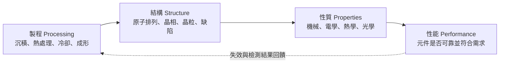
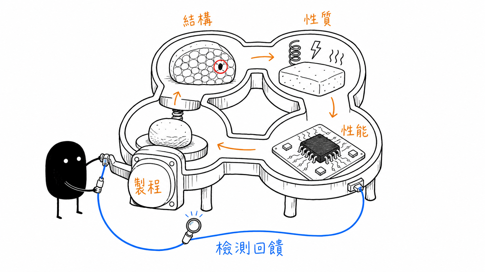
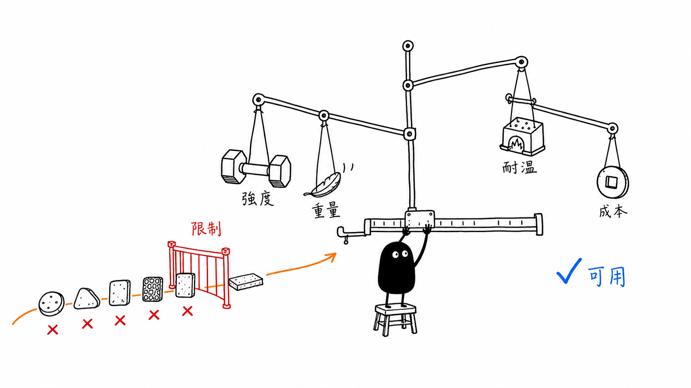
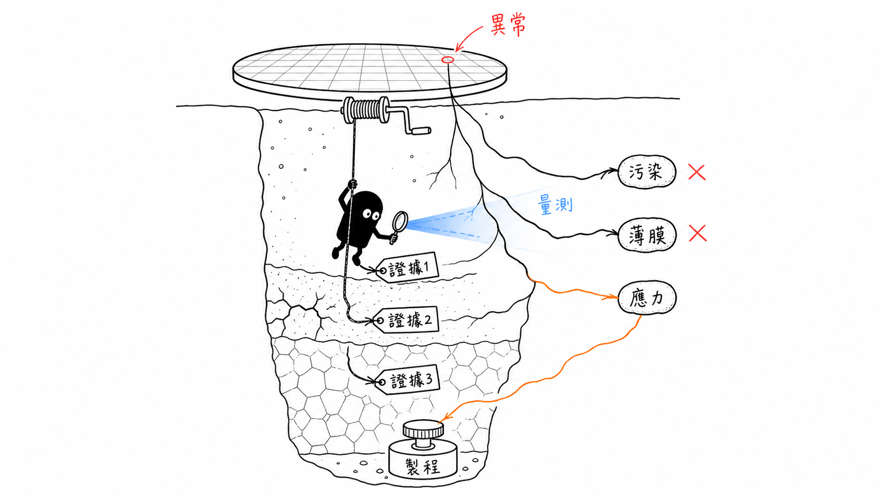

# 材料科學課程總覽：先看懂材料，再回頭理解檢測

## English Summary

The ten core topics in the UC Davis materials science course form one connected structure in this chapter. Processing changes a material's structure; that structure affects measurable properties, and those properties influence engineering performance. The chapter also introduces the six material families, common failure mechanisms, and thermally activated processes. Its final section applies the same reasoning to semiconductor inspection: a detected feature is evidence, not yet a root cause. Reaching an engineering conclusion still requires material mechanisms, process history, and follow-up measurements.

> 這篇整理 [UC Davis 的 Materials Science: 10 Things Every Engineer Should Know](https://www.coursera.org/learn/materials-science) 課程主線。內容不會把十個主題各自濃縮成一段定義，而是先說明這些分散的知識如何連回材料行為與半導體檢測。後續筆記會再分別處理材料選擇、原子結構、晶體缺陷、機械性質、失效與製程。

如果只想先抓住整門課，可以記得這句話：**製程改變結構，結構決定性質，性質最後會反映在元件性能上；當性能出現異常時，檢測結果又會帶著我們沿著這條路往回找。**

## 1. 什麼是材料科學？

第一次接觸材料科學時，很容易把注意力放在材料名稱、成分和性質數值上。不過真正重要的不是「這是什麼材料」，而是材料的**製程（processing）**、**結構（structure）**、**性質（properties）**與**使用性能（performance）**如何彼此影響。換句話說，我們需要進一步追問：材料為什麼會呈現某種行為？製程改變了什麼？這些改變放進實際元件後，是否仍然符合工程需求？

材料科學和材料工程的關注方向有所差異，但兩者並不是完全分開的領域：

- **材料科學**偏向理解機制，例如原子鍵結如何影響彈性模數、晶體缺陷如何促進擴散，以及差排移動為什麼會造成塑性變形。
- **材料工程**偏向利用這些機制設計材料、選擇製程並控制結果，例如透過熱處理調整鋼材的顯微組織，或選擇適合晶圓製程環境的薄膜材料。

因此，材料名稱或成分只能算是分析的起點。即使兩個零件具有相同成分，只要冷卻速率、熱處理、沉積條件或機械加工歷程不同，最後形成的晶粒、相組成、缺陷密度和殘留應力就可能不同，實際性質與使用結果也會跟著改變。**同樣的材料，不一定代表同樣的結構；同樣的結構，也不一定能在不同環境中維持相同表現。**

## 2. 課程主線：製程—結構—性質—性能

整門課看似包含許多分散的名詞，不過大部分問題都能放回同一條因果關係中理解：

### 2.1 製程（Processing）

製程是材料所經歷的製造與處理條件，包括溫度、時間、壓力、冷卻速率、氣氛、變形量、沉積方式與後續加工。製程不只是把材料做成特定形狀，它同時決定材料內部能形成哪些結構，以及缺陷是否會被引入、消除或重新分布。

### 2.2 結構（Structure）

結構需要從多個尺度觀察，而不是只看材料外觀：

| 尺度 | 主要觀察內容 | 可能使用的方法 |
| --- | --- | --- |
| 電子與原子尺度 | 電子結構、鍵結方式、原子排列 | 光譜分析、穿透式電子顯微鏡 |
| 晶體尺度 | 晶格、晶相、點缺陷、差排 | X 光繞射、電子顯微鏡 |
| 顯微尺度 | 晶粒、晶界、析出物、孔洞、夾雜物 | 光學顯微鏡、SEM、EDS |
| 巨觀尺度 | 裂紋、翹曲、表面缺陷、尺寸變化 | 目視、自動光學檢測、輪廓與尺寸量測 |

不同尺度之間具有連續的因果關係。例如原子尺度的空孔會影響擴散，擴散會控制析出物或新相的形成，而這些顯微結構又會改變材料的強度、韌性、導電性與失效方式。

### 2.3 性質（Properties）

性質是材料對外部刺激的可量測反應，常見類別包括：

- **機械性質**：彈性模數、降伏強度、抗拉強度、延性、韌性、硬度。
- **熱性質**：熱傳導率、熱膨脹係數、熱容量、耐熱性。
- **電性質**：電阻率、載子濃度、遷移率、介電性質。
- **光學性質**：吸收、反射、透射、折射率與發光行為。
- **化學性質**：耐腐蝕性、氧化行為與化學穩定性。

性質必須連同測試條件一起解讀。材料在室溫下具有良好強度，不代表它在高溫、循環載重或腐蝕環境中仍會維持相同行為；同樣地，量測到的平均性質也不一定能反映局部缺陷所造成的風險。

### 2.4 性能（Performance）

性能是材料放入特定元件、環境和使用條件後，是否真的能完成預期功能。它不是材料表上的單一常數，而是材料性質、零件幾何、製程變異、載重方式、環境與使用時間共同作用的結果。

例如高硬度並不必然代表更好的零件。若材料因此失去韌性，微小裂紋可能更容易快速擴展；若選用高導熱材料卻忽略熱膨脹係數差異，溫度循環後仍可能產生界面應力與分層。因此，工程分析真正要處理的是不同性質之間的取捨，而不是找到某一項數值最高的材料。

> **概念區分：** 性質回答的是「材料會怎麼反應」，性能回答的則是「這個反應放進實際情境後，是否仍然可接受」。兩者不能直接畫上等號。

## 3. 六大工程材料家族

課程從六類工程材料開始，因為材料分類能先提供一組判斷性質的線索。不過分類只代表常見趨勢，實際結果仍會受到成分、結構、製程與使用條件影響。

| 材料家族 | 主要結構或鍵結特徵 | 常見優勢 | 常見限制 | 半導體相關例子 |
| --- | --- | --- | --- | --- |
| 金屬（Metals） | 金屬鍵結；多數具有晶體結構 | 強度、韌性、導電與導熱性佳，容易加工 | 密度較高，可能腐蝕或在高溫潛變 | 銅互連、鋁墊、設備結構件 |
| 陶瓷（Ceramics） | 離子鍵或共價鍵結為主 | 高硬度、耐磨、耐高溫、化學穩定 | 脆性較高，對裂紋與缺口敏感 | 氧化鋁、氮化矽、介電層 |
| 玻璃（Glasses） | 非晶態網絡結構 | 光學性質可調、表面平滑、絕緣性佳 | 脆性、熱衝擊與缺陷敏感性 | 石英光罩基板、玻璃載板 |
| 聚合物（Polymers） | 長鏈分子，以共價鍵和次級鍵結組成 | 輕量、容易成形、絕緣、成本較低 | 耐溫與剛性有限，可能吸濕或老化 | 光阻、封裝樹脂、黏著層 |
| 複合材料（Composites） | 兩種以上材料形成基材與強化相 | 可針對需求組合強度、重量與熱性質 | 界面行為複雜，製程與檢測較困難 | 封裝基板、纖維強化設備零件 |
| 半導體（Semiconductors） | 能帶結構可透過摻雜與溫度控制 | 導電性可設計，能形成主動電子元件 | 對純度、缺陷、界面與製程條件高度敏感 | 矽、碳化矽、氮化鎵 |

這六個家族之間並不是彼此孤立。例如半導體元件同時包含矽或化合物半導體、金屬互連、介電陶瓷、玻璃或聚合物光阻，以及多種薄膜與界面。實際檢測時看到的缺陷，也可能來自不同材料之間的熱膨脹失配、附著力不足或化學反應，而不是單一材料本身的問題。

## 4. 工程選材：不是挑選「最強」的材料

工程選材不是從資料表中挑出一個「最強」的材料，而是先把功能、限制和風險說清楚，再找出能夠實際製造並穩定使用的材料與製程組合。這個判斷過程可以拆成七個步驟：

1. **定義功能**：零件或薄膜需要完成什麼工作？
2. **列出限制條件**：載重、溫度、尺寸、化學環境、電性與可靠度要求是什麼？
3. **建立評估指標**：哪些性質必須達到下限，哪些項目需要在彼此之間取捨？
4. **篩選材料家族與候選材料**：先排除不符合硬性限制的選項，再比較可行方案。
5. **納入製程與整合條件**：材料是否能被沉積、加工、接合、清洗並穩定量產？
6. **評估全生命週期**：同時考慮成本、良率、可維護性、失效風險與環境影響。
7. **透過試驗與檢測驗證**：確認實際材料和製程結果符合原先假設。

選材判斷通常會遇到彼此衝突的條件。例如晶圓載台需要剛性與尺寸穩定性，同時又受到重量、熱膨脹、潔淨度與成本限制；保護薄膜需要阻隔能力與附著力，卻不能因此產生過大的殘留應力。這些問題沒有脫離情境的唯一答案。只有把需求、限制、製程整合與失效風險都說清楚後，我們才有辦法判斷一個方案是否真的合理。

## 5. 十個核心主題

接下來的十個主題不是彼此獨立的十堂課，而是在回答同一件事：結構如何形成性質，這些性質又如何影響材料的工程使用。課程內容可以依照以下順序理解：

### Thing 1：六大工程材料與「結構決定性質」

先建立金屬、陶瓷、玻璃、聚合物、複合材料與半導體的基本分類，再從原子鍵結與排列方式解釋不同材料為什麼會有不同的機械、熱、電與光學性質。這一項是後續所有內容的共同起點。

### Thing 2：點缺陷解釋固態擴散

真實晶體並不完美，其中會存在空孔、間隙原子與置換原子。原子可以利用這些點缺陷在固體中移動，而溫度會透過熱活化機制顯著改變空孔濃度與擴散速率。Arrhenius 關係因此成為連結溫度、時間與材料變化的重要工具。

### Thing 3：差排解釋塑性變形

若整個晶面必須同時滑動，材料理論強度會遠高於實際量測值；差排的存在讓原子鍵可以局部且逐步地重新排列，因此材料能在較低應力下產生永久變形。加工硬化、晶粒細化與其他強化方式，也都和限制差排移動有關。

### Thing 4：應力—應變與主要機械性質

拉伸試驗將外力與材料變形轉換為應力—應變曲線，可以用來判讀彈性模數、降伏強度、抗拉強度與延性，並延伸到韌性的概念。重點不只在記住曲線上的位置，而是理解每個區段對應的變形與損傷機制。

### Thing 5：潛變

材料在固定載重下長時間處於高溫時，仍可能逐漸產生永久變形。潛變曲線通常包含初期、穩態與加速三個階段，而溫度、應力、擴散與晶界行為會共同決定潛變速率和破壞時間。

### Thing 6：延性—脆性轉變

部分材料在溫度降低後，吸收衝擊能量的能力會快速下降，破壞方式也可能從明顯塑性變形轉為突然脆斷。這種轉變和晶體結構、溫度、應變速率與缺口有關，對低溫設備與結構安全特別重要。

### Thing 7：斷裂韌性與臨界缺陷

工程材料幾乎無法完全消除缺陷，因此設計問題不只是「有沒有裂紋」，而是現有缺陷在特定應力下是否會失穩擴展。斷裂韌性把材料抵抗裂紋擴展的能力與應力、裂紋尺寸連結起來，使缺陷判定能從外觀描述進一步轉化為工程風險。

### Thing 8：疲勞

材料受到反覆載重時，即使最大應力低於單次拉伸所量到的降伏或抗拉強度，裂紋仍可能在局部應力集中處萌生並逐步擴展。S–N 曲線、疲勞強度、表面狀態與載重循環因此是評估壽命的重要依據。

### Thing 9：快與慢的製程

平衡相圖描述材料在接近平衡條件下可能出現的相，時間—溫度—轉變（TTT）圖則補入轉變所需的時間。透過比較擴散型與無擴散型相變，可以理解冷卻速率與熱處理歷程如何形成不同顯微組織，並進一步改變硬度、強度與韌性。

### Thing 10：半導體簡史與導電行為

半導體的導電性位於導體和絕緣體之間，但更重要的特徵是載子濃度可以透過溫度與摻雜控制。課程比較本質半導體與外質半導體，並再次使用 Arrhenius 關係理解不同溫度區間中的導電行為。

## 6. 學習目標

完成這組材料科學筆記後，希望不只是看過這些名詞，而是真的能做到以下幾件事：

1. **建立分類能力**：辨認主要工程材料家族，並說明其典型優勢、限制與適用條件。
2. **建立尺度連結**：從原子鍵結、晶體結構與缺陷，一路連結到顯微組織、材料性質和元件性能。
3. **解讀工程圖表**：能夠說明應力—應變曲線、潛變曲線、延性—脆性轉變圖、S–N 曲線、相圖與 TTT 圖所代表的物理意義。
4. **理解熱活化過程**：運用 Arrhenius 關係判斷溫度如何影響空孔、擴散、潛變與半導體導電行為。
5. **分析材料失效**：區分塑性變形、潛變、脆性斷裂與疲勞，並理解缺陷尺寸、應力與環境條件的影響。
6. **進行工程選材**：根據功能、限制、製程、成本與可靠度比較候選方案，而不是只比較單一性質。
7. **連結製程與結果**：解釋製程條件如何改變結構，並預測這些結構變化對性質和性能的影響。
8. **建立檢測假設**：從缺陷外觀提出可能的材料與製程機制，同時區分已觀察到的證據和仍待驗證的推論。
9. **選擇驗證方法**：依照問題尺度與資訊需求，判斷需要使用成像、成分、晶相、輪廓或電性量測中的哪一類方法。
10. **用自己的方式重新解釋**：不只記住公式與名詞，而是能說明結果為什麼合理、假設在哪裡，以及哪些條件改變後結論可能不再成立。

## 7. 為什麼這些內容和半導體檢測有關？

半導體檢測經常從一個可見或可量測的異常開始，例如亮點、暗點、刮痕、顆粒、殘留、裂紋、膜厚不均或圖形偏移。看到異常很重要，不過它只是分析的起點。影像中的外觀分類不等於缺陷的根本原因：相似的外觀可能來自污染、材料剝落、蝕刻不足、沉積異常、熱應力或機械接觸；同一個製程問題，也可能因位置和量測條件不同而呈現不同外觀。

因此，較可靠的分析方式不是看到某種外觀就立刻套用答案，而是先把觀察到的證據描述清楚，接著提出可能機制，再透過量測逐步確認或排除：

材料科學在這條路徑中的作用，是提供提出假設和選擇證據的基礎：

- **鍵結與晶體結構**幫助判斷材料可能呈現的導電、脆性或異向性行為。
- **點缺陷與擴散**幫助理解摻雜、氧化、污染遷移與高溫製程中的成分變化。
- **差排與殘留應力**幫助分析滑移線、翹曲、局部變形與裂紋萌生。
- **斷裂與疲勞**幫助評估顆粒、刮痕或微裂紋是否可能成為可靠度風險。
- **相變與熱處理**幫助連結溫度歷程、顯微組織和最後量測到的材料性質。
- **半導體載子行為**幫助理解摻雜、缺陷能階、溫度與電性異常之間的關係。

檢測工具可以提高看見異常的能力，但儀器輸出本身還不是結論。它仍然需要結合材料機制、製程背景與交叉驗證，才有辦法轉化成可靠判斷。較可靠的分析方式不是「看到某種外觀就回答某個根因」，而是先區分觀察與推論，再比較多個可能機制，最後判斷下一個最值得取得的證據是什麼。

## 8. 後續筆記如何延伸

這篇總覽先把共同架構搭起來。後續筆記會依照問題類型繼續往下拆，並且盡量把每個主題重新連回材料行為與檢測判斷：

- `02-material-properties-and-selection.md`：比較材料家族、性質取捨與選材方法。
- `03-atomic-bonding-and-structure.md`：整理原子鍵結、晶體結構與性質來源。
- `04-crystal-defects-and-microstructure.md`：連結空孔、擴散、差排與顯微組織。
- `05-mechanical-properties-and-failure.md`：解讀拉伸、潛變、轉變溫度、斷裂與疲勞。
- `06-processing-and-material-performance.md`：利用相圖、TTT 圖與熱處理說明製程如何控制結果。
- `07-semiconductor-inspection-reflection.md`：將材料機制、缺陷證據與實際檢測判斷重新整合。

## 9. 重點整理

- 材料科學的核心不是背誦材料名稱，而是建立製程、結構、性質與性能之間的因果關係。
- 材料分類能提供初步判斷，但真正的工程選擇仍需要考慮使用情境、製程限制與性質取捨。
- 課程十個主題從原子與晶體缺陷出發，延伸到變形、失效、相變與半導體導電行為。
- 半導體檢測看到的是異常訊號；要判斷根因，仍需要材料知識、製程背景與驗證方法共同支持。
- 整理材料科學內容時，除了記錄結論外，也需要說明結果、辨認假設，並判斷下一步應該取得什麼證據。

## 參考資料

- [UC Davis / Coursera — Materials Science: 10 Things Every Engineer Should Know](https://www.coursera.org/learn/materials-science)
- [NIST — Materials Design Toolkit](https://www.nist.gov/programs-projects/materials-design-toolkit)
- [NIST — Thermodynamics and Kinetics Group](https://www.nist.gov/mml/materials-science-and-engineering-division/thermodynamics-and-kinetics-group)
- [NIST — Structural Metrology of Advanced Manufacturing Processes](https://www.nist.gov/programs-projects/structural-metrology-advanced-manufacturing-processes)
