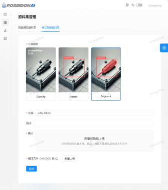

# Materials Science Course Overview

## 材料科學課程總覽：從材料行為到檢測證據

> **Learning Context**
>
> My background is in computer science, industrial AI, and semiconductor inspection. I started studying materials science because inspection results often stopped at appearance: a model could locate a scratch-like feature or classify a wafer-level pattern, but it could not explain how that feature formed. The framework in this note helps me place those observations in a longer chain, from processing and structure to measurable properties and device performance. It also marks a boundary I need to keep visible: inspection evidence can support a material or process hypothesis, but it does not verify the physical mechanism on its own.

第一次接觸材料科學時，很容易先注意材料名稱、成分和資料表上的性質。整理到後來，真正需要反覆確認的反而是：材料經歷了什麼、內部結構怎麼改變，以及最後量到的結果能支持哪一段推論。

如果只先保留一條主線，可以寫成：

> **製程改變結構，結構影響性質，性質最後反映在元件性能上；當性能出現異常時，檢測結果則提供沿著這條路往回追查的證據。**

## 1. Processing, Structure, Properties, and Performance

製程、結構、性質和性能一開始很像四組分開的定義。放回同一條線後，關係才比較清楚：

| 階段 | 需要回答的問題 | 常見內容 |
| --- | --- | --- |
| Processing | 材料經歷了什麼條件？ | 溫度、時間、壓力、冷卻速率、沉積、成形與清洗 |
| Structure | 這些條件改變了什麼？ | 鍵結、晶格、晶相、晶粒、缺陷、界面與殘留應力 |
| Properties | 材料如何回應外部刺激？ | 機械、熱、電、光學與化學性質 |
| Performance | 放入實際元件後是否仍符合需求？ | 功能、可靠度、尺寸穩定性、壽命與失效風險 |

看到材料名稱和成分相同時，很容易先假設它們會有相同的性質。不過經過不同冷卻速率或熱處理後，同一種材料仍可能形成不同晶相、晶粒尺寸與缺陷分布；成分沒有變，機械性質或導電行為卻可能已經不同。只查資料表，通常還不夠回答實際零件為什麼失效。

檢測位於這條關係的回饋端。影像可以記錄亮度、形狀、位置與表面紋理；電性量測可以在特定模型與條件下量化元件反應。不過單一量測通常不能直接證明唯一的物理機制，還需要和結構、製程紀錄及其他獨立證據對照。


> 圖 1：Processing、structure、properties 與 performance 之間的關係；inspection evidence 位於回饋與驗證端。

## 2. Materials Science and Materials Engineering

材料科學比較在意「為什麼會變成這樣」。例如原子鍵結如何影響彈性模數、空位與間隙缺陷如何參與擴散，或差排移動為什麼會造成塑性變形。材料工程則把這些關係帶回設計與製造：選擇材料、安排製程，接著確認結果是否符合使用需求。

兩者在實際問題裡很難完全分開。知道某種材料通常具有哪些性質，只能提供起點；要判斷一個元件的表現，仍要把成分、結構、製程歷程和使用條件放在一起看。

這裡最容易漏掉的是「同成分不等於同狀態」。相同成分經過不同的沉積、冷卻或機械加工歷程，晶粒、相組成、缺陷密度和殘留應力都可能不同。反過來，即使結構接近，換到不同溫度、載入方式或化學環境，性能也可能改變。

## 3. Materials Are Chosen Under Constraints

材料家族可以提供初步方向，不過沒有哪一類材料能脫離情境被稱為「最好」。真正放進產品或設備時，幾何、溫度、環境、製造、可靠度與整合限制都要一起考慮。

例如晶圓載台需要剛性與尺寸穩定性，也會受到重量、熱膨脹、潔淨度和成本限制；保護薄膜需要阻隔能力與附著力，卻不能帶入過大的殘留應力。單一性質較高，不代表整體方案更適合。


> 圖 2：工程選材需要同時考慮多個限制；單一性質較高，不代表材料整體更適合。

六大材料家族、常見性質與選材取捨會在 [Material Families, Property Trade-offs, and Engineering Selection](./02-material-properties-and-selection.md) 再展開。這一篇先保留一個提醒：材料名稱是篩選的起點，不是工程判斷的終點。

## 4. From Inspection Evidence to Engineering Verification

半導體與工業檢測通常從可見或可量測的異常開始，例如亮暗變化、刮痕、顆粒、殘留、裂紋、膜厚不均或圖形偏移。看到異常很重要，但它先回答的是「哪裡不同」，還沒有回答「為什麼不同」。

相似外觀可能來自污染、材料剝落、蝕刻不足、沉積異常、熱應力或機械接觸；同一個製程問題，也可能因位置、照明與量測條件不同而呈現不同外觀。比較穩妥的順序是：

```text
Observation
    ↓
Material or process hypothesis
    ↓
Additional measurement
    ↓
Verification
```

材料科學在這裡提供的不是一張「外觀直接對應根因」的答案表，而是讓假設變得比較可檢查。先描述實際看到的證據，再問哪一種結構或製程變化與它一致，最後選擇成分、晶相、輪廓、電性或製程紀錄來縮小範圍。


> 圖 3：檢測訊號先形成可檢查的材料或製程假設，再由額外量測與製程證據逐步確認；概念示意。

先前的檢測系統工作，主要是把影像轉成可用的工程輸出。描述整張影像狀態的條件適合 classification，particle 或 scratch 這類局部特徵則需要 localization；當幾何邊界本身具有意義時，也可能使用 segmentation 或 rule-based measurement。這些任務保留的空間資訊不一樣，不能只把它們當成幾種可以互換的模型。



> 圖 4：PoseidonAI 的示範資料集設定畫面；classification、object detection 與 instance segmentation 分別保留不同層次的觀察與空間資訊。

材料科學補上的，是模型輸出之後那一段。穩定的 label、bounding box 或 mask 可以整理觀察結果，也能協助比較位置與分布；不過它們仍然不是材料機制。當 label 聽起來比現有證據更確定時，就要回頭確認它記錄的是外觀、工程假設，還是已經有獨立證據支持的原因。

## Current Scope

這篇只建立製程、結構、性質、性能與檢測證據之間的基本框架。材料家族與工程選材、原子鍵結、缺陷與擴散、機械失效、相變與半導體導電行為，留在後續筆記分別處理。

這裡的專案連結來自 AOI、電腦視覺與檢測軟體工作。這些經驗不包含以 AOI 單獨驗證材料根因，也不包含材料分析實驗室的實際量測。

## Learning Source

- James F. Shackelford, [*Materials Science: 10 Things Every Engineer Should Know*](https://www.coursera.org/learn/materials-science), University of California, Davis / Coursera.
