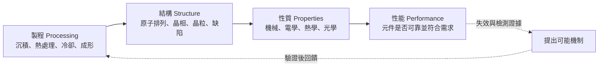
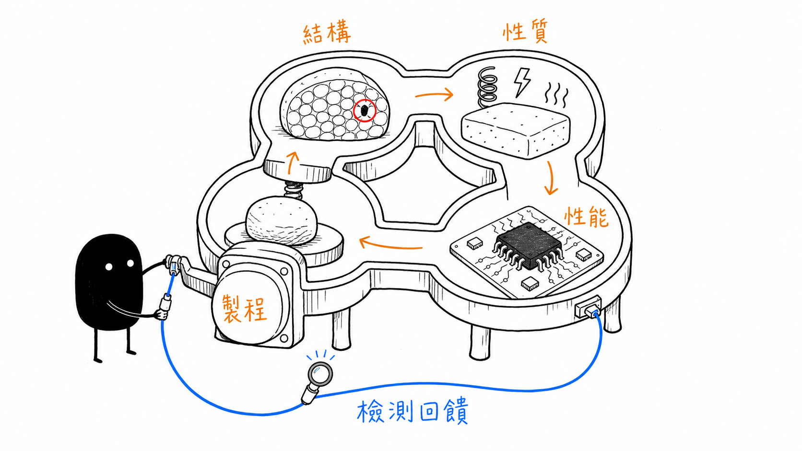
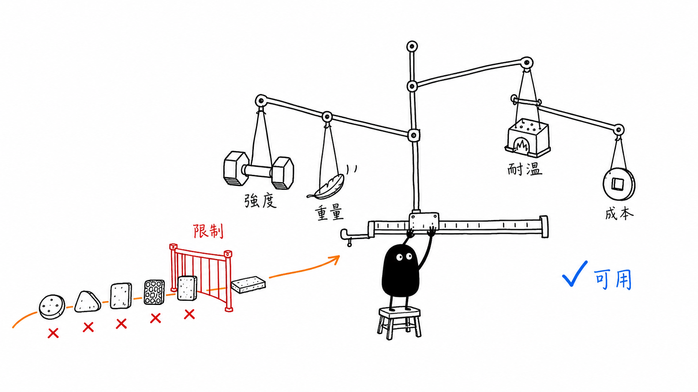
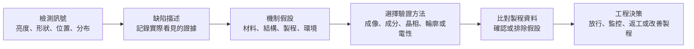
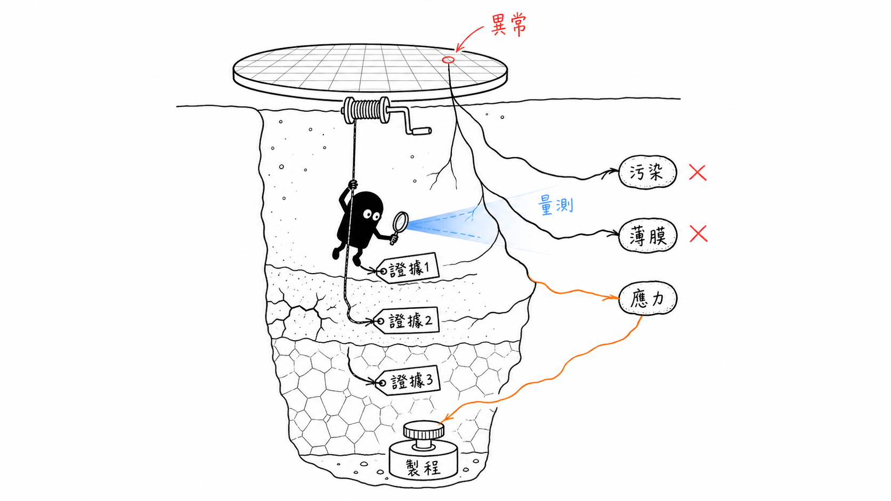

# Materials Science Course Overview

## 材料科學課程總覽：從材料行為到檢測證據

> **Learning Context**
>
> My background is in computer science, industrial AI, and semiconductor inspection. I started studying materials science to build a clearer physical basis for the signals that inspection systems capture. A model can locate a scratch-like feature or classify a wafer-level pattern, but those results do not explain how the feature formed. This chapter outlines the framework I use to connect observable evidence with material behavior, process history, and engineering verification.

## English Summary

> This chapter introduces the processing–structure–properties–performance relationship and uses it to organize ten core topics from the UC Davis course. It also compares six engineering material families and explains why material selection depends on operating conditions, manufacturing constraints, and interfaces rather than on a single property value. For semiconductor inspection, the main lesson is practical: a visible defect is evidence, not a verified root cause. Materials science helps turn that evidence into testable hypotheses.

---

本篇以先前整理的個人課程筆記為基礎，嘗試找出 UC Davis 課程各個主題之間的共同邏輯，而不是逐項重述課程內容。

如果只先保留一個概念，可以記住：

> **製程改變結構，結構影響性質，性質最後反映在元件性能上；當性能出現異常時，檢測結果則提供沿著這條路往回追查的證據。**

## 1. Course Framework: Processing, Structure, Properties, and Performance

> Processing changes a material's structure. Structure affects measurable properties, which contribute to engineering performance under specific operating conditions. Inspection enters at the other end of this chain: it records evidence of change, but further analysis is still needed before the evidence can be linked to a physical mechanism.

材料科學的核心不是背誦材料名稱或性質數值，而是理解製程、結構、性質和性能如何互相連結：

```mermaid
flowchart LR
    A["製程 Processing<br/>沉積、熱處理、冷卻、成形"] --> B["結構 Structure<br/>原子排列、晶相、晶粒、缺陷"]
    B --> C["性質 Properties<br/>機械、電學、熱學、光學"]
    C --> D["性能 Performance<br/>元件是否可靠並符合需求"]
    D -. "失效與檢測證據" .-> E["提出可能機制"]
    E -. "驗證後回饋" .-> A
```

這條主線可以按照四個問題理解：

| 階段 | 需要回答的問題 | 常見內容 |
| --- | --- | --- |
| 製程 | 材料經歷了什麼條件？ | 溫度、時間、壓力、冷卻速率、沉積、成形與清洗 |
| 結構 | 這些條件改變了什麼？ | 鍵結、晶格、晶相、晶粒、缺陷、界面與殘留應力 |
| 性質 | 材料如何回應外部刺激？ | 機械、熱、電、光學與化學性質 |
| 性能 | 放入實際元件後是否仍符合需求？ | 功能、可靠度、尺寸穩定性、壽命與失效風險 |

檢測位於這條關係的回饋端，不過它不會自動指出唯一根因。影像、電性或尺寸量測只能先說明出現了什麼變化，後續仍需要結合材料機制、製程紀錄和其他量測，確認這些變化為什麼發生。

> 圖 1：作者依個人課程筆記重新整理，用來表示製程、結構、性質、性能與檢測回饋之間的關係。

## 2. 材料科學在研究什麼？

第一次接觸材料科學時，很容易先注意材料名稱、成分和資料表上的性質。不過，即使兩個零件具有相同成分，只要冷卻速率、熱處理、沉積條件或機械加工歷程不同，最後形成的晶粒、相組成、缺陷密度和殘留應力就可能不同，實際性質也會跟著改變。

材料科學偏向理解這些變化背後的機制，例如原子鍵結如何影響彈性模數、晶體缺陷如何促進擴散，以及差排移動為什麼會造成塑性變形。材料工程則進一步利用這些關係選擇材料、設計製程並控制結果。兩者關注的階段不同，不過在處理實際工程問題時，通常需要同時使用。

因此，材料名稱或成分只能算是分析的起點。相同成分不一定形成相同結構，而相同結構在不同溫度、載入與環境下，也不一定維持相同性能。

## 3. Six Engineering Material Families

課程先以六類工程材料建立基本分類。這些分類能提供判斷性質的線索，不過只代表常見趨勢，不能取代實際材料、製程與測試條件。

| 材料家族 | 主要結構或鍵結特徵 | 常見優勢 | 常見限制 | 半導體或檢測相關例子 |
| --- | --- | --- | --- | --- |
| 金屬（Metals） | 金屬鍵結，多數具有晶體結構 | 強度、韌性、導電與導熱性佳 | 密度較高，可能腐蝕或在高溫下潛變 | 銅互連、鋁墊、設備結構件 |
| 陶瓷（Ceramics） | 離子鍵或共價鍵結為主 | 高硬度、耐磨、耐高溫、化學穩定 | 脆性較高，對裂紋與缺口敏感 | 氧化鋁、氮化矽、介電層 |
| 玻璃（Glasses） | 非晶態網絡結構 | 光學性質可調、表面平滑、絕緣 | 脆性、熱衝擊與缺陷敏感性 | 石英光罩基板、玻璃晶圓與載板 |
| 聚合物（Polymers） | 長鏈分子，以共價鍵和次級鍵結組成 | 輕量、容易成形、絕緣、成本較低 | 耐溫與剛性有限，可能吸濕、老化或潛變 | 光阻、封裝樹脂、黏著層、隱形眼鏡 |
| 複合材料（Composites） | 基材與強化相共同組成 | 可針對需求組合強度、重量與熱性質 | 界面行為複雜，製程與檢測較困難 | 封裝基板、纖維強化設備零件 |
| 半導體（Semiconductors） | 能帶結構可透過摻雜與溫度控制 | 導電性可設計，可形成主動電子元件 | 對純度、缺陷、界面與製程條件敏感 | 矽、碳化矽、氮化鎵 |

半導體製造並不是只處理半導體材料。一個元件或檢測設備可能同時包含矽、金屬互連、介電陶瓷、玻璃、聚合物薄膜與多種界面。因此，影像中的異常也可能與不同材料之間的熱膨脹失配、附著、污染或光學反應有關。

> **Engineering Takeaway**
>
> Material families are useful for an initial comparison, but they are not final selection rules. A semiconductor system combines silicon, metals, dielectrics, polymers, glasses, and their interfaces. The relevant question is therefore not which family is “best,” but whether a material and its process route can satisfy the full set of functional and integration constraints.

## 4. 工程選材：先確認需求，再比較材料

工程選材不是從資料表中挑出某一項數值最高的材料，而是先確認元件需要完成什麼功能，以及哪些條件不能被違反。整理後可以將判斷流程縮成四個階段：

1. **定義功能與限制**：確認載入、溫度、尺寸、化學環境、電性、光學與可靠度需求。
2. **篩選材料家族**：先排除不符合必要條件的選項，再比較強度、重量、成本與其他性質的取捨。
3. **納入製程與整合條件**：確認材料是否能被沉積、加工、接合、清洗並穩定量產。
4. **透過試驗與檢測驗證**：檢查實際製程結果是否符合原本假設，並記錄可能的失效風險。

例如晶圓載台需要剛性與尺寸穩定性，同時受到重量、熱膨脹、潔淨度和成本限制；保護薄膜需要阻隔能力與附著力，卻不能產生過大的殘留應力。這些問題沒有脫離情境的唯一答案，真正需要比較的是同一個材料與製程方案能否同時滿足整組需求。

> 圖 2：作者依個人課程筆記重新整理，用來表示工程選材中的多條件取捨。

## 5. Ten Core Topics

UC Davis 課程用十個主題建立材料科學的基本架構。這些主題並不是十組彼此分開的定義，而是從原子與缺陷一路連結到變形、失效、製程和半導體行為：

| 核心主題 | 主要問題 | 後續筆記 |
| --- | --- | --- |
| 1. 六大工程材料 | 鍵結與結構為什麼產生不同性質？ | Chapter 02–03 |
| 2. 點缺陷與固態擴散 | 原子如何利用空孔或間隙在固體中移動？ | Chapter 04 |
| 3. 差排與塑性變形 | 為什麼實際材料能在較低應力下永久變形？ | Chapter 04–05 |
| 4. 應力—應變與機械性質 | 如何區分剛性、強度、延展性與拉伸韌性？ | Chapter 05 |
| 5. 潛變 | 應力、溫度和時間如何共同造成長期變形？ | Chapter 05 |
| 6. 延性—脆性轉變 | 為什麼部分材料在低溫或高應變速率下更容易脆斷？ | Chapter 05 |
| 7. 斷裂韌性 | 裂紋尺寸、應力與材料抗裂能力如何共同決定風險？ | Chapter 05 |
| 8. 疲勞 | 為什麼低於巨觀降伏強度的循環載入仍可能造成失效？ | Chapter 05 |
| 9. 快與慢的製程 | 相圖、擴散與冷卻速率如何控制顯微組織？ | Chapter 06 |
| 10. 半導體導電行為 | 溫度、能隙與摻雜如何改變載子濃度和導電率？ | Chapter 07 |

Arrhenius 關係在其中多次出現，因為空孔濃度、擴散、潛變和半導體導電行為都可能受到熱活化過程影響。不過，不同主題中的能障、前因子和適用溫度範圍並不相同，不能因為公式形式相似，就直接共用同一組解釋。

## 6. Learning Checkpoints

This chapter should provide enough foundation for me to:

- explain the processing–structure–properties–performance relationship without treating the four terms as separate definitions;
- compare major material families while stating the limits of each generalization;
- distinguish stiffness, strength, ductility, toughness, creep, fracture, and fatigue;
- connect defects, diffusion, phase transformation, and thermal history to observable material behavior;
- describe how doping, temperature, and defects affect semiconductor conductivity; and
- separate inspection evidence, a failure hypothesis, and a verified root cause.

I use these points to check the later chapters as well. If a concept cannot help me interpret a simple engineering case, I probably do not understand it well enough yet.

## 7. Why This Matters for Semiconductor Inspection

> Semiconductor inspection often begins with a measurable anomaly: a change in brightness, shape, position, texture, or electrical response. The difficult part comes next. Similar appearances can result from different material and process mechanisms, while the same mechanism can look different under another illumination or measurement condition. Materials science does not remove this ambiguity, but it gives the investigation a better set of questions.

半導體與工業檢測經常從一個可見或可量測的異常開始，例如亮暗變化、刮痕、顆粒、殘留、裂紋、膜厚不均或圖形偏移。看到異常很重要，不過它只是分析的起點。相似外觀可能來自污染、材料剝落、蝕刻不足、沉積異常、熱應力或機械接觸；同一個製程問題，也可能因為位置和量測條件不同而呈現不同外觀。

因此，較可靠的分析方式是先描述觀察到的證據，接著提出可能機制，再透過其他量測逐步確認或排除：

```mermaid
flowchart LR
    A["檢測訊號<br/>亮度、形狀、位置、分布"] --> B["缺陷描述<br/>記錄實際看見的證據"]
    B --> C["機制假設<br/>材料、結構、製程、環境"]
    C --> D["選擇驗證方法<br/>成像、成分、晶相、輪廓或電性"]
    D --> E["比對製程資料<br/>確認或排除假設"]
    E --> F["工程決策<br/>放行、監控、返工或改善製程"]
```

材料科學在這條路徑中的作用，是協助建立假設和選擇證據：

| 材料概念 | 可以協助判斷的問題 |
| --- | --- |
| 鍵結與晶體結構 | 導電、脆性、異向性與光學反應 |
| 點缺陷與擴散 | 摻雜、氧化、污染遷移與高溫製程中的成分變化 |
| 差排與殘留應力 | 滑移線、翹曲、局部變形與裂紋萌生 |
| 斷裂與疲勞 | 刮痕或微裂紋是否可能發展成可靠度風險 |
| 相變與熱處理 | 溫度歷程、顯微組織與最終性質 |
| 半導體載子行為 | 摻雜、缺陷能階、溫度與電性異常 |

> 圖 3：作者依個人課程筆記重新整理，用來表示從檢測訊號建立並驗證材料或製程假設的過程。

## 8. Applied Reflection: From Model Outputs to Engineering Evidence

Several inspection projects gradually changed how I framed the work. I initially focused on converting images into reliable labels, improving the models, and making the results usable in a production workflow. Those tasks were necessary. They were not the whole problem.

In an anonymized wafer-inspection project, some labels described conditions across most of the wafer image, while particles and scratches were localized features. I separated whole-image attributes into classification tasks, retained localization for particles and scratches, and reviewed the local annotations before further model comparison. At the time, I mainly saw this as a computer-vision decision about spatial meaning and evaluation.

A transparent-product inspection project exposed a different part of the chain. Features changed under different illumination conditions, and AI-based recognition was combined with rule-based measurement when a defect had a clear geometric definition. The image was not a neutral record of the product (changing the light changed what became measurable).

I also worked on an AI development workflow that connected dataset review, task definition, model training, evaluation, visualization, export, and deployment. It made the inspection process easier to repeat, but it did not solve the interpretation problem for us. Materials science adds that missing boundary: a stable visual label can still describe only appearance, not the physical mechanism that produced it.

I now read the workflow as a longer chain. Material and process conditions influence the signal; imaging and annotation turn the signal into data; models organize the evidence; and engineering verification is still required before a root cause can be claimed.

## 9. Connection to Industrial AI

For industrial AI, the connection can be organized into three levels:

| Level | What AI can contribute | What still requires engineering evidence |
| --- | --- | --- |
| Observation | Detect, classify, segment, measure, and compare visible or electrical patterns | Whether the available signal captures the relevant physical change |
| Hypothesis support | Relate morphology, location, spatial distribution, batch history, and process context | Whether the correlation is causal and physically plausible |
| Root-cause verification | Prioritize cases and suggest what should be checked next | Confirmation through material analysis, process records, controlled experiments, or additional metrology |

This division is important because high model accuracy does not guarantee that the label represents the right engineering question. If the dataset combines evidence, interpretation, and confirmed cause into one field, the model may learn the easiest visual proxy (not necessarily the physical change we meant to measure) while concealing uncertainty in the labels.

For that reason, an inspection dataset becomes more useful when it preserves the available context: process stage, illumination or measurement condition, spatial distribution, batch relationship, and later verification result. Not every project can collect every field. But missing context should remain visible rather than being silently replaced by a confident defect name.

## 10. What Changed in My Understanding

Before studying these topics, I mainly framed inspection work as a problem of image acquisition, label definition, model accuracy, and inference speed. Those remain necessary. But materials science introduced a second layer of judgment: the same visual category can contain different physical mechanisms, and the same mechanism may produce different signals under different observation conditions.

This changed how I interpret model output.

> **A bounding box or class probability is not a material diagnosis.**

It is one piece of evidence that should be considered together with loading history, temperature exposure, likely contact locations, spatial distribution, and subsequent verification. In practice, some of this information may be unavailable. That limitation is part of the result.

The most useful distinction is now between **AOI evidence**, a **failure hypothesis**, and a **verified root cause**. AI can strengthen the first two by organizing data and revealing repeatable patterns. The third still requires evidence outside the model.

## 11. Working Principles and Boundaries

- **Material families describe common trends, not complete conclusions.** An individual material still has to be checked in its actual composition, process state, and operating condition.
- **A property value needs its test conditions.** Specimen geometry, temperature, loading, environment, and measurement method can all change how the value should be interpreted.
- **The AI task should match the spatial meaning of the anomaly.** Whole-image conditions and localized defects should not automatically be treated as the same bounding-box problem.
- **Inspection results support observation and comparison.** A material mechanism or root cause still needs evidence from the process, material analysis, or another measurement method.

These are basic reminders, but I keep returning to them when a convenient label starts to sound more certain than the available evidence.

## 12. Chapter Roadmap

| Chapter | Main question | Status |
| --- | --- | --- |
| [02. Material Properties and Engineering Selection](./02-material-properties-and-selection.md) | How do material families and property trade-offs guide engineering selection? | Completed |
| [03. Atomic Bonding and Structure](./03-atomic-bonding-and-structure.md) | How do bonding and crystal structure shape material behavior? | Completed |
| [04. Crystal Defects and Microstructure](./04-crystal-defects-and-microstructure.md) | How do defects affect diffusion, deformation, and inspection evidence? | Completed |
| [05. Mechanical Properties and Failure](./05-mechanical-properties-and-failure.md) | How do materials deform and fail under load, time, and temperature? | Completed |
| [06. Processing and Material Performance](./06-processing-and-material-performance.md) | How do phase transformations and process history control performance? | Completed |
| 07. Semiconductor Inspection Reflection | How can materials knowledge improve the interpretation of inspection data? | Planned |

## References

1. James F. Shackelford, [*Materials Science: 10 Things Every Engineer Should Know*](https://www.coursera.org/learn/materials-science), University of California, Davis / Coursera.
2. James F. Shackelford, *Introduction to Materials Science for Engineers*, 8th ed.
