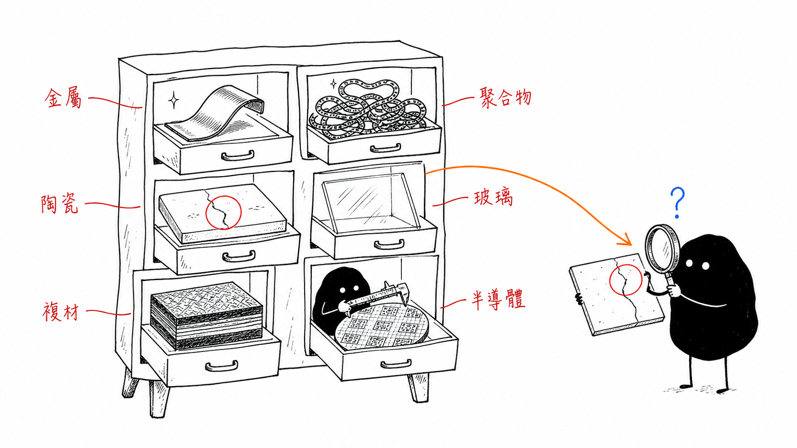
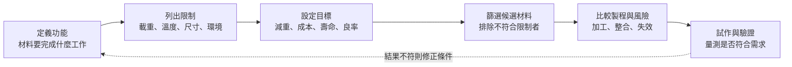
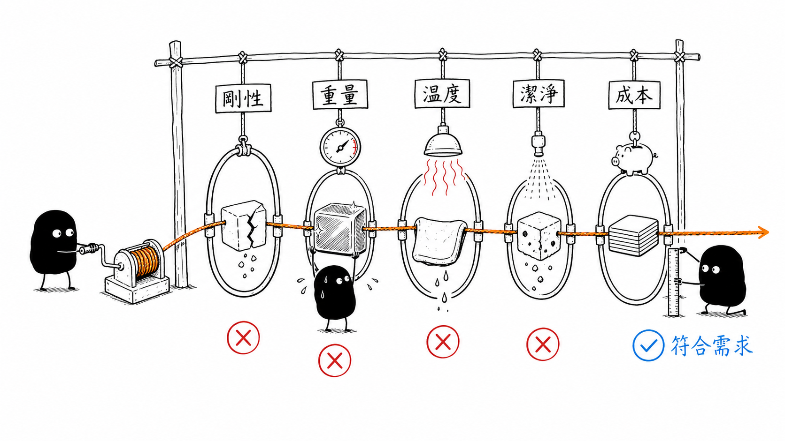

# 材料類型、材料性質與工程選材

## English Summary

Six engineering material families provide the starting point for this chapter. Their bonding, structure, and processing history shape the properties used in material selection. Those properties then become part of a practical workflow based on function, constraints, trade-offs, manufacturability, and verification. A simple steel–aluminum example shows why stiffness and weight cannot be judged separately. The semiconductor sections focus on optical contrast, thermal-expansion mismatch, thin-film interfaces, and inspection evidence. A bright AOI region, for example, may come from surface geometry, reflectivity, film interference, or contamination (the image does not distinguish them by itself). But appearance alone cannot identify the root cause.

> 這篇以 UC Davis 課程中的六大工程材料與「結構決定性質」為基礎，整理材料性質如何成為工程選材的判斷依據。內容會保留必要的分類與鍵結觀念，不過重點會放在性質取捨、製程限制、半導體應用，以及檢測結果如何協助驗證原本的選擇。

## 1. 六大工程材料是一份初步選單

工程材料的種類非常多，如果一開始就逐一比較所有成分、牌號和製程狀態，很容易只得到一份龐大卻缺乏脈絡的資料表。因此，UC Davis 課程先將常見材料整理成六個家族，讓我們能從鍵結、結構和典型性質建立第一層判斷。

| 材料家族 | 結構與鍵結線索 | 常見性質與限制 | 半導體相關例子 |
| --- | --- | --- | --- |
| 金屬 | 金屬鍵；多數具有晶體結構 | 導電、導熱與加工性通常較好；需注意密度、腐蝕與疲勞 | 銅互連、鋁接墊、設備結構件 |
| 聚合物 | 分子鏈內以共價鍵為主，鏈間具有次級鍵結 | 低密度、容易成形且多半絕緣；性質對時間與溫度敏感 | 光阻、封裝樹脂、黏著層 |
| 陶瓷 | 離子鍵、共價鍵或混合鍵結 | 高剛性、硬度與耐熱性；常溫塑性有限，對裂紋敏感 | 氧化鋁、氮化鋁、介電層 |
| 玻璃 | 非晶態網絡結構 | 表面平滑且光學性質可調；脆性與表面刮痕需要注意 | 石英光罩、光學窗口、玻璃載板 |
| 複合材料 | 基材結合纖維、顆粒或其他強化相 | 性質可依需求設計；界面、孔洞與方向性會影響結果 | 封裝基板、玻璃纖維強化樹脂 |
| 半導體 | 共價晶體與可控制的能帶結構 | 導電性可透過摻雜與溫度調整；對雜質、缺陷與界面敏感 | 矽、碳化矽、氮化鎵 |

這張表適合用來縮小範圍，但不能直接代替實際數據。即使屬於同一個材料家族，只要成分、晶體結構、孔隙率、晶粒、添加物或製程歷程不同，最後量測到的性質就可能有明顯差異。

## 2. 從鍵結與結構理解性質來源

原子的電子排列會影響鍵結方式，而鍵結又會進一步影響材料的剛性、導電、導熱、熱膨脹與變形行為。在這篇中，鍵結的用途是提供選材線索；完整的電子結構、鍵結能量與晶體排列會留到 `03-atomic-bonding-and-structure.md` 說明。

### 2.1 一次鍵結與二次鍵結

| 鍵結類型 | 基本方式 | 對材料性質的主要線索 |
| --- | --- | --- |
| 離子鍵 | 電子轉移後，由正負離子之間的靜電吸引形成 | 鍵結通常較強，多數材料缺少可自由移動的電子 |
| 共價鍵 | 相鄰原子共享電子，並具有明顯方向性 | 能形成高剛性結構；導電行為與能帶結構有關 |
| 金屬鍵 | 價電子離域並在晶格中移動 | 通常具有良好導電與導熱能力，也較容易產生塑性變形 |
| 次級鍵結 | 分子或原子間的偶極吸引，包括凡得瓦力與氫鍵 | 會影響聚合物的柔軟度、玻璃轉移、黏著與長期蠕變 |

實際材料中可能同時存在多種鍵結。例如陶瓷可能兼具離子與共價特徵；聚合物的分子鏈內是共價鍵，鏈與鏈之間的行為則受到次級鍵結影響。因此，將一個材料簡化成單一鍵結，只能作為初步理解，不能直接推導所有工程性質。

### 2.2 鍵結不是唯一決定因素

鍵結能幫助解釋彈性模數與導電性等基本趨勢，不過降伏強度、延展性、韌性、破壞方式與長期可靠度，還會受到晶體結構、差排、晶粒、孔洞、裂紋、相組成、溫度和製程歷程影響。

例如陶瓷具有強鍵結和高剛性，但當材料內存在裂紋時，它不容易透過局部塑性變形降低裂尖應力，因此實際拉伸強度仍可能受到表面加工與缺陷尺寸限制。聚合物分子鏈內雖然具有強共價鍵，但鏈間次級鍵較弱，長期受力時仍可能發生分子鏈滑動與蠕變。

## 3. 選材時需要比較哪些性質？

材料性質是材料對外部刺激所產生的可量測反應。查閱資料時，除了記錄數值外，還需要確認試驗方法、溫度、材料方向、應變速率、頻率、濕度與製程狀態。只要測試條件不同，即使性質名稱相同，數據也不一定能直接比較。

| 性質類別 | 主要問題 | 常見性質 | 半導體製造或檢測中的影響 |
| --- | --- | --- | --- |
| 機械 | 材料受到載重後會如何變形或破壞？ | 彈性模數、降伏強度、硬度、延展性、韌性 | 定位穩定、磨耗、裂紋、顆粒產生 |
| 熱 | 材料如何傳熱並隨溫度改變尺寸？ | 熱傳導率、熱膨脹係數、比熱、可使用溫度 | 熱點、漂移、翹曲、薄膜裂紋與分層 |
| 電 | 材料如何傳輸或隔離電荷？ | 導電率、電阻率、介電強度、介電損耗 | 互連、絕緣、漏電、接地與訊號完整性 |
| 光學 | 材料如何反射、吸收、透射或散射光？ | 折射率、反射率、透射率、吸收率 | AOI 對比、薄膜干涉、光學窗口與檢測波長 |
| 化學與環境 | 材料能否維持穩定並避免污染？ | 耐腐蝕、吸濕、溶劑相容性、真空放氣 | 清洗相容性、污染、氧化與製程穩定性 |

### 3.1 幾個不能互相代替的機械性質

- **彈性模數**描述材料抵抗彈性變形的能力，也就是剛性。
- **降伏強度**表示材料開始產生明顯永久變形時的應力。
- **硬度**描述材料抵抗局部壓入、刮傷或塑性變形的能力。
- **延展性**表示材料在斷裂前能承受多少塑性變形。
- **韌性**表示材料在斷裂前能吸收多少能量。

這些性質不能只用「越高越好」處理。高硬度不代表材料具有高韌性；彈性模數高，也不代表降伏強度或抗拉強度一定高。選材時需要先確認零件會遇到哪一種載重與失效風險，再決定哪一項性質真正具有優先性。

### 3.2 熱膨脹需要和界面一起判斷

在線性近似範圍內，材料的熱伸長可表示為：

$$
\Delta L=\alpha L_0\Delta T
$$

其中 $\alpha$ 是熱膨脹係數。如果兩種接合材料的 $\alpha$ 不同，溫度改變時就會產生不同的自由伸縮量。當界面限制這些變形後，應力會逐漸累積，最後可能表現為翹曲、裂紋、分層或電性漂移。

因此，選擇高熱傳導材料並不代表熱問題已經解決。熱傳導率、熱膨脹、界面熱阻、幾何尺寸與溫度分布仍然需要一起評估。

## 4. 性質之間的取捨

工程選材真正困難的地方，通常不是找不到符合單一條件的材料，而是多個條件彼此衝突：

- 提高硬度與強度，可能同時降低延展性或增加裂紋敏感性。
- 降低密度有助於減重，不過剛性、耐熱性或阻尼也可能跟著改變。
- 提高熱傳導率有助於散熱，卻不能直接消除熱膨脹失配。
- 選擇透明材料時，仍需要確認使用波長、表面品質與熱穩定性。
- 複合材料可以組合不同優勢，但也會新增界面、方向性與製程一致性的問題。

因此，工程選材要回答的不是「哪一種材料最好」，而是「在目前的功能、限制和風險下，哪一種材料與製程組合較為合適」。如果沒有先說清楚使用條件，單純比較資料表中的最高數值，很容易得到無法對應實際需求的答案。

## 5. 工程選材的基本流程

### 5.1 功能、限制與目標

首先需要說明材料在系統中負責什麼工作，例如承受載重、傳遞熱量、隔離電流、讓特定波長通過，或維持晶圓的位置。如果功能描述得太模糊，後續即使取得更多材料數據，也很難形成有效比較。

接著再把條件分成兩類：

- **限制**是候選材料必須符合的要求，例如最高工作溫度、最大允許變形、真空相容性或介電強度。
- **目標**是希望進一步改善的項目，例如降低質量、控制成本、提高散熱效率或延長使用壽命。

### 5.2 製程與驗證不能留到最後才考慮

材料在資料表上符合要求，不代表它能被穩定製造。選材時仍需要確認它能否被沉積、蝕刻、研磨、接合或清洗，以及製程是否會引入孔洞、裂紋、殘留應力和污染。

完成初步篩選後，還需要透過試片、原型件或實際製程進行量測。如果結果不符合預期，就要回頭確認問題出在材料數據、製程狀態、幾何設計，還是原本的需求定義。

## 6. 簡單例子：鋼和鋁的剛性與重量

假設兩根長度與截面積相同的拉桿分別使用鋼和鋁，在相同軸向載重下，其彈性伸長量可由下式估算：

$$
\delta=\frac{FL}{AE}
$$

若採用常見的近似彈性模數：

$$
E_{steel}\approx200\ \mathrm{GPa},\qquad
E_{Al}\approx70\ \mathrm{GPa}
$$

在 $F$、$L$ 與 $A$ 都相同時：

$$
\frac{\delta_{Al}}{\delta_{steel}}
=\frac{E_{steel}}{E_{Al}}
\approx2.9
$$

相同幾何下，鋁拉桿的彈性伸長大約是鋼的 2.9 倍；不過鋁的密度約為鋼的三分之一，因此相同體積下的重量也會明顯降低。

這個例子不能直接證明鋼或鋁比較好。它說明的是，如果幾何尺寸固定而變形限制嚴格，彈性模數可能具有較高優先性；如果允許調整截面並且需要減重，就必須同時比較剛性、密度、強度、加工方式與成本。

> **計算範圍：** 這裡只比較線性彈性、軸向拉伸與相同幾何條件。載重方式和幾何改變後，適合使用的材料指標也會跟著改變。

## 7. 半導體製造與檢測中的選材問題

半導體系統不只包含半導體晶圓，也同時包含薄膜、金屬互連、介電層、光阻、封裝材料、晶圓載台、光學元件與設備結構。每一個位置的功能不同，因此選材時需要比較的性質也不一樣。

### 7.1 AOI 的亮暗差異不一定是幾何缺陷

光學檢測中的亮點、暗點或局部對比變化，可能來自表面高度、粗糙度、材料反射率、薄膜干涉、污染或照明角度。即使影像外觀看起來相似，背後的材料與製程機制也可能完全不同。

因此，AOI 適合用來發現、定位與分類異常，但影像本身通常不足以確認材料成分、晶相或裂紋深度。若需要判斷根因，仍可能需要結合輪廓量測、SEM、EDS、XRD 或電性資料。

### 7.2 熱膨脹失配會反映在形貌與可靠度上

薄膜、基板和封裝材料在溫度循環中會產生不同程度的伸縮。當界面附著限制自由變形時，殘留應力可能逐漸累積，最後造成：

- 薄膜裂紋或剝離
- 晶圓翹曲與位置漂移
- 界面空洞或分層
- 圖形疊對與焦距誤差

這類問題不能只從單一材料的熱膨脹係數判斷，還需要考慮膜厚、基板剛性、沉積溫度、冷卻歷程與界面附著力。

### 7.3 設備材料也會影響檢測結果

晶圓載台與檢測設備可能同時要求高剛性、低熱膨脹、良好熱均勻性、低振動、可加工性和潔淨度。材料如果容易磨耗或產生顆粒，可能增加污染與誤檢；如果受到清洗液腐蝕或在真空環境中放氣，也可能影響製程與量測穩定性。

### 7.4 檢測結果是驗證起點

材料選擇完成後，檢測可以協助確認實際製程是否維持在預期狀態。例如表面顆粒可能反映材料磨耗或塗層剝落；規律裂紋可能和殘留應力或熱膨脹失配有關；亮暗差異則可能來自膜厚、粗糙度、反射率或污染。

不過，相同外觀可能對應不同機制，因此檢測結果只能作為證據起點。較可靠的分析方式是先描述缺陷的形狀、位置與分布，接著結合材料性質和製程條件提出假設，最後再利用其他量測方法逐步確認或排除。

## 8. 五個容易混淆的觀念

1. **彈性模數高，不等於強度高。** 剛性和材料開始永久變形或破壞前能承受的應力是不同性質。
2. **硬度高，不等於不容易斷。** 斷裂仍然和韌性、裂紋尺寸及應力狀態有關。
3. **鍵結強，不代表材料不會脆斷。** 陶瓷缺少常溫塑性變形能力，因此容易受到裂紋限制。
4. **材料資料表不是最終答案。** 試驗條件、材料方向和製程狀態不同，數據可能無法直接套用。
5. **檢測外觀不等於根因。** 影像提供的是異常證據，材料與製程機制仍需要交叉驗證。

## 9. 和其他筆記的內容分界

這篇只保留選材所需的鍵結、結構與性質觀念，後續內容會分別處理：

- `03-atomic-bonding-and-structure.md`：電子結構、鍵結能量、晶體結構與矽的共價鍵結。
- `04-crystal-defects-and-microstructure.md`：空位、擴散、差排與顯微組織。
- `05-mechanical-properties-and-failure.md`：拉伸、潛變、斷裂、疲勞與韌性。
- `06-processing-and-material-performance.md`：相圖、TTT 圖、熱處理與製程控制。
- `07-semiconductor-inspection-reflection.md`：將材料機制、檢測證據與實務判斷進一步整合。

## 10. 本篇整理

- 材料家族可以提供初步方向，不過實際性質仍然取決於結構、缺陷、製程和使用條件。
- 工程選材需要先定義功能、限制與目標，再比較材料性質、製程能力和失效風險。
- 熱、光學與界面性質會直接影響半導體製造和檢測，不能只比較機械強度。
- AOI 能協助發現異常，但根因仍需要結合材料機制、製程資料與後續量測確認。

## 參考資料

- [UC Davis / Coursera — Materials Science: 10 Things Every Engineer Should Know](https://www.coursera.org/learn/materials-science)
- [NIST — Materials Design Toolkit](https://www.nist.gov/programs-projects/materials-design-toolkit)
- [NIST — Structural Metrology of Advanced Manufacturing Processes](https://www.nist.gov/programs-projects/structural-metrology-advanced-manufacturing-processes)
