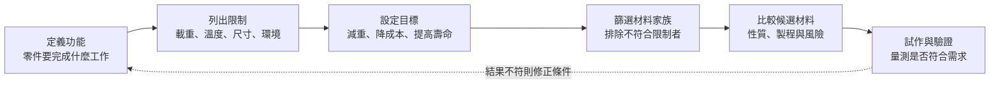

# 材料類型、材料性質與工程選材：不是找最強，而是找適合

> 這篇以 UC Davis 課程中的「六大工程材料選單」與「結構決定性質」為主線，重新整理金屬、聚合物、陶瓷、玻璃、複合材料與半導體的主要特徵。目的不只是記住每一類材料有哪些優點和限制，而是進一步理解這些性質從哪裡來、量測數值代表什麼，以及工程師如何根據實際需求選擇合適的材料。

如果只想先掌握這篇的主線，可以記得：**材料類別提供初步方向，材料性質提供比較依據，不過真正的選材結果仍然需要回到功能、環境、製程與可靠度進行驗證。**

## 1. 為什麼要先建立材料分類？

工程上可以使用的材料種類非常多，如果一開始就逐一比較所有牌號、成分和製程狀態，很容易只得到一份龐大卻缺乏脈絡的資料表。因此，UC Davis 課程先將常見的工程材料整理成六個家族，讓我們能從原子鍵結、結構和典型性質建立第一層理解，接著再逐步縮小候選範圍。

這種分類適合用來回答：

- 目前的設計問題大致需要哪一類材料？
- 哪些性質可能是這個材料家族的優勢？
- 哪些限制需要在後續選材時特別確認？
- 如果檢測發現異常，可能需要從哪些材料機制開始提出假設？

不過，材料分類只能提供常見趨勢，並不能直接代替實際數據。即使屬於同一個材料家族，只要成分、晶體結構、孔隙率、晶粒尺寸、添加物、熱處理或加工歷程不同，最後呈現的性質就可能有明顯差異。因此，我會把分類視為查找方向的起點，而不是可以直接採納的選材結論。

## 2. 六大工程材料家族

### 2.1 金屬（Metals）

金屬主要由**金屬鍵**結合，價電子不完全屬於單一原子，而是能在晶格中移動。這種電子結構使許多金屬具有良好的導電性、導熱性與金屬光澤。同時，金屬通常也具備一定程度的塑性變形能力，因為晶體中的差排能在適當的滑移系統上移動。

常見優勢包括：

- 剛性、強度與韌性通常能取得不錯的平衡。
- 多數金屬可以鑄造、鍛造、軋延、切削、焊接或熱處理。
- 導電與導熱能力通常優於陶瓷和聚合物。

常見限制包括：

- 密度通常高於聚合物與部分複合材料。
- 可能發生腐蝕、氧化、疲勞或高溫蠕變。
- 導電性在需要電絕緣的場合反而會成為限制。

半導體相關例子包括銅互連、鋁接墊、不鏽鋼設備零件與鋁合金機構件。

### 2.2 聚合物（Polymers）

聚合物的分子鏈內主要是強共價鍵，但不同分子鏈之間通常依靠較弱的次級鍵結。這種「鏈內強、鏈間相對較弱」的結構，使聚合物通常具有低密度、容易成形與電絕緣等特性。不過它的剛性、耐熱性與長期尺寸穩定性通常低於金屬和陶瓷，因此不能只根據分子鏈內的共價鍵很強，就推論整體材料也一定剛硬。

聚合物性質對溫度、時間和載入速率特別敏感。即使外加應力沒有超過短時間試驗所量到的強度，分子鏈仍可能在長期載重下逐漸旋轉、伸展或彼此滑動，造成蠕變與應力鬆弛。

半導體相關例子包括光阻、封裝樹脂、黏著層、絕緣薄膜與設備中的密封材料。

### 2.3 陶瓷（Ceramics）

陶瓷通常以離子鍵、共價鍵或兩者混合的方式結合。其鍵結強、方向性或電荷平衡限制明顯，因此陶瓷通常具有高剛性、高硬度、耐磨、耐高溫和良好化學穩定性。

陶瓷的原子鍵結並不弱，真正需要注意的是它們通常缺少能在常溫下大量進行塑性變形的機制。當表面或內部存在裂紋時，材料不容易透過局部塑性變形降低裂尖應力，因此在拉伸或彎曲載重下可能突然脆斷。這也能說明為什麼陶瓷雖然具有高剛性和高硬度，實際拉伸強度卻經常對缺陷尺寸、表面加工與試片狀態高度敏感。

半導體相關例子包括氧化鋁、氮化鋁、氮化矽、二氧化矽介電層與陶瓷晶圓載台。

### 2.4 玻璃（Glasses）

課程將玻璃獨立列為一個材料家族，主要差異不只是化學成分，而是玻璃缺少長程週期性的晶體排列，屬於**非晶態結構**。許多玻璃具有良好的光學透明性、表面平滑度、電絕緣性與化學穩定性。

不過，非晶態本身並不代表材料一定透明。實際透明度仍取決於能隙、成分、吸收機制、雜質、氣泡、相分離、表面粗糙度與使用波長。同時，玻璃也和陶瓷一樣具有明顯的缺陷敏感性，即使只是一道表面刮痕，也可能降低它能夠承受的實際應力。

半導體相關例子包括石英光罩基板、光學窗口、玻璃載板與部分顯示器基板。

### 2.5 複合材料（Composites）

複合材料由兩種以上的材料組成，常見形式是基材加上纖維、顆粒或其他強化相。課程使用玻璃纖維作為簡單例子：聚合物基材提供成形能力與一定延展性，玻璃纖維則提供較高的強度和剛性。

複合材料的優勢在於能針對需求調整性質，例如提高比強度、比剛性、耐磨性或尺寸穩定性。不過，這些優勢不只是把兩種材料的性質直接相加。材料的方向性、界面附著、孔洞、纖維排列與製程品質，都會影響最後能否真正產生預期效果。

半導體相關例子包括封裝基板、玻璃纖維強化樹脂與設備中的輕量結構件。

### 2.6 半導體（Semiconductors）

半導體的導電能力介於導體與絕緣體之間，但真正重要的特徵是其載子濃度與導電性可以透過溫度、摻雜、電場和材料結構進行控制。以矽為例，原子之間以共價鍵形成晶體；電子需要取得足夠能量，才能從價帶跨越能隙進入導帶並參與導電。

加入少量施主或受主雜質後，可以形成 n 型或 p 型半導體，進一步控制電子與電洞的濃度。這種可控制性使半導體成為電子元件的核心材料，不過它也代表純度、晶體缺陷、摻雜均勻性、界面狀態與製程溫度，都可能直接反映在最後量測到的電性結果上。

> **我目前的理解：** 六大材料家族的價值，不是替每一種材料貼上一組固定標籤，而是先讓我們知道應該從哪些結構與性質開始提問。真正的差異仍然要回到具體材料、製程狀態和使用條件確認。

常見例子包括矽、鍺、碳化矽、氮化鎵與砷化鎵。

## 3. 原子鍵結如何影響材料性質？

材料性質可以先從原子尺度開始理解。原子的電子排列會影響原子如何形成鍵結，而鍵結方式又會進一步影響材料的剛性、導電、導熱、熱膨脹與變形機制。不過，這裡只先整理選材時需要使用的基本連結。

### 3.1 一次鍵結與二次鍵結

一次鍵結通常較強，包括離子鍵、共價鍵與金屬鍵；二次鍵結則來自分子或原子間較弱的靜電吸引，包括凡得瓦力與氫鍵。這兩個層級不能只用「強或弱」簡單排序，因為材料最後呈現的性質，仍然取決於鍵結分布、結構排列與實際變形方式。

| 鍵結類型 | 基本方式 | 常見材料 | 對性質的主要線索 |
| --- | --- | --- | --- |
| 離子鍵 | 電子轉移後，正負離子之間產生靜電吸引 | 許多陶瓷 | 鍵結強、剛性與熔點通常較高；多數情況下缺少自由電子 |
| 共價鍵 | 相鄰原子共享電子，通常具有方向性 | 矽、部分陶瓷、聚合物分子鏈 | 鍵結強且具有方向性；導電行為和能帶結構有關 |
| 金屬鍵 | 價電子離域並能在金屬晶格中移動 | 金屬與合金 | 通常具有良好導電與導熱能力，也較容易透過差排產生塑性變形 |
| 次級鍵結 | 暫時或永久偶極之間的吸引 | 聚合物鏈間、分子材料 | 會影響柔軟度、玻璃轉移、黏著、蠕變與溫度敏感性 |

實際材料中也可能同時存在多種鍵結。例如陶瓷可能兼具離子與共價特徵；聚合物分子鏈內以共價鍵為主，鏈與鏈之間則由次級鍵結控制部分行為。因此，分類能提供性質方向，但不能把每一種材料都簡化成單一鍵結。

### 3.2 鍵結力與彈性模數

兩個原子之間同時存在吸引與排斥作用，在平衡原子間距 $r_0$ 時，系統能量最低且合力為零。當外力讓原子間距產生微小變化時，鍵結會提供回復力，使材料在移除外力後回到接近平衡的位置。

鍵結能量 $U$ 與原子間作用力 $F$ 的關係可表示為：

$$
F=-\frac{dU}{dr}
$$

在平衡位置附近，作用力和原子間距的微小變化可近似為線性關係，這也是巨觀拉伸試驗初期呈現線性彈性行為的原因。應力—應變曲線初始區段的斜率就是彈性模數：

$$
E=\frac{\sigma}{\varepsilon}
$$

鍵結力曲線在平衡位置附近越陡，表示稍微改變原子間距就需要越大的力，材料的彈性模數通常也越高。因此，強離子鍵或共價鍵結的陶瓷常具有較高剛性，而分子鏈間次級鍵結較弱的聚合物通常具有較低剛性。

不過，**鍵結並不是決定所有性質的唯一因素**。降伏強度、延展性、韌性、導電率與破壞行為，還會受到晶體結構、差排、晶粒、孔洞、裂紋、相組成、溫度與製程歷程影響。原子鍵結提供了性質的基礎，但工程上實際量到的數值，通常是多個尺度共同作用後的結果。

> **容易混淆：** 彈性模數描述材料抵抗彈性變形的能力，也就是剛性；強度描述材料在降伏或破壞前能承受的應力。材料可以很剛卻因缺陷而容易脆斷，也可以剛性較低卻承受很大的變形而不立即破壞。

詳細的鍵結能量曲線、一次鍵與二次鍵，以及矽的共價晶體結構，會在 `03-atomic-bonding-and-structure.md` 進一步整理。

## 4. 工程上常用的材料性質

材料性質是材料對外部刺激所產生的可量測反應。在查閱資料時，不只需要記錄數值，還要進一步確認試驗方法、材料方向、溫度、應變速率、頻率、濕度與材料狀態。只要這些條件不同，即使表格中的名稱相同，不同來源的數據也可能無法直接比較。

### 4.1 機械性質

| 性質 | 代表意義 | 常見判讀或試驗 |
| --- | --- | --- |
| 彈性模數 $E$ | 抵抗彈性變形的能力，也就是剛性 | 應力—應變曲線初始斜率 |
| 降伏強度 $\sigma_y$ | 開始產生明顯永久變形的應力 | 拉伸試驗；必要時使用 0.2% 偏移法 |
| 抗拉強度 $\sigma_{UTS}$ | 工程應力—應變曲線上的最大應力 | 最大負載除以原始截面積 |
| 延展性 | 斷裂前可承受的塑性變形程度 | 斷裂伸長率、截面縮減率 |
| 韌性 | 斷裂前單位體積可吸收的總能量 | 應力—應變曲線到斷裂為止的面積 |
| 硬度 | 抵抗局部壓入、刮傷或塑性變形的能力 | 壓痕硬度試驗 |
| 破壞韌性 $K_{IC}$ | 含裂紋材料抵抗裂紋失穩擴展的能力 | 標準破壞力學試驗 |

這些性質不能互相代替。例如硬度可以和強度存在經驗相關性，但不等於材料一定具有高韌性；彈性模數高也不代表降伏強度或抗拉強度一定高。

### 4.2 熱性質

| 性質 | 代表意義 | 工程影響 |
| --- | --- | --- |
| 熱傳導率 $k$ | 傳遞熱量的能力 | 散熱速度、溫度均勻性、熱點形成 |
| 熱膨脹係數 $\alpha$ | 溫度改變時尺寸變化的比例 | 翹曲、界面應力、薄膜裂紋或分層 |
| 比熱 $c_p$ | 單位質量升高單位溫度所需熱量 | 升降溫速度與熱慣性 |
| 玻璃轉移／熔融／分解溫度 | 結構或狀態開始顯著改變的溫度 | 可使用溫度與製程窗口 |

在線性近似範圍內，熱膨脹可表示為：

$$
\Delta L=\alpha L_0\Delta T
$$

如果兩種接合材料的熱膨脹係數不同，溫度循環時就會產生不同的自由伸縮量；當界面限制這些變形後，應力會累積並可能造成翹曲、裂紋或分層。

### 4.3 電性質

導電率 $\sigma_e$ 與電阻率 $\rho_e$ 互為倒數：

$$
\sigma_e=\frac{1}{\rho_e}
$$

金屬通常依靠可移動電子導電；陶瓷與聚合物多半是絕緣材料；半導體則能透過能隙、摻雜與溫度控制載子。除了導電率之外，介電常數、介電強度、漏電流與介電損耗也會影響絕緣層與高頻元件的材料選擇。

### 4.4 光學性質

光學材料需要考慮透射率、反射率、吸收率、折射率、散射與使用波長。材料在可見光下透明，不代表它在紫外光或紅外光範圍仍然透明；表面粗糙、顆粒、孔洞與膜厚變化也會改變光學訊號。

這些性質和半導體檢測直接相關，因為光學系統看到的明暗差異，可能來自幾何形貌、材料反射率、薄膜干涉或污染，而不一定只代表表面高度不同。如果沒有先理解材料和光線如何互相作用，就很容易把影像差異直接解讀成單一類型的缺陷。

### 4.5 化學與環境性質

耐腐蝕、抗氧化、吸濕、溶劑相容性、真空放氣與潔淨度，經常會直接決定材料能否進入實際製程。即使材料的機械與熱性質都符合需求，只要它會和清洗液反應、釋出污染物，或在真空環境中大量放氣，最後仍然可能不適合半導體設備與製程。

## 5. 六大材料家族的定性比較

下表整理的是一般工程趨勢，不代表每一種材料都符合相同排序：

| 材料家族 | 密度 | 剛性 | 常溫延展性 | 耐高溫 | 導電性 | 缺陷敏感性 |
| --- | --- | --- | --- | --- | --- | --- |
| 金屬 | 中至高 | 中至高 | 通常較好 | 依合金而異 | 通常高 | 中等；疲勞與腐蝕需注意 |
| 聚合物 | 低 | 通常低 | 依種類而異 | 通常較低 | 通常低 | 對刮傷未必敏感，但對時間、溫度與環境敏感 |
| 陶瓷 | 中 | 通常高 | 很低 | 通常高 | 通常低 | 高；裂紋與表面缺陷重要 |
| 玻璃 | 中 | 中至高 | 很低 | 依成分而異 | 低 | 高；表面刮痕會降低強度 |
| 複合材料 | 可設計 | 可設計 | 依基材與方向而異 | 依系統而異 | 可設計 | 界面、孔洞與方向性重要 |
| 半導體 | 中 | 中至高 | 通常低 | 依材料而異 | 可控制 | 對晶體缺陷、雜質與界面高度敏感 |

這張表比較適合用來快速篩選和提出問題，而不是直接得出最終答案。例如「陶瓷耐高溫」不代表所有陶瓷都適合熱循環；「聚合物密度低」也不代表它在長期受力、真空或化學環境中仍然能維持尺寸與性質。當實際情境改變後，原本看起來是優勢的特徵，也可能成為新的限制。

## 6. 性質之間的取捨

材料選擇真正困難的地方，往往不是找不到符合單一條件的材料，而是多個條件彼此衝突：

- 提高硬度與強度，可能同時降低延展性或增加裂紋敏感性。
- 降低密度有助於減重，但剛性、耐熱性或阻尼可能跟著改變。
- 提高熱傳導率有助於散熱，卻不一定能解決熱膨脹失配。
- 使用高絕緣材料可以降低漏電，但也可能增加散熱與接地設計難度。
- 選擇透明材料仍需確認波長範圍、表面品質、熱穩定性與化學相容性。
- 複合材料可以組合不同優勢，但會新增界面、方向性與製程一致性的問題。

因此，工程選材真正要回答的通常不是「哪一種材料最好」，而是「在目前的功能、限制和風險下，哪一種材料與製程組合最合適」。如果沒有先把使用條件說清楚，單純比較資料表上的最高數值，很容易得到看起來合理、實際上卻無法使用的答案。

## 7. 工程選材的基本流程

### 7.1 定義功能

我會先說明材料在系統中需要完成的工作，例如承受載重、傳遞熱量、隔離電流、讓特定波長通過、抵抗磨耗或維持晶圓位置。如果功能描述得太模糊，後續即使取得更多材料數據，也很難形成真正有效的比較。

### 7.2 列出限制條件

限制是候選材料必須符合的最低要求，例如：

- 最大工作溫度與溫度循環範圍
- 可接受的變形、翹曲或振動
- 強度、剛性、破壞韌性與疲勞壽命
- 導電、絕緣、接地或介電要求
- 真空、腐蝕、清洗與潔淨度條件
- 尺寸、重量、成本與供應限制

### 7.3 設定目標

目標是希望被最大化或最小化的項目，例如降低質量、降低成本、提高散熱、延長壽命或提高量產良率。一個設計可能同時有多個目標，因此需要明確決定優先順序和可接受的取捨。

### 7.4 篩選與排序

先利用硬性限制排除明顯不適合的材料，再根據目標比較剩餘候選方案。若問題和重量及剛性有關，不能只比較彈性模數 $E$，也需要同時考慮密度 $\rho$；若問題和散熱有關，除了熱傳導率，還要檢查熱膨脹、界面熱阻與幾何條件。

### 7.5 加入製程與實務資訊

材料在資料表上符合要求，不代表它能被穩定製造。還需要確認：

- 是否能以需要的尺寸與公差加工？
- 能否沉積、蝕刻、研磨、接合或清洗？
- 製程是否會引入孔洞、裂紋、殘留應力或污染？
- 供應商數據是否符合實際材料狀態與方向？
- 量產後能否透過檢測監控關鍵性質？

### 7.6 試作、量測與回饋

完成初步篩選後，仍然需要透過試片、原型件或實際製程進行驗證。材料選擇並不是一次性的查表工作，而是一個需要持續比對原始假設、量測結果與失效模式的循環。如果結果不符合預期，就要回頭確認問題出在材料數據、製程狀態、幾何設計，還是原本的需求定義。

## 8. 簡單例子：同樣載重下的剛性與重量

假設兩根長度與截面積相同的拉桿分別使用鋼和鋁，在相同軸向載重下，其彈性伸長量可由下式估算：

$$
\delta=\frac{FL}{AE}
$$

若取常見的近似彈性模數：

$$
E_{steel}\approx200\ \mathrm{GPa},\qquad
E_{Al}\approx70\ \mathrm{GPa}
$$

在 $F$、$L$ 與 $A$ 都相同時：

$$
\frac{\delta_{Al}}{\delta_{steel}}
=\frac{E_{steel}}{E_{Al}}
\approx\frac{200}{70}
\approx2.9
$$

也就是說，相同幾何下，鋁拉桿的彈性伸長大約是鋼的 2.9 倍。不過鋁的密度約為鋼的三分之一，因此相同體積下重量也會明顯降低。

這個簡單例子讓我看到，只比較「鋼比較硬」或「鋁比較輕」都不夠完整：

- 如果幾何尺寸固定而變形限制嚴格，較高的彈性模數可能更重要。
- 如果允許調整截面且減重是主要目標，就需要同時比較彈性模數、密度、強度、加工與成本。
- 即使計算顯示某一材料較有利，仍要確認疲勞、接合、腐蝕、熱膨脹與實際製程條件。

> **計算提醒：** 這裡只比較線性彈性、軸向拉伸與相同幾何條件，不代表鋁或鋼在所有結構中一定較好。載重方式和幾何改變後，適合的材料指標也會跟著改變。

## 9. 半導體製造與檢測中的選材思考

半導體系統並不是只由半導體材料組成，它同時包含晶圓、薄膜、金屬互連、介電層、光阻、封裝材料、載台、光學元件與設備結構。每一個位置需要完成的功能不同，因此選材時真正需要比較的性質也不一樣。

### 9.1 晶圓與主動材料

矽能成為主要半導體材料，不只是因為它具有可控制的導電性，也和高品質晶圓、成熟製程、可形成穩定氧化層及完整產業鏈有關。碳化矽和氮化鎵等材料在高功率、高電場或高溫應用中具有優勢，不過實際選擇仍需要比較晶體品質、基板尺寸、缺陷密度、接觸與製程成本。

### 9.2 薄膜與界面

薄膜材料需要同時考慮電性、厚度均勻性、附著力、殘留應力、熱膨脹與後續製程相容性。即使單層材料的性質符合要求，只要和上下層材料的界面不穩定，仍可能產生裂紋、剝離、空洞或電性漂移。

### 9.3 晶圓載台與檢測設備

晶圓載台可能需要高剛性、低熱膨脹、良好熱均勻性、低振動、可加工性與潔淨度。鋁合金、不鏽鋼、陶瓷或其他低膨脹材料各有優勢與限制，不能只用「最硬」或「最輕」決定。

例如：

- 剛性不足可能造成定位或焦距誤差。
- 熱膨脹不均可能造成漂移、翹曲與疊對偏差。
- 表面容易磨耗或產生顆粒，可能增加污染與誤檢。
- 材料會被清洗液腐蝕或在真空中放氣，可能影響製程穩定性。

### 9.4 檢測結果也是選材回饋

材料選擇完成後，檢測可以協助確認實際製程是否維持在預期狀態。例如表面顆粒可能反映材料磨耗或塗層剝落；規律裂紋可能和殘留應力或熱膨脹失配有關；亮暗差異則可能來自膜厚、粗糙度、反射率或污染。

不過，相同外觀可能對應不同機制，因此檢測結果只能作為證據的起點，而不是可以直接交付的根因結論。較可靠的做法是先描述缺陷的形狀、位置與分布，接著結合材料性質與製程條件提出可能假設，最後再透過其他量測方法逐步確認或排除。

## 10. 常見混淆與易錯觀念

1. **材料越硬，不代表越不容易斷。** 硬度描述局部壓入或刮傷阻力，斷裂仍和韌性、裂紋及應力狀態有關。
2. **彈性模數高，不等於強度高。** 剛性和降伏或破壞前可承受的應力是不同性質。
3. **陶瓷鍵結強，不等於實際拉伸強度一定高。** 缺少塑性變形及裂紋敏感性會限制其實際強度。
4. **聚合物鏈內有強共價鍵，不代表整體材料一定剛硬。** 鏈間次級鍵、分子排列、溫度與時間同樣重要。
5. **玻璃是非晶態，不代表所有非晶材料都透明。** 光學性質仍取決於電子結構、成分、缺陷與波長。
6. **複合材料不是把兩種優點直接相加。** 界面品質、排列方向與製程缺陷可能決定結果。
7. **導電率高低不是唯一電性指標。** 絕緣層還需要考慮介電強度、漏電、介電損耗與可靠度。
8. **材料資料表不是最終答案。** 測試條件、材料狀態、試片方向與實際製程不同，數據可能無法直接套用。
9. **最好的單一性質不等於最合適的材料。** 選材需要同時處理功能、限制、製程、成本與風險。
10. **檢測看到異常不等於已經知道根因。** 外觀、材料機制與製程原因之間仍需要交叉驗證。

## 11. 回頭看：真正想掌握的是什麼？

- 六大材料家族是一份用來建立方向的工程選單，而不是固定不變的性質排名。
- 原子鍵結能解釋部分性質來源，不過材料的實際行為仍會受到結構、缺陷、製程、溫度與時間影響。
- 剛性、強度、硬度、延展性與韌性描述的是不同問題，因此不能互相代替。
- 工程選材需要先定義功能與限制，接著比較性質、製程、成本及失效風險，最後再透過實際量測驗證。
- 半導體製造中的材料問題經常發生在薄膜、界面與多材料整合處，因此選材和檢測並不是分開的兩件事，而是會持續互相提供回饋。

這篇筆記真正需要留下的不是哪一個材料家族「最好」，而是一套能夠持續使用的判斷方式：先釐清材料需要完成的功能，再比較性質和限制，並且用實際結果檢查原本的選擇是否合理。只有當能說明為什麼採用某一種材料、它可能在哪些條件下失效，以及應該如何驗證時，選材才不只是查到一組數據而已。

## 參考資料

- [UC Davis / Coursera — Materials Science: 10 Things Every Engineer Should Know](https://www.coursera.org/learn/materials-science)
- [NIST — Materials Design Toolkit](https://www.nist.gov/programs-projects/materials-design-toolkit)
- [NIST — Structural Metrology of Advanced Manufacturing Processes](https://www.nist.gov/programs-projects/structural-metrology-advanced-manufacturing-processes)
