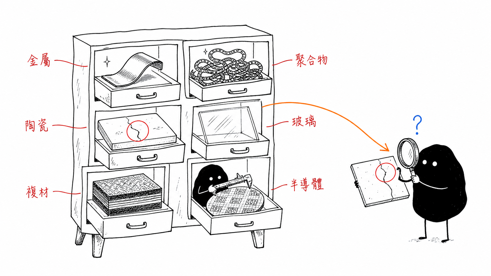
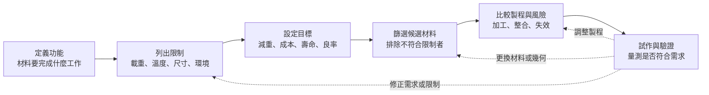
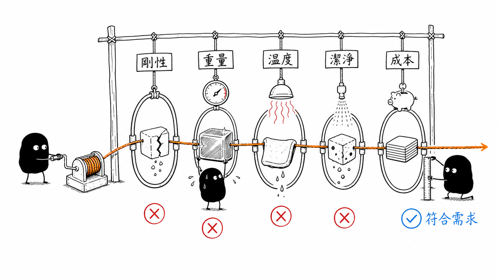

# Material Families, Property Trade-offs, and Engineering Selection

## 材料家族、性質取捨與工程選材

> **Learning Context**
>
> In inspection work, material selection is usually completed before an AOI system begins collecting images. But the selected material, surface condition, coating, interface, and thermal behavior all influence the signals that appear later. I studied engineering selection to understand these conditions more systematically, especially when a material performs well in one category but creates an integration or reliability problem somewhere else.

## English Summary

This chapter moves from six engineering material families to a practical selection process based on function, constraints, trade-offs, manufacturability, and verification. Bonding and structure provide useful clues, but engineering properties still need to be read together with geometry, processing, interfaces, operating conditions, and failure risks.

A steel–aluminum example shows why the answer changes when the design constraint changes. For semiconductor manufacturing and inspection, the same reasoning applies to optical response, thermal-expansion mismatch, surface condition, thin-film interfaces, and contamination. AOI can reveal evidence of change. It cannot identify a material or process root cause from visual contrast alone.

本篇主要依據先前翻譯與整理 UC Davis 課程時留下的學習筆記，接著將材料分類重新放回選材條件、性質取捨和檢測問題中理解。

## 1. Material Families as a Starting Point

I do not treat the six families as a shortlist by themselves. I use them to ask an earlier question: what advantage does each family offer, and what new risk does that advantage introduce?

| 材料家族 | 選材時的主要優勢 | 需要注意的工程風險 | 與檢測的關係 |
| --- | --- | --- | --- |
| 金屬 | 剛性、導電、導熱與加工性 | 密度、腐蝕、疲勞與磨耗顆粒 | 反射率、熱漂移與磨耗碎屑會改變量測結果 |
| 聚合物 | 低密度、容易成形、絕緣與光學性質可調 | 潛變、吸濕、老化與真空放氣 | 透明度、變形和表面污染會影響成像 |
| 陶瓷 | 硬度、耐磨、絕緣與高溫穩定性 | 脆性、加工損傷與缺陷敏感性 | 表面裂紋、崩角與顆粒是常見觀察重點 |
| 玻璃 | 透光、表面平滑且光學性質可設計 | 刮痕、脆性破壞與熱衝擊 | 薄膜干涉、表面損傷與光學畸變可能形成對比 |
| 複合材料 | 可以針對需求調整比性質 | 異向性、孔洞與界面變異 | 紋理不均與內部缺陷可能增加判讀難度 |
| 半導體 | 電性可以透過摻雜和結構控制 | 對純度、缺陷、表面與界面高度敏感 | 光學異常與電性異常可能互相關聯，但不一定一一對應 |

這張表的作用是縮小問題範圍，而不是直接選出答案。即使屬於同一個材料家族，只要成分、晶體結構、孔隙率、晶粒、添加物或製程歷程不同，最後量測到的性質就可能有明顯差異。分類只能提供第一層線索。

> **Engineering Takeaway**
>
> A material family is useful when it narrows the search space and exposes likely risks. It becomes misleading when its typical behavior is treated as a property value for every grade, process state, or operating condition.

## 2. 從鍵結與結構理解性質來源

原子的電子排列會影響鍵結方式，而鍵結又會進一步影響材料的剛性、導電、導熱、熱膨脹與變形行為。在這篇中，鍵結的用途是提供選材線索；完整的電子結構、鍵結能量與晶體排列會留到 `03-atomic-bonding-and-structure.md` 說明。

| 鍵結類型 | 基本方式 | 對材料性質的主要線索 |
| --- | --- | --- |
| 離子鍵 | 電子轉移後，由正負離子之間的靜電吸引形成 | 鍵結通常較強，多數材料缺少可自由移動的電子 |
| 共價鍵 | 相鄰原子共享電子，並具有明顯方向性 | 能形成高剛性結構；導電行為與能帶結構有關 |
| 金屬鍵 | 價電子離域並在晶格中移動 | 通常具有良好導電與導熱能力，也較容易產生塑性變形 |
| 次級鍵結 | 分子或原子間的偶極吸引，包括凡得瓦力與氫鍵 | 會影響聚合物的柔軟度、玻璃轉移、黏著與長期蠕變 |

實際材料可能同時存在多種鍵結，因此這張表只能用來判斷性質的大致方向。鍵結提供剛性、導電、熱膨脹與變形行為的第一層線索，不過實際工程性質仍然會受到晶體結構、缺陷、相組成、製程狀態與測試條件控制。這也是本篇只保留必要鍵結內容的原因，完整機制會在第三章再展開。

## 3. 選材時需要比較哪些性質？

材料性質是材料對外部刺激所產生的可量測反應。查閱資料時，除了記錄數值外，還需要確認試驗方法、溫度、材料方向、應變速率、頻率、濕度與製程狀態。只要測試條件不同，即使性質名稱相同，數據也不一定能直接比較。

| 性質類別 | 主要問題 | 常見性質 | 半導體製造或檢測中的影響 |
| --- | --- | --- | --- |
| 機械 | 材料受到載重後會如何變形或破壞？ | 彈性模數、降伏強度、硬度、延展性、韌性 | 定位穩定、磨耗、裂紋、顆粒產生 |
| 熱 | 材料如何傳熱並隨溫度改變尺寸？ | 熱傳導率、熱膨脹係數、比熱、可使用溫度 | 熱點、漂移、翹曲、薄膜裂紋與分層 |
| 電 | 材料如何傳輸或隔離電荷？ | 導電率、電阻率、介電強度、介電損耗 | 互連、絕緣、漏電、接地與訊號完整性 |
| 光學 | 材料如何反射、吸收、透射或散射光？ | 折射率、反射率、透射率、吸收率 | AOI 對比、薄膜干涉、光學窗口與檢測波長 |
| 化學與環境 | 材料能否維持穩定並避免污染？ | 耐腐蝕、吸濕、溶劑相容性、真空放氣 | 清洗相容性、污染、氧化與製程穩定性 |

### 3.1 幾個不能互相代替的機械性質

- **彈性模數**描述材料抵抗彈性變形的能力，也就是剛性。
- **降伏強度**表示材料開始產生明顯永久變形時的應力。
- **硬度**描述材料抵抗局部壓入、刮傷或塑性變形的能力。
- **延展性**表示材料在斷裂前能承受多少塑性變形。
- **韌性**表示材料在斷裂前能吸收多少能量。

這些性質不能只用「越高越好」處理。高硬度不代表材料具有高韌性；彈性模數高，也不代表降伏強度或抗拉強度一定高。選材時需要先確認零件會遇到哪一種載重與失效風險，再決定哪一項性質真正具有優先性。

### 3.2 熱膨脹需要和界面一起判斷

在線性近似範圍內，材料的熱伸長可表示為：

$$
\Delta L=\alpha L_0\Delta T
$$

其中 $\alpha$ 是熱膨脹係數。如果兩種接合材料的 $\alpha$ 不同，溫度改變時就會產生不同的自由伸縮量。當界面限制材料的自由熱應變時，系統會產生熱應力。這不一定代表應力會隨時間持續累積；若材料經歷重複溫度循環，或同時伴隨塑性變形、黏彈行為、界面損傷與沉積本徵應力，才可能進一步留下殘留應力或形成累積損傷。

因此，選擇高熱傳導材料並不代表熱問題已經解決。熱傳導率、熱膨脹、界面熱阻、幾何尺寸與溫度分布仍然需要一起評估。

## 4. 性質之間的取捨

工程選材真正困難的地方，通常不是找不到符合單一條件的材料，而是多個條件彼此衝突：

- 提高硬度與強度，可能同時降低延展性或增加裂紋敏感性。
- 降低密度有助於減重，不過剛性、耐熱性或阻尼也可能跟著改變。
- 提高熱傳導率有助於散熱，卻不能直接消除熱膨脹失配。
- 選擇透明材料時，仍需要確認使用波長、表面品質與熱穩定性。
- 複合材料可以組合不同優勢，但也會新增界面、方向性與製程一致性的問題。

因此，工程選材要回答的不是「哪一種材料最好」，而是「在目前的功能、限制和風險下，哪一種材料與製程組合較為合適」。如果沒有先說清楚使用條件，單純比較資料表中的最高數值，很容易得到無法對應實際需求的答案。

> **Engineering Takeaway**
>
> Property values become useful only after the loading, geometry, environment, and failure mode are defined. A higher value may solve one constraint while making another part of the system harder to manufacture, inspect, or maintain.

## 5. 工程選材的基本流程

```mermaid
flowchart LR
    A["定義功能<br/>材料要完成什麼工作"] --> B["列出限制<br/>載重、溫度、尺寸、環境"]
    B --> C["設定目標<br/>減重、成本、壽命、良率"]
    C --> D["篩選候選材料<br/>排除不符合限制者"]
    D --> E["比較製程與風險<br/>加工、整合、失效"]
    E --> F["試作與驗證<br/>量測是否符合需求"]
    F -. "修正需求或限制" .-> B
    F -. "更換材料或幾何" .-> D
    F -. "調整製程" .-> E
```

### 5.1 功能、限制與目標

首先需要說明材料在系統中負責什麼工作，例如承受載重、傳遞熱量、隔離電流、讓特定波長通過，或維持晶圓的位置。如果功能描述得太模糊，後續即使取得更多材料數據，也很難形成有效比較。

接著再把條件分成兩類：

- **限制**是候選材料必須符合的要求，例如最高工作溫度、最大允許變形、真空相容性或介電強度。
- **目標**是希望進一步改善的項目，例如降低質量、控制成本、提高散熱效率或延長使用壽命。

### 5.2 製程與驗證不能留到最後才考慮

材料在資料表上符合要求，不代表它能被穩定製造。選材時仍需要確認它能否被沉積、蝕刻、研磨、接合或清洗，以及製程是否會引入孔洞、裂紋、殘留應力和污染。

完成初步篩選後，還需要透過試片、原型件或實際製程進行量測。如果結果不符合預期，就要回頭確認問題出在材料數據、製程狀態、幾何設計，還是原本的需求定義。

## 6. Worked Example: Steel, Aluminum, Stiffness, and Weight

這個例子先比較相同幾何，再改成相同重量。兩次都使用鋼和鋁，不過限制條件改變後，選材結論也會跟著改變。

### 6.1 相同幾何

假設兩根長度與截面積相同的拉桿分別使用鋼和鋁，在相同軸向載重下，其彈性伸長量可由下式估算：

$$
\delta=\frac{FL}{AE}
$$

若採用常見的近似彈性模數：

$$
E_{steel}\approx200\ \mathrm{GPa},\qquad
E_{Al}\approx70\ \mathrm{GPa}
$$

在 $F$、$L$ 與 $A$ 都相同時：

$$
\frac{\delta_{Al}}{\delta_{steel}}
=\frac{E_{steel}}{E_{Al}}
\approx2.9
$$

相同幾何下，鋁拉桿的彈性伸長大約是鋼的 2.9 倍；不過鋁的密度約為鋼的三分之一，因此相同體積下的重量也會明顯降低。若空間固定而變形限制嚴格，鋼在這個比較中較有優勢。

### 6.2 相同重量

如果長度與材料質量固定，截面積可以利用密度 $\rho$ 表示：

$$
m=\rho AL
$$

因此：

$$
A=\frac{m}{\rho L}
$$

代回軸向伸長公式後可得：

$$
\delta=\frac{F\rho L^2}{mE}
$$

在相同載重、長度與質量下，需要比較的不再只是彈性模數 $E$，而是比彈性模數 $E/\rho$。使用常見近似值：

$$
\frac{E_{\mathrm{steel}}}{\rho_{\mathrm{steel}}}
\approx\frac{200}{7.8}
\approx25.6
$$

$$
\frac{E_{\mathrm{Al}}}{\rho_{\mathrm{Al}}}
\approx\frac{70}{2.7}
\approx25.9
$$

這裡的彈性模數與密度使用一致的相對單位進行比值比較。結果顯示，鋼與鋁的比彈性模數相當接近。如果允許鋁增加截面積，在相同重量下，兩者的軸向彈性伸長可能接近。

這並不代表兩種材料可以直接互換。空間限制、降伏強度、疲勞、腐蝕、接合方式、加工成本與截面形狀仍然可能改變最後的選擇。尤其在彎曲問題中，剛性還會受到截面二次矩影響，不能直接沿用軸向拉伸的結論。

> **Engineering Takeaway**
>
> A material comparison only becomes meaningful after the design constraint is defined. Steel is stiffer for the same geometry, while steel and aluminum have similar specific modulus in this simplified axial example. Change the mass or geometry constraint, and the selection result may change as well.

> **計算範圍：** 這裡只比較線性彈性與軸向拉伸，並使用概略材料數值說明選材方法。若載重模式、截面形狀、合金狀態或安全要求改變，適合使用的材料指標也需要重新確認。

## 7. Why This Matters for Semiconductor Manufacturing and Inspection

> In semiconductor and optical inspection systems, material choice affects more than structural performance. It changes reflectivity, transmission, thermal drift, surface stability, contamination risk, and the interfaces that may fail later. These factors shape what the camera can observe before any model begins interpreting the image.

半導體系統不只包含半導體晶圓，也同時包含薄膜、金屬互連、介電層、光阻、封裝材料、晶圓載台、光學元件與設備結構。每一個位置的功能不同，因此選材時需要比較的性質也不一樣。

### 7.1 AOI 的亮暗差異不一定是幾何缺陷

光學檢測中的亮點、暗點或局部對比變化，可能來自表面高度、粗糙度、材料反射率、薄膜干涉、污染或照明角度。即使影像外觀看起來相似，背後的材料與製程機制也可能完全不同。

因此，AOI 適合用來發現、定位與分類異常，但影像本身通常不足以確認材料成分、晶相或裂紋深度。若需要判斷根因，仍可能需要結合輪廓量測、SEM、EDS、XRD 或電性資料。

### 7.2 熱膨脹失配會反映在形貌與可靠度上

薄膜、基板和封裝材料在溫度改變時會產生不同程度的自由伸縮。當界面限制這些變形時，首先產生的是熱應力；製程完成並回到參考溫度後仍然存在的部分，才屬於殘留應力。若系統反覆經歷溫度循環，界面還可能逐步出現疲勞與損傷累積，最後造成：

- 薄膜裂紋或剝離
- 晶圓翹曲與位置漂移
- 界面空洞或分層
- 圖形疊對與焦距誤差

這類問題不能只從單一材料的熱膨脹係數判斷，還需要考慮膜厚、基板剛性、沉積溫度、冷卻歷程與界面附著力。

### 7.3 設備材料也會影響檢測結果

晶圓載台與檢測設備可能同時要求高剛性、低熱膨脹、良好熱均勻性、低振動、可加工性和潔淨度。材料如果容易磨耗或產生顆粒，可能增加污染與誤檢；如果受到清洗液腐蝕或在真空環境中放氣，也可能影響製程與量測穩定性。

### 7.4 檢測結果是驗證起點

材料選擇完成後，檢測可以協助確認實際製程是否維持在預期狀態。例如表面顆粒可能反映材料磨耗或塗層剝落；規律裂紋可能和殘留應力或熱膨脹失配有關；亮暗差異則可能來自膜厚、粗糙度、反射率或污染。

不過，相同外觀可能對應不同機制，因此檢測結果只能作為證據起點。較可靠的分析方式是先描述缺陷的形狀、位置與分布，接著結合材料性質和製程條件提出假設，最後再利用其他量測方法逐步確認或排除。

## 8. Applied Reflection: Material Decisions Become Inspection Constraints

In these inspection projects, I was not responsible for selecting the polymer formulation of a contact lens or the composition of a glass wafer. Those decisions had already been made before the inspection system was developed. My work began downstream, where the material's optical, mechanical, and surface behavior became constraints on imaging, algorithms, and system stability.

This was especially clear when inspecting transparent and easily deformed products. One illumination condition did not reveal every relevant feature consistently. Different lighting arrangements emphasized transmission, reflection, surface geometry, and edge shape in different ways. We therefore combined AI-based recognition with rule-based measurement for defects that had stable geometric definitions.

The material had not changed (only the way we observed it had). That made the connection between material behavior and inspection design much easier to see.

A glass-wafer inspection project presented a related problem. Bright-field and dark-field images emphasized different surface responses. Localized particles and scratches needed spatial detection, while wafer-level appearance patterns required a different interpretation. One image and one algorithm were not enough.

These experiences changed how I interpret material selection. A material is not only a list of stiffness, density, conductivity, or optical-property values. Once it enters a product, its transparency, reflectivity, surface quality, deformation behavior, interfaces, and environmental response determine what can be measured reliably downstream.

If I were involved earlier in the selection process, I would ask two connected questions:

1. Can the material and manufacturing route satisfy the functional and reliability requirements?
2. Can the resulting process state be measured and monitored with sufficient stability?

AOI cannot replace material selection. It can provide feedback on whether the selected material–process combination remains observable, repeatable, and under control.

## 9. Working Principles and Boundaries

- **High elastic modulus does not mean high strength.** Stiffness and the stress required for permanent deformation or failure answer different questions.
- **High hardness does not mean resistance to fracture.** Toughness, flaw size, and stress state still matter.
- **Strong bonding does not prevent brittle failure.** A ceramic may be stiff and strongly bonded while remaining sensitive to cracks.
- **A datasheet value is conditional.** Test method, orientation, temperature, process state, and specimen geometry can change the comparison.
- **Inspection appearance is not a root cause.** An image provides evidence; the proposed material or process mechanism still needs independent verification.

These are simple checks, but I need them because several engineering terms sound interchangeable until they are placed in an actual constraint.

## 10. Scope and Links to Other Chapters

This chapter keeps only the bonding, structure, and property concepts needed for material selection. The detailed mechanisms continue in:

- [03. Atomic Bonding and Structure](./03-atomic-bonding-and-structure.md): electronic structure, bonding energy, crystal structures, and covalent bonding in silicon;
- [04. Crystal Defects and Microstructure](./04-crystal-defects-and-microstructure.md): vacancies, diffusion, dislocations, and microstructure;
- [05. Mechanical Properties and Failure](./05-mechanical-properties-and-failure.md): tensile behavior, creep, fracture, fatigue, and toughness;
- `06-processing-and-material-performance.md`: phase diagrams, TTT diagrams, heat treatment, and process control; and
- `07-semiconductor-inspection-reflection.md`: a deeper connection between material mechanisms, inspection evidence, and engineering decisions.

## 11. What Changed in My Understanding

I used to read material comparisons mainly as lists of property values: higher modulus, lower density, better thermal conductivity, or greater hardness. The steel–aluminum example exposed the problem with that approach. Steel is clearly stiffer when geometry is fixed, but the comparison becomes much closer when mass is fixed and the aluminum section is allowed to grow.

I now define the required function and engineering constraints before comparing individual property values.

The same change applies to inspection work. Optical contrast depends on the material, surface, interface, geometry, and illumination together. Choosing a model before clarifying those conditions may improve a metric without improving the engineering interpretation. I now treat material selection and inspection design as connected decisions: one determines how the system behaves, while the other determines which part of that behavior becomes observable.

## References

1. James F. Shackelford, [*Materials Science: 10 Things Every Engineer Should Know*](https://www.coursera.org/learn/materials-science), University of California, Davis / Coursera.
2. James F. Shackelford, *Introduction to Materials Science for Engineers*, 8th ed.
3. Michael F. Ashby, [*Materials Selection in Mechanical Design*](https://shop.elsevier.com/books/materials-selection-in-mechanical-design/ashby/978-0-443-16028-8), 6th ed.
