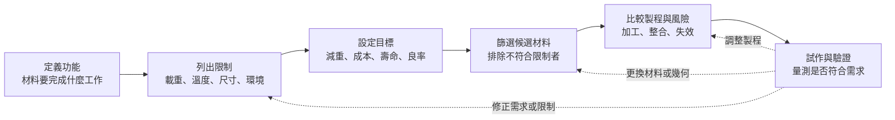
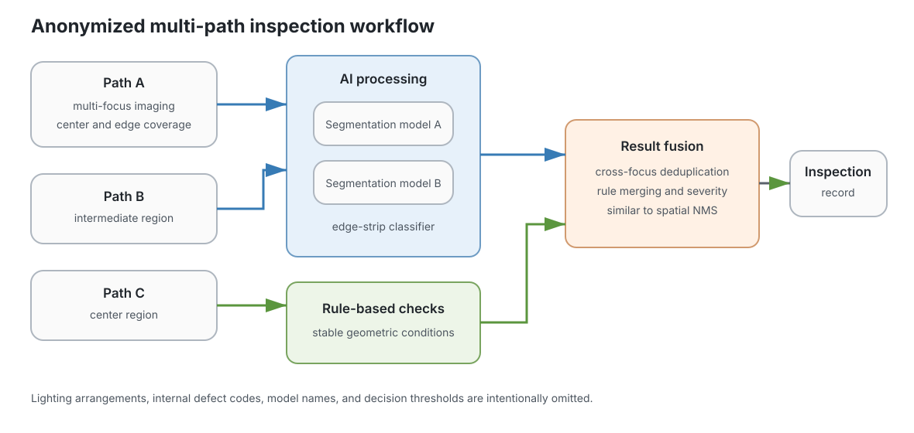
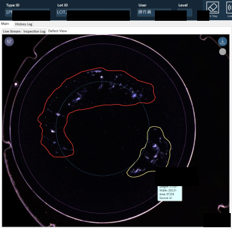
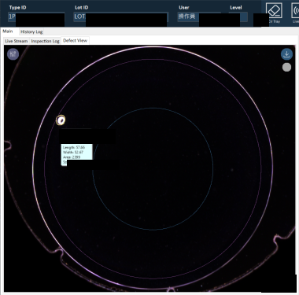
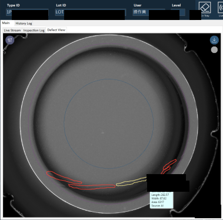
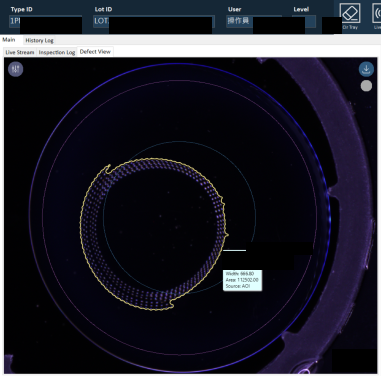

# Material Families, Property Trade-offs, and Engineering Selection

## 材料家族、性質取捨與工程選材

> **Learning Context**
>
> In inspection work, material selection is usually finished before an AOI system begins collecting images. The material still shapes what happens downstream: its surface, coating, interfaces, and thermal behavior affect which signals remain visible and repeatable. I studied engineering selection because a material can solve one problem and quietly create another. The useful question is not which material has the highest property value, but which combination of material, geometry, process, and measurement can satisfy the actual constraints.

材料比較很容易從資料表開始，接著一路找最大值。真正放進工程問題後，順序通常要反過來：先確認功能、限制和可能的失效模式，再決定哪些性質值得比較。

## 1. Material Families as a Starting Point

六大材料家族適合用來縮小候選範圍，也能提醒某些常見風險。不過分類不是答案。同一個材料家族內，只要成分、晶體結構、孔隙率、晶粒、添加物或製程歷程不同，最後量到的性質就可能差很多。

| 材料家族 | 選材時的主要優勢 | 需要注意的工程風險 | 與檢測的關係 |
| --- | --- | --- | --- |
| 金屬 | 剛性、導電、導熱與加工性 | 密度、腐蝕、疲勞與磨耗顆粒 | 反射率、熱漂移與磨耗碎屑會改變量測結果 |
| 聚合物 | 低密度、容易成形、絕緣與光學性質可調 | 潛變、吸濕、老化與真空放氣 | 透明度、變形和表面污染會影響成像 |
| 陶瓷 | 硬度、耐磨、絕緣與高溫穩定性 | 脆性、加工損傷與缺陷敏感性 | 表面裂紋、崩角與顆粒是常見觀察重點 |
| 玻璃 | 透光、表面平滑且光學性質可設計 | 刮痕、脆性破壞與熱衝擊 | 薄膜干涉、表面損傷與光學畸變可能形成對比 |
| 複合材料 | 可以針對需求調整比性質 | 異向性、孔洞與界面變異 | 紋理不均與內部缺陷可能增加判讀難度 |
| 半導體 | 電性可以透過摻雜和結構控制 | 對純度、缺陷、表面與界面高度敏感 | 光學異常與電性異常可能相關，但不一定一一對應 |

這張表比較像第一輪篩選。它可以提示某個材料家族常見的優勢與風險，不能直接代替特定材料牌號、製程狀態或使用條件下的性質數值。

> 圖 1：六類工程材料提供初步篩選方向；實際選材仍需回到材料狀態、製程與使用條件。

## 2. Bonding Provides Clues, Not Final Properties

原子的電子排列會影響鍵結方式，鍵結再提供剛性、導電、導熱、熱膨脹與變形行為的初步線索。這些線索對縮小候選範圍有用，但還不足以直接預測實際工程性質。

| 鍵結類型 | 基本方式 | 對選材的初步線索 |
| --- | --- | --- |
| 離子鍵 | 電子轉移後，由正負離子之間的靜電吸引形成 | 鍵結通常較強，多數材料缺少可自由移動的電子 |
| 共價鍵 | 相鄰原子共享電子，並具有明顯方向性 | 可形成高剛性結構；導電行為仍與能帶結構有關 |
| 金屬鍵 | 價電子離域並在晶格中移動 | 電與熱傳導通常較好；非方向性鍵結也較能容許晶格滑移 |
| 次級鍵結 | 分子或原子間的偶極吸引，包括凡得瓦力與氫鍵 | 會影響聚合物的柔軟度、玻璃轉移、黏著與長期潛變 |

金屬鍵較能容許滑移，不代表所有金屬都具有相同塑性。晶體結構、差排、晶粒尺寸、溫度和製程狀態都會改變結果。完整的鍵結與晶體結構會在 [Atomic Bonding and Crystal Structure](./03-atomic-bonding-and-structure.md) 再處理；這裡只保留選材需要的線索與限制。

## 3. Which Properties Matter?

材料性質是材料對外部刺激產生的可量測反應。查資料時最容易先注意數值，不過試驗方法、溫度、材料方向、應變速率、頻率、濕度與製程狀態也要一起看。性質名稱相同，不代表不同條件下的數據可以直接比較。

| 性質類別 | 主要問題 | 常見性質 | 半導體製造或檢測中的影響 |
| --- | --- | --- | --- |
| 機械 | 材料受到載重後會如何變形或破壞？ | 彈性模數、降伏強度、硬度、延展性、韌性 | 定位穩定、磨耗、裂紋、顆粒產生 |
| 熱 | 材料如何傳熱並隨溫度改變尺寸？ | 熱傳導率、熱膨脹係數、比熱、可使用溫度 | 熱點、漂移、翹曲、薄膜裂紋與分層 |
| 電 | 材料如何傳輸或隔離電荷？ | 導電率、電阻率、介電強度、介電損耗 | 互連、絕緣、漏電、接地與訊號完整性 |
| 光學 | 材料如何反射、吸收、透射或散射光？ | 折射率、反射率、透射率、吸收率 | AOI 對比、薄膜干涉、光學窗口與檢測波長 |
| 化學與環境 | 材料能否維持穩定並避免污染？ | 耐腐蝕、吸濕、溶劑相容性、真空放氣 | 清洗相容性、污染、氧化與製程穩定性 |

### Mechanical Properties Answer Different Questions

剛性、強度、硬度、延展性和韌性很容易被排成一串「越高越好」的數值，其實它們回答的問題不同。彈性模數高，不代表降伏強度一定高；硬度高，也不代表材料能抵抗斷裂。先確認零件會遇到哪一種載重與失效模式，才知道哪一項性質有優先性。

### Thermal Expansion Must Be Read with the Interface

在線性近似範圍內，材料的熱伸長可表示為：

$$
\Delta L=\alpha L_0\Delta T
$$

其中 $\alpha$ 是熱膨脹係數。兩種接合材料的 $\alpha$ 不同時，溫度改變會帶來不同的自由伸縮量；如果界面限制這些變形，系統就會產生熱應力。

算到這裡還不能直接寫成殘留應力。材料若進一步經歷塑性變形、黏彈行為、沉積本徵應力、界面損傷或反覆溫度循環，才可能在回到參考溫度後留下殘留應力，或逐步形成累積損傷。

因此，高熱傳導率不代表熱問題已經解決。熱膨脹、界面熱阻、幾何與溫度分布仍要一起評估。

## 4. Property Trade-offs

工程選材比較麻煩的地方，通常不是找不到符合單一條件的材料，而是不同條件會互相拉扯：

- 提高硬度與強度，可能同時降低延展性或增加裂紋敏感性。
- 降低密度有助於減重，不過剛性、耐熱性或阻尼也可能跟著改變。
- 提高熱傳導率有助於散熱，卻不能直接消除熱膨脹失配。
- 透明材料仍要確認使用波長、表面品質與熱穩定性。
- 複合材料可以組合不同優勢，但也會新增界面、異向性與製程一致性的問題。

所以性質數值要等載重、幾何、環境和失效模式定義後才有比較基準。一個數值變高，可能解決其中一項限制，也可能讓製造、整合或後續檢測變得更困難。

## 5. Engineering Selection Workflow

```mermaid
flowchart LR
    A["定義功能<br/>材料要完成什麼工作"] --> B["列出限制<br/>載重、溫度、尺寸、環境"]
    B --> C["設定目標<br/>減重、成本、壽命、良率"]
    C --> D["篩選候選材料<br/>排除不符合限制者"]
    D --> E["比較製程與風險<br/>加工、整合、失效"]
    E --> F["試作與驗證<br/>量測是否符合需求"]
    F -. "修正需求或限制" .-> B
    F -. "更換材料或幾何" .-> D
    F -. "調整製程" .-> E
```

功能先說清楚，後面的數據才知道要怎麼用。例如零件可能需要承受載重、傳遞熱量、隔離電流、讓特定波長通過，或維持晶圓位置。接著再把條件分成兩類：

- **限制（constraints）**是候選材料不能違反的要求，例如最高工作溫度、最大允許變形、真空相容性或介電強度。
- **目標（objectives）**是希望進一步改善的項目，例如降低質量、控制成本、提高散熱效率或延長壽命。

材料在 datasheet 上符合要求，不代表它能被穩定製造。沉積、蝕刻、研磨、接合與清洗都可能改變材料狀態，甚至引入孔洞、裂紋、殘留應力或污染。完成初步篩選後，仍要透過試片、原型件或實際製程量測。結果不符預期時，再回頭分辨問題來自材料數據、製程狀態、幾何，還是原本的需求定義。

> 圖 2：候選材料需要同時通過功能、限制、製程與驗證條件；概念示意。

## 6. Worked Example: Steel, Aluminum, Stiffness, and Weight

這個例子先比較相同幾何，再改成相同重量。材料仍然是鋼和鋁，但限制條件改變後，用來比較的指標也會跟著改變。

### Same Geometry

假設兩根長度與截面積相同的拉桿分別使用鋼和鋁，在相同軸向載重下，其彈性伸長量可由下式估算：

$$
\delta=\frac{FL}{AE}
$$

若採用常見的近似彈性模數：

$$
E_{\mathrm{steel}}\approx200\ \mathrm{GPa},\qquad
E_{\mathrm{Al}}\approx70\ \mathrm{GPa}
$$

在 $F$、$L$ 與 $A$ 都相同時：

$$
\frac{\delta_{\mathrm{Al}}}{\delta_{\mathrm{steel}}}
=\frac{E_{\mathrm{steel}}}{E_{\mathrm{Al}}}
\approx2.9
$$

看到 2.9 後，很容易直接得到「鋼比較適合」的結論。不過這次固定的是幾何，不是重量。相同幾何下，鋁拉桿的彈性伸長約為鋼的 2.9 倍；同時，鋁的密度約為鋼的三分之一，因此相同體積下的重量也會明顯降低。如果空間固定而變形限制嚴格，鋼在這個比較中較有優勢。

### Same Mass

如果長度與材料質量固定，截面積可以利用密度 $\rho$ 表示：

$$
m=\rho AL
$$

因此：

$$
A=\frac{m}{\rho L}
$$

代回軸向伸長公式後：

$$
\delta=\frac{F\rho L^2}{mE}
$$

在相同載重、長度與質量下，需要比較的不再只是 $E$，而是比彈性模數（specific modulus）$E/\rho$。使用常見近似值：

$$
\frac{E_{\mathrm{steel}}}{\rho_{\mathrm{steel}}}
\approx\frac{200}{7.8}
\approx25.6
$$

$$
\frac{E_{\mathrm{Al}}}{\rho_{\mathrm{Al}}}
\approx\frac{70}{2.7}
\approx25.9
$$

這裡的彈性模數與密度使用一致的相對單位做比值比較。改成固定重量後，原本只比較彈性模數的做法就不夠了；結果顯示，鋼與鋁的比彈性模數很接近。如果允許鋁增加截面積，在相同重量下，兩者的軸向彈性伸長也可能接近。

不過這不代表兩種材料可以直接互換。空間限制、降伏強度、疲勞、腐蝕、接合方式、加工成本與截面形狀仍可能改變最後選擇。尤其在彎曲問題中，剛性還會受到截面二次矩影響，不能直接沿用軸向拉伸的結論。

> **計算範圍：** 這裡只比較線性彈性與軸向載重，並用概略材料數值說明選材方法。載重模式、截面形狀、合金狀態或安全要求改變時，適合使用的材料指標也要重新確認。

## 7. Material Decisions Become Inspection Constraints

材料選定之後，它的光學、熱、機械與表面行為會變成後續檢測的條件。AOI 中的亮點、暗點或局部對比可能來自表面高度、粗糙度、反射率、薄膜干涉、污染或照明角度。外觀看起來相似，背後的物理機制不一定相同。

設備材料也會影響量測穩定性。晶圓載台可能同時要求高剛性、低熱膨脹、熱均勻性、潔淨度與可加工性；磨耗顆粒、清洗液腐蝕或真空放氣都可能進一步影響檢測結果。這些問題不能只靠單一材料數值判斷。

The material choices in my earlier inspection projects had already been made upstream. My work began where transparency, reflectivity, deformation, and surface geometry became imaging constraints. With transparent and easily deformed products, one acquisition condition did not preserve every useful feature. Different optical paths and focal conditions exposed different parts of the same object, and stable geometric defects could sometimes be handled more directly with rule-based measurement than with another model.

The datasheet was not enough. The listed properties still mattered. But one question came later: can the resulting product state be observed and measured consistently?

> Figure 3: An anonymized reconstruction of a multi-path inspection workflow. Different paths and focal conditions preserved different observable features; internal parameters are omitted.

| Focal view 1 | Focal view 2 |
| --- | --- |
|  |  |

> Figure 4: Two anonymized focal views from the same inspection path, included to show why one acquisition condition did not preserve every visible feature consistently.

| Additional regional view | Center-region view |
| --- | --- |
|  |  |

> Figure 5: Additional anonymized regional views used to illustrate coverage differences across the inspection workflow; the actual lighting configuration is not shown.

這些圖片保留的是觀察條件與可見特徵之間的關係，不是材料選擇的驗證結果。AOI 可以顯示選定的材料與製程組合在後續流程中是否仍然可觀察、可量測，但不能取代材料選擇，也不能單獨確認材料根因。

## Current Scope

這篇只處理以限制條件為起點的材料選擇，以及材料性質如何變成後續製造與檢測條件。鍵結機制、晶體缺陷、機械失效與製程歷程會在後續筆記分別展開。

專案段落來自實際檢測軟體與成像流程經驗，但不包含材料配方選擇、客戶製程決策或材料根因驗證。圖中的路徑與結果已匿名化，也不呈現實際照明配置、內部代碼或判定門檻。

## Learning Source

- James F. Shackelford, [*Materials Science: 10 Things Every Engineer Should Know*](https://www.coursera.org/learn/materials-science), University of California, Davis / Coursera.

## Additional References

- James F. Shackelford, *Introduction to Materials Science for Engineers*, 8th ed.
- Michael F. Ashby, [*Materials Selection in Mechanical Design*](https://shop.elsevier.com/books/materials-selection-in-mechanical-design/ashby/978-0-443-16028-8), 6th ed.
