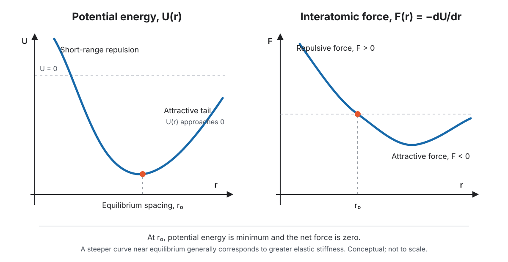
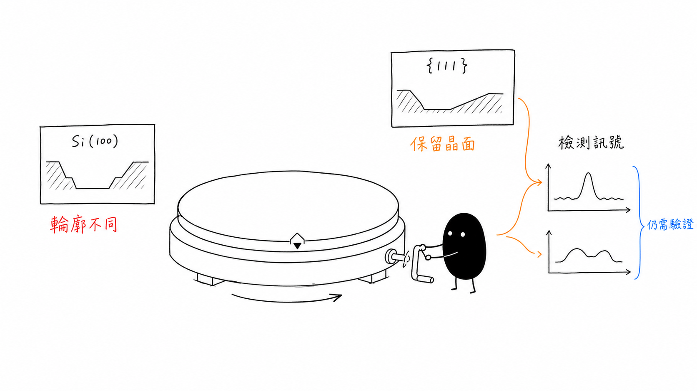

# Atomic Bonding and Crystal Structure

## 原子鍵結與晶體結構：從原子排列理解材料行為

> **Learning Context**
>
> In optical inspection, I usually work with signals that have already reached the surface or image level: brightness, texture, edges, cracks, and spatial patterns. This chapter moves one level deeper. I studied atomic bonding and crystal structure to understand why stiffness, thermal expansion, conductivity, deformation, and orientation-dependent behavior are connected rather than isolated entries in a specification table.
>
> The goal is not to infer crystal structure directly from an AOI image. It is to recognize when atomic arrangement offers a physically plausible hypothesis, and to identify what additional evidence would be needed to test it.

## English Summary

This chapter asks how atomic bonding and crystal arrangement appear in measurable material behavior. It starts with valence electrons, then uses the interatomic energy curve to connect bonding with elastic modulus and thermal expansion. SC, BCC, FCC, and HCP are compared through coordination, packing, and slip rather than through unit-cell diagrams alone.

Silicon provides the main engineering example. Each atom forms four directional covalent bonds in a diamond-cubic structure. Calling silicon “FCC” leaves out the two-atom basis that determines its nearest-neighbor arrangement and bonding behavior.

For semiconductor manufacturing, crystal orientation can influence etching, fracture, surface morphology, and some electrical behavior. But orientation is only one possible explanation for a visible pattern. Optical evidence still needs to be separated from a crystal-level hypothesis and its experimental verification.

---

本篇主要依據先前翻譯與整理 UC Davis 課程時留下的學習筆記，並沿著一個問題展開：**原子之間如何鍵結與排列，為什麼會改變材料在巨觀尺度下的行為？**

材料的彈性模數、熱膨脹、導電方式和變形傾向看起來是不同性質，不過它們都能向下追溯到原子的電子結構、鍵結方式，以及原子在空間中的排列。這並不表示只知道鍵結類型就能直接預測所有工程性質，因為缺陷、晶粒、溫度和製程同樣會改變結果；鍵結與晶體結構提供的是分析材料行為時的第一層依據。

## 1. From Valence Electrons to Material Behavior

The useful starting point is not the unit-cell drawing. It is the way valence electrons participate in bonding, because that limits how atoms can arrange, move, and respond to external energy.

原子由原子核與核外電子構成，其中最外層的**價電子（valence electrons）**對鍵結與導電行為特別重要。當原子彼此靠近時，電子與原子核之間同時存在吸引和排斥作用；系統會傾向移動到能量較低且相對穩定的狀態，因此形成原子鍵結。

分析工程材料時，可以先確認三個問題：

1. 價電子是轉移、共享，還是能在許多原子之間移動？
2. 鍵結是否具有明顯方向性？
3. 原子形成規則晶格、局部有序結構，或缺少長程規則排列？

這三個問題能初步連結材料的導電性、剛性、熱膨脹和可塑性。

## 2. 主要鍵結與次級鍵結

### 2.1 三種主要鍵結

| 鍵結類型 | 電子行為 | 方向性 | 常見材料 | 典型性質傾向 |
| --- | --- | --- | --- | --- |
| 離子鍵 | 電子由一種原子轉移至另一種原子，形成正、負離子 | 通常不以特定鍵角為主，但晶格需維持電中性 | 氧化物、鹽類陶瓷 | 剛性與熔點通常較高；室溫下多為絕緣體；滑移受電荷排列限制 |
| 共價鍵 | 相鄰原子共享價電子 | 強 | 矽、鑽石、許多陶瓷與聚合物主鏈 | 鍵結穩定且具方向性；性質與鍵角、網路連結方式密切相關 |
| 金屬鍵 | 價電子在許多正離子核心之間離域化 | 較弱 | 銅、鋁、鐵等金屬 | 電與熱傳導通常良好；原子面較容易在不破壞整體電中性的情況下滑移 |

這些分類是理解材料的起點，不是把材料切成完全獨立的三類。許多陶瓷同時具有離子鍵與共價鍵成分；不同鍵結比例會影響鍵的方向性、彈性和滑移難度。

### 2.2 次級鍵結

次級鍵結主要包括凡得瓦力與氫鍵。單一作用通常比主要鍵結弱，但當大量分子或高分子鏈同時受到這些作用時，仍可能明顯影響熔點、黏度、玻璃轉移、鏈間滑動和表面吸附。

例如聚合物主鏈內部通常由共價鍵連接，但不同鏈之間可能主要依靠次級鍵結。材料受力或加熱時，最先改變的未必是主鏈共價鍵，而可能是鏈段轉動或鏈間作用，因此聚合物的剛性與溫度依賴通常和金屬、陶瓷不同。

## 3. 鍵能曲線如何連到彈性與熱膨脹

原子間距為 $r$ 時，可用位能 $U(r)$ 描述系統狀態。原子間作用力則為：

$$
F(r)=-\frac{\mathrm{d}U}{\mathrm{d}r}
$$

當 $U(r)$ 位於最低點時，原子間的合力為零，對應平衡距離 $r_0$。若把原子稍微拉開，吸引作用會使其傾向回到平衡位置；若壓得太近，強烈的排斥作用則會阻止原子繼續靠近。

> 圖 1：作者依個人課程筆記重新繪製，用來表示原子間位能、平衡距離與回復力之間的關係。

### 3.1 彈性模數

在小應變與線性彈性範圍內：

$$
E=\frac{\sigma}{\varepsilon}
$$

彈性模數 $E$ 表示材料抵抗彈性變形的能力。從原子尺度來看，平衡距離附近的力—距離曲線越陡，原子被拉離平衡位置時產生的回復力越大，材料通常也具有較高的彈性模數。

這裡需要區分**剛性**與**強度**：

- 彈性模數主要描述彈性區的斜率，也就是材料有多難被彈性拉長。
- 降伏強度與抗拉強度則牽涉差排、缺陷、微觀組織和加工歷史。

因此，提高金屬強度的方法不一定會大幅改變彈性模數。兩者不能直接互換。

### 3.2 熱膨脹

實際的位能井並不左右對稱。溫度升高後，原子振動振幅增加，而非對稱的位能曲線會使平均原子間距向較大的一側移動，形成熱膨脹。

這也說明為什麼熱膨脹不能只理解成「原子本身變大」。改變的是原子振動狀態與平均間距。若兩種接合材料具有不同的熱膨脹係數，界面限制自由熱應變時便會產生熱應力。經過反覆溫度循環後，若同時出現塑性變形、黏彈行為、界面滑移或損傷，才可能進一步留下殘留應力，並形成翹曲、裂紋或界面分層。

> **Engineering Takeaway**
>
> Bonding provides a first-order explanation for stiffness and thermal expansion. It does not predict a component's strength or reliability by itself, because defects, microstructure, geometry, interfaces, and loading history still control the measured response.

## 4. 描述晶體結構的基本語言

晶體結構可以拆成兩個概念：

- **晶格（lattice）**：在空間中規律重複的幾何點陣。
- **基底（basis）**：配置在每個晶格點上的原子或原子群。

晶格加上基底，才構成完整的晶體結構。這項區分在理解矽的鑽石立方結構時尤其重要，因為矽雖然與 FCC 晶格有關，但不能直接當成一般 FCC 金屬。

常用的結構描述量包括：

- **單位晶胞（unit cell）**：能透過平移重建整個晶體的重複單元。
- **配位數（coordination number, CN）**：一個原子最近鄰原子的數量。
- **原子堆積因子（atomic packing factor, APF）**：

$$
\mathrm{APF}=\frac{V_{\mathrm{atoms}}}{V_{\mathrm{cell}}}
$$

其中，$V_{\mathrm{atoms}}$ 是晶胞內原子占據的總體積，$V_{\mathrm{cell}}$ 是晶胞的總體積。

- **晶向與晶面**：分別以 $[uvw]$ 和 $(hkl)$ 表示；等價方向族與晶面族則寫成 $\langle uvw\rangle$ 和 $\{hkl\}$。

另外，材料的有序程度也需要分清楚：

| 結構狀態 | 原子排列 | 例子 | 工程上的影響 |
| --- | --- | --- | --- |
| 單晶 | 整個材料具有連續晶格方向 | 單晶矽晶圓 | 晶向效應明確，適合控制蝕刻與元件方向 |
| 多晶 | 由不同方向的晶粒組成 | 多數工程金屬、多晶矽 | 晶界會影響擴散、變形、散射與破壞 |
| 非晶質 | 缺少長程週期性排列 | 玻璃、部分薄膜 | 通常沒有單晶的長程晶向，但仍可能有短程有序 |

## 5. 常見晶體結構：SC、BCC、FCC 與 HCP

| 結構 | 每個傳統晶胞的有效原子數 | 配位數 | APF | 常見材料 | 結構與變形重點 |
| --- | ---: | ---: | ---: | --- | --- |
| 簡單立方（SC） | 1 | 6 | 約 0.52 | 釙 | 堆積較疏鬆，在元素晶體中少見 |
| 體心立方（BCC） | 2 | 8 | 約 0.68 | $\alpha$-鐵、鎢、鉻 | 沒有像 FCC 或 HCP 一樣的幾何密排面；高原子密度面常為 $\{110\}$，塑性對溫度與應變速率通常較敏感 |
| 面心立方（FCC） | 4 | 12 | 約 0.74 | 鋁、銅、鎳 | $\{111\}\langle110\rangle$ 為主要密排滑移系統，常見 12 個滑移系統 |
| 六方最密堆積（HCP） | 6 | 12 | 約 0.74 | 鎂、鋅、$\alpha$-鈦 | 室溫下常以基面滑移為主，可容易啟動的獨立滑移系統通常少於 FCC |

APF 反映硬球模型下的幾何堆積程度，不等同材料的密度、強度或韌性。實際密度還取決於原子量與晶格常數；實際變形則要同時考慮滑移系統、臨界剪應力、缺陷與溫度。

### 簡單例子：為什麼 FCC 金屬通常較容易延性變形？

FCC 結構通常具有多組容易啟動的 $\{111\}\langle110\rangle$ 密排滑移系統，這是許多 FCC 金屬在常溫下具有良好延展性的重要原因之一。當外力方向改變時，晶粒通常仍能找到適合的滑移組合。

不過，這不是只看「12 個滑移系統」就能完成的判斷。晶粒大小、固溶原子、析出物、加工硬化與載入溫度都會改變差排移動難度。差排本身的結構與運動會在後續章節再詳細整理。

> **Engineering Takeaway**
>
> Coordination number and APF describe geometric arrangement. Slip behavior requires another layer of information: available slip systems, lattice resistance, defects, temperature, and loading direction.

## 6. 矽的鑽石立方結構

矽是理解「鍵結與晶體結構共同控制性質」的代表材料。每個矽原子有四個價電子，並與四個最近鄰原子形成具方向性的共價鍵；四個鍵大致指向正四面體的四個角，因此矽的配位數為 4。

鑽石立方結構可以描述為：

- FCC 布拉菲晶格加上雙原子基底；或
- 兩組彼此錯開 $(1/4,1/4,1/4)$ 的 FCC 子晶格。

傳統立方晶胞內共有 8 個有效原子，APF 約為 0.34。這個堆積因子明顯低於普通 FCC 的 0.74，因為方向性共價鍵限制了最近鄰排列。

因此需要避免一個常見誤解：

> **矽的鑽石立方結構使用 FCC 布拉菲晶格，但矽不是一般的 FCC 晶體。**

普通 FCC 金屬的每個原子有 12 個最近鄰；鑽石立方矽只有 4 個最近鄰，而且鍵結具有明顯方向性。若只看晶胞外框或角點與面心位置，便容易忽略雙原子基底所造成的差異。

> **Why Diamond Cubic Is Not Ordinary FCC**
>
> | | Ordinary FCC metal | Diamond-cubic silicon |
> | --- | --- | --- |
> | Basis | One atom | Two atoms |
> | Coordination number | 12 | 4 |
> | APF | Approximately 0.74 | Approximately 0.34 |
> | Nearest-neighbor bonding | Commonly metallic and non-directional | Directional covalent bonding |
>
> The Bravais lattice is only part of the description. Adding a different basis changes the nearest neighbors, bonding geometry, and material behavior.

## 7. 晶向為什麼會影響半導體製程？

單晶矽常以 $Si(100)$ 或 $Si(111)$ 等晶圓表面方向描述。不同晶面具有不同的原子排列與表面鍵結狀態，因此可能影響：

- 濕式蝕刻速率與形成的側壁形貌；
- 解理與裂紋傳播方向；
- 表面反應、氧化與薄膜成核；
- 在特定元件與界面條件下，載子遷移率與元件方向設計；
- 表面粗糙度與光學散射。

以 KOH 或 TMAH 等鹼性溶液進行矽的各向異性濕式蝕刻時，$\{111\}$ 晶面通常比 $\{100\}$ 晶面蝕刻得慢，因此製程可能保留下特定斜面。不過，實際速率仍取決於溶液濃度、溫度、添加物、摻雜與表面狀態，不能把這個趨勢當成所有蝕刻條件下的固定數值。

> 圖 2：作者依個人課程筆記重新整理，用來表示矽晶向、各向異性製程形貌與檢測訊號之間可能存在的關係。

## 8. Why This Matters for Semiconductor Inspection

> A direction-dependent pattern in an inspection image may justify a crystallographic hypothesis, but it does not verify one. The practical task is to separate what the image shows from what crystal structure might explain, then choose a measurement that can test the proposed connection.

在 AOI 或顯微影像中，同樣的亮暗差異未必來自相同原因。表面高度、粗糙度、晶向、薄膜厚度、折射率與殘留物都可能改變反射或散射訊號。因此，檢測影像比較適合被視為異常位置與形貌的線索，而不是直接等同材料根因。

例如，同一批晶圓若在固定方向上重複出現邊緣或紋理差異，可以依序確認：

1. 異常是否和 wafer notch 或已知晶向保持固定關係？
2. 圖樣是否隨製程條件、晶圓旋轉或照明方向改變？
3. 異常較接近幾何高低差、表面粗糙度，還是薄膜光學差異？
4. 是否需要搭配其他量測方法確認？

不同方法回答的問題並不相同，因此應該先確認要驗證的是晶向、相、應力，還是表面形貌，再選擇量測方式：

| 方法 | 主要可以回答的問題 |
| --- | --- |
| X 光繞射（XRD） | 晶相、晶格資訊、整體取向或織構 |
| 電子繞射 | 局部晶體結構與晶向 |
| Raman 光譜 | 晶格振動、應力或應變、材料相與部分缺陷資訊 |
| 光學輪廓儀或 AFM | 表面高度、粗糙度與形貌 |
| SEM | 高倍率表面形貌、裂紋與局部結構細節 |

### 簡單判讀例子

假設光學檢測在晶圓邊緣看到一條固定方向的線狀異常：

- 若轉動照明後對比明顯改變，可能和表面斜率或散射方向有關。
- 若異常方向始終和 wafer notch 保持固定關係，可以進一步檢查晶向或製程各向異性。
- 若只有特定膜厚區域出現，則需要考慮薄膜干涉，而不是直接判定為晶體缺陷。

這個例子無法只靠影像得到唯一答案，但可以把後續驗證從一般性的「看見異常」縮小成幾個具體假設。

## 9. Debugging Note: Which Reference Frame Does the Pattern Follow?

During a six-month on-site semiconductor wafer-inspection assignment, I worked on a runtime system that combined multiple camera streams, wafer-motion tracking, trigger-based inspection, ROI and template configuration, result aggregation, and history review.

In that kind of system, a fixed-direction pattern does not immediately imply a material or crystallographic cause. It may originate from camera angle, illumination direction, wafer motion, trigger timing, ROI alignment, image registration, or recipe configuration. The feature can look stable (and still belong to the wrong coordinate frame). My debugging process therefore began at the measurement-system level: acquisition stability, coordinate consistency, repeatability, and the relationship between the feature and the inspection setup.

Before studying crystal structure, I would have kept the investigation within those imaging and system-level explanations. This chapter adds another layer. If a feature remains fixed relative to the wafer rather than the camera or motion direction, persists after controlled changes in illumination, and corresponds to a known orientation or anisotropic process step, crystal orientation becomes a physically plausible hypothesis.

But that still requires independent verification. I did not use XRD, Raman spectroscopy, or electron diffraction to confirm a crystal-level cause during this assignment. The AOI image therefore cannot serve as evidence of crystallographic origin.

| Reference frame | Possible explanation |
| --- | --- |
| Camera-fixed pattern | Illumination, sensor, lens, or camera geometry |
| Motion- or equipment-fixed pattern | Transport, trigger, alignment, or scanning process |
| Wafer-fixed pattern | Surface condition, process anisotropy, crystal orientation, or another wafer-related mechanism |

This three-frame check is now more useful to me than starting with a defect name. It shows when optical debugging is still sufficient and when material characterization may be justified.

## 10. Checks I Would Make Before Using a Crystal-Level Explanation

- **Bonding gives first-order trends, not a complete property prediction.** Strength, ductility, toughness, and reliability still depend on defects, microstructure, temperature, and loading.
- **APF describes geometric packing.** It is not a direct measure of density, strength, or engineering performance.
- **Crystal structure affects available deformation mechanisms.** Actual behavior still depends on whether those mechanisms can operate under the given conditions.
- **Silicon should not be treated as an ordinary FCC crystal.** Its FCC Bravais lattice and two-atom basis together form the diamond-cubic structure.
- **A direction-dependent optical pattern can support a crystallographic hypothesis.** It cannot verify a crystal-level cause without independent evidence.

原子間位能曲線讓兩個原本分開記憶的性質連在一起：彈性模數和熱膨脹都與原子間距偏離平衡位置時，能量曲線的形狀有關。矽的例子則補上另一個容易混淆的地方。FCC Bravais lattice 加上 two-atom basis 才構成完整的 diamond-cubic structure；後者會改變最近鄰、配位數、堆積方式與鍵結幾何，不能只因為看到 FCC 就沿用金屬 FCC 的直覺。

回到檢測現場，這一章留下的是一個 debugging 順序：

1. 圖形是否固定在 camera frame？
2. 是否跟著設備運動或掃描方向？
3. 旋轉 wafer 或改變照明後，圖形是否仍跟著 wafer frame？
4. 是否存在已知的晶向或異向性製程，可以提出可驗證的假設？
5. 現有資料是否包含 XRD、Raman 或其他能確認晶體層級原因的證據？

前兩層還沒有排除以前，急著談晶向通常太早。即使圖形最後跟著 wafer reference direction，晶體方向也只是下一個值得測試的解釋，不應直接變成缺陷標籤。

## References

1. James F. Shackelford, [*Materials Science: 10 Things Every Engineer Should Know*](https://www.coursera.org/learn/materials-science), University of California, Davis / Coursera.
2. James F. Shackelford, *Introduction to Materials Science for Engineers*, 8th ed.
3. William D. Callister Jr. and David G. Rethwisch, *Materials Science and Engineering: An Introduction*.
4. Xiezheng Yu et al., [“Wet Anisotropic Etching Characteristics of Si{111} in KOH-Based Solution”](https://pmc.ncbi.nlm.nih.gov/articles/PMC11780415/), *ACS Omega*, 2025.
