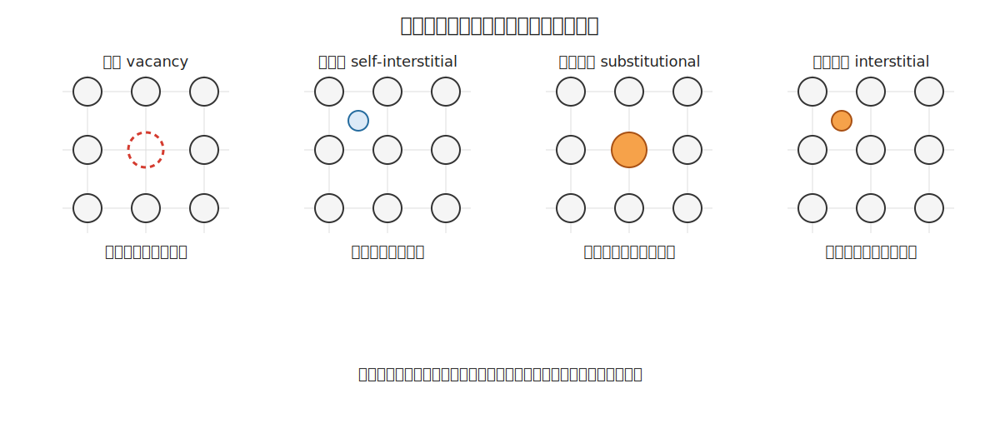
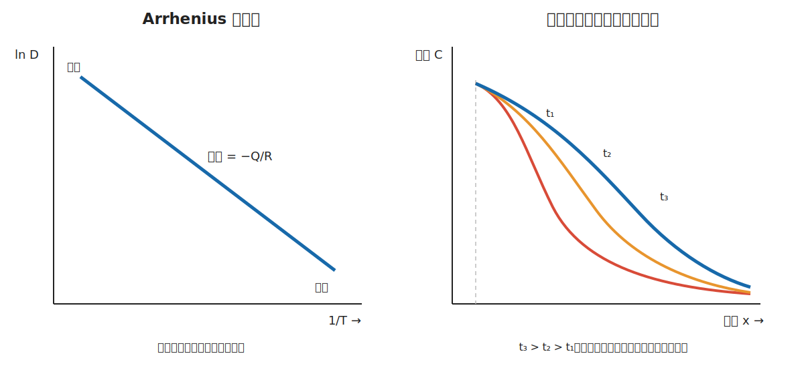
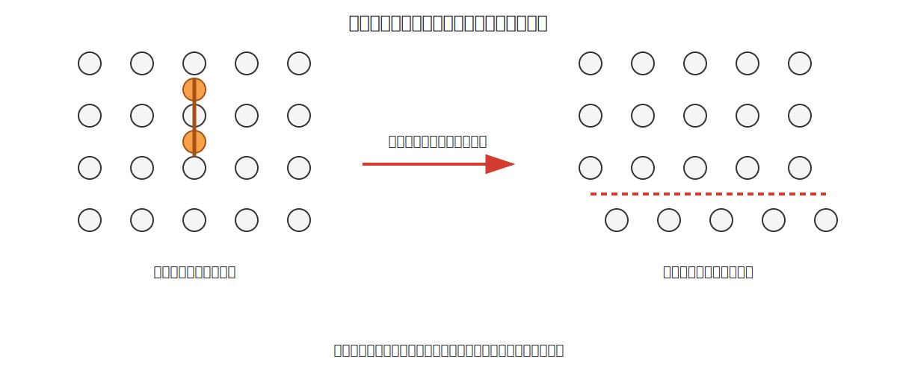
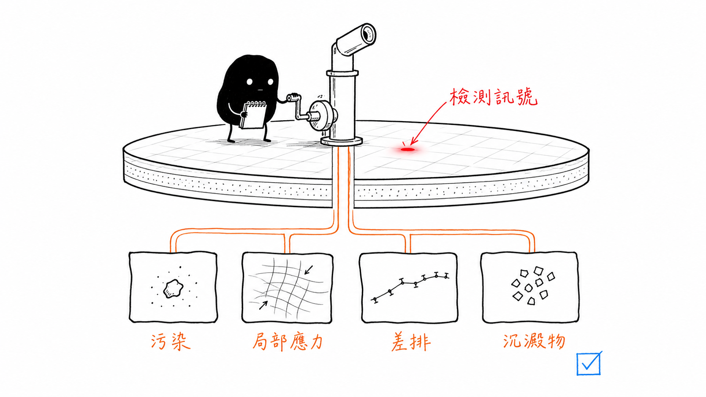

# 晶體缺陷與微觀組織：從不完美結構理解擴散、變形與檢測

## English Summary

This note asks how imperfections in a crystal become measurable material behaviour. It follows defects across four scales, from point defects to three-dimensional voids and precipitates. Vacancies provide sites for diffusion, while dislocations allow permanent deformation without moving an entire crystal plane at once. That changed my starting assumption. A controlled dopant can be useful, and a vacancy may be necessary for diffusion (not every imperfection is damage). But the same mechanisms become harmful when their type, concentration, or location falls outside the process requirement. And in wafer inspection, one optical signal can still support several material-level explanations rather than one certain cause.

---

這一篇主要整理一個問題：**真實晶體中的缺陷，如何改變原子移動、材料變形和半導體檢測結果？**

第三章先從原子鍵結與理想晶體結構建立基本模型，不過實際材料不可能完全按照理想晶格排列。晶體中會出現空位、間隙原子、差排、晶界和第二相粒子，有些缺陷在熱力學上無法避免，有些則由摻雜、加工或熱處理引入。

剛接觸這些內容時，「缺陷」很容易被理解成材料中不應該存在的錯誤。不過在整理擴散與差排的關係後，可以發現缺陷本身不一定代表材料失效。空位提供替位型原子移動的位置，差排讓金屬能在合理的應力下產生塑性變形，受控制的摻雜原子則是半導體功能的一部分。因此真正需要判斷的，不只是材料中是否存在缺陷，而是缺陷的類型、濃度、位置和尺度是否符合製程與使用需求。

## 1. 缺陷可以按照尺度分類

| 缺陷尺度 | 典型例子 | 主要影響 |
| --- | --- | --- |
| 點缺陷（0D） | 空位、自間隙原子、替位與間隙雜質 | 擴散、載子濃度、局部晶格應變 |
| 線缺陷（1D） | 刃狀差排、螺旋差排、混合差排 | 塑性變形、加工硬化、局部應力 |
| 面缺陷（2D） | 晶界、雙晶界、堆疊錯誤、相界面 | 快速擴散、晶粒滑移、腐蝕與破壞路徑 |
| 體缺陷（3D） | 孔洞、沉澱物、夾雜物、裂紋 | 局部應力集中、散射、漏電與破壞 |

這種分類是依照缺陷在空間中延伸的維度整理，並不是嚴格區分彼此互不相關。例如差排可能終止於晶界，空位也可能聚集形成孔洞；在實際材料中，不同尺度的缺陷經常互相作用。

## 2. 點缺陷：原子尺度的空缺與錯位

### 2.1 空位

空位（vacancy）是正常晶格位置缺少一個原子的狀態。即使材料沒有受到輻照或加工，有限溫度下仍會存在一定數量的平衡空位，因為增加少量空位雖然需要形成能，卻也會提高系統的組態熵。

平衡空位比例常寫成：

$$
\frac{N_v}{N}=A\exp\left(-\frac{Q_v}{k_{\mathrm B}T}\right)
$$

其中：

- $N_v$：空位數量；
- $N$：可用晶格位置總數；
- $A$：與熵及模型有關的前因子；
- $Q_v$：形成一個空位所需的能量；
- $k_{\mathrm B}$：波茲曼常數；
- $T$：絕對溫度。

溫度升高時，負指數的絕對值變小，因此平衡空位濃度會快速增加。這是一種熱活化行為，不是因為晶格在高溫下任意「鬆開」，而是更多原子取得形成空位所需的能量。

### 2.2 自間隙原子

自間隙原子（self-interstitial）是母材原子離開正常位置後進入晶格間隙。由於間隙空間通常有限，自間隙原子容易造成較大的局部晶格扭曲，因此其形成能往往高於空位。

在半導體矽中，空位與自間隙原子都可能參與摻雜原子的擴散與缺陷反應。實際機制依摻雜元素、溫度、氧化條件及缺陷化學而異，不能把所有摻雜擴散都簡化成單一空位跳躍。

### 2.3 替位與間隙型雜質

- **替位型雜質**：外來原子占據母材的正常晶格位置。
- **間隙型雜質**：較小的外來原子進入晶格間隙。

例如磷或硼可以在矽中形成受控制的摻雜分布，而碳在鐵中的擴散則常以間隙機制理解。這些原子是否能有效參與材料功能，不只取決於總濃度，也取決於它們位於哪種晶格位置，以及是否形成團簇或沉澱。

### 2.4 陶瓷中的成對缺陷

離子晶體還要維持整體電中性，因此常以成對或成組缺陷描述：

- **Schottky defect**：正、負離子的空位以維持電中性的方式同時出現。
- **Frenkel defect**：一個離子離開正常位置並進入間隙，形成空位—間隙對。

這些名稱有助於理解離子材料，不過本篇後續主要以金屬與矽的缺陷和擴散為主。

## 3. 簡單例題：溫度如何改變空位濃度？

假設某材料的空位形成能為：

$$
Q_v=1.0\ \mathrm{eV/atom}
$$

比較 $500\ \mathrm K$ 與 $1000\ \mathrm K$ 的空位比例。若前因子 $A$ 在兩個溫度下相同，則：

$$
\frac{(N_v/N)_{1000}}{(N_v/N)_{500}}
=
\exp\left[
-\frac{Q_v}{k_{\mathrm B}}
\left(
\frac{1}{1000}-\frac{1}{500}
\right)
\right]
$$

代入：

$$
k_{\mathrm B}=8.617\times10^{-5}\ \mathrm{eV/K}
$$

可得：

$$
\frac{(N_v/N)_{1000}}{(N_v/N)_{500}}
\approx 1.1\times10^5
$$

結果表示溫度從 $500\ \mathrm K$ 提高到 $1000\ \mathrm K$ 時，平衡空位比例可能增加約五個數量級。這個例子也能說明，熱處理溫度的改變不能只看成「加熱得更快」，因為缺陷數量與擴散能力本身也會隨溫度產生非常大的變化。

## 4. 點缺陷如何促成固態擴散？

固態中的原子雖然不像液體一樣自由流動，但仍能透過一次次局部跳躍逐漸改變位置。

### 4.1 空位擴散

替位型原子要移動到相鄰晶格位置，通常需要附近先存在空位：

也就是原子先跳入相鄰空位，接著在原本的位置留下新的空位。

從原子的角度看，它朝某方向移動；從空位的角度看，空位則往相反方向遷移。空位擴散同時受到空位形成能與原子跳躍能障影響。

### 4.2 間隙擴散

較小的間隙原子可以在相鄰間隙位置之間移動，不必等待正常晶格位置先形成空位。因此在適合的晶格與溫度範圍內，間隙擴散通常比替位擴散快。

不過，「間隙原子一定擴散較快」仍然只是一般趨勢。實際擴散係數還取決於原子尺寸、鍵結、晶體結構和遷移能障。

## 5. 擴散係數與 Arrhenius 關係

擴散係數常表示為：

$$
D=D_0\exp\left(-\frac{Q_d}{RT}\right)
$$

其中：

- $D$：擴散係數，常用單位為 $\mathrm{m^2/s}$；
- $D_0$：前指數因子；
- $Q_d$：每莫耳擴散活化能；
- $R$：氣體常數；
- $T$：絕對溫度。

若 $Q_d$ 使用單一原子的 $\mathrm{eV/atom}$，分母應搭配 $k_{\mathrm B}T$；若 $Q_d$ 使用 $\mathrm{J/mol}$，則搭配 $RT$。計算前需要先確認這項對應關係，因為公式形式看起來相同，但能量尺度與常數不能混用。

取自然對數後：

$$
\ln D=\ln D_0-\frac{Q_d}{R}\frac{1}{T}
$$

因此在 $\ln D$ 對 $1/T$ 的圖上，斜率為 $-Q_d/R$。

### 簡單例題：由一個溫度估算另一個溫度的擴散係數

已知銅在黃銅中的擴散係數在 $400^\circ\mathrm C$ 時為：

$$
D_1=1.0\times10^{-20}\ \mathrm{m^2/s}
$$

若 $Q_d=195\ \mathrm{kJ/mol}$，估算 $600^\circ\mathrm C$ 時的 $D_2$。先換成絕對溫度：

$$
T_1=673\ \mathrm K,\qquad T_2=873\ \mathrm K
$$

將兩個 Arrhenius 式相除，可消去未知的 $D_0$：

$$
\ln\left(\frac{D_2}{D_1}\right)
=
\frac{Q_d}{R}
\left(
\frac{1}{T_1}-\frac{1}{T_2}
\right)
$$

代入 $Q_d=195000\ \mathrm{J/mol}$ 與 $R=8.314\ \mathrm{J/(mol\cdot K)}$：

$$
\ln\left(\frac{D_2}{D_1}\right)\approx7.99
$$

因此：

$$
D_2\approx2.9\times10^{-17}\ \mathrm{m^2/s}
$$

雖然溫度只提高 $200^\circ\mathrm C$，擴散係數卻增加約三個數量級。計算完成後，可以先檢查結果的基本趨勢：溫度升高時 $D$ 應該變大；若結果相反，通常需要重新確認溫度倒數的順序或負號。

## 6. 菲克定律：區分穩態與非穩態

### 6.1 菲克第一定律

一維穩態擴散通量為：

$$
J=-D\frac{\mathrm dC}{\mathrm dx}
$$

其中 $J$ 表示單位時間通過單位面積的物質量，負號表示淨擴散方向由高濃度指向低濃度。

例如：

$$
D=2.0\times10^{-12}\ \mathrm{m^2/s}
$$

$$
\frac{\mathrm dC}{\mathrm dx}
=-5.0\times10^7\ \mathrm{mol/m^4}
$$

則：

$$
J=1.0\times10^{-4}\ \mathrm{mol/(m^2\cdot s)}
$$

正號表示通量朝所定義的正 $x$ 方向。這裡的負號不是額外的能量損失，而是在描述濃度下降方向與物質移動方向之間的關係。

### 6.2 菲克第二定律

當濃度分布會隨時間改變時，需使用菲克第二定律。對一維且 $D$ 為常數的情況：

$$
\frac{\partial C}{\partial t}
=
D\frac{\partial^2 C}{\partial x^2}
$$

第一定律回答「目前有多少物質通過」，第二定律則回答「某個位置的濃度接下來如何改變」。在摻雜、滲碳或薄膜互擴散問題中，這項差別比背下公式更重要。

## 7. 差排：讓塑性變形在較低應力下發生

差排（dislocation）是晶體中的線缺陷。若完美晶體要產生一個完整晶格間距的滑移，理想化模型要求整個晶面上的大量原子同時越過高能量位置，所需剪應力會非常高。

有差排時，只有差排核心附近的原子需要逐步改變鍵結：

整個過程可以理解成：局部原子先重新排列，接著差排向前移動，最後在晶面上留下永久滑移。

### 7.1 刃狀、螺旋與混合差排

| 差排類型 | 幾何特徵 | 柏格向量與差排線 |
| --- | --- | --- |
| 刃狀差排 | 晶體中多出一個額外半原子平面 | 互相垂直 |
| 螺旋差排 | 原子平面沿差排線形成螺旋狀錯位 | 互相平行 |
| 混合差排 | 同一差排線同時具有刃狀與螺旋成分 | 夾角沿差排線改變 |

柏格向量 $\mathbf b$ 描述差排造成的晶格位移大小與方向。差排移動的滑移面和滑移方向受到晶體結構限制，這也是第三章中 FCC、BCC 與 HCP 滑移行為不同的原因之一。

### 7.2 地毯皺褶比喻

可以把差排移動想成讓皺褶穿過一張重地毯。直接拖動整張地毯需要很大的力，但逐步推動一個皺褶較容易；當皺褶移到另一端後，地毯仍完成了整體位移。

這個比喻適合說明「局部移動如何累積成整體位移」，不過它沒有包含晶格週期性、鍵結方向、差排應力場與滑移系統，因此不能用來取代差排的幾何定義。

## 8. 晶界與微觀組織

多晶材料由許多晶粒組成，相鄰晶粒的晶向不同，兩者之間形成晶界。晶界附近的原子排列較不規則，能量通常高於晶粒內部，因此可能產生幾種影響：

- 提供較快的擴散路徑；
- 阻礙差排跨越，影響降伏強度；
- 成為雜質偏聚、沉澱與腐蝕反應的位置；
- 在高溫或長時間受力時參與晶界滑移；
- 改變電子、聲子或光的散射。

晶粒細化通常能增加晶界數量並提高金屬降伏強度，常以 Hall–Petch 關係描述：

$$
\sigma_y=\sigma_0+k_y d^{-1/2}
$$

其中 $d$ 為平均晶粒尺寸。不過這個關係有適用範圍，也不能直接套用到所有材料、所有晶粒尺度或所有溫度條件。

整理到這裡時，最容易混淆的是「微觀組織」和「晶體結構」。晶體結構描述原子如何週期排列，例如 FCC 或 BCC；微觀組織則描述晶粒尺寸、形狀、取向、相分布與缺陷配置。兩種材料可以具有相同晶體結構，卻因微觀組織不同而呈現不同強度、擴散或破壞行為。

## 9. 與半導體製造和檢測的連結

矽晶圓通常要求高度完整的單晶結構，不過製程中仍需要面對不同形式的缺陷與非理想狀態：

- 空位與自間隙原子可能參與摻雜擴散及缺陷反應；
- 差排與滑移線可能由熱應力或機械應力引發；
- 氧、碳與金屬污染可能形成複合缺陷或沉澱；
- 薄膜晶界、孔洞與界面缺陷可能改變漏電、附著與可靠度；
- 局部應力可能改變晶格振動、能帶與光學反應。

對檢測工作而言，最重要的限制是：**AOI 看見的是表面或光學訊號，不是空位、差排或晶界本身。** 一個亮點可能來自粒子污染、表面高度、薄膜干涉、粗糙度或局部材料狀態；固定方向的線狀痕跡也可能和刮傷、滑移線、晶向或製程掃描方向有關。

因此，較合理的做法是把檢測結果當成縮小假設範圍的起點，再依照問題選擇驗證方式：

| 要確認的問題 | 可考慮的方法 | 主要限制 |
| --- | --- | --- |
| 表面形貌與高度 | 光學輪廓、AFM、SEM | 不一定能直接辨認化學組成 |
| 晶向、晶體相與應變 | XRD、電子繞射、EBSD | 量測尺度和樣品條件不同 |
| 晶格振動與局部應力 | Raman 光譜 | 訊號也可能受溫度與組成影響 |
| 污染物與元素分布 | EDS、XPS、SIMS | 深度解析度、偵測極限與破壞性不同 |
| 載子復合相關缺陷 | 光致發光、少數載子壽命量測 | 通常無法單獨指定唯一缺陷種類 |

### 簡單判讀例子

假設晶圓上出現固定方向的細長亮線，不宜直接把它命名為差排，而應先檢查：

1. 亮線是否具有可量測的表面高低差？
2. 旋轉晶圓或改變照明方向後，對比是否改變？
3. 線條方向是否和晶向、wafer notch 或設備掃描方向固定相關？
4. Raman、XRD 或電子顯微分析是否支持局部應力或晶格異常？

只有當不同量測結果指向相同機制時，才能提高對根因判斷的信心。這個過程可能比直接替影像分類慢，不過能避免把外觀相似但來源不同的缺陷合併成同一類。

## 10. 易錯觀念提醒

| 易錯說法 | 較精確的理解 |
| --- | --- |
| 晶體缺陷代表材料品質一定不好 | 許多缺陷在有限溫度下必然存在，部分缺陷也是擴散、塑性與摻雜功能的必要條件 |
| 溫度升高只是讓原子移動得更快 | 溫度也會改變平衡空位濃度與可啟動的缺陷機制 |
| 空位自己攜帶物質向前擴散 | 原子跳入空位，原子與空位的淨移動方向相反 |
| 菲克第一定律適合所有濃度問題 | 第一律主要描述穩態通量；濃度隨時間改變時需使用第二律 |
| 材料擴散還有通用的「菲克第三定律」 | 標準擴散理論通常以第一與第二定律為主，所謂第三定律多半是題目中的干擾說法 |
| 差排移動需要把整排原子鍵同時打斷 | 差排核心附近的原子逐步重排，因此所需應力遠低於完美晶體整體滑移 |
| 晶界只會使材料變弱 | 晶界可以阻礙差排，但也可能加速擴散、腐蝕或高溫變形 |
| AOI 能直接看見原子尺度缺陷 | AOI 量到的是光學響應，需要其他方法驗證材料根因 |

## 11. 本篇範圍與後續連結

本篇先把缺陷分成點、線、面與體缺陷，並集中整理兩條主線：點缺陷如何控制固態擴散，以及差排如何促成塑性變形。晶界和半導體檢測部分則用來說明這些機制如何延伸到微觀組織與工程判讀。

拉伸曲線、加工硬化、蠕變、斷裂與疲勞會在 `05-mechanical-properties-and-failure.md` 進一步整理；相圖、相變、TTT 圖與熱處理則留在 `06-processing-and-material-performance.md`。這樣可以避免把所有微觀組織變化都歸因於單一缺陷或單一擴散公式。

## 參考資料

- UC Davis / Coursera, [Materials Science: 10 Things Every Engineer Should Know](https://www.coursera.org/learn/materials-science)
- J. F. Shackelford, *Introduction to Materials Science for Engineers*, 8th ed.
