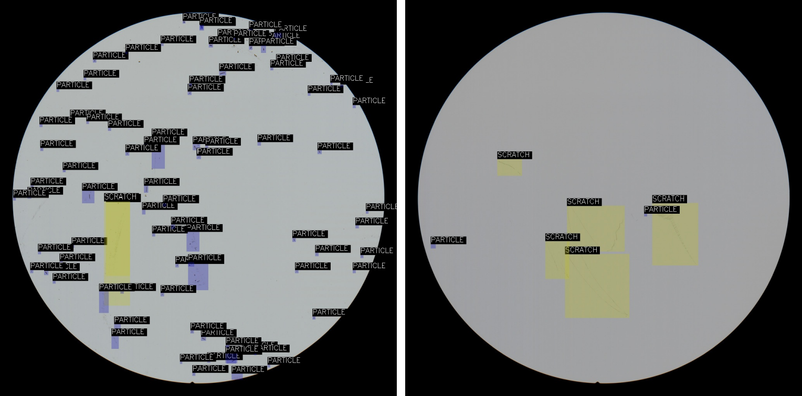
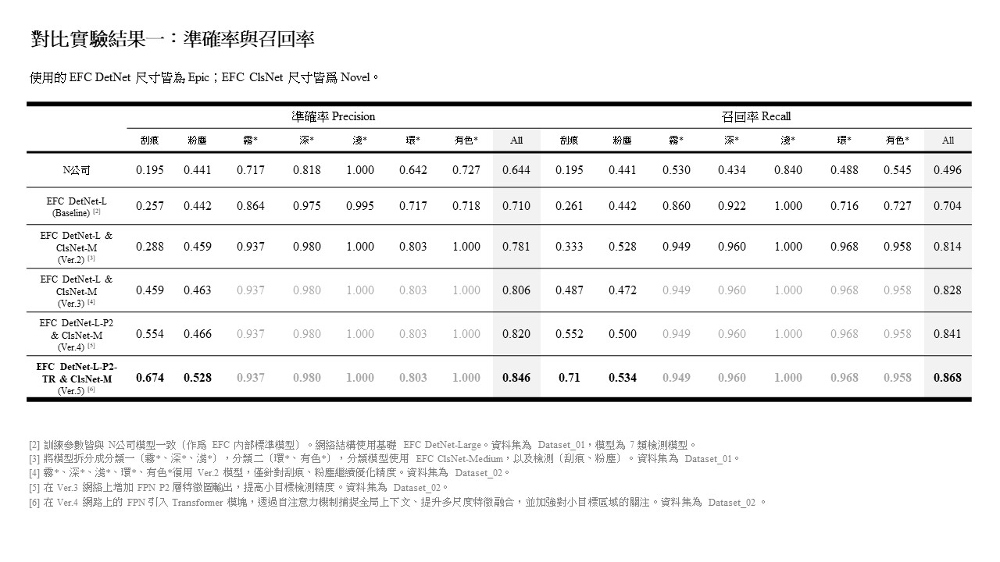

# Crystal Defects, Diffusion, and Microstructure

## 晶體缺陷、擴散與微觀組織：從不完美結構理解材料行為與檢測證據

> **Learning Context**
>
> In computer vision, a defect usually means something observable that a model should detect or classify. Materials science uses the same word differently: a vacancy can support diffusion, a dislocation can make plastic deformation possible, and a controlled dopant can be part of a working semiconductor.
>
> That difference was easy to miss. This note separates structural imperfection from damage, then asks how far optical evidence can support a material hypothesis. AOI does not identify an atomic-scale defect directly. It shows a signal. Any claim about the underlying mechanism still needs evidence at the right scale.

理想晶格很適合拿來建立模型，不過真實材料不會完全照著理想位置排列。空位、間隙原子、差排、晶界與第二相粒子，有些在有限溫度下無法避免，有些則由摻雜、加工或熱處理引入。

一開始很容易把「缺陷」理解成材料中不該存在的錯誤。整理過擴散與差排後，這個說法就不太夠用了：空位提供替位型原子移動的位置，差排讓金屬能在合理應力下產生塑性變形，受控制的摻雜原子更是半導體功能的一部分。真正需要判斷的，是缺陷的類型、濃度、位置與尺度是否符合製程和使用條件。

## 1. Defects as Functional Imperfections

先把同一個字在兩個領域裡的意思分開：材料缺陷（material defect）不等於 AI dataset 裡的 defect label。前者描述結構偏離理想狀態，後者通常只描述資料中可觀察的異常。

| 缺陷尺度 | 典型例子 | 主要影響 |
| --- | --- | --- |
| 點缺陷（0D） | 空位、自間隙原子、替位與間隙雜質 | 擴散、載子濃度、局部晶格應變 |
| 線缺陷（1D） | 刃狀差排、螺旋差排、混合差排 | 塑性變形、加工硬化、局部應力 |
| 面缺陷（2D） | 晶界、雙晶界、堆疊錯誤、相界面 | 快速擴散、晶粒滑移、腐蝕與破壞路徑 |
| 體缺陷（3D） | 孔隙、空洞、沉澱物、夾雜物 | 局部應力集中、散射、漏電與破壞風險 |

這種分類是依照缺陷在空間中延伸的維度整理，並不是把它們切成彼此無關的類別。例如差排可能終止於晶界，空位也可能聚集形成空洞。裂紋在不同脈絡下可被描述為延伸、平面或體積損傷，這裡先不硬塞進 dimensional classification，留到下一篇的斷裂與失效再談。

## 2. 點缺陷：原子尺度的空缺與錯位


> 圖 1：Vacancy、self-interstitial、substitutional impurity 與 interstitial impurity 的概念比較；原子尺寸與晶格變形不按比例繪製。

### 2.1 空位

空位（vacancy）是正常晶格位置缺少一個原子的狀態。即使材料沒有受到輻照或加工，有限溫度下仍會存在一定數量的平衡空位，因為增加少量空位雖然需要形成能，卻也會提高系統的組態熵。

平衡空位比例常寫成：

```math
\frac{N_v}{N}
=
A\exp\left(-\frac{Q_v}{k_{\mathrm B}T}\right)
```

其中：

- $N_v$：空位數量；
- $N$：可用晶格位置總數；
- $A$：與熵及模型有關的前因子；
- $Q_v$：形成一個空位所需的能量；
- $k_{\mathrm B}$：波茲曼常數；
- $T$：絕對溫度。

溫度升高時，負指數的絕對值變小，因此平衡空位濃度會快速增加。這是一種熱活化行為，不是因為晶格在高溫下任意「鬆開」，而是更多原子取得形成空位所需的能量。

### 2.2 自間隙原子

自間隙原子（self-interstitial）是母材原子離開正常位置後進入晶格間隙。在許多緊密排列的晶體中，間隙空間有限，自間隙原子會造成較大的局部晶格扭曲，因此其形成能通常高於空位；實際數值仍然取決於材料與晶體結構。

在半導體矽中，空位與自間隙原子都可能參與摻雜原子的擴散與缺陷反應。實際機制依摻雜元素、溫度、氧化條件及缺陷化學而異，不能把所有摻雜擴散都簡化成單一空位跳躍。

### 2.3 替位與間隙型雜質

- **替位型雜質**：外來原子占據母材的正常晶格位置。
- **間隙型雜質**：較小的外來原子進入晶格間隙。

例如磷或硼可以在矽中形成受控制的摻雜分布，而碳在鐵中的擴散則常以間隙機制理解。這些原子是否能有效參與材料功能，不只取決於總濃度，也取決於它們位於哪種晶格位置，以及是否形成團簇或沉澱。

### 2.4 陶瓷中的成對缺陷

離子晶體還要維持整體電中性，因此常以成對或成組缺陷描述：

- **Schottky defect**：正、負離子的空位以維持電中性的方式同時出現。
- **Frenkel defect**：一個離子離開正常位置並進入間隙，形成空位—間隙對。

這些名稱有助於理解離子材料，不過本篇後續主要以金屬與矽的缺陷和擴散為主。

## 3. 簡單例題：溫度如何改變空位濃度？

假設某材料的空位形成能為：

```math
Q_v=1.0\ \mathrm{eV/atom}
```

比較 $500\ \mathrm K$ 與 $1000\ \mathrm K$ 的空位比例。若前因子 $A$ 在兩個溫度下相同，則：

```math
\frac{(N_v/N)_{1000}}{(N_v/N)_{500}}
=
\exp\left[-\frac{Q_v}{k_{\mathrm B}}\left(\frac{1}{1000}-\frac{1}{500}\right)\right]
```

代入：

```math
k_{\mathrm B}=8.617\times10^{-5}\ \mathrm{eV/K}
```

可得：

```math
\frac{(N_v/N)_{1000}}{(N_v/N)_{500}}
\approx
1.1\times10^5
```

結果表示溫度從 $500\ \mathrm K$ 提高到 $1000\ \mathrm K$ 時，平衡空位比例可能增加約五個數量級。看到這個差距後，就不太適合把熱處理溫度的影響只理解成「溫度高一點」。缺陷數量與原子移動能力都可能跟著跨越好幾個數量級。

不過這條式子描述的是熱力學平衡下的缺陷族群，不包含所有製程後留下的缺陷。淬火、輻照、離子植入與塑性變形都可能保留額外的非平衡缺陷。算到這裡，還不能拿平衡空位濃度直接代表實際樣品中的總缺陷量。

## 4. 點缺陷如何促成固態擴散？

固態中的原子雖然不像液體一樣自由流動，但仍能透過一次次局部跳躍逐漸改變位置。

### 4.1 空位擴散

替位型原子要移動到相鄰晶格位置，通常需要附近先存在空位：

也就是原子先跳入相鄰空位，接著在原本的位置留下新的空位。

從原子的角度看，它朝某方向移動；從空位的角度看，空位則往相反方向遷移。空位擴散同時受到空位形成能與原子跳躍能障影響。

### 4.2 間隙擴散

較小的間隙原子可以在相鄰間隙位置之間移動，不必等待正常晶格位置先形成空位。因此在適合的晶格與溫度範圍內，間隙擴散通常比替位擴散快。

不過，「間隙原子一定擴散較快」仍然只是一般趨勢。實際擴散係數還取決於原子尺寸、鍵結、晶體結構和遷移能障。

## 5. 擴散係數與 Arrhenius 關係

擴散係數常表示為：

```math
D=D_0\exp\left(-\frac{Q_d}{RT}\right)
```

其中：

- $D$：擴散係數，常用單位為 $\mathrm{m^2/s}$；
- $D_0$：前指數因子；
- $Q_d$：每莫耳擴散活化能；
- $R$：氣體常數；
- $T$：絕對溫度。

若 $Q_d$ 使用單一原子的 $\mathrm{eV/atom}$，分母應搭配 $k_{\mathrm B}T$；若 $Q_d$ 使用 $\mathrm{J/mol}$，則搭配 $RT$。計算前需要先確認這項對應關係，因為公式形式看起來相同，但能量尺度與常數不能混用。

取自然對數後：

```math
\ln D=\ln D_0-\frac{Q_d}{R}\frac{1}{T}
```

因此在 $\ln D$ 對 $1/T$ 的圖上，斜率為 $-Q_d/R$。


> 圖 2：Arrhenius linearization 與 concentration profile 隨時間變化的概念比較；兩側圖形用來說明趨勢，不代表同一組實驗資料。

對替位擴散而言，量測到的有效活化能可能同時包含缺陷形成與遷移的貢獻。若溫度、濃度、相組成或主導擴散路徑改變， $D_0$ 與 $Q_d$ 也可能跟著改變，因此不能將同一條 Arrhenius 直線無限制外推。

### 簡單例題：由一個溫度估算另一個溫度的擴散係數

已知銅在黃銅中的擴散係數在 $400^\circ\mathrm C$ 時為：

```math
D_1=1.0\times10^{-20}\ \mathrm{m^2/s}
```

若 $Q_d=195\ \mathrm{kJ/mol}$，估算 $600^\circ\mathrm C$ 時的 $D_2$。先換成絕對溫度：

```math
T_1=673\ \mathrm K,\qquad T_2=873\ \mathrm K
```

將兩個 Arrhenius 式相除，可消去未知的 $D_0$：

```math
\ln\left(\frac{D_2}{D_1}\right)
=
\frac{Q_d}{R}\left(\frac{1}{T_1}-\frac{1}{T_2}\right)
```

代入 $Q_d=195000\ \mathrm{J/mol}$ 與 $R=8.314\ \mathrm{J/(mol\cdot K)}$：

```math
\ln\left(\frac{D_2}{D_1}\right)\approx7.99
```

因此：

```math
D_2\approx2.9\times10^{-17}\ \mathrm{m^2/s}
```

雖然溫度只提高 $200^\circ\mathrm C$，擴散係數卻增加約三個數量級。計算完成後，可以先檢查結果的基本趨勢：溫度升高時 $D$ 應該變大；若結果相反，通常需要重新確認溫度倒數的順序或負號。

## 6. 菲克定律：區分穩態與非穩態

### 6.1 菲克第一定律

一維穩態擴散通量為：

```math
J=-D\frac{\mathrm dC}{\mathrm dx}
```

其中 $J$ 為擴散通量，表示單位時間穿過單位面積的物質量；其正負號取決於座標方向與濃度梯度的定義。式中的負號表示淨擴散方向由高濃度指向低濃度。

這裡的負號不是額外的能量損失。它只是把濃度下降方向和物質移動方向連起來；真正判讀正負號前，仍要先看座標軸怎麼定義。

### 6.2 菲克第二定律

當濃度分布會隨時間改變時，需使用菲克第二定律。對一維且 $D$ 為常數的情況：

```math
\frac{\partial C}{\partial t}
=
D\frac{\partial^2 C}{\partial x^2}
```

第一定律回答「目前有多少物質通過」，第二定律則回答「某個位置的濃度接下來如何改變」。在摻雜、滲碳或薄膜互擴散問題中，這項差別比背下公式更重要。

上述形式把問題簡化成一維擴散，並在第二定律中將 $D$ 視為常數。這是連續體模型，不會逐顆追蹤原子。若擴散係數隨濃度、位置或時間改變，或同時存在電場、化學反應與多組分耦合，就需要使用更完整的模型。

## 7. 差排：讓塑性變形在較低應力下發生

差排（dislocation）是晶體中的線缺陷。若完美晶體要產生一個完整晶格間距的滑移，理想化模型要求整個晶面上的大量原子同時越過高能量位置，所需剪應力會非常高。

有差排時，只有差排核心附近的原子需要逐步改變鍵結：

整個過程可以理解成：局部原子先重新排列，接著差排向前移動，最後在晶面上留下永久滑移。


> 圖 3：刃狀差排透過局部鍵結重排逐步滑移；圖中只呈現概念路徑，不代表實際應力場與晶格比例。

### 7.1 刃狀、螺旋與混合差排

| 差排類型 | 幾何特徵 | 柏格向量與差排線 |
| --- | --- | --- |
| 刃狀差排 | 晶體中多出一個額外半原子平面 | 互相垂直 |
| 螺旋差排 | 原子平面沿差排線形成螺旋狀錯位 | 互相平行 |
| 混合差排 | 同一差排線同時具有刃狀與螺旋成分 | 夾角沿差排線改變 |

柏格向量 $\mathbf b$ 描述差排造成的晶格位移大小與方向。差排移動的滑移面和滑移方向受到晶體結構限制，這也是第三章中 FCC、BCC 與 HCP 滑移行為不同的原因之一。

把差排往前移動，可以先想成把厚地毯上的皺摺慢慢推過去：局部移動最後累積成較大的位移。這個比喻只是在說明為什麼不必讓整個平面同時移動，並不能代表晶格週期、柏格向量、差排應力場或滑移系統。

## 8. 晶界與微觀組織

多晶材料由許多晶粒組成，相鄰晶粒的晶向不同，兩者之間形成晶界。晶界附近的原子排列較不規則，能量通常高於晶粒內部，因此可能產生幾種影響：

- 提供較快的擴散路徑；
- 阻礙差排跨越，影響降伏強度；
- 成為雜質偏聚、沉澱與腐蝕反應的位置；
- 在高溫或長時間受力時參與晶界滑移；
- 改變電子、聲子或光的散射。

晶粒細化通常能增加晶界數量並提高金屬降伏強度，常以 Hall–Petch 關係描述：

```math
\sigma_y=\sigma_0+k_y d^{-1/2}
```

其中 $d$ 為平均晶粒尺寸。不過這個關係有適用範圍，也不能直接套用到所有材料、所有晶粒尺度或所有溫度條件。Hall–Petch 關係主要用於一定晶粒尺度範圍內的多晶材料；高度完整的單晶矽沒有一般多晶材料中的晶粒尺寸強化問題。若研究的是多晶矽、金屬薄膜或其他多晶結構，才需要進一步考慮晶界效應。

### 8.1 微觀組織不只是缺陷清單

整理到這裡時，最容易混淆的是「微觀組織」和「晶體結構」。晶體結構描述原子如何週期排列，例如 FCC 或 BCC；微觀組織則包含晶粒尺寸與取向、相組成、沉澱物、孔洞、界面，以及不同缺陷的空間分布。即使兩個材料具有相同化學成分和晶體結構，只要這些特徵的尺寸、數量或分布不同，性質與失效行為仍可能明顯不同。

## 9. 晶體缺陷與半導體檢測證據

矽晶圓通常要求高度完整的單晶結構，不過製程中仍需要面對不同形式的缺陷與非理想狀態：

- 空位與自間隙原子可能參與摻雜擴散及缺陷反應；
- 差排與滑移線可能由熱應力或機械應力引發；
- 氧、碳與金屬污染可能形成複合缺陷或沉澱；
- 薄膜晶界、孔洞與界面缺陷可能改變漏電、附著與可靠度；
- 局部應力可能改變晶格振動、能帶與光學反應。


> 圖 4：同一個檢測訊號可能對應多種材料與製程假設；箭頭表示待查方向，不代表已確認的因果關係。

對檢測工作而言，最重要的限制是：**AOI 看見的是表面或光學訊號，不是空位、差排或晶界本身。** 一個亮點可能來自粒子污染、表面高度、薄膜干涉、粗糙度或局部材料狀態。影像可以先縮小調查範圍，但不會自己補上材料機制。

因此，較合理的做法是把檢測結果當成縮小假設範圍的起點，再依照問題選擇驗證方式。以下只整理各方法主要可以回答的問題；量測原理、解析度、取樣深度與樣品限制會留到後續的材料分析方法筆記：

| 要確認的問題 | 可考慮的方法 | 主要限制 |
| --- | --- | --- |
| 表面形貌與高度 | 光學輪廓、AFM、SEM | 不一定能直接辨認化學組成 |
| 晶向、晶體相與應變 | XRD、電子繞射、EBSD | 量測尺度和樣品條件不同 |
| 晶格振動與局部應力 | Raman 光譜 | 訊號也可能受溫度與組成影響 |
| 污染物與元素分布 | EDS、XPS、SIMS | 深度解析度、偵測極限與破壞性不同 |
| 載子復合相關缺陷 | 光致發光、少數載子壽命量測 | 通常無法單獨指定唯一缺陷種類 |

這些方法回答的問題不同，量測尺度、取樣深度與樣品條件也不同。表格先用來安排下一步，不在這篇展開各儀器的量測原理。

## 10. Label Review and Dataset Semantics

An anonymized wafer-inspection dataset contained two kinds of labels. Some described a condition across most of the image. Particles and scratches were different because their positions mattered. The original schema represented both with bounding boxes, including boxes that covered nearly the whole wafer.

I separated the tasks according to what the annotations actually meant. Whole-image conditions became classification tasks. Particles and scratches remained detection tasks, and the local annotations were reviewed before model comparison. One wafer could then carry a global classification result and several local detections at the same time. It sounds ordinary once written that way. The original labels made the distinction much less obvious.

```text
Wafer record
├── Global classification result
└── Local detections
    ├── particle
    └── scratch
```



> Figure 5: Detection outputs from the anonymized wafer case. The image shows local particle and scratch results only. A wafer-level appearance class belongs to a separate classification record rather than being forced into another full-image box.

The revised workflow also improved the measured precision and recall. But that change cannot be assigned to one model: task definition, annotation review, dataset preparation, training, and post-processing changed together.



> Figure 6: A comparison retained in the related [model-evaluation repository](https://github.com/RocketWill/N_Glass-Wafer-Model-Evaluation-Results). The result is useful as a project check, not as evidence that task separation alone produced the full improvement.

Studying crystal defects introduced another distinction. None of those labels identifies an atomic or microstructural defect. A particle may be contamination, detached material, residue, or another foreign object. A scratch describes visible morphology, but the image does not establish whether mechanical contact, brittle cracking, handling, or another mechanism produced it. Haze is even broader: it can be a repeatable optical condition without uniquely identifying roughness, film thickness, composition, or microstructure.

| Level | Example from the project | Meaning |
| --- | --- | --- |
| Observable evidence | Particle, scratch, haze-like or ring-like contrast | What appears in the image |
| Engineering hypothesis | Contamination, contact damage, residue, stress-related change | A plausible explanation |
| Verified mechanism | Supported by process records or material characterization | A root cause with independent evidence |

The label still matters. But it should state what was observed, not quietly claim a mechanism that the available evidence cannot support.

這次資料結構調整也留下另一個問題：若同一個標籤欄位同時混入整張影像狀態、局部形貌、工程假設與已驗證原因，模型即使學得到影像特徵，輸出仍然很難解讀。比較能追查的紀錄，至少會把下面幾層分開：

- 可觀察標籤與空間尺度；
- 影像及量測條件；
- 待驗證的工程機制；
- 製程或批次脈絡；
- 後續驗證結果，包括仍未解決的狀態。

不是每份 production dataset 都能補齊所有欄位。不過把「未知」留下來，通常比把不確定性包成一個很肯定的類別名稱更有用。這樣模型可以協助 triage 與安排驗證，不必假裝 prediction 已經完成診斷。

## Current Scope

這篇先停在點缺陷、固態擴散、差排、晶界與微觀組織，以及這些概念如何限制 inspection evidence 的解讀。

平衡空位公式不包含所有由非平衡製程保留下來的缺陷；Arrhenius 關係跨越機制改變後，不能直接外推；最簡化的 Fick 定律也只適用於前面列出的擴散條件。這些模型適合建立第一層判斷，不足以替一個光學異常指定材料根因。

下一篇會把載入方式、時間與環境條件放進來，繼續看材料如何進入斷裂、疲勞與失效。

## Learning Source

- James F. Shackelford, [*Materials Science: 10 Things Every Engineer Should Know*](https://www.coursera.org/learn/materials-science), University of California, Davis / Coursera.

## Additional References

- James F. Shackelford, *Introduction to Materials Science for Engineers*, 8th ed.
- William D. Callister Jr. and David G. Rethwisch, *Materials Science and Engineering: An Introduction*.
