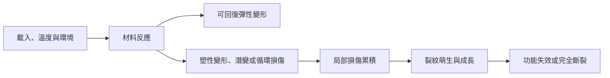

# 從機械性質到失效證據：材料損傷如何累積

## English Summary

This chapter addresses a gap between my work in AI-based optical inspection and the material mechanisms behind a visible defect. In semiconductor wafer and industrial AOI projects, my work has focused on image acquisition, data review, defect models, inspection workflows, and equipment-side validation. A model can locate a crack, scratch, particle, or pattern anomaly. But the label alone cannot establish whether the cause is overload, fatigue, creep, thermal cycling, a process condition, or even the imaging setup.

I begin with the tensile curve, then add the effects of time, temperature, crack geometry, and repeated loading. The aim is not to turn every image into a failure diagnosis. It is to separate what the inspection system observes from the mechanism that still needs to be tested.

The most useful change is in how I would structure the evidence. Defect labels and geometry should be connected with process stage, spatial distribution, loading or thermal history, and follow-up characterization (when those records are available). That distinction matters. AOI can support localization, measurement, grouping, and trend comparison; a verified root cause still requires material or process evidence.

---

## 1. 為什麼整理這個主題？

過去參與半導體晶圓和其他工業 AOI 專案時，我的工作主要集中在影像擷取、資料整理、缺陷模型、檢測流程和設備端驗證。這些方法能協助定位異常、量測尺寸，並且比較不同影像或批次之間的變化。不過，模型輸出的 crack、scratch、particle 或 pattern anomaly 仍然只是影像層級的標籤，無法單獨說明異常究竟是由瞬間超載、疲勞、潛變、熱循環，還是製程與成像條件造成。

因此，這一篇主要整理一個問題：**材料受到不同形式的載入後，如何從材料反應逐步發展成永久變形、損傷與最終失效，而檢測結果又能支持哪些判斷？**

拉伸試驗、潛變、衝擊、斷裂和疲勞看起來是不同的主題，不過它們都在描述材料如何回應外力、溫度與時間。整理這些內容後，較重要的並不是記住每一條曲線，而是要能分清楚量測值代表哪一種材料行為、測試條件如何限制結果的解讀，以及目前看到的是失效原因、損傷結果，還是仍然需要進一步驗證的線索。

失效也不一定等於零件完全斷裂。永久變形、剛性下降、尺寸漂移或表面裂紋，只要讓元件無法維持原本功能，就已經構成功能性失效。

## 2. 從載入條件到材料反應

材料受力後可能只產生可回復的彈性變形，也可能因為塑性變形、潛變或循環載入而逐漸累積損傷。因此在整理失效過程時，不能只使用一條固定路徑，而是需要先區分材料可能產生的反應：

在正常範圍內，彈性變形本身並不等於材料已經受到損傷，因為卸載後材料仍可以大致回復原狀。不過這張流程圖仍然只是一個簡化模型，例如脆性材料可能在幾乎沒有可見塑性變形的情況下斷裂，高溫元件可能在長時間受力後累積潛變應變，而循環載入也可能在名義應力低於降伏強度時形成疲勞裂紋。因此這張圖適合用來整理不同階段的證據，但不能視為所有材料都會依序經過的固定流程。

因此，判讀失效時至少需要一起確認四類條件：

| 條件 | 需要確認的內容 |
| --- | --- |
| 材料 | 材料種類、微觀組織、缺陷與表面狀態 |
| 載入 | 拉伸、壓縮、剪切、衝擊或循環載入 |
| 環境 | 溫度、腐蝕介質、濕度與真空條件 |
| 時間 | 瞬間載入、持續載入、循環次數與載入歷史 |

## 3. 如何解讀拉伸曲線？

拉伸試驗將試片沿單軸方向拉伸，並記錄載荷與伸長量。為了比較不同尺寸的試片，通常先轉換成工程應力與工程應變。ASTM E8/E8M 的範圍也提醒了一項限制：標準試片量到的強度與延展性，不一定能完整代表成品在不同環境中的實際行為。

$$\sigma_{\mathrm{eng}}=\frac{P}{A_0}$$

$$\varepsilon_{\mathrm{eng}}=\frac{L-L_0}{L_0}=\frac{\Delta L}{L_0}$$

其中 $P$ 為載荷，$A_0$ 為原始截面積，$L_0$ 為原始標距長度。

> 圖 1：作者依個人課程筆記重新整理，內容對應 UC Davis 課程 Module 2。

典型延性金屬的工程應力—應變曲線可以分成：

1. **線性彈性區**：卸載後大致回復原始形狀，初始線性斜率為彈性模數 $E$。
2. **降伏與塑性變形**：開始留下永久應變；沒有明顯降伏點時，常使用 $0.2\%$ 偏移法定義降伏強度。
3. **加工硬化**：對許多晶體金屬而言，塑性變形會增加差排交互作用，使後續變形需要更高應力。
4. **極限抗拉強度**：工程應力到達最大值。
5. **頸縮與斷裂**：變形集中在局部區域，工程應力下降，最後斷裂。

UC Davis 課程以「Big Four」整理彈性模數、降伏強度、抗拉強度與延展性，接著再將韌性列為第五項重要性質。這種分類的實用之處，是可以先用同一條曲線區分四個不同問題：

| 性質 | 從曲線如何取得 | 回答的問題 |
| --- | --- | --- |
| 彈性模數 $E$ | 初始線性區斜率 | 材料有多不容易產生彈性變形？ |
| 降伏強度 $\sigma_y$ | 開始明顯塑性變形的應力 | 何時開始留下永久變形？ |
| 抗拉強度 $\sigma_{\mathrm{UTS}}$ | 工程應力最大值 | 拉伸過程可承受的最大工程應力是多少？ |
| 延展性 | 斷裂伸長率或斷面收縮率 | 斷裂前可以累積多少塑性變形？ |

這四個量不能互相替代。彈性模數高不代表降伏強度一定較高，抗拉強度高也不代表材料在斷裂前能吸收較多能量。如果只使用「比較硬」或「比較強」描述材料，很容易將剛性、降伏和破壞等原本不同的設計條件混在一起。

### 簡單例題：由載荷與伸長量計算工程應力、應變

假設試片的原始截面積為 $50\ \mathrm{mm^2}$，原始標距長度為 $50\ \mathrm{mm}$。當載荷為 $10\ \mathrm{kN}$ 時，標距增加 $0.05\ \mathrm{mm}$。

工程應力為：

$$\sigma_{\mathrm{eng}}=\frac{10\,000\ \mathrm N}{50\ \mathrm{mm^2}}=200\ \mathrm{MPa}$$

工程應變為：

$$\varepsilon_{\mathrm{eng}}=\frac{0.05}{50}=0.001$$

若這一點仍位於線性彈性區，則彈性模數可估算為：

$$E=\frac{\sigma}{\varepsilon}=\frac{200\ \mathrm{MPa}}{0.001}=200\ \mathrm{GPa}$$

這個結果接近鋼的典型數量級。除了完成計算外，還需要檢查單位和物理趨勢是否合理；如果得到遠低於一般金屬的數值，就應該回頭確認截面積、伸長量和單位換算。對我而言，能否判斷計算結果是否合理，也是確認自己是否理解公式的一部分。

### 3.1 剛性、強度、延展性與拉伸韌性

這四個名詞描述不同面向：

- **剛性（stiffness）**：抵抗彈性變形的能力，主要由彈性模數表示。
- **強度（strength）**：抵抗降伏或斷裂的能力，需要說明指的是降伏強度、抗拉強度或其他定義。
- **延展性（ductility）**：斷裂前能承受的塑性變形程度。
- **拉伸韌性（tensile toughness）**：在單軸拉伸試驗的脈絡下，應力—應變曲線至斷裂前的面積可視為材料吸收的應變能密度。

拉伸韌性同時受到強度和延展性影響。材料即使具有較高的強度，如果在斷裂前幾乎沒有塑性變形，也不一定具有較高的拉伸韌性；相反地，能夠大幅伸長但承受應力很低的材料，也不一定能吸收最多能量。因此曲線面積可以幫助理解拉伸條件下的 work to fracture，但不能直接延伸成所有載入形式和試片條件都能共用的韌性數值。

較容易混淆的是：拉伸曲線面積代表的韌性、Charpy 試驗量到的衝擊吸收能，以及斷裂力學中的 $K_{\mathrm{IC}}$，三者的測試方式、單位與適用問題不同。它們都和材料抵抗破壞有關，不過不能因此直接視為同一個材料常數。

### 3.2 工程應力與真應力

工程應力始終使用原始截面積 $A_0$，真應力則使用當下截面積 $A$：

$$\sigma_{\mathrm{eng}}=\frac{P}{A_0},\qquad \sigma_{\mathrm{true}}=\frac{P}{A}$$

在頸縮發生前，若變形近似均勻且材料體積近似不變，可使用：

$$\sigma_{\mathrm{true}}=\sigma_{\mathrm{eng}}(1+\varepsilon_{\mathrm{eng}})$$

$$\varepsilon_{\mathrm{true}}=\ln(1+\varepsilon_{\mathrm{eng}})$$

> 圖 2：作者依個人課程筆記重新整理，內容對應 UC Davis 課程 Module 2。

工程應力在極限抗拉強度後下降時，很容易直接解讀成材料本身突然變弱。實際上，頸縮後截面積快速縮小，載荷與局部面積同時改變；工程應力仍用固定的 $A_0$ 計算，因此無法直接反映頸縮區的局部狀態。對許多延性金屬而言，真應力可在頸縮後繼續上升到接近斷裂。

頸縮開始後，局部應力狀態不再是簡單的單軸拉伸，上面的均勻變形換算式也不再足夠。若要取得較準確的真應力，需要量測局部截面並進一步修正。

## 4. 時間、溫度與潛變

潛變（creep）是材料在持續應力下，應變隨時間增加的現象。它通常在較高同系溫度下特別重要：

$$T_{\mathrm H}=\frac{T}{T_{\mathrm m}}$$

其中溫度需使用絕對溫標。不過，不能以單一固定溫度判斷所有材料是否會潛變；聚合物在室溫附近也可能出現顯著的時間依賴變形。

> 圖 3：作者依個人課程筆記重新整理，內容對應 UC Davis 課程 Module 3。

典型潛變曲線可分為：

1. **第一階段潛變**：潛變速率逐漸下降，加工硬化的影響較明顯。
2. **第二階段潛變**：潛變速率近似穩定，硬化與回復機制達到動態平衡。
3. **第三階段潛變**：孔洞、晶界損傷或頸縮逐漸發展，有效截面減少，應變速率加快直到破壞。

在穩態潛變且主導機制未改變的有限應力與溫度範圍內，潛變速率常以 Norton–Arrhenius 型經驗關係表示：

$$\dot{\varepsilon}_{s}=A\sigma^n\exp\left(-\frac{Q_c}{RT}\right)$$

其中 $A$ 與 $n$ 依材料與機制而定，$Q_c$ 為潛變活化能。這個式子顯示應力與溫度都會顯著改變潛變速率。

### Arrhenius 外推的限制

如果已經在幾個較高溫度下量到潛變速率，可以利用 Arrhenius 關係估算較低溫度下的長期行為。不過這種外推成立的前提，是外推範圍內仍然由相同的潛變機制控制。當溫度改變時，差排攀移、擴散、晶界滑移或微觀組織演化的主導關係也可能跟著改變，此時原本擬合得到的直線就不再可靠。

因此在進行長期壽命預測時，不能只看回歸線是否擬合良好，還需要確認主導機制和材料狀態是否保持一致。這也是使用資料模型進行預測時，仍然需要回到材料機制進行檢查的原因。

## 5. 衝擊、裂紋與斷裂韌性

### 5.1 延性—脆性轉變與 Charpy 衝擊試驗

延性破壞通常伴隨明顯塑性變形與較多能量吸收，脆性破壞則可能在變形很小時快速發生。破壞模式不只由材料名稱決定，溫度、應變速率、缺口、厚度與微觀組織都會改變結果。

Charpy 衝擊試驗以擺錘撞擊帶缺口試片，根據撞擊前後的能量差估算試片吸收的衝擊能。ASTM E23 規範的是金屬缺口試片的 Charpy 與 Izod 衝擊測試，因此這裡不把結果延伸成所有材料與幾何條件下都通用的韌性。對部分 BCC 金屬與鋼材而言，吸收能會在一段溫度範圍內快速下降，形成延性—脆性轉變。

> 圖 4：作者依個人課程筆記重新整理，內容對應 UC Davis 課程 Module 3；曲線只表示定性趨勢。

這張圖只表示常見定性趨勢：

- 部分 BCC 金屬具有明顯的轉變溫度區；
- FCC 金屬通常不呈現同樣尖銳的轉變，但不代表任何條件下都不會脆性破壞；
- HCP 材料因可用滑移系統與織構等因素，行為需要依合金與測試條件判斷。

Charpy 結果適合比較材料在指定試片與測試條件下的衝擊行為，但不能直接等同於裂紋尖端的斷裂韌性。

### 5.2 斷裂韌性與臨界裂紋

只看名義應力是否超過降伏或抗拉強度，無法完整處理已經含有裂紋的零件。斷裂力學進一步考慮的是：材料中如果已經存在裂紋，裂紋尖端的局部應力場是否會使它快速成長？

在線彈性斷裂力學的 Mode I 張開模式下，應力強度因子可寫成：

$$K_{\mathrm I}=Y\sigma\sqrt{\pi a}$$

其中：

- $Y$：幾何修正因子；
- $\sigma$：遠場名義應力；
- $a$：依幾何定義的裂紋尺寸。

當試片厚度、裂紋與載入條件滿足線彈性和平面應變要求時，材料抵抗裂紋成長的臨界值記為 $K_{\mathrm{IC}}$。ASTM E399 也將它限定在具有尖銳裂紋、裂紋尖端塑性區相對較小且高拘束的條件下。簡化判斷為：

$$K_{\mathrm I}\geq K_{\mathrm{IC}}$$

> 圖 5：作者依個人課程筆記重新整理，內容對應 UC Davis 課程 Module 4。

### 簡單例題：估算臨界裂紋尺寸

假設：

$$K_{\mathrm{IC}}=50\ \mathrm{MPa\sqrt m},\qquad \sigma=200\ \mathrm{MPa},\qquad Y=1$$

由：

$$a_c=\frac{1}{\pi}\left(\frac{K_{\mathrm{IC}}}{Y\sigma}\right)^2$$

可得：

$$a_c=\frac{1}{\pi}\left(\frac{50}{200}\right)^2\ \mathrm m\approx0.020\ \mathrm m$$

也就是約 $20\ \mathrm{mm}$。這個數值只適用於題目設定的理想幾何；若裂紋位於表面、幾何因子不同，或材料出現顯著塑性區，計算方式都需要調整。實際工程允許裂紋尺寸通常還要顯著低於理論臨界值，並考慮安全係數、量測誤差、殘留應力、載荷變動與裂紋幾何的不確定性。

這個例題也顯示，臨界裂紋尺寸並不是一個固定常數。相同材料在承受較高工作應力時，可以容許的裂紋尺寸會更小；同一條裂紋如果位於應力集中較嚴重的位置，也可能具有更高的破壞風險。因此即使影像已經量到裂紋長度，仍然不能脫離應力和幾何條件，直接判定零件是否安全。

## 6. 循環載入與疲勞

疲勞（fatigue）是材料在重複或變動載入下逐步累積損傷的現象。即使名義應力低於材料的降伏強度，表面粗糙、缺口或夾雜物附近仍可能產生局部循環滑移，最後形成裂紋。

疲勞失效通常分成：

1. 裂紋萌生；
2. 穩定裂紋成長；
3. 剩餘截面不足以承受載荷時快速斷裂。

> 圖 6：作者依個人課程筆記重新整理，內容對應 UC Davis 課程 Module 4。

S–N 曲線以應力振幅 $S$ 對破壞循環數 $N$ 表示疲勞行為。部分鋼材可能出現近似水平的平台，稱為耐久極限；許多鋁合金與其他材料則會隨循環數增加持續下降，因此通常指定某一循環數下的疲勞強度，而不是假設存在真正的無限壽命。

S–N 資料也不能脫離條件單獨使用。平均應力、表面狀態、殘留應力、腐蝕環境、溫度、載入頻率與實際載入順序，都可能改變疲勞壽命。

## 7. 從檢測異常建立失效假設

檢測影像或感測器訊號通常只能先指出異常位置與變化趨勢。若要進一步判斷失效機制，可以把觀察、可能機制與待驗證證據分開記錄：

| 可見或可量測的現象 | 可能機制 | 還需要確認 |
| --- | --- | --- |
| 永久彎曲或尺寸漂移 | 超過降伏、潛變、熱膨脹失配 | 載入歷史、溫度、殘留應變 |
| 缺口附近快速斷裂 | 脆性破壞、斷裂韌性不足 | 斷口形貌、裂紋尺寸、工作溫度 |
| 表面出現週期性裂紋 | 疲勞、熱循環、局部應力集中 | 循環數、應力振幅、裂紋成長方向 |
| 高溫長時間後孔洞增加 | 潛變損傷、擴散或界面反應 | 時間—溫度紀錄、晶界與截面分析 |
| 影像亮暗或紋理改變 | 表面形貌、薄膜、污染或應力改變 | 多模態影像、材料分析與製程紀錄 |

同一種外觀可能對應不同的材料機制，而相同的機制也可能在不同條件下呈現不同外觀。因此，異常分類適合用來縮小後續調查的範圍，但不能直接取代根因分析。

### 7.1 匿名化分析情境：從晶圓表面異常到可驗證假設

以下情境建立在過去參與晶圓缺陷模型最佳化、資料複查與重新標註、檢測任務拆分，以及設備端驗證的工作經驗上。不過這些經驗並不代表我曾經完成正式的材料失效分析，因此案例中的「線狀異常」只是一個用來練習判讀流程的假設情境，不對應特定客戶、產品或已經確認的根因。

假設晶圓 AOI 系統在固定區域或特定批次中反覆偵測到小型線狀異常，第一步不應該直接判定它是疲勞裂紋，而是先確認影像、系統和模型所提供的量測結果是否可靠：

| 判讀層級 | 可以先做的工作 |
| --- | --- |
| 影像與系統 | 比較多相機或不同照明結果，檢查 trigger、晶圓定位、ROI、template 與 recipe 是否一致 |
| 模型與資料 | 複查標註、分類與偵測任務的分工，確認小缺陷是否被縮放、裁切或類別定義影響 |
| 空間與批次 | 量測異常長度、方向、尖端與邊緣距離，查看是否集中在固定位置、製程步驟或批次 |
| 材料假設 | 在確認實體異常後，再考慮表面刮痕、裂紋、薄膜變化、污染或其他製程相關現象 |
| 後續驗證 | 視問題需要安排高倍率光學、SEM、截面分析，並比對熱歷史、接觸位置與製程紀錄 |

在這個情境中，AI 比較適合處理異常定位、尺寸量測、跨批次分群和趨勢比較，也能協助找出人工複查時不容易注意到的空間分布。不過即使模型在相同位置穩定地輸出 crack label，也只能提高「這個位置存在可重複異常」的可信度，不能直接證明疲勞、脆性破壞或熱應力是造成異常的唯一機制。

因此在實際判讀時，需要將兩個問題分開處理。檢測系統首先回答的是「哪裡不一樣」，材料和失效分析才進一步追問「為什麼不一樣，以及還需要哪些證據才能排除其他解釋」。如果直接把這兩個問題合併，模型的分類結果就很容易被誤認為已經完成根因判斷。

## 8. Connection to Industrial AI

機械失效問題可以同時產生數值、時間序列、影像與文字紀錄：

- 拉伸試驗的載荷—位移或應力—應變資料；
- 溫度、持續時間、循環數與載入歷史；
- 振動、聲發射與設備狀態訊號；
- 裂紋、斷口、晶圓表面與薄膜形貌影像；
- 維修紀錄、製程批次與異常處理結果。

Industrial AI 可以協助曲線特徵擷取、異常偵測、裂紋分割、趨勢預測和剩餘壽命估計。不過如果模型輸入只有影像外觀，通常無法唯一辨認潛變、疲勞、脆性破壞或製程污染。比較合理的處理方式，是先將材料機制轉換成可以檢查的特徵，例如斜率變化、遲滯、循環數、裂紋成長速率、溫度暴露和空間分布，接著再與影像結果進行交叉比對。

對半導體檢測而言，模型標記出的 crack、scratch、particle 或 pattern anomaly 是觀測層級的標籤，不一定是機制層級的答案。如果希望模型能進一步支援工程判斷，資料設計還需要保留材料狀態、製程步驟、載入和環境條件，以及後續驗證結果。透過這些資訊，才能進一步區分「模型找到異常」和「目前的證據足以支持某個失效機制」。

## 9. 學習後改變的判斷方式

在整理這些主題以前，可見缺陷比較容易被理解成分類和定位問題，也就是先取得影像、定義標籤，接著再提高模型的 precision、recall 或推論速度。這些工作仍然重要，不過材料科學補上了另一個需要判斷的層次：相同的線狀外觀可能來自不同的載入歷史和材料機制，而同一種機制也不一定會在所有成像條件下呈現相同特徵。

這項理解也讓檢測資料的設計範圍變得更完整。除了 defect label 和 bounding box 外，如果條件允許，還應該保留製程階段、溫度暴露、可能的接觸位置、空間分布、批次關係和後續驗證結果。實際專案未必能取得全部欄位，不過無法取得哪些資訊，本身也應該留下紀錄。模型是否能正確分類是一個問題，現有標籤是否足以描述工程機制則是另一個問題。

其中較重要的改變，是開始將 AOI evidence、failure hypothesis 和 verified root cause 分開記錄。前兩者可以透過資料和模型協助建立，但最後一項仍然需要材料分析、製程紀錄或實驗結果支持。這種區分不會降低 AI 在檢測中的價值，反而能讓模型輸出更清楚地對應到它實際可以支持的工程判斷。

## 容易混淆的觀念

1. **剛性高不等於強度高。** 前者主要看彈性模數，後者需要指定降伏或破壞條件。
2. **抗拉強度不是斷裂韌性。** 有裂紋的零件可能在名義應力低於抗拉強度時失效。
3. **工程應力下降不代表局部真應力一定下降。** 頸縮後需要考慮截面快速縮小。
4. **高溫只是潛變條件的一部分。** 同系溫度、時間、應力與材料機制都需要確認。
5. **Charpy 衝擊能不等於 $K_{\mathrm{IC}}$。** 兩者的試片、單位與力學意義不同。
6. **FCC 沒有明顯轉變溫度，不代表永遠不會脆性破壞。**
7. **不是所有材料都有耐久極限。** 無平台材料應標示指定循環數下的疲勞強度。
8. **AI 找到異常不等於找出根因。** 機制判斷仍需要材料、載入、環境與時間證據。

## 本篇範圍與下一步

本篇先透過拉伸、潛變、衝擊、斷裂和疲勞建立失效判讀的基本架構，沒有進一步展開破壞準則、Paris law、多軸疲勞、黏彈模型和有限元素分析。這些方法都很重要，不過在使用前仍需要確認材料模型、幾何和邊界條件是否合理，否則更複雜的計算也不一定能帶來更可靠的判斷。

下一章將回到製程如何改變相組成與微觀組織，並整理相圖、熱處理與 TTT diagram 如何連結到最後的材料性能。

## 參考資料

- UC Davis / Coursera, [Materials Science: 10 Things Every Engineer Should Know](https://www.coursera.org/learn/materials-science)
- J. F. Shackelford, *Introduction to Materials Science for Engineers*, 8th ed.