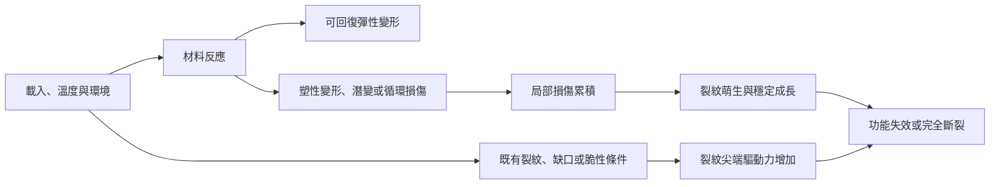
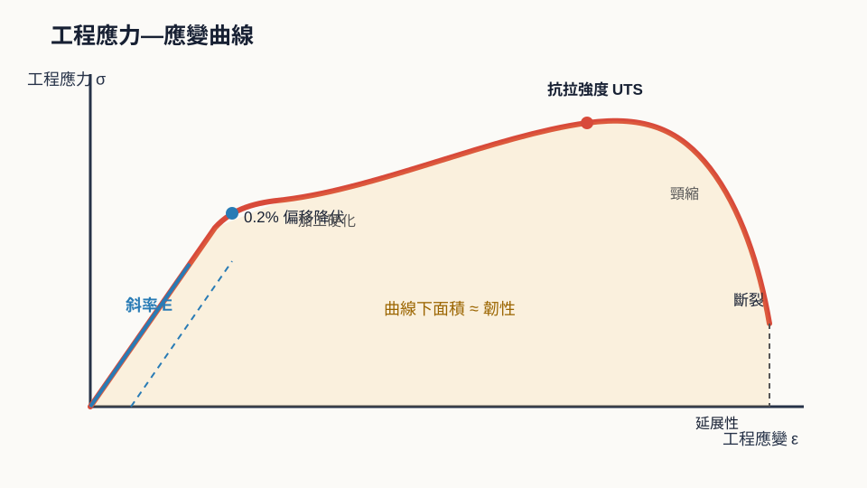
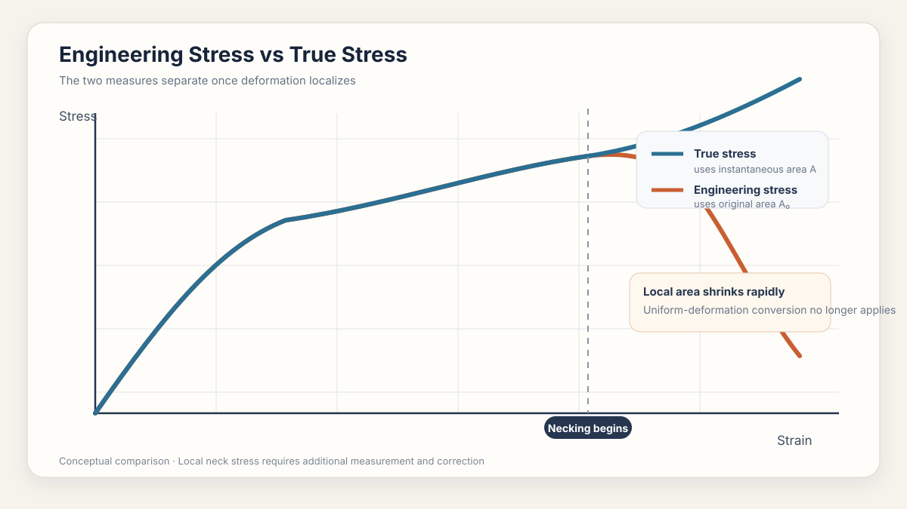
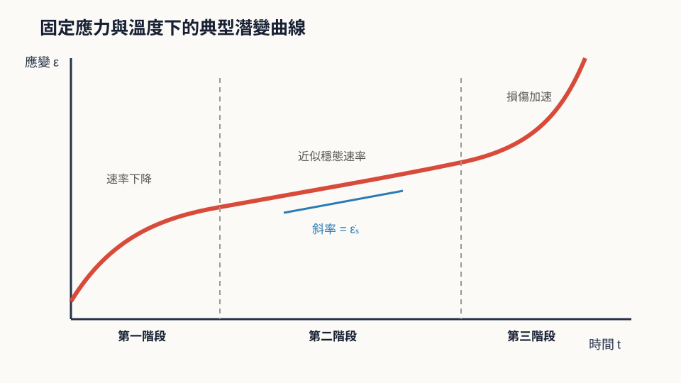
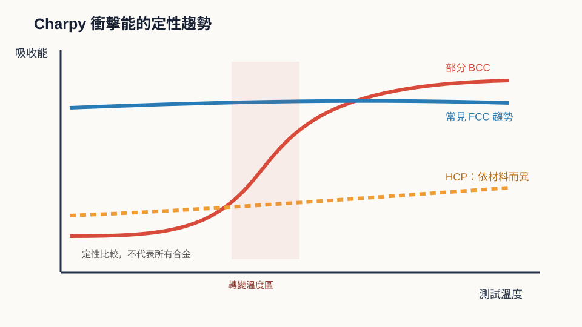
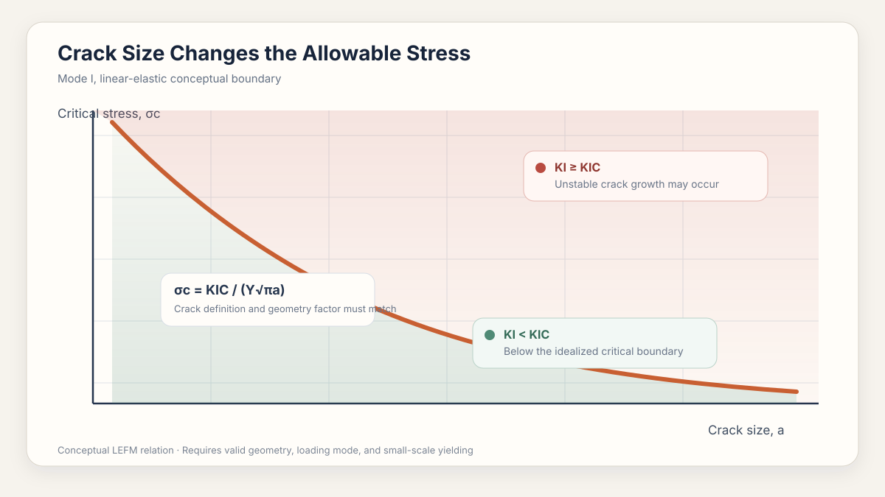
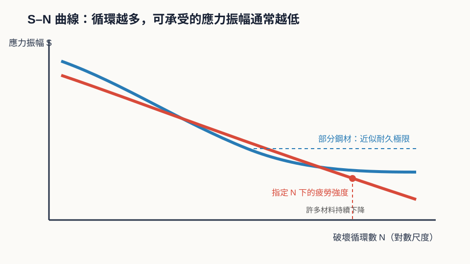
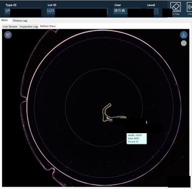
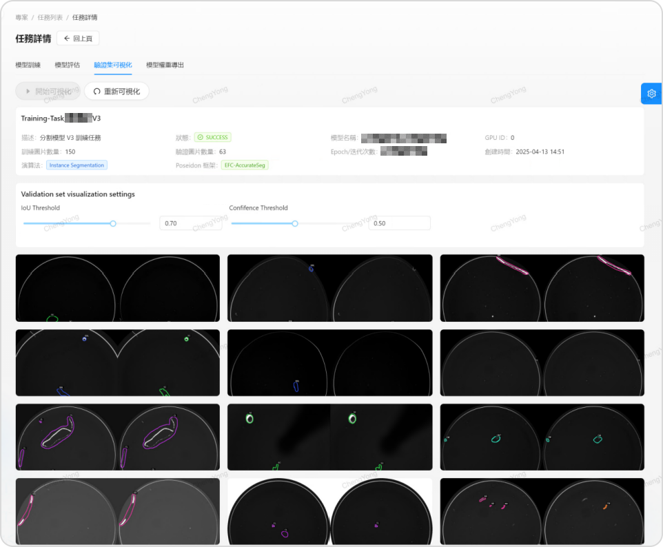

# Mechanical Properties and Failure Evidence

## 材料如何變形、累積損傷與失效

> **Learning Context**
>
> In the industrial inspection projects I have worked on, labels such as scratch, crack, particle, and pattern anomaly were used for screening, localization, measurement, and traceability. They were useful operational categories. But they did not automatically identify a failure mechanism.
>
> I studied mechanical properties and failure to understand what additional evidence would be needed before a visible feature could be connected to yielding, creep, brittle fracture, fatigue, thermal cycling, or another material mechanism. The purpose is not to make AOI a substitute for failure analysis. It is to clarify what the inspection system can measure, what remains a hypothesis, and when material or process verification is required.

## English Summary

This chapter examines what a visible defect can and cannot reveal about mechanical failure. Starting from tensile behavior, I connect stress–strain response with creep, impact, fracture toughness, and fatigue while keeping the assumptions behind each test and equation visible.

The inspection examples come from anonymized glass-wafer and contact-lens work. Scratch segmentation can locate a feature and estimate its visible surface length. But that value is not automatically the crack size used in fracture mechanics. Depth, tip geometry, loading, residual stress, and material toughness are still missing.

The practical result is a clearer evidence chain: AOI observation, failure hypothesis, and verified root cause should be recorded separately. That distinction matters.

---

## 1. 為什麼整理這個主題？

這一篇主要整理一個問題：**材料受到不同形式的載入後，如何產生永久變形、逐步累積損傷或突然失效，而檢測結果又能支持哪些判斷？**

拉伸、潛變、衝擊、斷裂和疲勞看起來是不同的主題，不過它們都在描述材料如何回應外力、溫度與時間。比起單獨記住每一條曲線，更需要分清楚量測值代表哪一種材料行為、測試條件如何限制結果的解讀，以及目前看到的是失效原因、損傷結果，還是仍然需要進一步驗證的線索。

失效也不一定等於零件完全斷裂。永久變形、剛性下降、尺寸漂移或表面裂紋，只要使元件無法維持原本功能，就已經構成功能性失效。

## 2. 從載入條件到材料反應

材料受力後可能只產生可回復的彈性變形，也可能因為塑性變形、潛變或循環載入而逐漸累積損傷。因此在整理失效過程時，不能只使用一條固定路徑，而是需要先區分材料可能產生的反應：

在正常範圍內，彈性變形本身並不等於材料已經受到損傷，因為卸載後材料仍可以大致回復原狀。不過這張流程圖仍然只是一個簡化模型，例如脆性材料可能在幾乎沒有可見塑性變形的情況下斷裂，高溫元件可能在長時間受力後累積潛變應變，而循環載入也可能在名義應力低於降伏強度時形成疲勞裂紋。因此這張圖適合用來整理不同階段的證據，但不能視為所有材料都會依序經過的固定流程。

因此，判讀失效時至少需要一起確認四類條件：

| 條件 | 需要確認的內容 |
| --- | --- |
| 材料 | 材料種類、微觀組織、缺陷與表面狀態 |
| 載入 | 拉伸、壓縮、剪切、衝擊或循環載入 |
| 環境 | 溫度、腐蝕介質、濕度與真空條件 |
| 時間 | 瞬間載入、持續載入、循環次數與載入歷史 |

## 3. 如何解讀拉伸曲線？

拉伸試驗將試片沿單軸方向拉伸，並記錄載荷與伸長量。為了比較不同尺寸的試片，通常先轉換成工程應力與工程應變。ASTM E8/E8M 的範圍也提醒了一項限制：標準試片量到的強度與延展性，不一定能完整代表成品在不同環境中的實際行為。

$$\sigma_{\mathrm{eng}}=\frac{P}{A_0}$$

$$\varepsilon_{\mathrm{eng}}=\frac{L-L_0}{L_0}=\frac{\Delta L}{L_0}$$

其中 $P$ 為載荷，$A_0$ 為原始截面積，$L_0$ 為原始標距長度。

> 圖 1：作者依個人課程筆記重新整理；圖中標示工程應力—應變曲線的線性彈性區、降伏、加工硬化、極限抗拉強度、頸縮與斷裂位置。

典型延性金屬的工程應力—應變曲線可以分成：

1. **線性彈性區**：卸載後大致回復原始形狀，初始線性斜率為彈性模數 $E$。
2. **降伏與塑性變形**：開始留下永久應變；沒有明顯降伏點時，常使用 $0.2\%$ 偏移法定義降伏強度。
3. **加工硬化**：對許多晶體金屬而言，塑性變形會增加差排交互作用，使後續變形需要更高應力。
4. **極限抗拉強度**：工程應力到達最大值。
5. **頸縮與斷裂**：變形集中在局部區域，工程應力下降，最後斷裂。

UC Davis 課程以「Big Four」整理彈性模數、降伏強度、抗拉強度與延展性，接著再將韌性列為第五項重要性質。這種分類的實用之處，是可以先用同一條曲線區分四個不同問題：

| 性質 | 從曲線如何取得 | 回答的問題 |
| --- | --- | --- |
| 彈性模數 $E$ | 初始線性區斜率 | 材料有多不容易產生彈性變形？ |
| 降伏強度 $\sigma_y$ | 開始明顯塑性變形的應力 | 何時開始留下永久變形？ |
| 抗拉強度 $\sigma_{\mathrm{UTS}}$ | 工程應力最大值 | 拉伸過程可承受的最大工程應力是多少？ |
| 延展性 | 斷裂伸長率或斷面收縮率 | 斷裂前可以累積多少塑性變形？ |

這四個量不能互相替代。彈性模數高不代表降伏強度一定較高，抗拉強度高也不代表材料在斷裂前能吸收較多能量。如果只使用「比較硬」或「比較強」描述材料，很容易將剛性、降伏和破壞等原本不同的設計條件混在一起。

### 簡單例題：由載荷與伸長量計算工程應力、應變

假設試片的原始截面積為 $50\ \mathrm{mm^2}$，原始標距長度為 $50\ \mathrm{mm}$。當載荷為 $10\ \mathrm{kN}$ 時，標距增加 $0.05\ \mathrm{mm}$。

工程應力為：

$$\sigma_{\mathrm{eng}}=\frac{10\,000\ \mathrm N}{50\ \mathrm{mm^2}}=200\ \mathrm{MPa}$$

工程應變為：

$$\varepsilon_{\mathrm{eng}}=\frac{0.05}{50}=0.001$$

若這一點仍位於線性彈性區，則彈性模數可估算為：

$$E=\frac{\sigma}{\varepsilon}=\frac{200\ \mathrm{MPa}}{0.001}=200\ \mathrm{GPa}$$

這個結果接近鋼的典型數量級。除了完成計算外，還需要檢查單位和物理趨勢是否合理；如果得到遠低於一般金屬的數值，就應該回頭確認截面積、伸長量和單位換算。

> **Engineering Takeaway**
>
> A calculated value should be checked against its physical scale, units, specimen assumptions, and loading regime. Correct algebra does not guarantee a meaningful engineering interpretation.

### 3.1 剛性、強度、延展性與拉伸韌性

這四個名詞描述不同面向：

- **剛性（stiffness）**：抵抗彈性變形的能力，主要由彈性模數表示。
- **強度（strength）**：抵抗降伏或斷裂的能力，需要說明指的是降伏強度、抗拉強度或其他定義。
- **延展性（ductility）**：斷裂前能承受的塑性變形程度。
- **拉伸韌性（tensile toughness）**：在單軸拉伸試驗的脈絡下，應力—應變曲線至斷裂前的面積可視為材料吸收的應變能密度。

拉伸韌性同時受到強度和延展性影響。材料即使具有較高的強度，如果在斷裂前幾乎沒有塑性變形，也不一定具有較高的拉伸韌性；相反地，能夠大幅伸長但承受應力很低的材料，也不一定能吸收最多能量。因此曲線面積可以幫助理解拉伸條件下的 work to fracture，但不能直接延伸成所有載入形式和試片條件都能共用的韌性數值。

較容易混淆的是：拉伸曲線面積代表的韌性、Charpy 試驗量到的衝擊吸收能，以及斷裂力學中的 $K_{\mathrm{IC}}$，三者的測試方式、單位與適用問題不同。它們都和材料抵抗破壞有關，不過不能因此直接視為同一個材料常數。

### 3.2 工程應力與真應力

工程應力始終使用原始截面積 $A_0$，真應力則使用當下截面積 $A$：

$$\sigma_{\mathrm{eng}}=\frac{P}{A_0},\qquad \sigma_{\mathrm{true}}=\frac{P}{A}$$

在頸縮發生前，若變形近似均勻且材料體積近似不變，可使用：

$$\sigma_{\mathrm{true}}=\sigma_{\mathrm{eng}}(1+\varepsilon_{\mathrm{eng}})$$

$$\varepsilon_{\mathrm{true}}=\ln(1+\varepsilon_{\mathrm{eng}})$$

> 圖 2：作者依個人課程筆記重新整理；頸縮發生後，工程應力因仍使用原始截面積計算而下降，真應力則反映局部截面持續縮小的影響。

工程應力在極限抗拉強度後下降時，很容易直接解讀成材料本身突然變弱。實際上，頸縮後截面積快速縮小，載荷與局部面積同時改變；工程應力仍用固定的 $A_0$ 計算，因此無法直接反映頸縮區的局部狀態。對許多延性金屬而言，真應力可在頸縮後繼續上升到接近斷裂。

頸縮開始後，局部應力狀態不再是簡單的單軸拉伸，上面的均勻變形換算式也不再足夠。若要取得較準確的真應力，需要量測局部截面並進一步修正。

## 4. 時間、溫度與潛變

潛變（creep）是材料在持續應力下，應變隨時間增加的現象。它通常在較高同系溫度下特別重要：

$$T_{\mathrm H}=\frac{T}{T_{\mathrm m}}$$

其中溫度需使用絕對溫標。不過，不能以單一固定溫度判斷所有材料是否會潛變；聚合物在室溫附近也可能出現顯著的時間依賴變形。

> 圖 3：作者依個人課程筆記重新整理；圖中比較典型潛變的三個階段，以及潛變速率由下降、近似穩定到快速增加的變化。

典型潛變曲線可分為：

1. **第一階段潛變**：潛變速率逐漸下降。對許多金屬而言，加工硬化或其他微觀結構演化會降低潛變速率；不同材料的主導機制可能不同。
2. **第二階段潛變**：潛變速率近似穩定，硬化與回復機制達到動態平衡。
3. **第三階段潛變**：孔洞、晶界損傷或頸縮逐漸發展，有效截面減少，應變速率加快直到破壞。

在穩態潛變且主導機制未改變的有限應力與溫度範圍內，潛變速率常以 Norton–Arrhenius 型經驗關係表示：

$$\dot{\varepsilon}_{s}=A\sigma^n\exp\left(-\frac{Q_c}{RT}\right)$$

其中 $A$ 與 $n$ 依材料與機制而定，$Q_c$ 為潛變活化能。這個式子顯示應力與溫度都會顯著改變潛變速率。

### Arrhenius 外推的限制

如果已經在幾個較高溫度下量到潛變速率，可以利用 Arrhenius 關係估算較低溫度下的長期行為。不過這種外推成立的前提，是外推範圍內仍然由相同的潛變機制控制。當溫度改變時，差排攀移、擴散、晶界滑移或微觀組織演化的主導關係也可能跟著改變，此時原本擬合得到的直線就不再可靠。

因此在進行長期壽命預測時，不能只看回歸線是否擬合良好，還需要確認主導機制和材料狀態是否保持一致。這也是使用資料模型進行預測時，仍然需要回到材料機制進行檢查的原因。

## 5. 衝擊、裂紋與斷裂韌性

### 5.1 延性—脆性轉變與 Charpy 衝擊試驗

延性破壞通常伴隨明顯塑性變形與較多能量吸收，脆性破壞則可能在變形很小時快速發生。破壞模式不只由材料名稱決定，溫度、應變速率、缺口、厚度與微觀組織都會改變結果。

Charpy 衝擊試驗以擺錘撞擊帶缺口試片，根據撞擊前後的能量差估算試片吸收的衝擊能。ASTM E23 規範的是金屬缺口試片的 Charpy 與 Izod 衝擊測試，因此這裡不把結果延伸成所有材料與幾何條件下都通用的韌性。對部分 BCC 金屬與鋼材而言，吸收能會在一段溫度範圍內快速下降，形成延性—脆性轉變。

> 圖 4：作者依個人課程筆記重新整理；圖中定性比較不同晶體結構材料的衝擊吸收能隨溫度變化的趨勢，其中部分 BCC 金屬具有較明顯的延性—脆性轉變區。

這張圖只表示常見定性趨勢：

- 部分 BCC 金屬具有明顯的轉變溫度區；
- FCC 金屬通常不呈現同樣尖銳的轉變，但不代表任何條件下都不會脆性破壞；
- HCP 材料因可用滑移系統與織構等因素，行為需要依合金與測試條件判斷。

Charpy 結果適合比較材料在指定試片與測試條件下的衝擊行為，但不能直接等同於裂紋尖端的斷裂韌性。

### 5.2 斷裂韌性與臨界裂紋

只看名義應力是否超過降伏或抗拉強度，無法完整處理已經含有裂紋的零件。斷裂力學進一步考慮的是：材料中如果已經存在裂紋，裂紋尖端的局部應力場是否會使它快速成長？

在線彈性斷裂力學的 Mode I 張開模式下，應力強度因子可寫成：

$$K_{\mathrm I}=Y\sigma\sqrt{\pi a}$$

其中：

- $Y$：幾何修正因子；
- $\sigma$：遠場名義應力；
- $a$：依幾何定義的裂紋尺寸。

當試片厚度、裂紋與載入條件滿足線彈性和平面應變要求時，材料抵抗裂紋成長的臨界值記為 $K_{\mathrm{IC}}$。ASTM E399 也將它限定在具有尖銳裂紋、裂紋尖端塑性區相對較小且高拘束的條件下。簡化判斷為：

$$K_{\mathrm I}\geq K_{\mathrm{IC}}$$

> 圖 5：作者依個人課程筆記重新整理；工作應力或裂紋尺寸增加時，應力強度因子會提高，達到材料的斷裂韌性後，裂紋可能失穩成長。

這裡的裂紋尺寸 $a$ 具有明確的幾何定義，不能直接用 AOI 量到的表面 scratch 長度代替。實際判斷前，仍然需要確認該特徵是否具有尖銳裂紋前緣、深度與三維幾何、相對於載荷的方向、載入模式、局部與殘留應力，以及材料在實際條件下的斷裂韌性。表面可見長度可以作為幾何證據，不過它本身不是完整的斷裂力學輸入。

> **Engineering Takeaway**
>
> A visible scratch length is not automatically the crack size used in fracture mechanics. Depth, tip geometry, orientation, loading mode, residual stress, and material toughness must still be established.

### 簡單例題：估算臨界裂紋尺寸

假設：

$$K_{\mathrm{IC}}=50\ \mathrm{MPa\sqrt m},\qquad \sigma=200\ \mathrm{MPa},\qquad Y=1$$

由：

$$a_c=\frac{1}{\pi}\left(\frac{K_{\mathrm{IC}}}{Y\sigma}\right)^2$$

可得：

$$a_c=\frac{1}{\pi}\left(\frac{50}{200}\right)^2\ \mathrm m\approx0.020\ \mathrm m$$

也就是約 $20\ \mathrm{mm}$。這個數值只適用於題目設定的理想幾何；若裂紋位於表面、幾何因子不同，或材料出現顯著塑性區，計算方式都需要調整。實際工程允許裂紋尺寸通常還要顯著低於理論臨界值，並考慮安全係數、量測誤差、殘留應力、載荷變動與裂紋幾何的不確定性。

這個例題也顯示，臨界裂紋尺寸並不是一個固定常數。相同材料在承受較高工作應力時，可以容許的裂紋尺寸會更小；同一條裂紋如果位於應力集中較嚴重的位置，也可能具有更高的破壞風險。因此即使影像已經量到裂紋長度，仍然不能脫離應力和幾何條件，直接判定零件是否安全。

## 6. 循環載入與疲勞

疲勞（fatigue）是材料在重複或變動載入下逐步累積損傷的現象。即使名義應力低於材料的降伏強度，表面粗糙、缺口或夾雜物附近仍可能產生局部循環滑移，最後形成裂紋。

疲勞失效通常分成：

1. 裂紋萌生；
2. 穩定裂紋成長；
3. 剩餘截面不足以承受載荷時快速斷裂。

> 圖 6：作者依個人課程筆記重新整理；S–N 曲線比較具有近似耐久極限的平台行為，以及疲勞強度隨循環數持續下降的材料。

S–N 曲線以應力振幅 $S$ 對破壞循環數 $N$ 表示疲勞行為。部分鋼材可能出現近似水平的平台，稱為耐久極限；許多鋁合金與其他材料則會隨循環數增加持續下降，因此通常指定某一循環數下的疲勞強度，而不是假設存在真正的無限壽命。

S–N 資料也不能脫離條件單獨使用。平均應力、表面狀態、殘留應力、腐蝕環境、溫度、載入頻率與實際載入順序，都可能改變疲勞壽命。

單張影像中的線狀異常無法證明疲勞。較有力的判斷還需要重複量測中的裂紋成長、循環數與載荷歷史、可能的起裂位置，以及斷口特徵等時間與材料證據。

## 7. 從檢測異常建立失效假設

> 圖 7：作者依個人課程筆記重新整理；從載入與溫度條件出發，將 AOI 可見異常、可能的失效機制，以及仍待材料或製程方法確認的證據分開整理。

檢測影像或感測器訊號通常只能先指出異常位置與變化趨勢。若要進一步判斷失效機制，可以把觀察、可能機制與待驗證證據分開記錄：

| 可見或可量測的現象 | 可能機制 | 還需要確認 |
| --- | --- | --- |
| 永久彎曲或尺寸漂移 | 超過降伏、潛變、熱膨脹失配 | 載入歷史、溫度、殘留應變 |
| 缺口附近快速斷裂 | 脆性破壞、斷裂韌性不足 | 斷口形貌、裂紋尺寸、工作溫度 |
| 表面出現週期性裂紋 | 疲勞、熱循環、局部應力集中 | 循環數、應力振幅、裂紋成長方向 |
| 高溫長時間後孔洞增加 | 潛變損傷、擴散或界面反應 | 時間—溫度紀錄、晶界與截面分析 |
| 影像亮暗或紋理改變 | 表面形貌、薄膜、污染或應力改變 | 多模態影像、材料分析與製程紀錄 |

同一種外觀可能對應不同的材料機制，而相同的機制也可能在不同條件下呈現不同外觀。因此，異常分類適合用來縮小後續調查的範圍，但不能直接取代根因分析。

### 7.1 Project Case: A Visible Contour Is Not Yet a Fracture Assessment

In an automated contact-lens inspection project, several imaging paths covered different regions and focal positions. Segmentation models recorded visible contours, while rule-based checks handled conditions with stable geometric definitions. The default length, width, and area values were measured in pixels. When a user supplied a px-to-mm calibration value, the software could convert them to millimetres.

> Figure 8: An anonymized Path A result at focus 1. The contour and measurements describe the visible image geometry. Internal identifiers and the defect code have been removed.

> Figure 9: A PoseidonAI validation view from the contact-lens segmentation workflow. The left image in each pair is the prediction and the right image is the ground truth. The coloured masks describe visible contours at the selected IoU and confidence thresholds; they do not reveal depth, loading history, or a verified fracture mechanism.

The measurement was useful. It supported localization, defect grouping, comparison across inspected samples, and the selection of regions for closer review. But it was not a fracture assessment. The model had no access to depth or loading history.

Studying fracture mechanics changed how I interpret that output. A segmented surface length is not automatically the crack dimension $a$ used in a stress-intensity calculation. The image alone does not establish whether the feature is a superficial scratch or a structural crack, whether it has a sharp crack tip, or how it is oriented relative to applied and residual stresses. Loading mode, geometry factor, crack depth, and material toughness are still missing.

A more defensible workflow separates the evidence into four levels:

| Level | Available information |
| --- | --- |
| Optical evidence | Location, visible length, width, orientation, and contrast |
| Geometric hypothesis | Superficial scratch, groove, surface crack, or film feature |
| Mechanical assessment | Local stress, crack depth, loading mode, geometry factor, and material toughness |
| Verified decision | Supported by metrology, sectioning, process records, or mechanical testing |

Better segmentation improves the first level. It does not complete the remaining three.

> **Project Connection: A Crack Label Is an Inspection Category**
>
> In a separate automated contact-lens inspection project, production labels included scratches, crack marks, cracked lenses, edge roughness, bubbles, and foreign material. Multiple illumination conditions, AI models, and rule-based measurements were combined to screen these conditions consistently.
>
> Here, “cracked lens” was an operational acceptance category. It indicated what the inspection system should reject and where an operator should review the image; it did not establish the loading history or fracture mechanism. That distinction is easy to lose when a label already sounds like an engineering diagnosis.

## 8. Measurement Boundary Note: From a Visible Line to a Failure Claim

Mechanical-failure analysis can involve stress–strain curves, temperature and cycle histories, equipment signals, inspection images, process records, and follow-up characterization. Industrial AI can help extract curve features, segment visible damage, compare distributions, and identify changes across repeated measurements. Image appearance alone, however, rarely distinguishes creep, fatigue, brittle fracture, process contamination, and an imaging artifact.

The data model should preserve the boundary between observation and explanation. For an AOI record, that means retaining the image scale, camera and illumination path, inspection recipe, process step, wafer or batch relationship, review result, and any available loading or thermal history. A bounding box is not physical geometry: one long scratch may be split into several boxes, while one particle box may contain several nearby objects. Segmentation may give a better visible contour, but it still does not reveal depth.

I would therefore record three different fields instead of placing everything in one defect label:

1. **AOI evidence**: what the image or sensor measured;
2. **failure hypothesis**: which mechanisms remain plausible and why;
3. **verified root cause**: what was supported by process records, material characterization, or testing.

This is the distinction I want the dataset to preserve. And when a required field is unavailable, that absence should also be recorded rather than silently replaced by an assumption.

## 9. What the Current Measurement Can and Cannot Support

A visible defect used to enter my workflow mainly as a classification and localization problem: acquire the image, define the label, then improve precision, recall, or inference time. Those tasks still matter. Mechanical behavior adds another layer, because similar line-shaped features can come from different loading histories, while the same mechanism may look different under another illumination or imaging condition.

This changed how I think about inspection records. Defect labels and bounding boxes are useful operational outputs, but they are not sufficient descriptions of an engineering mechanism. Process stage, temperature exposure, possible contact location, spatial pattern, batch relationship, and later verification should be linked when they are available. The missing information matters too.

The practical change is simple: AOI evidence, a failure hypothesis, and a verified root cause should not be stored as if they were the same conclusion. AI can help establish the first and organize the second. The third still needs material, process, or experimental evidence.

## 10. Failure Terms I Need to Keep Separate

1. **Stiffness is not strength.** Elastic modulus describes resistance to elastic deformation; strength requires a specified yielding or failure condition.
2. **Tensile strength is not fracture toughness.** A cracked component may fail below its nominal tensile strength.
3. **A drop in engineering stress does not prove that local true stress has fallen.** Necking changes the local cross-section and stress state.
4. **High temperature is only part of a creep condition.** Homologous temperature, time, stress, material state, and the active mechanism must also be considered.
5. **Charpy impact energy is not $K_{\mathrm{IC}}$.** The specimens, units, and mechanical meanings are different.
6. **The absence of a sharp transition in an FCC material does not guarantee ductile behavior under every condition.**
7. **Not every material has a fatigue limit.** For materials without a plateau, fatigue strength should be reported at a specified number of cycles.
8. **An AI-detected anomaly is not a verified cause.** Mechanism assessment still needs evidence about the material, loading, environment, and time.

這一章先停在拉伸行為、潛變、衝擊、斷裂韌性與疲勞。Paris law、多軸疲勞、黏彈性模型和有限元素分析都還沒有展開。這不是因為它們不重要，而是目前的影像案例連裂紋深度、載入與邊界條件都不完整，直接使用更複雜的模型不會讓結論自動變可靠。

目前比較實際的做法，是先把可見長度、寬度、方向和對比記錄好，再明確寫下缺少的機械證據。量得更精細，和知道它為什麼失效，是兩件事。

## References

- UC Davis / Coursera, [Materials Science: 10 Things Every Engineer Should Know](https://www.coursera.org/learn/materials-science)
- ASTM International, [ASTM E8/E8M-21: Standard Test Methods for Tension Testing of Metallic Materials](https://store.astm.org/e0008_e0008m-21.html)
- ASTM International, [ASTM E23-23: Standard Test Methods for Notched Bar Impact Testing of Metallic Materials](https://store.astm.org/e0023-23.html)
- ASTM International, [ASTM E399: Standard Test Method for Linear-Elastic Plane-Strain Fracture Toughness of Metallic Materials](https://store.astm.org/standards/e399)
- J. F. Shackelford, *Introduction to Materials Science for Engineers*, 8th ed.
