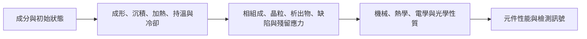

# Processing, Phase Transformations, and Material Performance

## 製程、相變與材料性能：時間—溫度路徑如何留下可觀察的結果

> **Learning Context**
>
> In inspection work, I usually see a material only after several upstream steps have already changed its surface, geometry, interfaces, or internal state. That history is easy to miss. The image may reflect the material, the process route, or the way the signal was acquired.
>
> I studied phase diagrams and transformation kinetics to understand what may have happened before inspection. The question is not whether an AOI pattern “looks like” a phase change. It is what process and material evidence would be needed before connecting a repeated signal with composition, thermal history, phase composition, or microstructure.

## English Summary

This chapter follows a processing route into a material state. Composition and the initial condition define the available transformation paths; the time–temperature history influences which ones occur and how far they proceed. Binary phase diagrams identify equilibrium phases, and the lever rule estimates their fractions. A simplified TTT diagram for eutectoid steel then adds kinetics.

The two diagrams answer different questions. A phase diagram shows what is stable near equilibrium. A TTT diagram shows what may form along a specified isothermal path.

For inspection work, a repeated image pattern may correlate with a batch or process step. But the image does not reveal phase or microstructure by itself. Process history, material characterization, and controlled comparison are still needed.

---

## 1. 這一章要整理的問題

前幾章從鍵結、晶體結構、缺陷和機械性質逐步理解材料行為。不過即使材料成分相同，只要經歷的加熱、持溫、冷卻或加工方式不同，最後形成的相、晶粒、析出物和殘留應力也可能不同。因此，材料性質不能只被理解成材料名稱旁邊的一組固定數值。

這一章主要整理一個問題：**製程與熱歷史如何改變材料的相組成和微觀組織，並進一步影響性能與檢測結果？**

> 圖 1：作者依個人課程筆記設計並重新整理；相同成分的材料經過慢冷、等溫停留或快速淬火後，可能形成不同的微觀組織。

這條關係可以先簡化成：

這張圖不是單向且不可逆的固定流程。製程設備、環境和量測方法也可能改變最後觀察到的訊號；檢測結果則可以回頭協助比較批次和製程條件，但不能直接取代相鑑定或微觀組織分析。

## 2. 相、組織與材料狀態並不是同一件事

閱讀相圖以前，需要先把幾個常被混用的詞分開：

| 名詞 | 這一章中的意思 | 例子 |
| --- | --- | --- |
| 成分（composition） | 材料中各元素或組成分的比例 | $0.76\ \mathrm{wt\%C}$ 的共析鋼 |
| 相（phase） | 具有相對均勻成分、結構和性質的區域 | 奧氏體、鐵素體、滲碳體 |
| 相分率（phase fraction） | 各相在材料中所占的比例 | $W_\alpha$、$W_\beta$ |
| 微觀組織（microstructure） | 各相、晶粒與缺陷的尺寸、形狀、分布和排列 | 粗波來鐵、細波來鐵、貝氏體 |
| 材料狀態（material state） | 成分、相、組織、殘留應力和製程歷史的綜合結果 | 退火、淬火或回火後的鋼 |

其中最容易混淆的是「相」和「微觀組織」。一開始看到波來鐵、貝氏體和麻田散鐵並列時，很容易把它們都當成相的名稱；不過波來鐵（pearlite，也常稱珠光體）其實是鐵素體與滲碳體形成的層狀混合組織。即使兩塊材料含有相同的兩個相，只要比例、尺寸和分布不同，機械性質仍可能出現明顯差異。

## 3. 相圖能回答什麼？

相圖將溫度、成分和穩定相的關係整理成一張地圖。對固定壓力下的二元合金，相圖通常以溫度為縱軸、成分為橫軸。

> 圖 2：作者依個人課程筆記重新整理；這是一張通用的簡化共晶相圖，標示液相、兩相區、共晶點、等溫連線，以及槓桿定則需要使用的三個成分位置。

### 3.1 基本讀圖語言

- **液相線（liquidus）**：線以上為完全液態；冷卻穿過此線時，第一批固相開始形成。
- **固相線（solidus）**：線以下為完全固態；冷卻穿過此線時，最後一部分液體完成凝固。
- **溶解度線（solvus）**：分隔單一固溶體和兩個固相共存區。
- **單相區**：指定溫度與成分下只存在一個平衡相。
- **兩相區**：兩個相同時存在，例如 $L+\alpha$ 或 $\alpha+\beta$。
- **等溫連線（tie line）**：在兩相區畫出的水平線，用來讀取兩個相各自的成分。

實際讀圖時，我會依序確認：

1. 在橫軸找到材料總成分 $C_0$。
2. 在縱軸找到溫度 $T$。
3. 判斷交點位於單相區或兩相區。
4. 若位於兩相區，畫出等溫連線。
5. 由連線兩端讀取各相成分。
6. 若需要相比例，再使用槓桿定則。

相圖可以回答「在接近平衡的條件下，哪些相較穩定」。它通常不能單獨回答相變需要多久、晶粒多大、各相如何排列，也不能保證快速冷卻後仍然得到平衡組織。

## 4. 簡單例題：使用槓桿定則估算相比例

假設某二元合金位於 $\alpha+\beta$ 兩相區，等溫連線讀到：

$$C_\alpha=20\ \mathrm{wt\%B},\qquad C_0=40\ \mathrm{wt\%B},\qquad C_\beta=80\ \mathrm{wt\%B}$$

則 $\alpha$ 相分率為：

$$W_\alpha=\frac{C_\beta-C_0}{C_\beta-C_\alpha}
=\frac{80-40}{80-20}
=\frac{2}{3}$$

$\beta$ 相分率為：

$$W_\beta=\frac{C_0-C_\alpha}{C_\beta-C_\alpha}
=\frac{40-20}{80-20}
=\frac{1}{3}$$

檢查結果：

$$W_\alpha+W_\beta=1$$

這個例題最需要避免的錯誤，是把距離放在相同一側。$\alpha$ 相的比例要使用靠近 $\beta$ 端的線段，$\beta$ 相則使用靠近 $\alpha$ 端的線段。除了檢查兩者相加是否為 $1$，也可以先看總成分比較靠近哪一端，確認比例的大小關係是否合理。

這裡的橫軸使用重量百分比，因此計算結果是近似重量分率。如果相圖以原子百分比表示，分率的基準也會跟著改變；若需要體積分率，還要考慮各相密度並進一步換算。這項計算也假設材料位於指定溫度的兩相平衡區。

> **Engineering Takeaway**
>
> The lever rule estimates equilibrium phase fractions at a specified temperature and composition. The fraction basis follows the composition axis. It does not predict morphology, grain size, transformation time, or final performance.

## 5. 共晶與共析：起始相不同

共晶和共析的名稱相近，但起始狀態不同：

| 反應 | 一般形式 | 起始相 | 生成結果 |
| --- | --- | --- | --- |
| 共晶（eutectic） | $L\rightarrow\alpha+\beta$ | 一個液相 | 兩個固相 |
| 共析（eutectoid） | $\gamma\rightarrow\alpha+\beta$ | 一個固相 | 兩個固相 |

UC Davis 課程使用鉛—錫或錫—鉍型的共晶相圖說明緩慢凝固。以歷史上常用，也經常作為教材範例的鉛—錫焊料為例，共晶反應約發生在 $183^\circ\mathrm C$ 與 $61.9\ \mathrm{wt\%Sn}$：

$$L\rightarrow\alpha+\beta$$

對偏離共晶成分的合金，冷卻時通常會先形成初生相，再由剩餘液體形成共晶組織。液相與固相共存的溫度區間會影響材料的流動、凝固和接頭形成。不過實際電子製造還會受到焊料系統、氧化、潤濕、加熱曲線和界面反應影響，不能只用一張二元平衡相圖判斷接頭品質。

鋼中的共析反應則完全發生在固態。以亞穩定鐵—滲碳體系統的近似共析成分為例：

$$\gamma\rightarrow\alpha+Fe_3C$$

其中：

- $\gamma$：奧氏體，FCC 結構；
- $\alpha$：鐵素體，BCC 結構；
- $Fe_3C$：滲碳體。

共析成分與溫度常近似寫為 $0.76\ \mathrm{wt\%C}$ 和 $727^\circ\mathrm C$。實際數值會依採用的相圖版本和合金元素而略有差異，因此這裡主要用來建立讀圖概念。

## 6. 為什麼還需要時間？

平衡相圖主要回答穩定狀態，但實際熱處理還包含加熱速度、持溫時間和冷卻路徑。當材料降到相變溫度以下時，會同時出現兩個方向相反的影響：

1. **熱力學驅動力增加**：過冷程度增加後，原相與新相之間的自由能差通常變大。
2. **原子擴散變慢**：溫度降低後，原子進行長距離移動的能力下降。

可以用前一章的 Arrhenius 關係理解第二點：

$$D=D_0\exp\left(-\frac{Q_d}{RT}\right)$$

接近平衡轉變溫度時，擴散速度較快，但形成新相的驅動力較小；溫度很低時，驅動力雖然增加，擴散卻可能慢到無法在有限時間內完成。兩者競爭，使擴散型相變常在某個中間溫度最快。

這也是 TTT 圖出現 C 形轉變曲線和「鼻尖」的原因。擴散快不代表相變一定快，驅動力大也不代表原子能及時完成重新分布。

## 7. TTT diagram：把等溫保持時間加入判斷

TTT（Time–Temperature–Transformation）圖描述材料先快速降至指定溫度，再在該溫度等溫保持時，相變何時開始、何時完成，以及可能形成什麼組織。

> 圖 3：作者依個人課程筆記重新整理；這張共析鋼 TTT 示意圖比較高溫等溫形成波來鐵、較低溫等溫形成貝氏體，以及快速降至 $M_s$ 以下形成麻田散鐵的路徑，不能用來讀取特定鋼材的工業處理參數。

### 7.1 波來鐵

共析奧氏體在較高溫度進行擴散型轉變時，碳需要從形成鐵素體的區域移向滲碳體，最後形成鐵素體與滲碳體交替排列的波來鐵。

- 較高轉變溫度：擴散距離較長，通常形成較粗的層片。
- 較低轉變溫度：成核位置增加、擴散距離縮短，通常形成較細的層片。

細波來鐵通常比粗波來鐵具有較高的強度和硬度，但具體性質仍受到成分、層片間距和先前奧氏體狀態影響。

### 7.2 貝氏體

在波來鐵轉變溫度以下、麻田散鐵開始溫度以上進行等溫轉變，可以形成貝氏體。它同樣包含鐵素體與碳化物，不過形態不是規則的波來鐵層片。

貝氏體常被描述為具有較好的強度與韌性組合，但上貝氏體、下貝氏體和不同合金中的碳化物分布並不相同，因此不適合只用單一性質標籤概括。

### 7.3 麻田散鐵

如果冷卻速度足夠快，使奧氏體避開擴散型轉變曲線並降至麻田散鐵開始溫度 $M_s$ 以下，便可能形成麻田散鐵：

$$\gamma\ (\mathrm{FCC})\rightarrow\text{martensite}\ (\mathrm{BCT\text{-}like\ in\ carbon\ steels})$$

更精確地說，主要是鐵晶格產生協同剪切式轉變；碳原子來不及長距離擴散，被困在新的晶格間隙中，使晶格產生明顯扭曲。這種結構會強烈阻礙差排移動，因此未回火麻田散鐵通常具有高硬度和高強度，但延性、韌性和殘留應力需要特別留意。

在含碳鋼中，麻田散鐵通常以過飽和的 BCT 結構描述；碳含量較低時，四方畸變可能不明顯。它和波來鐵、貝氏體的擴散型相變不同，通常被視為近似無擴散、非熱活化的轉變。降至 $M_s$ 以下後，轉變量主要受到溫度下降程度、成分和原始奧氏體狀態控制，而不是單純延長等溫保持時間。

$M_s$ 不是所有鋼都相同的固定溫度。它會受到碳含量、合金元素和奧氏體狀態影響；冷卻至室溫後，也可能保留部分未轉變的奧氏體。

## 8. 三條熱處理路徑的簡單比較

假設同一批共析鋼先加熱至奧氏體區，再採用不同路徑：

| 路徑 | 路徑類型 | 可能組織 | 判讀重點 |
| --- | --- | --- | --- |
| 爐冷或緩慢連續冷卻 | 連續冷卻，較適合用 CCT 理解 | 以粗波來鐵為主 | 接近平衡，但仍受到實際冷卻速率影響 |
| 快速降至較高轉變溫度後等溫保持 | TTT 等溫路徑 | 粗或細波來鐵 | 溫度影響成核、擴散距離與層片間距 |
| 快速降至較低轉變溫度後等溫保持 | TTT 等溫路徑 | 貝氏體 | 需要讀取轉變開始與完成時間 |
| 淬火至 $M_s$ 以下 | 近似無擴散轉變 | 麻田散鐵與可能的殘留奧氏體 | 組織比例與降至的溫度、成分和初始狀態有關 |

這個比較說明，即使材料最後都回到室溫，微觀組織也不一定相同。只記錄最終溫度，會遺漏真正控制結果的時間—溫度路徑。

### TTT 與 CCT 不能直接互換

TTT 圖假設材料快速到達指定溫度後等溫保持；一般工業熱處理則經常持續冷卻，因此 CCT（Continuous Cooling Transformation）圖通常更接近實際冷卻過程。

TTT 圖仍然很有價值，因為它能把相變的時間尺度、轉變溫度與產物清楚分開。不過實際使用時，需要確認圖表對應的合金成分、先前奧氏體化條件、晶粒尺寸與量測方法，不能把一張共析鋼示意圖直接套用到其他鋼材。

## 9. Applied Reflection: Process History Is Not the Same as an Inspection Recipe

In a six-month on-site wafer-inspection assignment, I worked with trigger timing, wafer motion, multiple camera streams, ROI and template settings, inspection recipes, result aggregation, and history review. The records available to me mainly described the inspection system. They were useful when a pattern appeared only under a particular configuration or remained fixed in one coordinate system.

Studying phase transformations adds a distinction I did not make clearly enough at the time. An inspection recipe describes how the equipment acquires and evaluates a signal. A manufacturing process recipe describes what the material experienced before it reached the inspection station. The names sound similar (and are easy to mix up in practice), but they answer different questions.

Those records were enough to investigate acquisition and coordinate-related behavior, but they did not reconstruct the wafer’s upstream thermal or material history. If an anomaly changes after an AOI threshold, illumination, or ROI update, the first explanation may belong to the measurement system. If it follows a process step, batch, thermal exposure, or spatial position on the wafer, an upstream material or process hypothesis becomes more reasonable.

But the image still does not identify a phase or microstructure. In that assignment, I did not have diffraction, cross-sectional analysis, or complete thermal-history evidence, so I could not infer a material transformation from the image.

This changes the information I would request during an investigation. I would keep the inspection configuration and manufacturing history as separate records, then compare both with the observed pattern. Otherwise, a stable model output may hide whether the repeated signal came from the material, the process, or the way the image was acquired.

## 10. Connection to Industrial AI: Linking Process Paths with Inspection Evidence

> 圖 4：作者依個人課程筆記設計並重新整理；製程紀錄與 AOI 可以建立重複模式，不過根因仍需要材料分析或受控實驗補上證據缺口。

My platform work already connects dataset management, training configurations, model evaluation, export, and machine-side deployment. In a separate wafer-inspection project, bright-field and dark-field results were combined before defect classification and measurement. These systems preserve useful model and inspection context. They do not, however, reconstruct the material’s upstream process history.

For a material investigation, I would also want the process path to remain visible in the dataset. Depending on the production line, that may include:

- material grade or specification, incoming lot, and initial condition;
- process step, recipe version, and equipment ID;
- temperature profile, hold time, and cooling condition;
- wafer, panel, or batch relationship;
- inspection camera, illumination, scale, and model version;
- follow-up metrology, material characterization, and final disposition.

AI can compare these fields with defect distributions, detect drift, group similar batches, and identify which process variables repeatedly appear with a signal. That is useful. But correlation is not phase identification, and a model feature is not a transformation mechanism.

The gap is fairly specific. Model versions and equipment settings explain how a result was produced, while upstream process steps, thermal exposure, batch genealogy, and later characterization help explain what may have happened to the material. Those fields were not fully available in the projects described here.

For this kind of system, the model should be able to report which recorded process path is associated with an observation and how stable that association is. A verified explanation still needs a physically plausible mechanism and independent evidence.

## 11. What Changed in My Understanding

Before studying phase diagrams, I tended to read a material property as a value attached to a material name. The steel examples made the limitation obvious: after an appropriate and comparable austenitizing condition, the same composition can produce coarse pearlite, fine pearlite, bainite, martensite, or a mixture depending on the subsequent time–temperature path.

The phase diagram also became less universal than it first appeared. It is a map of equilibrium states, not a replay of the actual manufacturing route. TTT and CCT diagrams add kinetics, but they still depend on composition and prior conditions.

For inspection work, this means a repeated visual pattern should be connected with process history before it is given a material explanation. The pattern can be real and repeatable. The mechanism can still be unresolved.

## 12. Working Principles and Boundaries

1. **A phase is not the same as a microstructure.** Pearlite contains ferrite and cementite; its arrangement matters.
2. **A phase diagram is mainly an equilibrium map.** It does not specify transformation time or guarantee the result of rapid processing.
3. **The lever rule estimates phase fractions, not morphology or performance.**
4. **A TTT diagram describes an isothermal path.** Continuous cooling requires a different interpretation and often a CCT diagram.
5. **TTT and CCT diagrams are material-specific.** Composition, austenitizing condition, and grain size can shift the transformation behavior.
6. **Martensite is an approximately athermal, diffusionless lattice transformation.** Carbon is trapped because it cannot complete long-range diffusion during rapid cooling; the transformed fraction mainly follows temperature rather than isothermal holding time.
7. **High hardness is not a complete design target.** Toughness, residual stress, dimensional stability, and service conditions still matter.
8. **An AOI pattern does not identify a phase.** Diffraction, microscopy, sectioning, thermal records, or another material method may still be required.

## 13. Scope and Links to Other Chapters

This chapter uses binary phase diagrams, eutectic and eutectoid reactions, and a simplified eutectoid-steel TTT diagram to connect processing history with microstructure and performance. It does not attempt to cover the full Fe–Fe₃C diagram, precipitation hardening, sintering, polymer processing, ceramic firing, thin-film phase formation, or semiconductor thermal processing in detail.

The steel example is a model for learning how equilibrium and kinetics work together. It should not be transferred directly to silicon wafers or thin films. What carries across is the need to keep composition, initial state, process path, kinetics, and verification as separate parts of the explanation. The final chapter will return to semiconductor conductivity and inspection, then connect the material mechanisms from Chapters 01–06 with the evidence available in an industrial inspection system.

## References

1. James F. Shackelford, [*Materials Science: 10 Things Every Engineer Should Know*](https://www.coursera.org/learn/materials-science), University of California, Davis / Coursera.
2. James F. Shackelford, *Introduction to Materials Science for Engineers*, 8th ed.
3. William D. Callister Jr. and David G. Rethwisch, *Materials Science and Engineering: An Introduction*.
4. University of Cambridge DoITPoMS, [The Lever Rule](https://eng.libretexts.org/Bookshelves/Materials_Science/TLP_Library_II/12%3A_Phase_Diagrams_and_Solidification/12.7%3A_The_Lever_Rule).
5. National Bureau of Standards, [*Heat Treatment and Properties of Iron and Steel*](https://nvlpubs.nist.gov/nistpubs/Legacy/MONO/nbsmonograph88.pdf), NBS Monograph 88.
