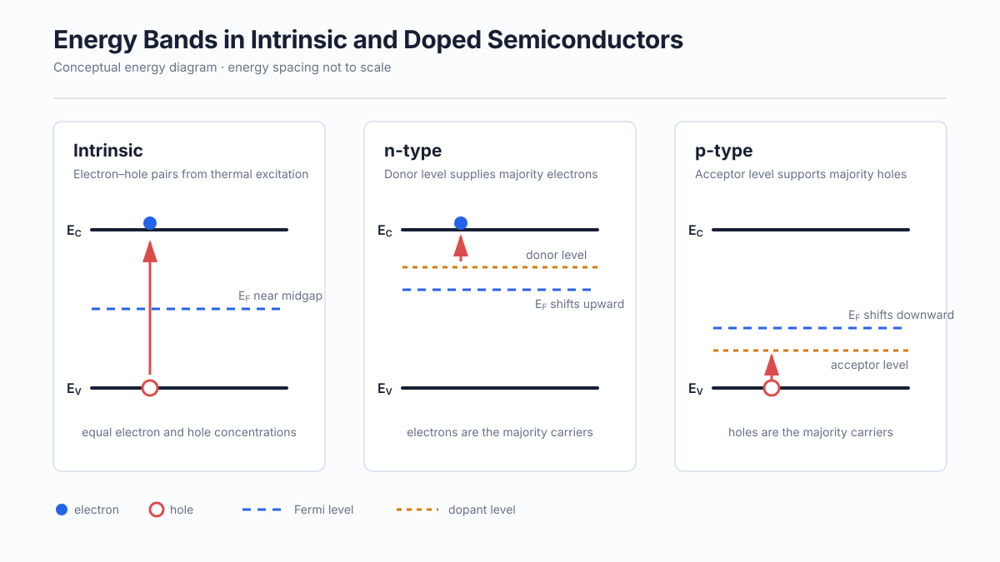
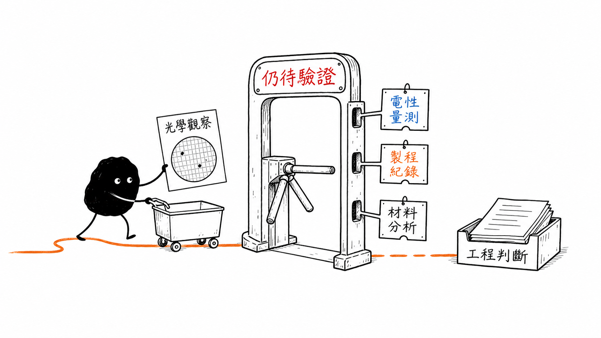
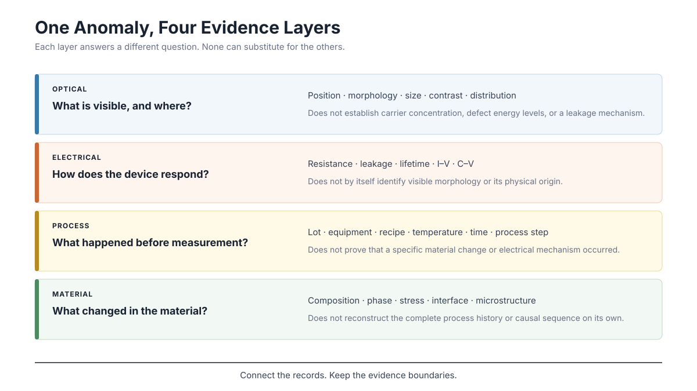
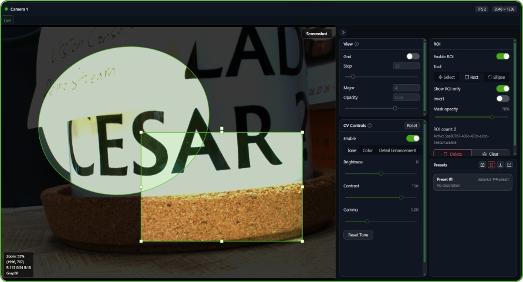
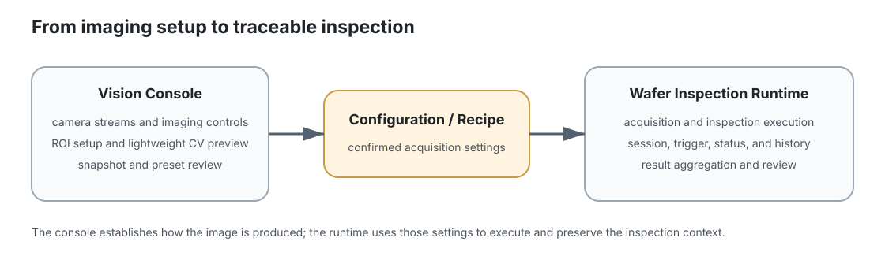
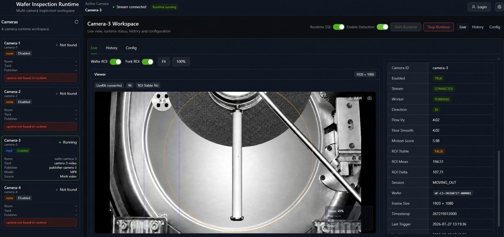
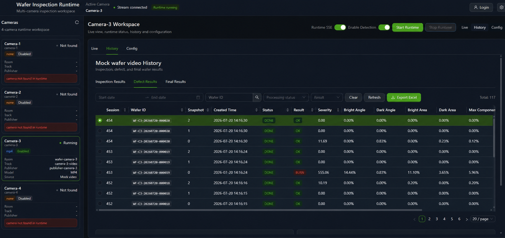
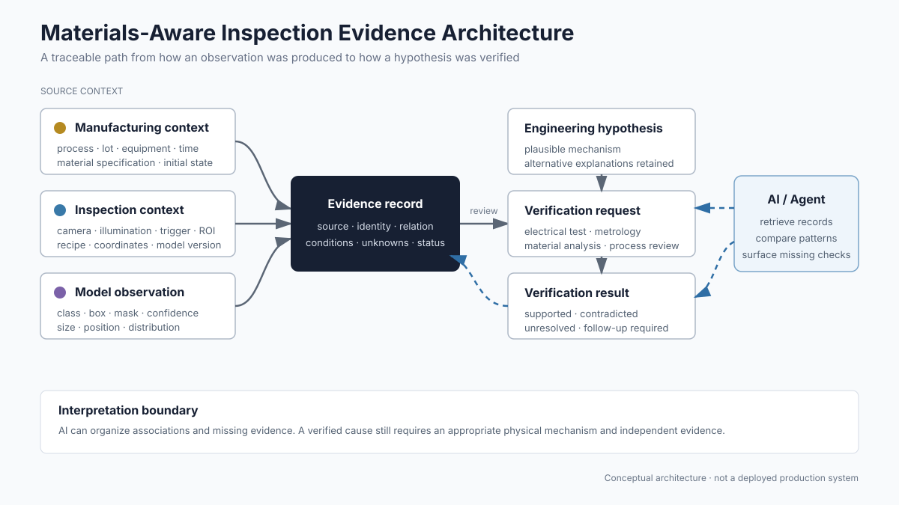

# Materials-Aware Inspection Evidence

## 材料知識如何改變檢測證據的解讀

> **Learning Context**
>
> My inspection work has involved cameras, defect models, runtime software, dataset management, equipment records, and production-facing workflows. These systems can detect, measure, and organize visible abnormalities. The difficult part starts after that.
>
> Materials science changed how I read the same records. A repeated optical pattern can be useful without revealing carrier concentration, leakage, stress, or a material mechanism. This note keeps the semiconductor background needed to explain that gap, then looks at how optical, electrical, process, and material evidence can be connected without treating them as interchangeable.

## 1. 這一章要整理的問題

前六章分別整理了材料分類、鍵結與晶體結構、缺陷、機械性質、破壞行為，以及製程歷史對材料狀態的影響。到了半導體，這些概念開始和實際檢測工作更直接地重疊：晶體缺陷、摻雜、界面、污染和溫度都可能影響電性，不過 AOI 最先取得的仍然是光學訊號。

這一章主要想釐清一個問題：

> **半導體的材料與電性知識，如何改善工業檢測資料的解讀，同時避免把光學標籤直接當成電性或材料根因？**

這個問題包含兩個層次。第一個層次是理解半導體為什麼能透過摻雜和溫度改變導電行為；第二個層次則是判斷 AOI、電性測試、製程紀錄和材料分析各自能提供什麼證據。

## 2. 半導體為什麼不同於金屬與絕緣體？

從能帶角度來看，材料能否導電和電子可使用的能態有關。以下比較刻意簡化，只保留理解後續內容需要的差異：

| 材料 | 簡化能帶狀態 | 常見導電特徵 |
| --- | --- | --- |
| 金屬 | 能帶部分填滿，或價帶與導帶重疊 | 通常已有大量可移動電子 |
| 半導體 | 價帶與導帶之間存在較小能隙 | 載子濃度可受到溫度、光照與摻雜控制 |
| 絕緣體 | 能隙較大 | 常溫下能進入導帶的電子通常很少 |

半導體的特殊之處不只是導電率介於金屬和絕緣體之間，而是載子濃度可以被工程化控制。製程可以在晶格中引入特定摻雜原子，也能透過氧化、沉積、退火和界面設計形成元件需要的電性行為。

不過「可以控制」不代表最後的量測結果只由一個參數決定。摻雜濃度、實際活化程度、載子遷移率、溫度、缺陷與界面狀態都可能改變電性響應。

## 3. 能帶、能隙與費米能階

> 圖 1：本徵、n 型與 p 型半導體的簡化能帶、摻雜能階與費米能階位置；能量距離未按比例繪製，縱軸也不是晶圓厚度或影像位置。

理解半導體導電行為時，幾個基本名詞需要先分開：

- **價帶（valence band）**：在低溫基態下，主要由價電子占據的能帶。
- **導帶（conduction band）**：電子進入後，可以在外加電場下參與導電的能帶。
- **能隙（bandgap, $E_g$）**：導帶底與價帶頂之間沒有允許能態的區域。
- **電子（electron）**：位於導帶中的負電載子。
- **電洞（hole）**：價帶缺少電子後形成的等效正電載子。
- **費米能階（Fermi level, $E_F$）**：用來描述電子占據能態機率的能量基準。

費米能階不是一條實際存在的電子軌道。它是統計判斷的參考位置：在熱平衡下，$E_F$ 會影響導帶與價帶附近能態被占據的機率。對本徵半導體，它通常位於能隙中間附近；加入施體或受體後，位置會分別向導帶或價帶移動。

能帶圖還有一個容易看錯的地方。縱軸代表能量，不是電子在晶圓中的高度，也不是缺陷在影像裡的位置。

## 4. 本徵半導體、n 型與 p 型摻雜

### 4.1 本徵半導體

理想的本徵半導體（intrinsic semiconductor）不依靠刻意加入的摻雜原子提供載子。當部分價帶電子取得足夠熱能跨越能隙時，導帶會增加一個電子，價帶則留下相對應的電洞。在熱平衡下：

$$
n=p=n_i
$$

其中 $n$ 和 $p$ 分別為電子與電洞濃度，$n_i$ 為本徵載子濃度。在常用的非簡併近似下：

$$
n_i
=
\sqrt{N_C N_V}
\exp\left(-\frac{E_g}{2kT}\right)
$$

$N_C$ 與 $N_V$ 是導帶和價帶的有效態密度，$k$ 是波茲曼常數，$T$ 是絕對溫度。這裡又出現指數溫度關係，不過它描述的是載子激發，不能和前面章節的空位形成、擴散或相變速率當成同一個機制。

### 4.2 n 型半導體

在矽中加入具有較多價電子的施體（donor），例如磷，可以在導帶附近形成施體能階。少量能量便能使施體電子進入導帶，因此電子成為多數載子，電洞則為少數載子。

在施體大致完成游離、且本徵激發尚未主導的條件下，可以近似寫成：

$$
n\approx N_D
$$

這個近似仍有條件。游離是否完整、補償摻雜、高濃度下的簡併效應，以及缺陷造成的載子捕獲，都可能讓實際結果偏離這條簡單關係。

### 4.3 p 型半導體

加入價電子較少的受體（acceptor），例如硼，會在價帶附近形成受體能階。價帶電子可以進入受體能階，原本的位置留下電洞，因此電洞成為多數載子。

在相似的近似條件下：

$$
p\approx N_A
$$

n 型或 p 型並不代表材料只剩下一種載子。兩種載子仍然同時存在，只是多數與少數的比例不同。在熱平衡、非簡併條件下，它們受到質量作用定律（mass-action law）限制：

$$
np=n_i^2
$$

## 5. 載子濃度、遷移率與導電率

在均勻材料、低電場，而且載子輸運可用漂移遷移率（drift mobility）近似時，半導體導電率可寫成：

$$
\sigma
=
q\left(n\mu_n+p\mu_p\right)
$$

其中：

- $q$：基本電荷量；
- $n$、$p$：電子與電洞濃度；
- $\mu_n$、$\mu_p$：電子與電洞遷移率。

電阻率（resistivity）則為：

$$
\rho=\frac{1}{\sigma}
$$

這條公式先把「有多少載子」和「載子能不能移動」放在一起。提高摻雜濃度通常會增加多數載子，不過摻雜原子、晶格振動與其他散射來源也可能降低遷移率。因此，不能只看到摻雜增加，就預期導電率按照相同比例持續上升。

### 一個簡單的比例檢查

假設某 n 型半導體在指定溫度區間內，可以忽略電洞的導電貢獻。若電子濃度增加為原本的兩倍，而電子遷移率因散射降到原本的 $70\%$：

$$
\frac{\sigma_2}{\sigma_1}
=
\frac{(2n)(0.7\mu_n)}{n\mu_n}
=
1.4
$$

載子濃度增加兩倍，導電率只增加約 $40\%$。這不是特定製程的預測，只是確認載子濃度與遷移率需要一起放進判斷。

## 6. 溫度、缺陷、表面與界面

### 6.1 溫度效應不是單一方向

對本徵半導體而言，溫度升高會使更多電子跨越能隙，因此載子濃度快速增加。不過溫度也會加劇晶格振動，使聲子散射增加，遷移率可能隨之下降。

對摻雜半導體，可以概略分成三個區域：

1. **Freeze-out region**：溫度較低，部分摻雜原子尚未游離。
2. **Extrinsic region**：摻雜原子提供的載子占主導。
3. **Intrinsic region**：溫度升高後，本徵激發產生的載子逐漸超過摻雜貢獻。

這三個區域用來整理主導機制，不是所有半導體共用的固定溫度表。材料、摻雜濃度與量測範圍不同，各區域出現的位置也會改變。

因此，「半導體溫度越高，電阻一定越低」只可能在特定材料與溫度範圍內成立。真正量到的導電率取決於載子濃度增加與遷移率下降之間的競爭。

### 6.2 缺陷與界面可能改變載子行為

晶體缺陷、污染、氧化層與薄膜界面可能在能隙中引入額外能態。依缺陷種類、能階、密度、元件結構與偏壓條件不同，它們可能參與載子捕獲、復合、表面電位變化、遷移率劣化或漏電。

不過材料中的缺陷能態和 AOI 使用的 defect label 不是同一個概念。影像中的亮點、暗點、haze、ring、particle 或 scratch 可以是穩定且有用的光學分類，但不能單獨證明 trap density、recombination center 或 leakage mechanism。

載子統計、輸運與光學響應的完整說明放在 [Carriers, Transport, and Optical Response](../02-semiconductor-characterization-fundamentals/01-carriers-transport-and-optical-response.md)。01-07 保留這些課程內容，是為了讓後面的檢測反思有足夠的物理背景。

> 圖 2：光學觀察可以建立工程假設，但電性或材料判讀仍需要製程紀錄、電性量測或材料分析；箭頭不代表已確認因果。

## 7. 光學、電性、製程與材料證據

> 圖 3：光學、電性、製程與材料證據回答不同問題；四層需要互相連結，但不能彼此取代。

| 證據類型 | 通常可以回答 | 通常不能單獨回答 |
| --- | --- | --- |
| 光學證據 | 位置、形貌、大小、分布、對比與重複模式 | 載子濃度、缺陷能階、漏電或復合機制 |
| 電性證據 | 電阻、漏電、載子壽命、I–V 或 C–V 行為 | 可見異常的確切形貌與物理來源 |
| 製程證據 | 批次、設備、recipe、溫度、時間與製程步驟 | 材料是否真的形成特定缺陷或電性機制 |
| 材料分析 | 成分、晶相、應力、界面與微觀結構 | 完整的製程因果關係 |

實際工作不一定缺少所有資料。更常見的問題是資料彼此沒有連起來：模型保存 class、box 和 confidence，設備紀錄保存 camera 與 recipe，製程系統保存 batch 和處理條件，後續 electrical test 又位於另一套系統。每份資料單獨看都合理，但若無法對回同一片 wafer、同一位置與同一時間範圍，就很難形成可以繼續驗證的工程推論。

因此，spatial overlap 或 repeated correlation 可以提高某個 hypothesis 的優先順序，卻不會自動把它變成 verified cause。這個差距需要保留。

## 8. A Wafer Category Is Not an Electrical Diagnosis

In an anonymized wafer-inspection project, the dataset contained wafer-level appearance categories as well as localized particles and scratches. The earlier label review separated whole-image conditions from local objects because the two annotations meant different things. That case is described in [Crystal Defects, Diffusion, and Microstructure](./04-crystal-defects-and-microstructure.md).

Correcting the task definition helped the model output match the annotation semantics. But it did not turn an optical category into an electrical diagnosis. A haze-like state can be repeatable across a batch while carrier concentration, trap density, leakage, and recombination behavior remain unknown.

That does not make the label useless. It can support screening, localization, distribution comparison, and later review. It just needs to state what was observed without quietly claiming the mechanism behind it.

## 9. Inspection Context Is Not Material History

The Vision Console and wafer runtime were developed as connected tools with different jobs. The console established an imaging setup: camera streams, exposure and gain, ROI, image-processing steps, snapshots, and presets. The runtime used the confirmed camera and recipe settings to execute inspection and retain operational context.

> Figure 4: A demo-stream view from the Vision Console I helped develop for a multi-camera inspection setting at a major semiconductor manufacturer in Taiwan. Production images are not reproduced. The screen shows how ROI and basic image processing could be checked before those settings were used by the inspection runtime.

> Figure 5: A reconstructed note on the relationship between the two tools. The console establishes how an image is acquired; the runtime uses that configuration to execute inspection and retain the operational context.

The runtime treated each wafer as an inspection session rather than a set of unrelated frames. Camera identity, trigger reason, direction, sample timing, measurements, and final aggregation could be traced through the same session. That structure was useful for runtime stability, debugging, and result reproduction.

After studying materials science, those fields also read as a record of how an observation was produced. They still do not describe what happened before inspection. Upstream process steps, thermal exposure, material specification, electrical tests, and later characterization require separate links.

> 圖 6：Wafer inspection runtime 的匿名化展示畫面，使用模擬影片呈現多相機狀態、ROI、觸發原因、檢測工作階段與即時量測資訊；畫面用來說明觀察結果如何產生，不代表已確認材料或電性原因。

The model platform, Vision Console, wafer runtime, and data workflows preserved different parts of the observation chain. They were separate systems built for different projects, not one deployed materials-analysis platform. The distinction matters because the diagrams below connect capabilities that were not delivered as a single production architecture.

## 10. A Practical Evidence Record

> 圖 7：Wafer inspection runtime 的匿名化歷史紀錄畫面；檢測工作階段、wafer、時間、檢測結果與量測欄位保存在同一筆紀錄中，資料來自模擬影片，不包含客戶生產資料。

Runtime history 讓觀察結果回到一次可追蹤的檢測工作階段，但材料導向的紀錄還需要更完整的證據層次：

| 層次 | 例子 | 為什麼需要 |
| --- | --- | --- |
| 觀察結果 | image、label、confidence、box / mask、校正後尺寸 | 記錄實際觀察到什麼 |
| 檢測條件 | camera、illumination、ROI、trigger、recipe、model version | 說明訊號如何產生 |
| 產品脈絡 | wafer、lot、coordinate、orientation、process stage | 對回實體對象、位置與製程節點 |
| 製程脈絡 | upstream step、equipment、time、temperature、material state | 支持製程與材料假設 |
| 驗證結果 | electrical test、metrology、characterization、review status | 區分相關性與受到證據支持的結論 |

> 圖 8：材料導向證據鏈的學習草圖，不是已部署的生產架構；Agent 可以協助查詢、比較與整理紀錄，但不能替代驗證。

不是每個專案一開始就能補齊所有欄位。比較重要的是不要用一個看起來肯定的缺陷名稱把缺口蓋掉。若裂紋深度、電性結果或材料分析尚未取得，`unresolved` 本身就是有效狀態。

這也改變了「完整缺陷紀錄」的意思。完整不代表每個欄位都有答案，而是觀察結果、量測條件、產品與製程脈絡、假設及驗證狀態都能追查。互相衝突的驗證結果也應該留下來，不宜只保留最後一個方便使用的結論。

### Where Industrial AI Can Help

Industrial AI can retrieve related records, compare distributions across lots, surface repeated associations, and identify missing checks. An agent can also help find similar cases or prepare the next verification request.

The output still needs traceability. If the system reports an association, it should show the batches, time range, model version, and comparison conditions behind it. Without electrical or material verification, the result remains a correlation or hypothesis.

## 11. 還需要哪些證據

- AOI 座標和電性測試資料的空間解析度差異很大時，兩者應如何對齊？
- 哪些量測最適合區分表面污染、界面陷阱、體缺陷與製程引入的應力？
- Unresolved 或互相衝突的 verification results，應如何保存在 production dataset，才不會在後續彙整時被過早壓成單一答案？

這些問題不能只從目前的檢測紀錄解決。有些需要更完整的元件、製程或材料知識，有些則要等真正拿到跨系統資料後，才能確認資料模型應該怎麼設計。

## Current Scope

這篇保留少量半導體載子與導電率背景，用來支撐檢測反思；更完整的載子統計、輸運與光學響應放在 Section 02。

工程案例涵蓋 optical acquisition、runtime context、dataset design 與 traceability，不代表執行電性診斷、掌握 upstream semiconductor process，或以 AOI 證實 material root cause。Evidence-chain diagram 是學習後的統整，不是已部署的 production architecture。

## Related Notes

- [Carriers, Transport, and Optical Response](../02-semiconductor-characterization-fundamentals/01-carriers-transport-and-optical-response.md)
- [Crystal Defects, Diffusion, and Microstructure](./04-crystal-defects-and-microstructure.md)
- [Processing, Phase Transformations, and Material Performance](./06-processing-and-material-performance.md)

## Learning Source

- James F. Shackelford, [*Materials Science: 10 Things Every Engineer Should Know*](https://www.coursera.org/learn/materials-science), University of California, Davis / Coursera.

## Additional References

- Ben G. Streetman and Sanjay Kumar Banerjee, *Solid State Electronic Devices*.
- Donald A. Neamen, *Semiconductor Physics and Devices*.
