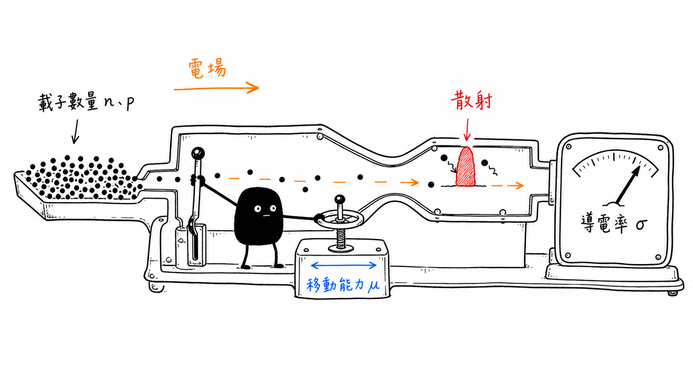
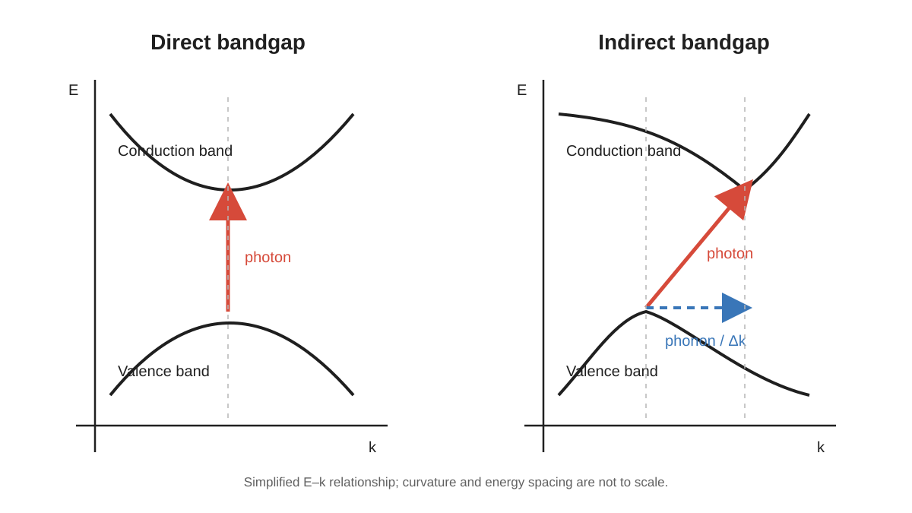

# Carriers, Transport, and Optical Response

## 從能帶、載子移動到光學檢測訊號

> **Learning context**
>
> Before studying this topic, I had encountered terms such as energy bands, doping, carrier mobility, and conductivity in project discussions. I still understood them mostly as separate facts. Working through the equations helped me connect carrier availability with carrier movement (the formulas were not the difficult part). It also made me ask more carefully what an electrical or optical measurement can actually show.
>
> I then compared this model with the camera and ROI tools I had built. Exposure, illumination, processing settings, and surface condition all affect the recorded image. But the comparison only goes so far. An optical pattern and an electrical change remain different evidence until they are linked and independently verified.

## Short English Note

This note reviews energy bands, carrier concentration, mobility, conductivity, and direct versus indirect bandgaps. The calculations are kept simple and are mainly used to check units and assumptions. The project section focuses on one boundary that matters in my inspection work: a camera records the response of the material and the optical system together. It does not provide a direct map of carrier concentration or conductivity.

## 1. 這次需要先拆開的幾個量

剛開始接觸半導體導電行為時，很容易把「自由電子比較多」直接理解成「導電率比較高」。這個方向沒有完全錯，不過只看到了載子數量。載子除了要存在，也要能在電場下移動。

因此這裡先把三個容易混在一起的量拆開：

| Quantity | 符號 | 這裡的簡單理解 |
| --- | --- | --- |
| Carrier concentration | $n$、$p$ | 單位體積內可以參與導電的電子或電洞數量 |
| Mobility | $\mu_n$、$\mu_p$ | 載子在電場下移動的容易程度 |
| Conductivity | $\sigma$ | 材料在目前狀態下傳導電流的能力 |

這三個量彼此相關，但不是同一件事。摻雜可以增加主要載子濃度，缺陷、散射和溫度則會影響 mobility。最後量到的導電率，才是兩者共同作用後的結果。

## 2. 從能帶重新理解電子與電洞

孤立原子的電子只能存在於離散能階。許多原子形成固體後，能階彼此接近並展開成能帶。對半導體而言，最常使用的兩個區域是：

- **Valence band**：在低溫基態下通常大多被電子占據；
- **Conduction band**：電子進入後，可以在外加電場下參與傳導。

兩者之間的能量差稱為 bandgap：

$$
E_g=E_C-E_V
$$

其中 $E_C$ 是 conduction-band edge，$E_V$ 是 valence-band edge。當電子取得足夠能量並跨越 bandgap，conduction band 會多出一個電子，valence band 則留下可以用電洞描述的空缺。

電洞不是像電子一樣的基本粒子，而是價帶中未被電子占據狀態的準粒子描述。在電流與載子輸運的計算中，可以把它視為帶正電的有效載子。第一次看到這個定義時並不直觀，不過放進電流計算後就比較容易理解。

## 3. Fermi level 與 carrier concentration

Fermi level $E_F$ 不是某一顆電子必定占據的能階，也不是電子的空間位置，而是描述能態占據機率的重要參考。Fermi–Dirac distribution 可以寫成：

$$
f(E)=\frac{1}{1+\exp\left(\frac{E-E_F}{k_BT}\right)}
$$

$f(E)$ 表示能量為 $E$ 的可用狀態被電子占據的機率。當溫度、摻雜和能帶結構改變時，$E_F$ 相對於 $E_C$ 和 $E_V$ 的位置也會影響電子與電洞濃度。

在非簡併、熱平衡的近似條件下：

$$
n=N_C\exp\left(-\frac{E_C-E_F}{k_BT}\right)
$$

$$
p=N_V\exp\left(-\frac{E_F-E_V}{k_BT}\right)
$$

$N_C$ 與 $N_V$ 分別是 conduction band 和 valence band 的 effective density of states。現階段比完整推導更重要的，是先看懂指數項的方向：$E_F$ 越接近 $E_C$，電子濃度越高；越接近 $E_V$，電洞濃度越高。

$N_C$ 與 $N_V$ 也會隨溫度改變，所以溫度的影響不只出現在指數項中。這一篇暫時不展開它們的推導。

對本徵半導體：

$$
n=p=n_i
$$

在熱平衡、非簡併近似下，也有：

$$
np=n_i^2
$$

摻入 donor 後，電子通常成為主要載子；摻入 acceptor 後，電洞通常成為主要載子。不過 n 型或 p 型並不代表材料只剩下一種載子。電子與電洞仍然同時存在，只是多數載子與少數載子的濃度可能相差很大。

## 4. Mobility：載子存在，不代表移動得一樣快

沒有外加電場時，載子仍進行熱運動，不過方向是隨機的，平均後不形成固定方向的淨電流。施加電場 $\mathcal{E}$ 後，在低電場、近似線性的範圍內，drift velocity 的大小可以寫成：

$$
|v_d|=\mu|\mathcal{E}|
$$

對電子而言，實際漂移方向與外加電場相反；電洞則和電場同方向。工程計算通常把 mobility $\mu$ 當作正值，方向另外處理。

Mobility 描述載子對電場的響應。它不是固定不變的材料常數，可能受到以下條件影響：

- 晶格振動與溫度；
- ionized impurity scattering；
- 缺陷、界面與表面狀態；
- 載子濃度；
- 晶向與實際材料結構；
- 電場強度。

因此，增加摻雜濃度雖然通常會增加主要載子數量，也可能同時加強雜質散射並降低 mobility。最後的 conductivity 是否依比例增加，需要把兩者放在同一個式子中判斷。

> 圖 1：作者依個人課程筆記設計並重新整理；導電率同時取決於可參與導電的載子數量，以及載子在電場下移動的能力。

## 5. 從載子得到 conductivity 與 resistivity

在均勻材料、低電場，而且載子輸運可以用 drift mobility 近似描述時，conductivity 可以寫成：

$$
\sigma=q\left(n\mu_n+p\mu_p\right)
$$

其中：

- $q$：elementary charge；
- $n$、$p$：electron 與 hole concentration；
- $\mu_n$、$\mu_p$：electron 與 hole mobility。

電流密度與電場的關係為：

$$
J=\sigma\mathcal{E}
$$

到了高電場、速度飽和或具有明顯接面與非均勻結構的情況，電流行為就不能只靠這個簡單的 bulk conductivity 關係描述。這裡只先處理低電場模型。

Resistivity 則是 conductivity 的倒數：

$$
\rho=\frac{1}{\sigma}
$$

這裡的 $\rho$ 是材料的 resistivity，不是某個元件直接量到的 resistance。兩者只差一個字，實際使用時卻不能混在一起。元件幾何會留到後面的量測筆記再處理。

## 6. 一個用來檢查 mobility 單位的簡單計算

先用一個簡單的例子檢查單位。已知：

$$
\mu_n=1000\ \mathrm{cm^2/(V\cdot s)}
$$

$$
\mathcal{E}=100\ \mathrm{V/cm}
$$

使用低電場近似，先計算速度大小：

$$
|v_d|=\mu_n|\mathcal{E}|
$$

代入後：

$$
\begin{aligned}
|v_d|
&=(1000\ \mathrm{cm^2/(V\cdot s)})
  (100\ \mathrm{V/cm})\\
&=1.0\times10^5\ \mathrm{cm/s}
\end{aligned}
$$

這個計算不難，真正有用的是單位檢查。電壓單位消去後，$\mathrm{cm^2}$ 除以 $\mathrm{cm}$，最後留下 $\mathrm{cm/s}$。如果算完不是速度單位，代表前面至少有一個地方需要重看。這個關係也只適用於 drift velocity 與 electric field 近似線性的範圍。

## 7. 溫度改變時，不能只記一個方向

溫度升高時，更多電子可能跨越 bandgap，因此本徵載子濃度會增加；另一方面，晶格振動也會增加，mobility 反而可能下降。所以 conductivity 的溫度變化不能只記成「溫度越高，載子移動越快」。這句話太簡化了。

實際半導體的溫度區間還可能分成 freeze-out、extrinsic 和 intrinsic regimes。不同區段由不同因素主導：

| Regime | 主要限制 |
| --- | --- |
| Freeze-out | 摻雜原子尚未完全游離，可用載子不足 |
| Extrinsic | 主要載子濃度大致由摻雜控制，mobility 的影響開始明顯 |
| Intrinsic | 熱生成的 electron–hole pairs 逐漸主導 |

這三個區段比較像解讀曲線時的檢查順序，不能直接套用成所有材料都相同的趨勢。真正看資料時，仍然要回頭確認材料、摻雜濃度與量測溫度範圍。

## 8. Direct 與 indirect bandgap

光子的能量可以寫成：

$$
E_{\mathrm{ph}}=h\nu=\frac{hc}{\lambda}
$$

若波長使用 nm、能量使用 eV，可以使用以下近似式：

$$
E_{\mathrm{ph}}(\mathrm{eV})
\approx\frac{1240}{\lambda(\mathrm{nm})}
$$

例如，波長為 $620\ \mathrm{nm}$ 的光子能量約為：

$$
E_{\mathrm{ph}}\approx\frac{1240}{620}=2.0\ \mathrm{eV}
$$

當光子能量足以跨越 bandgap 時，可能產生 electron–hole pair。不過能量足夠只是第一個條件，並不代表每一個入射光子都會被吸收。材料厚度、表面反射與允許的轉換條件仍然會影響結果。

光子提供的動量相對較小，因此電子吸收或放出光子時，能量與 crystal momentum 是否能同時守恆很重要。

- **Direct bandgap**：valence-band maximum 與 conduction-band minimum 位於相同 crystal momentum，電子—電洞轉換較容易直接伴隨光子吸收或放出。
- **Indirect bandgap**：兩者位於不同 crystal momentum，轉換通常還需要 phonon 協助提供或吸收動量。

> 圖 2：作者依個人課程筆記重新整理；direct transition 可在近似相同的 crystal momentum 下進行，indirect transition 通常需要 phonon 協助。圖形只表示關係，能帶曲率與能量距離未按比例繪製。

矽屬於 indirect-bandgap semiconductor，因此電子與電洞復合時通常還需要 phonon 協助。相較之下，GaAs 等 direct-bandgap materials 的光學轉換較直接。這裡先不把「適合做電子元件」和 bandgap 類型畫上等號，因為實際材料選擇還牽涉其他條件。

在目前接觸的工業 AOI 系統中，可見影像的對比通常更直接受到表面形貌、反射、散射、薄膜干涉、污染和照明幾何影響。Exposure、gain 與 sensor response 也會改變最後記錄的強度。

因此，direct／indirect bandgap 幫助我理解材料的吸收和發光機制，但不能直接拿來解釋相機中的每一個亮點、暗點或紋理變化。這兩個層次需要分開。

## 9. Project Note: A Camera Signal Is a Measurement Result

In the Vision Console, I implemented controls for exposure, gain, white balance, gamma, frame rate, ROI configuration, and image-processing pipelines. A separate wafer-inspection runtime also retained camera identity, ROI measurements, grayscale differences, motion state, and trigger context.

At the time, these fields were mainly useful for operation, debugging, and result reproduction. After studying semiconductor transport and optical response, I read them somewhat differently. An image is not a direct copy of the material state. It is a signal produced by the material and its surface, then modified by illumination, optics, the sensor, camera settings, and image processing.

For example, increasing exposure or gain can make the same region brighter. That does not mean the material's bandgap or absorption coefficient has changed. A grayscale difference inside an ROI may support stability or trigger logic, but it cannot be converted directly into carrier concentration, mobility, or conductivity.

To connect an AOI pattern with an electrical result, I would need to preserve the measurement conditions on both sides:

| Optical and runtime context | Electrical and material context |
| --- | --- |
| Camera, illumination, exposure, and gain | Temperature, bias, and test structure |
| ROI, scale, focus, and processing preset | Doping, carrier concentration, and mobility |
| Image position, timestamp, and session | Wafer or lot, process step, and electrical result |

A repeated relationship between the two sides can justify further investigation. It does not verify a material mechanism by itself.

## 10. 寫在公式旁邊的檢查

最後留下幾個實際看公式或檢測資料時，會需要回頭確認的問題：

- 現在討論的是 carrier concentration、mobility、conductivity，還是特定結構的 resistance？
- 使用的是 $\mathrm{cm}$ 系統還是 SI units？
- 少數載子的貢獻真的可以忽略嗎？
- 電子漂移方向和 conventional current direction 是否已經分清楚？
- $|v_d|=\mu|\mathcal{E}|$ 是否仍在低電場近似範圍？
- 溫度改變時，是 carrier concentration 還是 mobility 主導目前趨勢？
- 現在看到的是 bulk material relation，還是包含接面、接觸與幾何效應的元件量測？
- 影像中的亮暗差異，是否能在固定 camera 和 illumination settings 下重現？
- 目前只有 optical correlation，還是已經有 electrical／material verification？

這些問題不能取代實驗設計，不過至少能避免只記得 $\sigma=q(n\mu_n+p\mu_p)$，卻忘了確認公式使用條件和資料來源。

## Current Scope

This note stays with basic carrier statistics, low-field transport, and optical-response concepts. It does not yet cover Hall measurements, p-n junctions, recombination-rate models, high-field transport, or the extraction of material parameters from characterization data.

## Sources

1. Arizona State University, [*Fundamentals of Semiconductor Characterization*](https://www.coursera.org/learn/fundamentals-of-semiconductor-characterization), Coursera.

## Project Context

The project note is based on my implementation experience with a multi-camera Vision Console and an event-driven wafer-inspection runtime. I use that experience to discuss measurement context, not to suggest that these systems measured semiconductor carrier properties directly.
