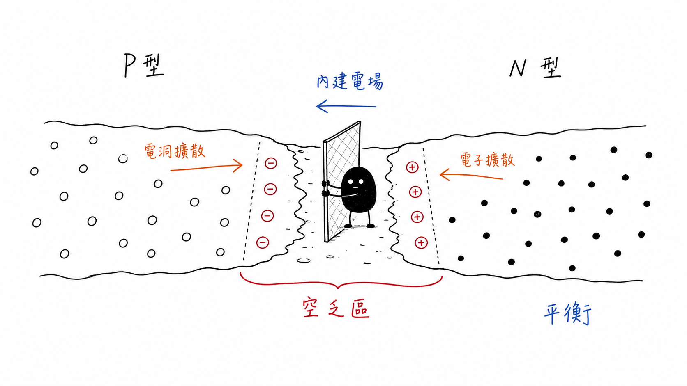
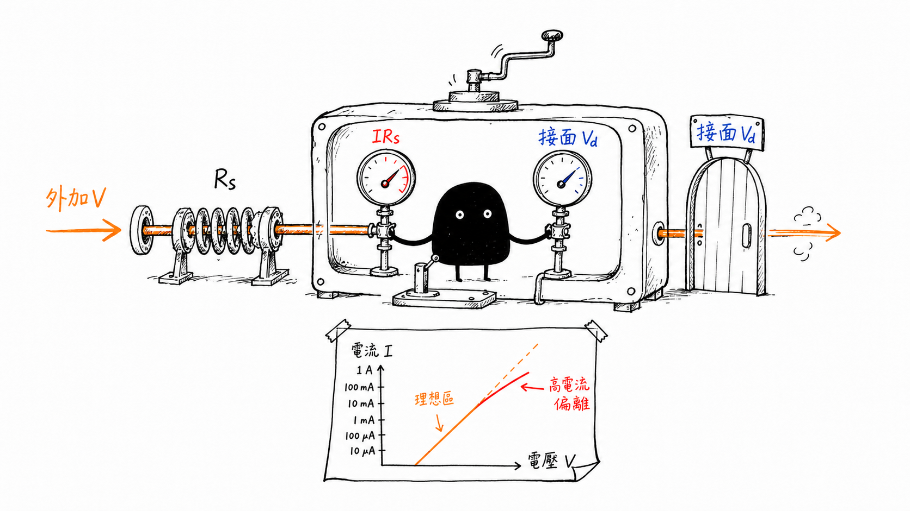

# p–n Junction and Diode I–V

## 從載子擴散、內建電場到真實量測曲線

> **Learning Context**
>
> Before studying this topic, I understood a diode mainly as a component that conducts in one direction. That description was often enough for programming and system integration, but it skipped the part I wanted to understand: what changes inside the semiconductor before the current begins to rise.
>
> Drawing the junction made the sequence clearer. Carrier diffusion leaves fixed charge near the interface, the fixed charge creates an internal field, and the field eventually limits further diffusion. Applied bias then changes this existing barrier. This note stops at that physical picture and the basic I–V model; parameter extraction is handled in the next section of the repository.

## 1. 接合以前，兩邊都接近電中性

上一則筆記已經整理過摻雜與載子濃度。這裡只留下形成接面需要的部分：N 型材料以電子為多數載子，P 型材料則以電洞為多數載子。不過兩邊在接合以前都可以接近電中性，不是 N 型整塊帶負電、P 型整塊帶正電。

這一點很容易被 P 和 N 的名稱誤導。摻雜改變的是自由載子的比例，材料裡仍然同時存在可移動載子與固定的離化雜質。

在完全游離與非簡併近似下：

$$
n_n\approx N_D,\qquad p_p\approx N_A
$$

少數載子則仍滿足熱平衡關係：

$$
np=n_i^2
$$

這些近似不是這篇要推導的重點，但後面的 built-in voltage 會再用到 $N_D$、$N_A$ 和 $n_i$。

## 2. 載子擴散如何形成 Depletion Region

P 型與 N 型半導體剛接觸時，接面兩側存在很大的濃度差。電子傾向由 N 側擴散到 P 側，電洞則由 P 側擴散到 N 側。

靠近接面的電子與電洞復合後，原本被它們平衡的離化雜質留在晶格中：N 側留下帶正電的固定施體離子，P 側留下帶負電的固定受體離子。它們不會像自由載子一樣跨過接面，卻會建立由 N 側指向 P 側的 electric field。

接面附近因此缺少可移動的多數載子，形成 depletion region。

> 圖 1：載子擴散後留下固定離化雜質，形成 depletion region 與由 N 側指向 P 側的 built-in electric field；閘門為概念示意。

一開始容易只記得「載子因濃度差而擴散」，卻漏掉這個動作會自己建立一個反方向的電場。接面不會一直毫無限制地擴散下去。

## 3. 平衡不是載子停止移動

固定電荷建立的 electric field 會推動載子產生 drift，方向和原本的 diffusion contribution 相反。在熱平衡下，兩者互相抵消，合成後沒有淨電流：

$$
\text{diffusion current}+\text{drift current}=0
$$

這不代表電子與電洞完全靜止。這個差異很重要：「量到零」可能是內部沒有活動，也可能是幾個相反作用剛好抵消。只看最後的淨值，兩種情況很容易混在一起。

熱平衡時，整個接面的 Fermi level 保持水平。P 側與 N 側原本不同的能帶位置會重新排列，並在接面附近彎曲。能帶圖中的高度代表電子能量，不是晶圓真的發生機械彎曲。

## 4. Built-in Voltage 從哪裡來

在突變接面、熱平衡與非簡併近似下，built-in voltage 可以寫成：

$$
V_{bi}
=
\frac{k_BT}{q}
\ln\left(
\frac{N_AN_D}{n_i^2}
\right)
$$

從這個式子可以先讀出幾個方向：$N_A$ 或 $N_D$ 增加時，$V_{bi}$ 通常增加；溫度不只出現在 $k_BT/q$，也會透過 $n_i$ 進入結果；材料改變時，相關能帶與本徵載子條件也會不同。

所以 $V_{bi}$ 不是只由「P 型和 N 型接在一起」決定。摻雜、溫度和材料都在裡面。

$V_{bi}$ 是接面內部的 electrostatic potential difference，不是把普通電壓表接在未加偏壓的二極體兩端，就能直接讀到的 terminal voltage。內部勢壘和儀器讀值之間，還隔著接觸與完整的量測路徑。

## 5. Forward 和 Reverse Bias 如何改變 Barrier

對 p–n junction 施加 forward bias 時，外加電場抵消一部分 built-in field。有效 barrier 降低，depletion region 變窄，多數載子也更容易跨越接面。電流不是碰到某個數字後突然打開，而是偏壓逐漸改變原本已經存在的 barrier。

Reverse bias 則加強原有電場，使 depletion region 變寬，多數載子更難跨越接面。在理想 diffusion model 中，反向電流主要和少數載子有關；真實元件還可能包含 depletion-region generation、surface leakage 與 edge effects。

這一篇先停在 breakdown 以前。反向電壓再升高後出現的其他機制，需要另外處理，不能繼續把 reverse current 視為固定不變。

## 6. Basic Diode I–V Model

在簡單的 diffusion-current model 中，$n=1$。為了描述真實曲線對理想模型的偏離，常把 ideality factor $n$ 放進二極體方程式：

$$
I
=
I_0
\left[
\exp\left(
\frac{V_D}{nV_T}
\right)-1
\right]
$$

其中：

$$
V_T=\frac{k_BT}{q}
$$

$I_0$ 設定簡化模型中的 current scale，$V_D$ 是真正落在 junction 上的電壓，$V_T$ 隨溫度改變。$n$ 可以表示曲線偏離 simple diffusion behavior 的程度，但不能只靠一個數值就替非理想行為指定唯一機制。

在適當的 forward-bias 區間，semi-log I–V 會接近直線。如何選擇 fitting window，並由曲線估計 $I_0$ 與 $n$，接到 [Diode Parameter Extraction and Measurement Limits](../03-electrical-characterization-and-process-monitoring/03-diode-parameters-and-process-monitoring.md)。

## 7. Real Diode：Terminal Voltage 不等於 Junction Voltage

真實二極體除了 junction，還包含 contact、semiconductor region 和 interconnect resistance。這些 contribution 可以先合併成等效 series resistance $R_s$：

$$
V=V_D+IR_s
$$

電流較小時，$IR_s$ 壓降不明顯，terminal voltage 大部分落在 junction 上。Forward current 增加後，$IR_s$ 也跟著增加，這時儀器施加的 $V$ 就不能直接當成 $V_D$。

> 圖 2：外加電壓分配在 p–n junction 與 series resistance 上；高 forward current 時，$IR_s$ 壓降使量測 I–V 偏離簡單 junction model。

把接觸、current crowding、自熱和材料電阻都放進固定的 $R_s$，仍然是一種簡化。這一節只想留下物理上的差別：terminal voltage 和 junction voltage 不一定相同。如何從量測曲線估計 $R_s$，留在後面的 parameter-extraction note。

## Current Scope

This note stays with equilibrium junction formation, built-in voltage, basic forward and reverse bias, the diode equation, and a simple series-resistance correction. It stops before breakdown mechanisms, detailed recombination models, capacitance–voltage behavior, and parameter-fitting procedures. Parameter extraction continues in the linked Section 03 note.

## Learning Source

- Arizona State University, [*Fundamentals of Semiconductor Characterization*](https://www.coursera.org/learn/fundamentals-of-semiconductor-characterization), Coursera.
