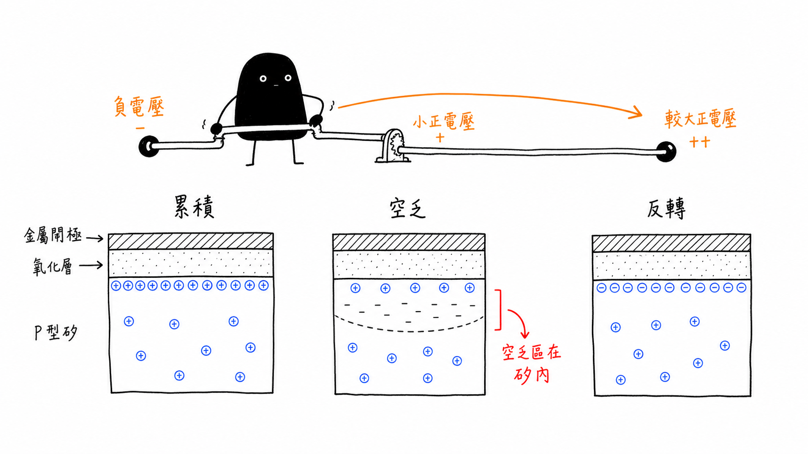
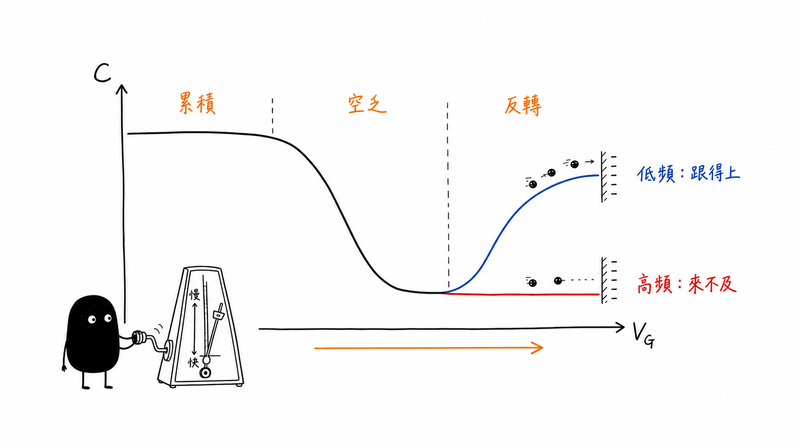

# MOS Capacitor C–V and Oxide Charge

## 從表面載子分布、C–V 曲線到氧化層電荷

> **Learning Context**
>
> A capacitor used to seem like one of the simpler parts of a circuit: two conductors separated by a dielectric, with one capacitance value to calculate. A MOS capacitor looked similar at first. That picture stopped working once the semiconductor surface began to change with gate voltage.
>
> It became easier to read the C–V curve after following the surface state instead of treating the curve as one continuous shape. Accumulation, depletion, and inversion are not merely labels on a graph. Each one says something about where the carriers are and how far the field reaches into the silicon. The measurement time decides whether those carriers can respond.

## 1. MOS 電容看起來簡單，變化主要發生在矽表面

MOS 是 metal–oxide–semiconductor 的縮寫。最基本的結構可以先分成三層：

- 上方金屬閘極；
- 中間的絕緣氧化層；
- 下方半導體基板。

這一篇以 P 型矽基板為例，閘極施加電壓 $V_G$，半導體端接地。氧化層理想上不提供直流導電路徑，因此閘極電壓主要透過電場改變矽表面附近的載子分布。

這也是 MOS 電容和普通平行板電容最不一樣的地方。金屬中的電荷可以集中在很薄的表面，但半導體內的自由載子濃度有限，電場可能進入矽內一段距離。換句話說，第二個「極板」不是永遠固定在同一個位置。

先記一個容易畫錯的地方：

> 空乏區位於半導體內，不在氧化層內。

氧化層本來就是絕緣體；空乏描述的是半導體表面附近，多數載子被排開後留下固定離化雜質的區域。

## 2. P 型基板的三種表面狀態

### 2.1 累積：負閘極電壓吸引電洞

當 $V_G$ 為負時，閘極的負電荷會吸引 P 型矽中的多數載子，也就是電洞，靠近氧化層與矽的界面。表面電洞濃度高於體內，稱為 accumulation。

此時半導體表面的可移動電荷離氧化層很近，量到的電容通常接近氧化層電容。

### 2.2 空乏：正閘極電壓先把電洞推開

當 $V_G$ 從零往正方向增加，電洞會被界面排開，留下固定的受體離子。這段缺少可移動多數載子的區域就是 depletion region，其寬度以 $W$ 表示。

閘極電壓繼續增加時， $W$ 會變寬。等效上，儲存正負電荷的距離拉大，因此總電容下降。

### 2.3 反轉：表面形成少數載子反轉層

當正閘極電壓再提高，電子開始被吸引到矽表面。電子原本是 P 型基板中的少數載子，但當表面電子濃度足夠高時，表面會形成反轉層，其載子分布表現得更接近 N 型。

這裡只有靠近界面的薄層發生反轉，較深處的基板仍然是 P 型。把整塊基板直接改畫成 N 型，會失去空間上的差異。

在 MOS 電容中，這裡討論的是反轉層。若加入 source 與 drain，才會進一步涉及 MOSFET 的通道導電。



> 圖 1：P 型 MOS capacitor 隨 $V_G$ 由 accumulation 進入 depletion 與 inversion；depletion width 的變化發生在 silicon 內，結構為概念示意。

## 3. 氧化層電容先由幾何決定

若先忽略邊緣效應，單位面積氧化層電容為：

```math
C^{\prime}_{ox}=\frac{\varepsilon_{ox}}{t_{ox}}
```

其中：

| 符號 | 意義 |
| --- | --- |
| $C^{\prime}_{ox}$ | 單位面積氧化層電容，常用 $\mathrm{F/cm^2}$ |
| $\varepsilon_{ox}$ | 氧化層介電常數 |
| $t_{ox}$ | 氧化層厚度 |

若元件面積為 $A$，總氧化層電容才是：

```math
C_{ox}=\frac{\varepsilon_{ox}A}{t_{ox}}=C^{\prime}_{ox}A
```

這裡最常出現的不是推導問題，而是單位問題。單位面積電容和元件總電容差了一個面積，數值不能直接混用。若厚度以 nm 給出、介電常數使用 $\mathrm{F/cm}$，也必須先把厚度換成 cm。

從公式可以直接看出，氧化層越薄， $C^{\prime}_{ox}$ 越大。不過這只是在幾何模型中的方向，不能據此說氧化層越薄就沒有代價；漏電、崩潰與製程變異仍是另外的問題。

## 4. 空乏區相當於多串聯一個電容

在空乏狀態下，電場不只跨過氧化層，也進入半導體。若以一維近似表示，單位面積的空乏層電容為：

```math
C^{\prime}_s=\frac{\varepsilon_s}{W}
```

氧化層與空乏區可先看成串聯：

```math
\frac{1}{C^{\prime}}
=
\frac{1}{C^{\prime}_{ox}}
+
\frac{1}{C^{\prime}_s}
```

整理後：

```math
C^{\prime}
=
\frac{C^{\prime}_{ox}C^{\prime}_s}
{C^{\prime}_{ox}+C^{\prime}_s}
```

當正閘極電壓使 $W$ 增加時， $C^{\prime}_s$ 下降，串聯後的總電容也跟著下降。這條關係讓 C–V 曲線不再只是形狀記憶：曲線向下，其實對應到電場進入矽內更深。

這個模型仍有邊界。實際量測還會受到頻率、溫度、寄生電容、串聯電阻與元件結構影響，不能看到一段下降就只用 $W$ 解釋所有差異。

## 5. C–V 曲線還要問「載子來得及嗎」

對 P 型基板由負 $V_G$ 掃向正 $V_G$ 時，可以先這樣閱讀：

1. 累積區的電容接近 $C_{ox}$；
2. 進入空乏後， $W$ 增加，總電容下降；
3. 進入反轉後，曲線怎麼走取決於少數載子是否能跟上交流訊號。

在低頻或接近準靜態的條件下，少數載子有較充足的時間調整並參與 surface-charge response，量測電容在 inversion region 可能再次上升。

在高頻量測中，少數載子常來不及跟隨快速變化，空乏寬度的小訊號響應受到限制，電容會維持在較低的位置。這不是兩種互相矛盾的 MOS 物理，而是量測時間尺度不同。

如果直流閘極電壓掃描得太快，少數載子的生成速度也可能跟不上。這時空乏區可能暫時超過平衡狀態下的最大寬度，形成 deep depletion，量到的電容也可能低於一般高頻曲線的最低值。因此，量測頻率和電壓掃描速率是兩個不同、但都需要記錄的條件。



> 圖 2：由 accumulation 進入 depletion 時 capacitance 下降；inversion region 的 response 會受到 measurement frequency 與 minority-carrier response time 影響，曲線為定性示意。

這張圖只畫定性的方向。實際曲線還要註明掃描方向、頻率、溫度、交流訊號振幅與元件面積，否則一條曲線很容易被過度解讀。

## 6. 氧化層與界面電荷會把理想曲線推離原位

理想 MOS 模型通常先假設氧化層內沒有額外電荷、界面也完全乾淨。真實元件不太可能一直符合這個條件。為了方便比較，常見電荷可以先分成四類：

| 類型 | 筆記中的理解 | 可能反映在量測中的現象 |
| --- | --- | --- |
| 固定氧化層電荷 | 靠近氧化層／矽界面的固定電荷 | C–V 曲線與 $V_{FB}$ 位移 |
| 可移動離子電荷 | 可能在電場或溫度作用下移動的離子，例如鈉或鉀 | 偏壓歷史相關位移、遲滯 |
| 氧化層捕獲電荷 | 載子被氧化層缺陷捕獲，例如受到輻射或電場應力後 | 電壓位移、可靠度變化 |
| 界面陷阱電荷 | 氧化層／矽界面的缺陷態，可和半導體交換電荷 | stretch-out、頻率色散與參數提取偏差 |

這張表只能當成初步對照，不是唯一診斷規則。曲線位移、拉伸或遲滯可能同時受多種機制與量測條件影響。看到某個外觀後，還不能直接替它指定唯一缺陷來源。

## 7. Flat band 不等於閘極電壓為零

Flat-band condition 指的是半導體內的能帶接近平坦，表面位勢約為零，沒有明顯的累積、空乏或反轉。

直覺上容易把 flat band 和 $V_G=0$ 畫上等號，但兩者並不一定相同。原因至少包括：

- 金屬閘極與半導體的 work-function difference；
- 氧化層或界面附近存在淨電荷。

如果先把氧化層內與界面附近的淨電荷簡化成一個等效面電荷 $Q_{ox}$，flat-band voltage 可以寫成：

```math
V_{FB}
=
\Phi_{MS}
-
\frac{Q_{ox}}{C^{\prime}_{ox}}
```

其中 $\Phi_{MS}$ 是金屬與半導體的功函數差， $Q_{ox}$ 是以單位面積表示的等效氧化層電荷。

這個式子比較直觀的理解方式，是把 $Q_{ox}$ 看成一個藏在元件裡的額外偏壓。即使外部施加相同的 $V_G$，半導體表面實際感受到的電場條件仍可能不同。

這是一個方便建立方向感的等效模型。固定氧化層電荷、可移動離子、氧化層捕獲電荷與界面陷阱的位置、時間響應和偏壓依賴不一定相同，因此不能只靠一個曲線位移完成分類。

但符號不能只靠背誦。 $Q_{ox}$ 的正負、電壓方向與基板類型會共同決定曲線往哪一邊移；實際使用前，仍要先確認教材或量測系統採用的符號定義。

## 8. Flat-band Capacitance 為什麼低於 Oxide Capacitance

flat band 時雖然沒有明顯的空乏區，小訊號電場仍會進入半導體約一個 Debye length。在非簡併、均勻摻雜，而且摻雜大致完成游離的近似下，對本篇的 P 型基板可以先令 $N\approx N_A$：

```math
L_D
=
\sqrt{
\frac{\varepsilon_s k_BT}
{q^2N}
}
```

對應的單位面積半導體電容為：

```math
C^{\prime}_{s,FB}
=
\frac{\varepsilon_s}{L_D}
```

因此 flat-band capacitance 仍然是兩個電容串聯：

```math
C^{\prime}_{FB}
=
\frac{C^{\prime}_{ox}C^{\prime}_{s,FB}}
{C^{\prime}_{ox}+C^{\prime}_{s,FB}}
```

所以 flat-band capacitance 會小於 oxide capacitance。如果直接把兩者視為相同，從 C–V 曲線讀出的 $V_{FB}$ 位置也會跟著偏掉。

### 一個簡單的數值檢查

考慮以下條件：

- $t_{ox}=5\ \mathrm{nm}=5\times10^{-7}\ \mathrm{cm}$
- $N_A=1\times10^{17}\ \mathrm{cm^{-3}}$
- $T=300\ \mathrm{K}$
- $\varepsilon_{r,ox}=3.9$
- $\varepsilon_{r,Si}=11.7$
- $\varepsilon_0=8.854\times10^{-14}\ \mathrm{F/cm}$

先算氧化層電容：

```math
C^{\prime}_{ox}
=
\frac{3.9\varepsilon_0}{t_{ox}}
\approx
6.91\times10^{-7}\ \mathrm{F/cm^2}
```

也就是：

```math
C^{\prime}_{ox}\approx690.6\ \mathrm{nF/cm^2}
```

在這組條件下，Debye length 約為：

```math
L_D\approx12.9\ \mathrm{nm}
```

因此：

```math
C^{\prime}_{s,FB}
=
\frac{\varepsilon_s}{L_D}
\approx
801\ \mathrm{nF/cm^2}
```

代入串聯關係：

```math
C^{\prime}_{FB}
\approx
\frac{(690.6)(801)}
{690.6+801}
\approx
371\ \mathrm{nF/cm^2}
```

這個結果可以先從兩個方向檢查：

- 串聯電容應小於 $690.6$ 與 $801\ \mathrm{nF/cm^2}$ 中較小的一個；
- $371\ \mathrm{nF/cm^2}$ 符合這個範圍，至少沒有出現明顯的單位或串聯關係錯誤。

若量到的是總電容，還要再乘上或除回元件面積，才能和這裡的單位面積電容比較。

這是依理想介電常數、均勻摻雜與簡化 Debye-length 模型得到的計算值，不代表實際量測一定會精確落在同一位置。

## 9. 從 C–V 曲線估計 Flat-band Voltage

有了 $C^{\prime}_{FB}$ 後，可以在量測曲線上找到：

```math
C^{\prime}=C^{\prime}_{FB}
```

再讀出對應的閘極電壓，作為 $V_{FB}$ 的估計。

這是一種入門的圖形估計方式。實際進行參數提取時，還要確認量測頻率、寄生電容、串聯電阻與界面陷阱是否使交點發生偏移。

這個步驟看起來只是「找交點」，但它其實把前面的資訊全部串起來：

- 氧化層厚度決定 $C^{\prime}_{ox}$；
- 摻雜與溫度影響 $L_D$；
- $L_D$ 影響 $C^{\prime}_{s,FB}$；
- 串聯關係決定 $C^{\prime}_{FB}$；
- 最後才從量測曲線讀出 $V_{FB}$。

只要其中一個單位、面積或材料參數用錯，最後的交點仍然可能「看起來找得到」，但工程意義已經不同。

真正需要保留的不是一條單獨的曲線，而是曲線、元件條件、量測設定和使用模型之間的關係。到了 MOS capacitor，measurement frequency 和 interface state 尤其不能省略。

## Current Scope

This note stops at the path from gate voltage to surface charge, the resulting C–V response, and a basic estimate of $V_{FB}$ under stated assumptions. A shifted or stretched curve is still not a complete defect diagnosis. Separating fixed oxide charge from mobile ions, trapped charge, and interface states requires measurement design and fitting beyond the current scope.

## Learning Source

- Arizona State University, [*Fundamentals of Semiconductor Characterization*](https://www.coursera.org/learn/fundamentals-of-semiconductor-characterization), Coursera.
