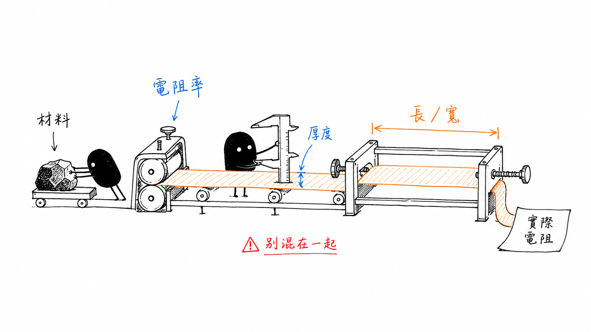
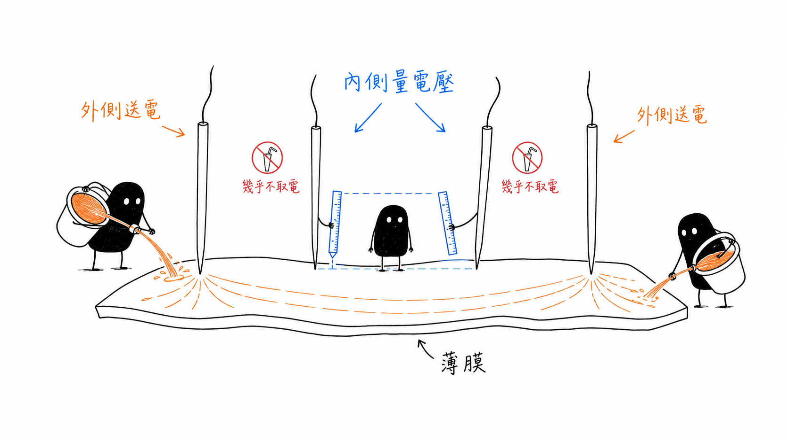

# Resistivity, Sheet Resistance, and Four-Point Probe

## 先分清楚這個電阻到底在說什麼

> **Learning Context**
>
> I had used resistance-related terms before, but I often let the material, geometry, and measurement setup blur together. Working through this topic helped me separate them. Resistivity describes the material. Sheet resistance brings in film thickness, while the resistance of a finished structure still depends on its shape.
>
> The four-point probe was also a useful reminder that a measured number includes the way it was obtained. Separating current injection from voltage sensing reduces the influence of lead and contact resistance, but it does not remove non-uniform films, edge effects, temperature changes, or poor probe contact.

## Short English Note

This note separates resistivity, sheet resistance, and the resistance of a finished structure, then follows the assumptions behind a four-point-probe measurement. The project connection is limited to wafer-map traceability: optical and electrical maps may be compared, but neither identifies a shared root cause without additional evidence.

## 1. 三個名字很像，但不是同一個量

這一篇原本只是想複習四點探針，結果真正花時間整理的，反而是更前面的問題：量到的電阻值，究竟有多少來自材料本身，又有多少是幾何和量測方式帶進來的？

電阻、電阻率和片電阻的名字很接近，單位也都帶有 $\Omega$。讀到後面時常要倒回來確認，公式中的數值到底在描述材料、薄膜，還是已經做好的結構。先把它們放在一起：

| Quantity | 符號 | 這裡的理解 |
| --- | --- | --- |
| Resistance | $R$ | 某個實際物件在指定幾何下呈現的電阻 |
| Resistivity | $\rho$ | 材料對電流傳導的本質阻礙程度 |
| Sheet resistance | $R_{\mathrm{sh}}$ | 將薄膜電阻率與厚度合併後，方便描述平面導電的量 |

這個單元統一使用 $R_{\mathrm{sh}}$ 表示 sheet resistance，之後的 $R_s$ 則保留給 diode series resistance。

這三個量沒有先拆開，後面的四點探針公式就算代得出數字，也很容易說不清楚到底量到了什麼。

## 2. 先從最熟悉的電阻式開始

對截面均勻、材料性質差異不大的導體，可以先使用：

$$
R=\rho\frac{L}{A}
$$

其中：

- $R$：電阻；
- $\rho$：電阻率；
- $L$：電流通過的長度；
- $A$：垂直於電流方向的截面積。

這個式子很熟悉，不過也正好提醒了一件容易被省略的事：路徑變長，電阻會增加；截面積變大，電阻會降低。材料完全相同，只要尺寸不同，最後量到的 $R$ 就不一樣。

所以只說「這個材料的電阻是多少」其實不太完整。試片的長度、寬度和厚度都不知道時，$R$ 不能直接當成材料本身的特性。

電阻率 $\rho$ 才比較接近這裡想找的材料性質。它與 conductivity 的關係為：

$$
\rho=\frac{1}{\sigma}
$$

不過稱為材料性質，也不代表它永遠固定。溫度、摻雜、缺陷和材料狀態改變時，$\rho$ 仍然會變。這裡先把它理解成：在指定條件下，用電阻率把幾何造成的差異暫時分開。

## 3. 薄膜多了厚度這件事

接著把試片換成一層厚度均勻的長方形薄膜。截面積可以寫成：

$$
A=Wt
$$

代回電阻式：

$$
R=\rho\frac{L}{Wt}
$$

重新整理後：

$$
R=\left(\frac{\rho}{t}\right)\frac{L}{W}
$$

把厚度和電阻率放在一起，就得到片電阻：

$$
R_{\mathrm{sh}}=\frac{\rho}{t}
$$

最後得到：

$$
R=R_{\mathrm{sh}}\frac{L}{W}
$$

片電阻常用的單位是：

$$
\Omega/\square
$$

第一次看到「每方塊歐姆」時，方塊很像某種面積單位。實際上它只是利用正方形的 $L/W=1$：只要電流從一側流到相對側，在理想且均勻的薄膜中，不論方塊是 $1\ \mathrm{mm}$ 還是 $1\ \mathrm{cm}$，得到的電阻都相同。

$\Omega/\square$ 在量綱上仍然是歐姆。square 不是另一個物理單位，而是提醒使用者：這個數值描述的是薄膜，以及電流方向上的長寬比例。

> 圖 1：作者依個人課程筆記設計並重新整理；電阻率描述材料，厚度將它轉成片電阻，長寬比再決定實際結構的電阻。

## 4. 用方塊數看薄膜幾何

$L/W$ 可以先想成電流方向上串接了多少個方塊。這個說法不是完整推導，不過在看長條狀薄膜時很直觀。

例如，一段均勻薄膜的片電阻為：

$$
R_{\mathrm{sh}}=100\ \Omega/\square
$$

若它的長寬比為：

$$
\frac{L}{W}=10
$$

則總電阻為：

$$
\begin{aligned}
R
&=R_{\mathrm{sh}}\frac{L}{W}\\
&=(100\ \Omega/\square)(10\ \square)\\
&=1000\ \Omega
\end{aligned}
$$

算到這裡容易產生一種「已經得到電阻」的感覺，不過片電阻還不是元件最後的電阻。它只是先把材料和厚度合併起來，真正放進線路或測試結構後，仍然要乘上長寬比。

厚度的方向也可以順手檢查。若電阻率不變，薄膜越厚，片電阻應該越低。不過實際製程不會只讓一個條件改變，厚度、摻雜、微觀結構和缺陷都有可能一起影響結果，所以這個趨勢只能當成第一步判斷。

## 5. 兩點量測：一起量，也一起帶入誤差

最直接的兩點量測，是用同一對導線送電流並量電壓。接法很簡單，問題也在這裡：同一條路徑上的其他電阻會一起被量進來。

$$
R_{\mathrm{measured}}
=R_{\mathrm{sample}}
+2R_{\mathrm{wire}}
+2R_{\mathrm{contact}}
+R_{\mathrm{other}}
$$

除了試片本身，導線、探針接觸、表面氧化或污染，以及儀器的連接方式，都可能多帶入一些電阻。

如果試片約為 $1000\ \Omega$，額外混入 $2\ \Omega$，相對誤差大約只有 $0.2\%$。但若試片本身只有 $1\ \Omega$，同樣的 $2\ \Omega$ 已經比被測物還大。寄生電阻沒有變，量測的可信程度卻完全不同。

這裡還有一個名稱容易混淆。量測中的 contact resistance，可能只是探針和試片在當下接觸得不好；後面討論元件時遇到的 metal–semiconductor contact，則是元件本身的電性界面。兩者都叫接觸電阻，但不能當成同一個問題處理。

## 6. 多兩支探針，重點其實是工作分開了

四點量測真正有用的地方，不只是探針從兩支變成四支，而是把工作拆成兩組：

- 外側兩點負責通入電流；
- 內側兩點負責量測電位差。

電壓表的輸入阻抗很高，因此流入量測端的電流非常小。內側導線和接點既然幾乎沒有電流，產生的壓降也會小很多。試片電阻可以先近似寫成：

$$
R_{\mathrm{sample}}\approx\frac{V_{\mathrm{inner}}}{I_{\mathrm{outer}}}
$$

> 圖 2：作者依個人課程筆記設計並重新整理；外側探針建立電流路徑，內側探針讀取電位差，藉此降低量測導線與接點壓降的影響。

這裡也曾經理解得太快，把「降低接點影響」讀成「接點問題已經消失」。其實探針位置、接觸狀況、試片尺寸、離邊緣多遠、薄膜是否均勻，以及溫度，都還會留在結果裡。

## 7. 回到片電阻公式

對四支等間距探針，如果薄膜夠薄、試片相對探針間距夠大、材料接近均勻，而且量測位置離邊緣夠遠，片電阻可以寫成：

$$
R_{\mathrm{sh}}=\frac{\pi}{\ln 2}\frac{\Delta V}{I}
$$

因為：

$$
\frac{\pi}{\ln 2}\approx4.532
$$

所以也常寫成：

$$
R_{\mathrm{sh}}\approx4.532\frac{\Delta V}{I}
$$

看到 $4.532$ 後，最容易做的事就是直接代數字。不過試片尺寸有限、量測位置靠近邊緣或探針排列不同時，通常還要加入 correction factor：

$$
R_{\mathrm{sh}}=\frac{\pi}{\ln 2}\frac{\Delta V}{I}f
$$

$f$ 代表幾何修正。這一篇先記住它不是永遠等於 1；不同試片形狀和邊界該用哪個數值，等真正看到量測配置時再回來查表。

## 8. 先代一組簡單的數字

假設量測時通入：

$$
I=1\ \mathrm{mA}
$$

內側兩支探針量到：

$$
\Delta V=20\ \mathrm{mV}
$$

先算電壓與電流的比值：

$$
\frac{\Delta V}{I}
=\frac{20\ \mathrm{mV}}{1\ \mathrm{mA}}
=20\ \Omega
$$

暫時採用理想薄膜與標準探針配置：

$$
\begin{aligned}
R_{\mathrm{sh}}
&\approx4.532\frac{\Delta V}{I}\\
&=(4.532)(20\ \Omega)\\
&\approx90.6\ \Omega/\square
\end{aligned}
$$

如果之後用這層薄膜製作一段長寬比為 5 的結構：

$$
R\approx(90.6\ \Omega/\square)(5\ \square)
\approx453\ \Omega
$$

算到 $90.6\ \Omega/\square$ 並不難，比較容易漏掉的是它的前提。這個數字只代表目前位置和目前假設下的片電阻，不代表整片 wafer 都一樣，也看不出變化究竟來自厚度還是材料電阻率。

## 9. 畫成 map 之後，先知道哪裡不一樣

在 wafer 上量測多個位置後，就能把片電阻整理成 map。若中心、邊緣或某個方向反覆出現高低差，至少知道變化不是隨機散落的。到這一步，才比較有理由回頭看薄膜沉積、摻雜、熱處理或其他製程條件。

不過 map 先回答的是「哪裡不同」，還沒有回答「為什麼不同」。同一個高片電阻區域，可能來自：

- 薄膜較薄；
- 材料電阻率較高；
- 載子濃度或 mobility 改變；
- 製程均勻性問題；
- 探針接觸或幾何修正不足。

片電阻 map 比單一平均值多了空間資訊，已經很有用。不過 map 主要回答的是位置，不是機制。要再往根因走，還是需要厚度量測、製程紀錄，或其他電性與材料證據一起確認。

## 10. A Small Connection to Wafer Maps

While reading about sheet-resistance mapping, I thought about the spatial records in the wafer-inspection runtime I had built.

An inspection result was linked to a wafer session, camera, ROI, timestamp, and measurement position. Those fields were originally kept for runtime debugging, result review, and traceability. A sheet-resistance map belongs to a different physical measurement, but it raises a similar data question: can every value be traced back to the same wafer orientation, coordinate system, probe condition, and measurement time?

An optical map and an electrical map may later show similar spatial patterns. That can justify a closer comparison, but it does not prove that they share the same cause. Before comparing them, the wafer identity, orientation, coordinate systems, sampling resolution, and acquisition conditions would all need to be aligned.

The connection here is only about spatial traceability. My inspection system did not measure resistivity or sheet resistance.

## 11. 目前寫在公式旁邊的檢查

整理完後，先把容易忘記的事情留在這裡：

1. 看到 $R$ 時，先確認它是材料、薄膜，還是實際結構的量。
2. 使用 $R_{\mathrm{sh}}=\rho/t$ 前，確認厚度與電阻率單位相容。
3. 使用「方塊數」時，確認電流方向對應的是 $L/W$，不要把長寬顛倒。
4. 看到四點探針結果時，先確認幾何條件與 correction factor 是否適用。
5. 解讀 wafer map 時，把空間差異和根因判斷分開。
6. 注入電流是否造成自熱，或讓接觸偏離近似歐姆行為。
7. 如果要由 $R_{\mathrm{sh}}$ 回推 $\rho$，薄膜厚度是否由獨立方法量測，而且能代表目前的量測位置。
8. 正反向電流量測是否一致，是否需要排除熱電勢或儀器 offset。

這一篇先停在片電阻與四點探針。接觸電阻要如何透過測試結構分離，留到下一篇再慢慢整理。

## Questions Left Open

- 探針間距、wafer 尺寸和量測位置改變時，correction factor 要如何選擇？
- 對非常薄或不均勻的薄膜，四點探針模型會先在哪個假設失效？
- 若片電阻 map 與光學異常位置重疊，還需要哪些證據才能建立合理的製程假設？

## References

1. Arizona State University, [*Electrical Characterization: Diodes*](https://www.coursera.org/learn/electrical-characterization-diodes), Coursera.
2. F. M. Smits, [“Measurement of Sheet Resistivities with the Four-Point Probe,”](https://doi.org/10.1002/j.1538-7305.1958.tb03883.x) *Bell System Technical Journal*, vol. 37, no. 3, pp. 711–718, 1958.
