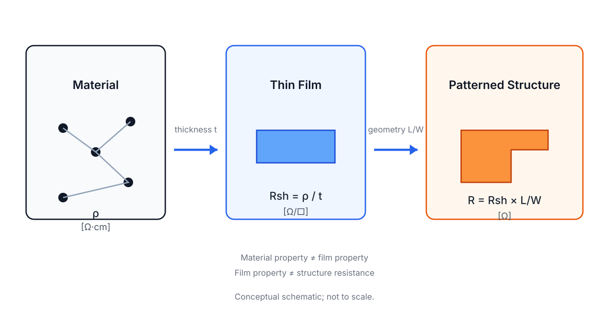
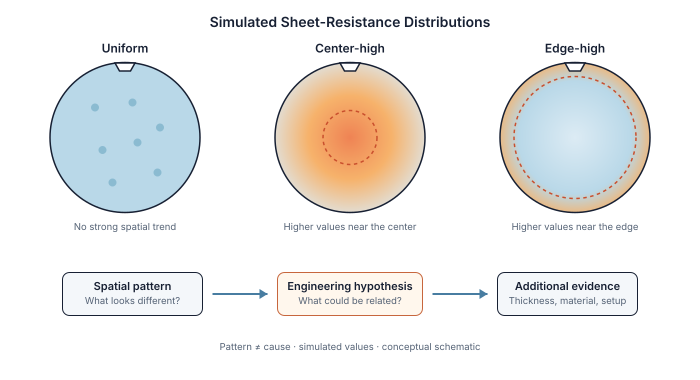

# Resistivity, Sheet Resistance, and Four-Point Probe

## 先分清楚這個電阻到底在說什麼

> **Learning Context**
>
> I had used resistance-related terms before, but I often let material, geometry, and measurement setup blur together. This note separates them first, then follows the assumptions behind a four-point-probe result.
>
> What confused me most was that the same word, "resistance," could refer to the material, the film, or the finished geometry depending on what I was looking at.

以前看到 resistance、resistivity 和 sheet resistance，常常先把它們當成同一類問題。真正開始算之後，才發現三個數值描述的層次並不一樣：有些比較接近材料，有些已經把薄膜厚度放進去，有些則還受到元件幾何與量測方式影響。

## 1. Resistance、Resistivity 和 Sheet Resistance

| Quantity | 符號 | 這裡的理解 |
| --- | --- | --- |
| Resistance | $R$ | 某個實際結構在指定幾何下呈現的電阻 |
| Resistivity | $\rho$ | 材料在指定條件下對電流傳導的阻礙程度 |
| Sheet resistance | $R_{\mathrm{sh}}$ | 將薄膜電阻率與厚度合併後，用來描述平面導電的量 |

這一組筆記統一使用 $R_{\mathrm{sh}}$ 表示 sheet resistance，$R_s$ 則保留給 diode series resistance。三個量沒有先拆開，後面的四點探針公式就算代得出數字，也很容易說不清楚到底量到了什麼。

## 2. 從材料到薄膜：為什麼會出現片電阻

> 圖 1：先用比較直觀的方式分開材料、薄膜厚度與結構幾何。這張圖幫忙抓住方向，下面再把關係放回公式。

對截面均勻、材料性質差異不大的導體，可以先使用：

$$
R=\rho\frac{L}{A}
$$

$R$ 會隨電流路徑 $L$ 增加而增加，也會隨截面積 $A$ 增加而降低。因此同一種材料做成不同尺寸，量到的 resistance 仍然可能不同。電阻率 $\rho$ 比較接近材料層次，但溫度、摻雜、缺陷和材料狀態改變時，它也不會永遠固定。

薄膜的截面積可以寫成 $A=Wt$，所以：

$$
R=\rho\frac{L}{Wt}=\left(\frac{\rho}{t}\right)\frac{L}{W}
$$

把電阻率和厚度合併後得到：

$$
R_{\mathrm{sh}}=\frac{\rho}{t},\qquad R=R_{\mathrm{sh}}\frac{L}{W}
$$

$R_{\mathrm{sh}}$ 常用 $\Omega/\square$ 表示。這裡的 square 不是另一個面積單位，只是利用正方形的 $L/W=1$ 來描述薄膜幾何。若 $R_{\mathrm{sh}}=100\ \Omega/\square$，而結構的 $L/W=10$，理想情況下：

$$
R=(100\ \Omega/\square)(10\ \square)=1000\ \Omega
$$

這個例子只是在提醒：片電阻已經包含材料與厚度，但還不是最後元件的 resistance。

> 圖 2：把前面的關係收回工程量：材料電阻率經過薄膜厚度後形成 sheet resistance，放進圖案化結構時還要考慮長寬比；概念示意，不按比例。

## 3. Two-Point Measurement 會把其他電阻一起量進來

最直接的兩點量測，是用同一對導線送電流並量電壓：

$$
R_{\mathrm{measured}}=R_{\mathrm{sample}}+2R_{\mathrm{wire}}+2R_{\mathrm{contact}}+R_{\mathrm{other}}
$$

除了試片本身，導線、探針接觸、表面氧化或污染，以及儀器連接方式，都可能一起進入數值。試片約為 $1000\ \Omega$ 時，額外混入 $2\ \Omega$ 只約是 $0.2\%$；但試片只有 $1\ \Omega$ 時，同樣的寄生電阻就可能比被測物還大。

量測中的 contact 可能只是探針和試片當下接觸不穩；元件裡的 metal–semiconductor contact 則是結構本身的電性界面。名稱相近，問題不一定相同。

## 4. Four-Point Probe：把送電流和量電壓分開

四點量測真正有用的地方，不只是探針從兩支變成四支，而是工作被拆成兩組：外側兩點負責通入電流，內側兩點負責量測電位差。因為電壓表輸入阻抗很高，流入內側量測端的電流非常小，內側導線和接點造成的壓降也會小很多。

量到這裡，可以先得到內側電位差和外側電流的比值：

$$
\frac{\Delta V_{\mathrm{inner}}}{I_{\mathrm{outer}}}
$$

看到單位是 $\Omega$，很容易順手把它叫成 sample resistance。不過這一步還沒得到 sheet resistance；probe configuration、sample geometry 和 correction factor 都還沒有放進來。下一節的 $4.532$，就是把其中一組理想配置接回 $R_{\mathrm{sh}}$ 的幾何因子。

> 圖 3：外側探針建立電流路徑，內側探針讀取電位差，藉此降低量測導線與接點壓降的直接影響。

這裡不能把「降低接點影響」讀成「接點問題消失」。探針位置、接觸狀況、試片尺寸、離邊緣的距離、薄膜均勻性和溫度，都可能留在結果裡。

## 5. 4.532 不是沒有條件的常數

對四支等間距探針，如果薄膜夠薄、試片相對探針間距夠大、材料接近均勻，而且量測位置離邊緣夠遠：

$$
R_{\mathrm{sh}}=\frac{\pi}{\ln 2}\frac{\Delta V}{I}\approx4.532\frac{\Delta V}{I}
$$

試片尺寸有限、量測位置靠近邊緣或探針排列不同時，通常要加入幾何修正：

$$
R_{\mathrm{sh}}=\frac{\pi}{\ln 2}\frac{\Delta V}{I}f
$$

$f$ 代表 correction factor，不是固定等於 1，該用哪個值要看試片形狀、探針間距和量測位置。

假設 $I=1\ \mathrm{mA}$、$\Delta V=20\ \mathrm{mV}$，則 $\Delta V/I=20\ \Omega$。在理想薄膜與標準探針配置下：

$$
R_{\mathrm{sh}}\approx4.532(20\ \Omega)\approx90.6\ \Omega/\square
$$

這個數值代表目前位置和目前假設下的片電阻，不代表整片 wafer 都一樣，也看不出變化究竟來自厚度還是材料電阻率。

## 6. Wafer Map 先回答哪裡不同

在 wafer 上量測多個位置後，可以把 sheet resistance 整理成 map。若中心、邊緣或某個方向反覆出現高低差，至少知道變化不是隨機散落的。

但 map 先回答的是「哪裡不同」，還沒有回答「為什麼不同」。高片電阻區域可能來自薄膜較薄、材料電阻率較高、載子濃度或 mobility 改變、製程均勻性問題，或探針接觸與幾何修正不足。

因此 map 比單一平均值多了空間資訊，卻不能單獨命名 process cause。要再往下走，還需要厚度量測、製程紀錄，或其他電性與材料證據。這也接到 [WAT Test Structures and Yield Signals](../04-ic-process-monitoring-and-failure-analysis/02-wat-test-structures-and-yield-signals.md)：一個分布要放回測試結構與 wafer 位置，才比較有機會和後續 product behavior 對上。

> 圖 4：Uniform、center-high 和 edge-high 是模擬的空間分布，只用來比較 pattern。看到 pattern 後可以形成 hypothesis，但仍要靠厚度、材料、量測條件或製程紀錄繼續檢查。

## Comparing Maps Needs More Than Similar Shapes

While reading about sheet-resistance mapping, I thought about the spatial records in a wafer-inspection runtime I had built.

An inspection result was linked to a wafer session, camera, ROI, timestamp, and measurement position. A sheet-resistance map belongs to a different physical measurement, but it raises a similar data question: can every value be traced back to the same wafer orientation, coordinate system, probe condition, and measurement time?

An optical map and an electrical map may show similar spatial patterns. That can justify a closer comparison, but it does not prove that they share the same cause. Before comparing them, wafer identity, orientation, coordinate systems, sampling resolution, and acquisition conditions would all need to be aligned.

## What I Would Check Next

- 量測 map 出現 center-edge pattern 時，如何區分 film thickness、material resistivity 與量測邊界效應？
- 同一個 $R_{\mathrm{sh}}$ shift 要和哪一組 process 或 WAT evidence 對照，才值得往下一步追？

## References

- Arizona State University, [*Electrical Characterization: Diodes*](https://www.coursera.org/learn/electrical-characterization-diodes), Coursera.
- F. M. Smits, [“Measurement of Sheet Resistivities with the Four-Point Probe,”](https://doi.org/10.1002/j.1538-7305.1958.tb03883.x) *Bell System Technical Journal*, vol. 37, no. 3, pp. 711–718, 1958.
