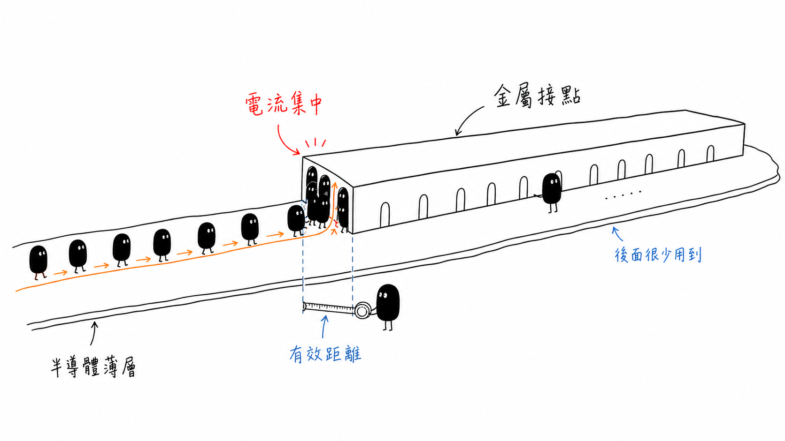
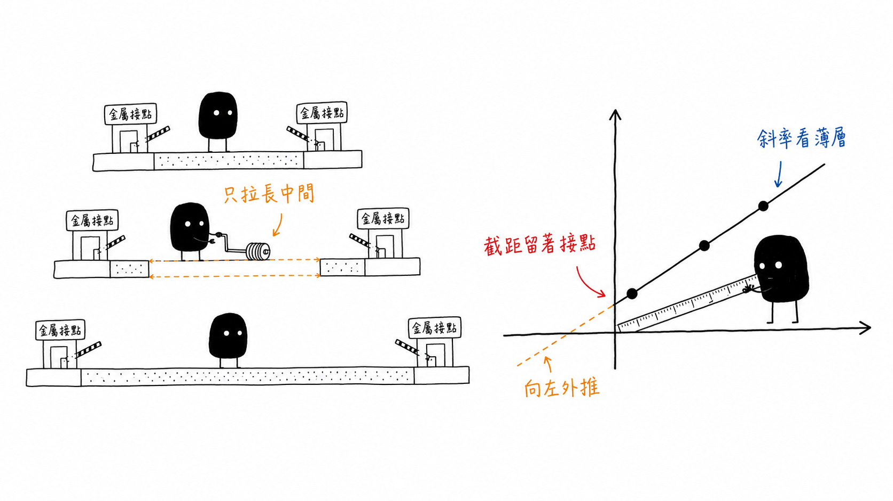

# Contact Resistance and the Transfer Length Method

## 從總電阻中拆出接點的影響

> **Learning Context**
>
> The previous note used four-point sensing to reduce resistance from the measurement leads and probe contacts. This chapter deals with a different problem: the metal–semiconductor contact is part of the device itself, so its resistance cannot simply be removed by changing the meter connection.
>
> TLM became easier to follow once I treated it as a separation problem. The contact dimensions stay the same while the gap between contacts changes. That produces a line whose slope describes the semiconductor layer and whose intercept keeps the contribution of the two contacts.

## Short English Note

This note follows current crowding, transfer length, and the assumptions behind a linear TLM fit. The project connection is limited to one software habit: fitted values should remain traceable to their raw data, geometry, fitting range, and measurement conditions.

## 1. 先把兩種接觸問題分開

前一篇提到，探針碰到試片時可能多帶入一些 contact resistance。四點量測把送電和量電壓分開，就是為了降低這類量測接點與導線造成的影響。

這一篇的接觸電阻不是同一件事。這次要處理的是金屬電極與半導體接觸後，界面本身成為元件的一部分：

| 情況 | 接觸發生在哪裡 | 主要問題 |
| --- | --- | --- |
| Measurement contact | 探針與測試表面之間 | 量測路徑額外帶入的電阻 |
| Device contact | 金屬與半導體之間 | 元件本身需要承擔的接觸電阻 |

換成四條導線，可以降低第一種影響；第二種則不能靠接線方式直接消失。它需要另外設計測試結構，再從量測結果中拆出來。

## 2. 金屬和半導體接在一起，界面仍可能阻礙電流

金屬與半導體看起來已經接觸，不代表電流可以毫無阻礙地通過。界面可能受到下列因素影響：

- 表面氧化或污染；
- 材料與晶格結構不連續；
- 金屬—半導體能障；
- 界面粗糙度與缺陷；
- 接點下方的摻雜與載子濃度；
- 接觸面積與實際電流分布。

某一個實際接點造成的電阻以 $R_c$ 表示，單位是 $\Omega$。如果只比較 $R_c$，尺寸不同的接點很難放在一起判斷，因此還需要 specific contact resistivity：

$$
\rho_c
=R_cA
$$

在電流近似均勻通過接觸面、接點接近 ohmic，而且使用小訊號斜率的簡化條件下：

$$
R_c
\approx\frac{\rho_c}{A}
$$

$\rho_c$ 常用的單位是：

$$
\Omega\cdot\mathrm{cm^2}
$$

這裡的平方公分是面積，因此和材料電阻率 $\rho$ 的 $\Omega\cdot\mathrm{cm}$ 不同。幾個量放在一起時，可以先用單位快速檢查：

| Quantity | 符號 | 常見單位 |
| --- | --- | --- |
| Resistance | $R$ | $\Omega$ |
| Resistivity | $\rho$ | $\Omega\cdot\mathrm{cm}$ |
| Sheet resistance | $R_{\mathrm{sh}}$ | $\Omega/\square$ |
| Specific contact resistivity | $\rho_c$ | $\Omega\cdot\mathrm{cm^2}$ |

本篇使用 $R_{\mathrm{sh}}$ 表示 sheet resistance，避免和二極體模型中的 series resistance $R_s$ 混淆。

## 3. 面積公式有用，但不能太早相信

若：

$$
\rho_c=1.0\times10^{-6}\ \Omega\cdot\mathrm{cm^2}
$$

接點面積為：

$$
A=1.0\times10^{-4}\ \mathrm{cm^2}
$$

暫時假設電流分布均勻：

$$
\begin{aligned}
R_c
&=\frac{\rho_c}{A}\\
&=\frac{1.0\times10^{-6}}{1.0\times10^{-4}}\\
&=1.0\times10^{-2}\ \Omega
\end{aligned}
$$

若面積縮小為原本的十分之一，接觸電阻會增加十倍。這個方向很直觀，不過這個式子主要用來建立面積變化的概念。

實際平面接點通常還有 current crowding。電流先沿著半導體薄層水平移動，接近接點後才轉向進入金屬。靠近接點前緣的路徑較短，因此幾何面積不一定等於被均勻使用的有效導電面積。

這種現象稱為 current crowding。

> 圖 1：作者依個人課程筆記設計並重新整理；電流由半導體薄層進入金屬時，主要集中在接點前緣，較深處的物理面積不一定被同等使用。

## 4. Transfer length 是被大量使用的那一段

Transfer length 以 $L_T$ 表示，可以先理解成：

> 電流從半導體薄層轉移進入金屬時，主要使用的有效接觸距離。

若接點本身很長，但 $L_T$ 很短，大部分電流仍集中在邊緣附近。繼續把接點往後延長，接觸電阻不一定會按照物理面積同比例下降。

在標準 TLM 模型下：

$$
L_T
=\sqrt{\frac{\rho_c}{R_{\mathrm{sh}}}}
$$

這個關係把界面與薄層放在一起：

- $\rho_c$ 較高，電流較不容易向上進入金屬，$L_T$ 會增加；
- $R_{\mathrm{sh}}$ 較高，電流較不容易沿薄層向內分布，$L_T$ 會縮短。

也就是說，$L_T$ 不是只由接點面積決定。它同時受到接觸界面品質與半導體薄層片電阻影響。

## 5. TLM 為什麼要做不同間距

Transfer length method 會在同一層材料上製作多個幾何相同的金屬接點，但刻意改變接點之間的距離 $D$。

這裡先把幾個容易畫反的方向列出來：

| 符號 | 意義 |
| --- | --- |
| $D$ | 相鄰接點之間的間距 |
| $Z$ | 垂直於電流方向的接點寬度 |
| $L_c$ | 電流進入接點方向上的接點長度 |
| $L_T$ | 電流由薄層轉移進入金屬的特徵長度 |

圖 2 主要表達 $D$ 的改變，$Z$ 與 $L_c$ 沒有按比例畫出。真正解讀測試結構時，這三個方向仍然需要回到版圖或尺寸圖確認。

在薄層均勻、接點接近 ohmic、接點寬度一致，而且 $L_c$ 相對 $L_T$ 足夠大的標準線性 TLM 近似下，兩個接點之間量到的總電阻可以先拆成：

$$
R_{\mathrm{total}}
=R_c+R_{\mathrm{layer}}+R_c
$$

若接點寬度為 $Z$，中間薄層的電阻為：

$$
R_{\mathrm{layer}}
=R_{\mathrm{sh}}\frac{D}{Z}
$$

因此：

$$
R_{\mathrm{total}}
=\frac{R_{\mathrm{sh}}}{Z}D+2R_c
$$

這裡的設計很巧。接點尺寸和製程保持不變，改變的只有中間距離：

- 距離增加時，薄層電阻增加；
- 左右兩個接觸電阻理想上保持不變。

把不同間距的總電阻放到同一張圖後，就有機會將兩種貢獻分開。

對每一個接點間距，$R_{\mathrm{total}}$ 最好由選定線性偏壓區的 I–V 斜率取得，而不是只使用單一電壓與電流點。若 I–V 本身已經明顯彎曲，一個 $V/I$ 數值就不能代表穩定的歐姆電阻，後面的直線擬合也失去原本的前提。

> 圖 2：作者依個人課程筆記設計並重新整理；只改變接點間距後，直線斜率對應薄層電阻，縱軸截距保留兩個接點的影響，向左外推則可取得傳輸長度。圖中只表達間距變化，接點寬度與長度未按比例繪製。

## 6. 直線上的三個讀值

若將 $R_{\mathrm{total}}$ 放在縱軸，接點距離 $D$ 放在橫軸，線性式可以和：

$$
y=mx+b
$$

對照。

### 斜率：先找片電阻

斜率為：

$$
m=\frac{R_{\mathrm{sh}}}{Z}
$$

所以：

$$
R_{\mathrm{sh}}=mZ
$$

若橫軸直接使用距離，斜率不是片電阻本身。還要乘上接點寬度 $Z$，才能得到 $R_{\mathrm{sh}}$。

### 縱軸截距：留下兩個接點

當距離外推到零：

$$
R_{\mathrm{total}}=2R_c
$$

因此縱軸截距 $b$ 對應兩個接點：

$$
R_c=\frac{b}{2}
$$

把截距直接當成單一接點電阻，會多算一倍。這是很容易在圖上讀錯的地方。

### 橫軸截距：得到 transfer length

將直線向左外推到總電阻為零，理想 TLM 模型下：

$$
D_{\mathrm{x}}=-2L_T
$$

所以：

$$
L_T
=\frac{\left|D_{\mathrm{x}}\right|}{2}
$$

負號不是說傳輸長度小於零。它只是直線外推後落在座標軸左側的數學位置。

## 7. 用一組課程數據重新算一次

課程示例中的接點距離和總電阻約為：

| 接點距離 $D$ | 總電阻 $R_{\mathrm{total}}$ |
| ---: | ---: |
| $10\ \mu\mathrm{m}$ | $7.0\ \Omega$ |
| $20\ \mu\mathrm{m}$ | $11.0\ \Omega$ |
| $30\ \mu\mathrm{m}$ | $15.5\ \Omega$ |
| $40\ \mu\mathrm{m}$ | $19.8\ \Omega$ |

直線擬合後，可以近似寫成：

$$
R_{\mathrm{total}}
\approx
\left(0.429\ \Omega/\mu\mathrm{m}\right)D
+2.6\ \Omega
$$

這裡 $D$ 使用 $\mu\mathrm{m}$。斜率的單位是 $\Omega/\mu\mathrm{m}$，和距離相乘後才會回到總電阻的 $\Omega$。

### 接觸電阻

縱軸截距約為：

$$
2R_c\approx2.6\ \Omega
$$

所以單一接點：

$$
R_c\approx1.3\ \Omega
$$

### 片電阻

若接點寬度為：

$$
Z=48\ \mu\mathrm{m}
$$

則：

$$
\begin{aligned}
R_{\mathrm{sh}}
&=mZ\\
&\approx
\left(0.429\ \Omega/\mu\mathrm{m}\right)
\left(48\ \mu\mathrm{m}\right)\\
&\approx20.6\ \Omega/\square
\end{aligned}
$$

### Transfer length

橫軸截距約為：

$$
D_{\mathrm{x}}
=-\frac{2.6\ \Omega}
{0.429\ \Omega/\mu\mathrm{m}}
\approx-6.1\ \mu\mathrm{m}
$$

因此：

$$
L_T
\approx\frac{6.1}{2}
\approx3.0\ \mu\mathrm{m}
$$

這個結果表示，大部分電流主要由接點邊緣約 $3\ \mu\mathrm{m}$ 的範圍進入金屬。它不是說後面的接點完全沒有電流，而是貢獻會快速減少。

### Specific contact resistivity

在這組標準 TLM 近似下：

$$
\rho_c
=R_{\mathrm{sh}}L_T^2
$$

先換算：

$$
3.0\ \mu\mathrm{m}
=3.0\times10^{-4}\ \mathrm{cm}
$$

代入後：

$$
\begin{aligned}
\rho_c
&\approx
\left(20.6\ \Omega/\square\right)
\left(3.0\times10^{-4}\ \mathrm{cm}\right)^2\\
&\approx1.85\times10^{-6}\ \Omega\cdot\mathrm{cm^2}
\end{aligned}
$$

由於前面的圖表讀值和直線係數都經過取近似，這裡保留約兩位有效數字已經足夠。

## 8. 直線不漂亮時，先不要急著讀截距

TLM 的計算很像一個簡單的 linear regression，但物理假設比擬合函式更重要。若量測點明顯彎曲或散布很大，仍然強行畫一條直線，截距可以算出來，卻不一定代表可靠的 $R_c$。

常見需要回頭檢查的情況包括：

- 接點沒有呈現近似 ohmic 的 I–V；
- 不同接點的尺寸或製程狀態不一致；
- 薄層片電阻沿測試結構改變；
- 接點間距太短，兩側電流轉移區域互相影響；
- 接點長度相對 $L_T$ 不夠長；
- 探針接觸不穩定；
- 量測電流造成自熱；
- 選擇的擬合範圍只留下看起來較直的點。

$R_{\mathrm{sh}}$ 主要來自斜率，$R_c$ 則來自外推到 $D=0$ 的截距。當距離範圍太窄、資料點太少或電阻散布較大時，截距往往比斜率更敏感。除了 $R^2$，還需要查看截距的信賴區間與 residual pattern。

若擬合得到負的縱軸截距，也不應直接報告負接觸電阻。這比較像是一個需要停下來檢查的訊號：儀器 offset、接點幾何、薄層不均勻或模型假設，至少有一項可能沒有處理好。

所以這一段最值得保留的，不只是斜率和截距公式，而是先看原始點、I–V 線性、殘差和量測條件。直線只是模型成立後的結果。

## 9. A Small Note on Keeping Fits Reviewable

TLM is not closely related to the optical inspection systems I built, so I would not treat it as a direct project example. But one part felt familiar: keeping a result reviewable.

In model evaluation, a final score was not enough if the dataset version, threshold, configuration, and raw predictions were missing. A fitted contact resistance has a similar limitation: the value is much less useful without the original spacing and resistance points, contact geometry, current range, fitting window, residuals, temperature, and sample identity.

The connection ends there. My inspection systems did not measure contact resistance. This was simply a useful reminder that a fitted parameter should not become detached from the data that produced it.

## 10. 目前寫在圖旁邊的檢查

1. 目前討論的是量測接點，還是元件內部的金屬—半導體接點？
2. $\rho_c$ 的單位是否包含面積，而且沒有和 $\rho$、$R_{\mathrm{sh}}$ 或 series resistance $R_s$ 混在一起？
3. TLM 斜率是否已乘上接點寬度 $Z$？
4. 縱軸截距代表兩個接點，還是已經除以 2？
5. 橫軸截距的負號是否只被當成外推位置？
6. 擬合前是否先確認各組 I–V 接近線性？
7. 原始量測點、幾何、擬合範圍與 residual 是否仍然保留？
8. 接點長度 $L_c$ 相對 $L_T$ 是否足以使用標準 TLM 近似？

這一篇先停在接觸電阻、current crowding 和 TLM。下一篇再回到 diode I–V，整理理想因子、串聯電阻，以及 process monitor 可以支持哪些判斷。

## Questions Left Open

- 接點不是 ohmic 時，TLM 圖會先在哪一個區域偏離直線？
- 接點間距接近 transfer length 時，兩側電流分布要如何修正？
- 若殘差具有固定方向，如何區分薄膜不均勻、接點製程差異與量測問題？

## References

1. Arizona State University, [*Electrical Characterization: Diodes*](https://www.coursera.org/learn/electrical-characterization-diodes), Coursera.
