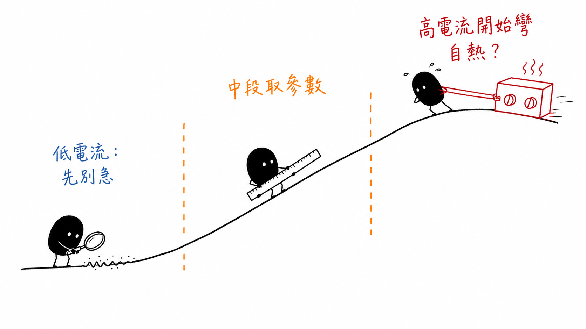
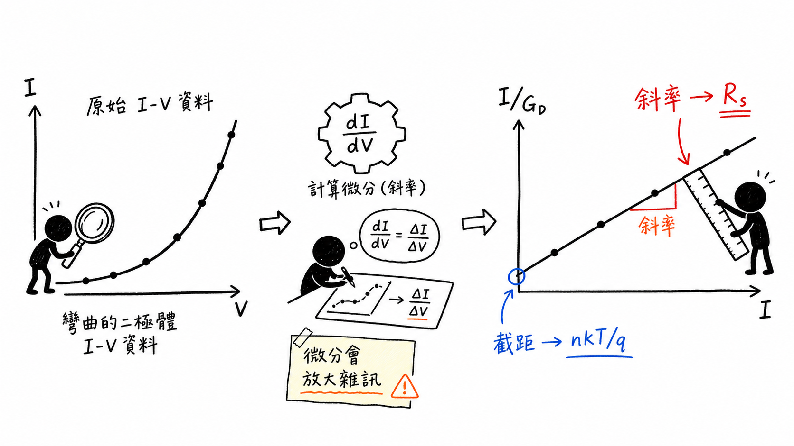
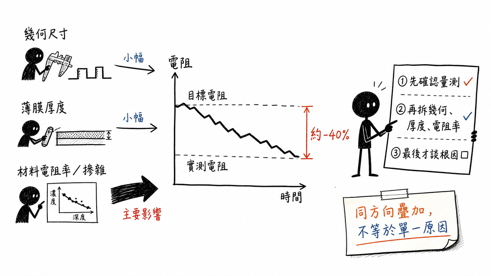

# Diode Parameters and Process Monitoring

## 先把曲線分段，再回頭看製程

> **Learning Context**
>
> After learning the basic p–n junction model, I still tended to read a diode I–V curve as one result: normal or abnormal. This note takes a slower approach. The low-, medium-, and high-current regions do not carry the same information, and forcing one equation across the full curve can hide the mechanism I am trying to estimate.
>
> The second half follows a process-monitor example in which a polysilicon resistor measured about 40% below its target. The useful part was not finding one cause quickly. It was learning to separate geometry, film thickness, and resistivity before deciding what the electrical result could actually support.

## Short English Note

This note separates the regions used to estimate diode parameters, then works through a polysilicon process-monitor example in which geometry, thickness, and resistivity change in the same direction. The project connection is limited to keeping warnings traceable to their measurement conditions, wafer context, and later verification.

## 1. 這次先不重畫 p–n 接面

前面的半導體筆記已經整理過空乏區、內建電場，以及順向與逆向偏壓下的基本行為。這次先不把同一套圖再畫一次，直接接著看一個比較接近量測的問題：

> 已經取得一條二極體 I–V 曲線後，可以從哪一段讀出哪些參數？

理想二極體方程式為：

$$
I
=
I_0
\left[
\exp\left(\frac{qV}{nkT}\right)-1
\right]
$$

其中：

| 符號 | 意義 |
| --- | --- |
| $I$ | 二極體電流 |
| $I_0$ | 反向飽和電流，也常寫成 $I_S$ |
| $q$ | 元電荷 |
| $V$ | 二極體兩端電壓 |
| $n$ | ideality factor |
| $k$ | 波茲曼常數 |
| $T$ | 絕對溫度 |

公式本身不算長，真正容易混亂的是：實際曲線不會從頭到尾都維持理想的指數行為。看的區間不同，能讀到的東西也不一樣。

## 2. 同一條 I–V 曲線，要分區看

整理課程圖時，先把順向 I–V 曲線粗略切成三段：

1. **低電流區**：訊號較小，漏電、儀器解析度、接觸狀態與其他非理想效應可能更明顯。
2. **中間指數區**：半對數圖較接近直線，適合估計 $I_0$ 與 $n$。
3. **高電流區**：series resistance 的壓降逐漸不可忽略，曲線開始偏離理想指數關係。

> 圖 1：作者依個人課程筆記設計並重新整理；低電流區先留意弱訊號與非理想效應，中間區用來估計指數模型參數，高電流區則開始受到串聯電阻與可能的自熱影響。

這三段沒有一條固定的分界線。先這樣切開，只是提醒自己不要拿同一個模型硬套整條曲線；最後還是要回到元件、溫度、儀器範圍和實際數據判斷。

## 3. 中間直線區可以估計飽和電流

當順向電壓相對熱電壓已經夠大，指數項遠大於 1，式子可以先簡化成：

$$
I
\approx
I_0
\exp\left(\frac{qV}{nkT}\right)
$$

取自然對數後：

$$
\ln I
\approx
\ln I_0
+
\frac{q}{nkT}V
$$

換到 $\ln I$ 對 $V$ 的圖上，中間指數區應該接近直線。把這一段往 $V=0$ 外推，電流截距就能拿來估計 $I_0$。

課程示例讀到的量級約為：

$$
I_0
\approx
1\times10^{-10}\ \mathrm{A}
$$

先記一個容易誤解的地方：這個數值是從直線區外推得到，不是說二極體在零偏壓下真的持續流過同樣大小的淨電流。擬合範圍一換，截距也可能跟著移動，所以 $I_0$ 最好不要脫離原始曲線、溫度和 fitting window 單獨保存。

## 4. 直線斜率對應 ideality factor

由：

$$
\ln I
=
\ln I_0
+
\frac{q}{nkT}V
$$

可得半對數圖的斜率：

$$
\frac{d\ln I}{dV}
=
\frac{q}{nkT}
$$

因此：

$$
n
=
\frac{q}{kT}
\left(
\frac{d\ln I}{dV}
\right)^{-1}
$$

在室溫附近：

$$
\frac{kT}{q}
\approx
25.8\ \mathrm{mV}
$$

$n$ 可以先提供一個方向，看看選定區間比較接近哪一類傳輸行為：

- $n$ 接近 1：通常較接近擴散主導；
- $n$ 接近 2：空乏區中的復合可能較明顯；
- $n$ 明顯小於 1 或大於 2：先檢查擬合區間、series resistance、漏電、溫度和量測設定，不急著替它指定單一物理原因。

所以 ideality factor 不是愈小就一定愈好。它是從某一段偏壓區間算出來的參數，離開原本的曲線和條件後，意義也會變得很有限。

## 5. 高電流區開始彎，先想到 series resistance

實際二極體不只有接面，接觸、半導體區域與金屬導線都會帶入 series resistance。把 $R_s$ 放進模型後：

$$
I
=
I_0
\left[
\exp\left(
\frac{q\left(V-IR_s\right)}{nkT}
\right)-1
\right]
$$

外加電壓可先拆成：

$$
V
=
V_D+IR_s
$$

電流不大時，$IR_s$ 很小，外加電壓大多落在二極體接面上。電流增加後，series resistance 吃掉的電壓愈來愈多，因此半對數曲線會逐漸偏離中段的直線。

這裡順便記一下符號。$R_s$ 是二極體的 series resistance；前兩篇的 $R_{\mathrm{sh}}$ 是 sheet resistance。兩個長得很像，但不是同一個量。

## 6. 想辦法把彎曲的資料拉成直線

只靠肉眼看高電流區彎了多少，很難穩定估計 $R_s$。課程裡先引入 differential conductance：

$$
G_D
=
\frac{dI}{dV}
$$

在順向指數項遠大於 1 的近似下，將含有 $R_s$ 的方程式重新整理，可以得到：

$$
\frac{I}{G_D}
=
\frac{nkT}{q}
+
IR_s
$$

整理完之後，它剛好和直線：

$$
y=b+mx
$$

有相同形式。橫軸放 $I$、縱軸放 $I/G_D$ 時：

- 斜率對應 $R_s$；
- 縱軸截距對應 $nkT/q$；
- 有了溫度後，可以再由截距估計 $n$。

> 圖 2：作者依個人課程筆記設計並重新整理；先由原始 I–V 資料計算微分電導，再將 $I/G_D$ 對 $I$ 作圖。斜率與截距可分別用來估計 $R_s$ 與 $n$，不過微分也會放大量測雜訊。

課程示例中的直線斜率約為：

$$
0.01\ \mathrm{V/mA}
$$

換算後：

$$
\begin{aligned}
R_s
&=
0.01\ \mathrm{V/mA}\\
&=
10\ \mathrm{V/A}\\
&=
10\ \Omega
\end{aligned}
$$

若縱軸截距約為 $0.0295\ \mathrm{V}$，室溫下可估得：

$$
\begin{aligned}
n
&=
\frac{0.0295}{0.0258}\\
&\approx
1.14
\end{aligned}
$$

算到這裡約為 $1.14$。不過如果數值本來就是從圖上讀的，寫成約 $1.1$ 至 $1.2$ 比保留很多小數位更實際。

## 7. 直線變好看了，雜訊不會跟著消失

Conductance transformation 整理完很漂亮，不過 $G_D=dI/dV$ 需要對量測資料做微分，局部雜訊也會一起被放大。

如果真的要拿它做擬合，旁邊至少要留下：

- 原始 $I$–$V$ 資料，不只保存轉換後的直線；
- 電壓步距與掃描方向；
- 溫度與等待時間；
- 微分方法與是否做過平滑；
- 擬合使用的電流區間；
- residual pattern，而不只是一個 $R^2$；
- 是否已進入自熱或儀器 compliance 限制。

高電流有助於看見 $R_s$，不代表電流愈高愈好。接面一旦開始升溫，原本固定 $T$ 的假設也會跟著鬆動。實際上是在訊號夠明顯和自熱還沒太嚴重之間，找一段勉強可靠的區間。

## 8. 換一題：電阻為什麼低了約 40%？

接著換到製程監控的例子。某個 polysilicon resistor 的量測電阻比目標低了約 40%。看到這個結果時，很容易先猜是摻雜濃度變高，不過電阻其實同時受到材料和幾何影響：

$$
R
=
\rho\frac{L}{Wt}
$$

也可以寫成：

$$
R
=
R_{\mathrm{sh}}\frac{L}{W}
$$

其中：

$$
R_{\mathrm{sh}}
=
\frac{\rho}{t}
$$

照這個式子看，電阻下降可能來自：

- 長度 $L$ 變短；
- 寬度 $W$ 變寬；
- 薄膜厚度 $t$ 增加；
- 材料電阻率 $\rho$ 降低；
- 或幾項變化同時發生。

> 圖 3：作者依個人課程筆記設計並重新整理；幾何尺寸、薄膜厚度與材料電阻率的變化都可能使電阻下降。幾個因素同方向疊加時，仍不能把警報直接歸因於單一製程參數。

## 9. 把幾何、厚度與電阻率分開算

課程案例中的目標條件為：

| 項目 | 目標值 | 實測值 |
| --- | ---: | ---: |
| 長度 $L$ | $10\ \mu\mathrm{m}$ | $9.9\ \mu\mathrm{m}$ |
| 寬度 $W$ | $1.0\ \mu\mathrm{m}$ | $1.04\ \mu\mathrm{m}$ |
| 厚度 $t$ | $200\ \mathrm{nm}$ | $210\ \mathrm{nm}$ |
| 平均硼濃度 | $6\times10^{16}\ \mathrm{cm^{-3}}$ | $1\times10^{17}\ \mathrm{cm^{-3}}$ |
| 電阻率 $\rho$ | 約 $0.3\ \Omega\cdot\mathrm{cm}$ | 約 $0.2\ \Omega\cdot\mathrm{cm}$ |

### 先看平面幾何

$$
\frac{(L/W)_{\mathrm{measured}}}{(L/W)_{\mathrm{target}}}
=
\frac{9.9/1.04}{10/1}
\approx
0.952
$$

平面幾何使電阻約下降 $4.8\%$。

### 再看厚度

因為電阻和厚度成反比：

$$
\frac{R_{\mathrm{measured}}}{R_{\mathrm{target}}}
\bigg|_{\mathrm{thickness}}
=
\frac{200}{210}
\approx
0.952
$$

厚度增加又使電阻約下降 $4.8\%$。

### 最後放入材料電阻率

目標厚度：

$$
200\ \mathrm{nm}
=
2.0\times10^{-5}\ \mathrm{cm}
$$

因此目標電阻約為：

$$
\begin{aligned}
R_{\mathrm{target}}
&=
\frac{0.3}{2.0\times10^{-5}}
\left(\frac{10}{1}\right)\\
&=
1.5\times10^5\ \Omega
\end{aligned}
$$

實測厚度：

$$
210\ \mathrm{nm}
=
2.1\times10^{-5}\ \mathrm{cm}
$$

實測條件對應：

$$
\begin{aligned}
R_{\mathrm{measured}}
&=
\frac{0.2}{2.1\times10^{-5}}
\left(\frac{9.9}{1.04}\right)\\
&\approx
9.06\times10^4\ \Omega
\end{aligned}
$$

所以：

$$
\frac{R_{\mathrm{measured}}}{R_{\mathrm{target}}}
\approx
\frac{90.6}{150}
\approx
0.604
$$

也就是約下降：

$$
39.6\%
$$

算完後大致能對上警報幅度。幾何和厚度各自只推了一小段，電阻率下降的影響比較大，不過三項剛好都朝降低電阻的方向走。直接把整個 40% 都歸到摻雜，會漏掉另外兩項變化。

還有一個不能直接畫等號的地方：化學分析得到的總摻雜濃度，不一定等於電性上真正有效的載子濃度。若要確認摻雜與電阻率之間的關係，可能還要搭配片電阻、Hall measurement、活化率或其他電性資料。

## 10. Monitor 先說「有事」，還沒說原因

這個例子最後留下的判斷順序大概是：

1. **Observation**：電阻比歷史或目標值低約 40%。
2. **Measurement check**：確認儀器、探針、溫度、測試結構和重複量測。
3. **Parameter separation**：分別檢查 $L$、$W$、$t$、$R_{\mathrm{sh}}$ 與 $\rho$。
4. **Process hypothesis**：再回頭看摻雜、活化、沉積、蝕刻和熱處理紀錄。
5. **Verification**：用獨立量測或製程資料確認假設。
6. **Verified root cause**：只有證據足夠時才進入這一層。

Monitor value 超出規格，至少代表這件事值得往下查。它可以幫忙縮小方向，但只靠一個數字，還不足以證明是哪一道製程造成的。

## 11. A Small Connection to Runtime History

The process-monitor example reminded me of the history records in a wafer-inspection runtime I had built. Each result remained linked to its wafer session, camera, recipe, timestamp, ROI, and processing status.

An electrical warning needs a different set of records, but the same traceability problem appears: the test structure, wafer position, measurement setup, process history, and later verification must remain connected to the value.

The runtime did not measure diode parameters, sheet resistance, or dopant activation. The connection here is only the habit of keeping a warning reviewable rather than storing it as an isolated number.

## 12. 這次整理後，先看的東西不太一樣了

以前看到曲線偏離理想模型，比較容易先找一個參數把曲線配回去。這次重新算過後，反而會先看偏離發生在哪一段：低電流、中間指數區，還是高電流區？不同區段有不同限制，擬合範圍本身就是結果的一部分。

製程監控也是類似的情況。電阻下降 40%，並不是「摻雜增加 40%」的另一種寫法。幾何、厚度和材料電阻率都會進入結果，而且化學濃度與有效載子濃度之間，還隔著活化與傳輸行為。

目前比較順手的做法，是先保留原始量測和條件，接著拆參數，最後才建立製程假設。這樣沒有直接猜原因來得快，不過之後回頭檢查時，比較不容易只剩下一個無法追溯的結論。

## 13. 先寫在旁邊，免得之後忘記

### Diode I–V

- 溫度是否已記錄，而且量測期間足夠穩定？
- $I_0$ 與 $n$ 使用哪一段半對數直線區擬合？
- 高電流區是否已受到 $R_s$、自熱或 compliance 影響？
- $G_D$ 的微分方法、平滑方式和電壓步距是否保留？
- 正向與反向掃描是否一致？
- 單一 ideality factor 是否真的能描述選定區間？

### Process monitor

- 警報是否能用重複量測再現？
- test structure 的 $L$、$W$ 與厚度是否有獨立量測？
- 使用的是 $R$、$R_{\mathrm{sh}}$，還是由厚度回推的 $\rho$？
- 摻雜資料代表總濃度，還是 electrically active concentration？
- wafer position、lot、tool、recipe 與時間是否能對齊？
- 目前寫下的是 observation、hypothesis，還是已驗證的 root cause？

## Questions Left Open

1. 若 ideality factor 會隨偏壓改變，應該如何選擇一個具有代表性的報告方式？
2. 微分電導法對電壓步距與平滑參數有多敏感，怎樣才不會把真正的局部變化一起抹掉？
3. 自熱開始出現時，能否只從單次 I–V sweep 判斷，還是需要脈衝量測或不同掃描速度比較？
4. SIMS、Hall measurement 與片電阻 map 的空間解析度不同時，應該如何建立合理的對齊與比較方式？

## References

1. Arizona State University, [*Electrical Characterization: Diodes*](https://www.coursera.org/learn/electrical-characterization-diodes), Coursera.
