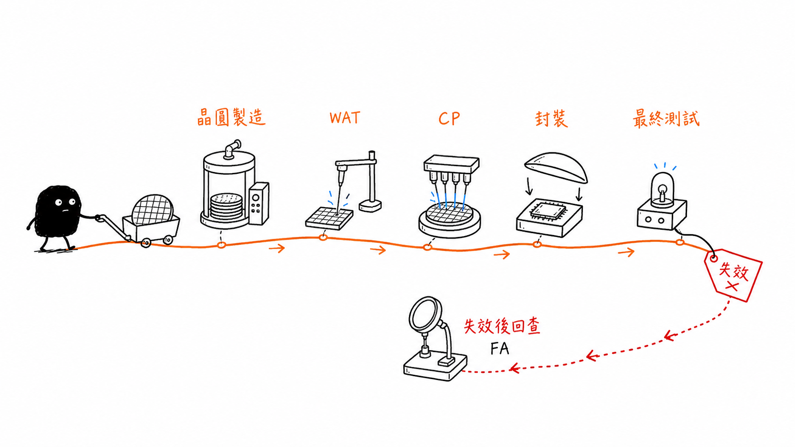
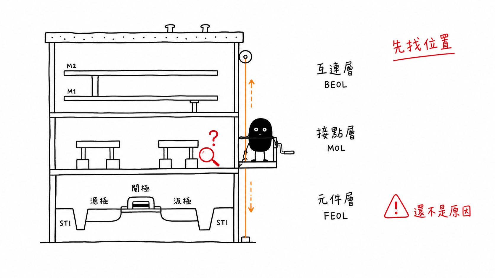
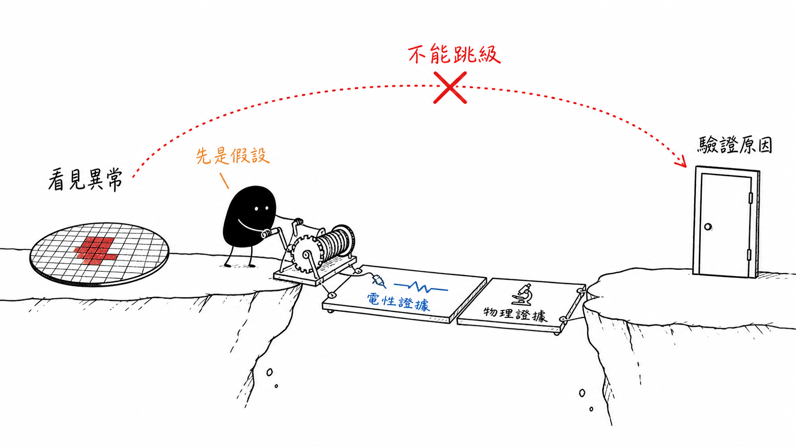

# From Process Flow to Evidence Layers

## 先找到異常位於哪一層，再討論可能是哪一道製程

> **Learning Context**
>
> Wafer maps, inspection results, and runtime history were already familiar, but most of that experience began after an image or a model had reported something unusual. The missing part was the manufacturing path behind the observation: which structure had been formed there, which process steps could affect it, and which measurement would help separate the possibilities.
>
> This note builds a first working map without reproducing the full CMOS process sequence. It keeps only enough detail to locate evidence in the device, contact, interconnect, or package layers before making a process hypothesis.

## Short English Note

A visible defect, an electrical warning, and a failed test bin belong to different evidence layers. Before connecting them, the measured structure first needs a clear position in the process flow.

---

這一篇原本只是想把 IC 製造流程重新畫一次，結果真正花時間整理的反而是另一件事：**當一個異常出現時，能不能先判斷它位於哪一層？**

從 IC 設計、光罩、晶圓製造一路排到 WAT、CP、封裝與最終測試，中間還有 STI、well、gate、contact、via 和 metal interconnect。第一次整理很容易把它們看成一長串站點名稱。但對故障分析來說，只記得名稱還不太夠。至少要先知道一個結構何時形成、後面還經過哪些步驟，以及目前看到的資料屬於哪一種證據。

這裡先不追求記住數百道製程。先把位置放對。

## 1. 先把 IC 放回完整產品流程

一顆 IC 並不是從晶圓製程直接跳到成品。從設計到可以交付的產品，中間大致會經過下面這條路徑：

```text
Circuit design
    ↓
Layout and mask
    ↓
Wafer fabrication
    ↓
WAT
    ↓
CP
    ↓
Dicing and packaging
    ↓
Final test
    ↓
Failure analysis when needed
```

這張圖刻意畫得很簡單。實際生產會有更多量測、抽樣、回饋和重工判斷，也不是每一顆產品都要等到最後才做品質檢查。不過它可以先分開幾個原本容易混在一起的詞。

| 階段 | 主要處理的問題 | 常見輸出 |
|---|---|---|
| Circuit design and layout | 電路要做什麼，以及如何轉成可製造的幾何圖案 | Schematic、layout、mask data |
| Wafer fabrication | 如何在晶圓上逐層形成元件與互連 | Process record、inline metrology、inspection result |
| WAT | 測試結構反映出的製程與元件參數是否合理 | Threshold voltage、sheet resistance、contact resistance 等 |
| CP | 晶圓上每顆 product die 的功能與電性是否通過 | Die result、fail bin、wafer map |
| Packaging and final test | 切割與封裝後，產品功能和連接是否仍符合要求 | Final-test result、package-related failure evidence |
| Failure analysis | 如何把失效位置、電性和物理證據逐步收斂 | Hypothesis、localization result、physical evidence |



> 圖 1：作者重新設計並整理；晶圓製造、WAT、CP、封裝與最終測試位於不同階段，也各自留下不同資料。失效分析從異常結果往回查證，不是取代前面的製程監控與測試。圖中流程為概念示意，不代表特定晶圓廠的實際流程。

這裡最先修正的一個觀念，是 **WAT 不等於 CP**。WAT 偏向利用特別設計的 test structure 觀察製程或元件參數；CP 則是在晶圓仍未切割時，測試 product die 的功能與電性。兩者可能互相呼應，不過回答的問題並不相同。第二篇會再詳細拆開。

## 2. 製程不是一條只走一次的直線

把 IC 製造先想成蓋房子，確實比較容易建立初步畫面。晶圓不是一次變成完整晶片，而是在同一塊基底上反覆增加材料、轉移圖案、移除材料，再繼續做下一層。

常見操作可以先記成下面這個循環：

```text
Grow or deposit material
    ↓
Coat photoresist and transfer a pattern
    ↓
Etch material or implant dopants
    ↓
Strip photoresist and clean
    ↓
Measure and inspect
    ↓
Prepare the surface for the next layer
```

同一種操作會在不同位置重複出現。例如微影不是只做一次；STI、gate、contact、via 和 metal pattern 都需要各自的圖案。蝕刻也不只處理矽，還可能處理 oxide、nitride、poly 或 metal。名稱相同，目標材料、停止位置和失效模式卻不一定相同。

幾個基本動作可以先這樣理解：

- **Growth and deposition**：在表面形成 oxide、nitride、poly、metal 或 dielectric 等材料。
- **Lithography**：透過光阻與光罩，把 layout 中的幾何圖案轉移到晶圓表面。
- **Etching**：移除沒有被保護的材料，留下需要的溝槽、開口或線路。
- **Ion implantation**：把摻雜離子植入指定區域，改變半導體的電性。
- **Thermal process**：進行氧化、摻雜活化、擴散或材料修復。
- **CMP**：去除過高的材料並重新平坦化表面，讓後續圖案能繼續形成。
- **Cleaning, metrology, and inspection**：移除殘留物，並檢查尺寸、厚度、均勻性或可見缺陷。

以前看到 process flow 時，容易把這些框框當成一次性的順序。重新整理後，比較像是一組反覆使用的工具。真正需要追的是：**這一次在處理哪個材料、要形成什麼結構，以及偏差會留在哪裡。**

## 3. 一張剖面圖裡，其實有三段不同的工作

一張從矽基板一路畫到 passivation 和 bump 的 CMOS 剖面很密。第一次看時最顯眼的是一層又一層的 metal，但底下的 transistor、contact 和上方互連並不是同一階段完成的。

為了先建立位置感，這裡分成 FEOL、MOL 和 BEOL 三個工作區域：

```text
Passivation and top connection
──────────────────────────────
Metal lines and vias                  BEOL
Interlayer dielectric
──────────────────────────────
Contact and local interconnect        MOL
Silicide
──────────────────────────────
Gate, source, drain, well and STI     FEOL
Silicon substrate
```

| 區域 | 代表性結構 | 先想到的問題 |
|---|---|---|
| FEOL | Well、STI、gate oxide、gate、source、drain | 隔離、摻雜、氧化層品質、元件尺寸與電性 |
| MOL | Silicide、contact、local interconnect | 接觸形成、界面、對準與局部串聯電阻 |
| BEOL | Via、metal、interlayer dielectric、passivation | Open、short、via resistance、金屬完整性與層間可靠度 |



> 圖 2：作者重新設計並整理；簡化剖面將元件、接點與互連分成 FEOL、MOL 與 BEOL 三個工作區域。這張圖只協助定位證據所在的結構層，尺寸、材料厚度與實際製程邊界均未按比例繪製。

不同教材或公司對 MOL 邊界的分法可能略有差異，因此這裡不把表格當成唯一標準。它比較像一張工作地圖：先判斷異常靠近元件、局部接點，還是多層互連，再去查對應製程。

## 4. STI：先讓相鄰元件不要互相干擾

STI 是 Shallow Trench Isolation，也就是淺溝槽隔離。簡單來說，它在相鄰主動區之間形成絕緣結構，避免本來應該分開工作的元件產生不必要的導通或漏電路徑。

Advanced STI 的簡化流程大致包含：

```text
Pad oxide and nitride
    ↓
STI lithography
    ↓
Etch nitride, oxide and silicon trench
    ↓
Liner oxidation and oxide fill
    ↓
CMP, stopping near the nitride layer
    ↓
Nitride strip
```

這裡可以看到前一節的操作循環真的會組合起來：先沉積保護材料，再用微影決定位置，接著蝕刻出 trench，填入 oxide，最後以 CMP 去除多餘材料。

如果只看到版圖上的兩塊 active area，還看不出 STI 填充品質；如果只看到表面異常，也不一定知道底下的 trench 深度或側壁狀態。可能的問題包括隔離區 bridge、填充 void、CMP 不均勻或圖案對準偏移，但每一種都需要不同證據確認。

這也是第一個很直接的提醒：**結構在剖面裡，影像證據不一定也在剖面裡。**

## 5. MOS 元件：多個製程結果疊在同一個電性上

STI 與 well 建立元件所在的區域後，還要形成 gate oxide、gate、source 和 drain，並透過不同的 implantation 調整摻雜與 threshold voltage。把 self-aligned gate、LDD 和 hot-carrier effect 放在一起看，也能發現元件尺寸、摻雜分布與電場不是互相獨立的。

這一篇先不推導 MOSFET 方程式，只保留一個後面會反覆用到的關係：一個電性結果常常同時包含多個製程貢獻。

例如 saturation current 偏低時，不能只因為剛好先想到 implantation，就直接判定 implantation 出了問題。它還可能受到下列因素影響：

- carrier mobility；
- gate capacitance and oxide thickness；
- threshold voltage；
- channel width and length；
- source and drain resistance；
- measurement setup and repeatability。

看到一個低電流數值後，最容易做的事就是挑一個熟悉的製程原因代入。不過目前真正能說的，通常只是「MOS 元件相關參數值得繼續比較」。如果 threshold voltage、gate capacitance、sheet resistance 和 critical dimension 也在相同晶圓區域一起偏移，假設才會逐漸具體。

不大，但不是零。只是還沒走到 root cause。

## 6. Contact、via 和 metal：導通問題不一定發生在同一層

元件做好後，還要把 source、drain 和 gate 連到上方金屬，再把不同金屬層連起來。這裡至少要先分開三種結構：

- **Contact**：連接元件區或 poly 與第一層局部互連／金屬。
- **Via**：連接上下兩層 metal。
- **Metal line**：在同一層中傳遞訊號或電源。

它們都可能表現成高電阻、open 或功能失效，但形成方式和應查證的位置不同。Contact 異常可能涉及界面、silicide、開口尺寸、清洗或填充；via 異常可能涉及對準、barrier、void 或 CMP；metal line 則還要考慮線寬、殘留、過度蝕刻、裂紋與電遷移。

把它們全部叫成「線路不通」雖然很方便，卻會讓後面的調查範圍太大。

## 7. 一個簡單例子：同樣是高電阻，位置可能完全不同

假設某批晶圓出現高電阻相關警告。只看「resistance high」還不能決定是哪一道製程，因為不同測試結構量到的東西不同。

| 觀察結果 | 比較接近的結構層 | 下一步較需要的資料 |
|---|---|---|
| Sheet resistance 偏高 | Doped layer 或 thin film | 膜厚、implant dose、activation、wafer uniformity |
| Contact-chain resistance 偏高 | Contact 與附近 layer | Contact 數量、幾何、界面、相關 sheet resistance |
| Metal continuity fail | BEOL metal 或 via | Open 位置、via chain、line width、physical inspection |

例如 contact-chain 的總電阻升高，不一定代表每一個 contact 本身都變差。量測中還可能混入相連薄層的電阻、線寬變化和測試結構幾何。這部分可以回到 [Contact Resistance and the Transfer Length Method](../03-electrical-characterization-and-process-monitoring/02-contact-resistance-and-transfer-length-method.md) 查看更完整的拆解。

同樣地，sheet resistance 的變化也不能直接翻譯成「材料電阻率改變」。若厚度同時改變，兩者仍要分開。相關定義整理在 [Resistivity, Sheet Resistance, and Four-Point Probe](../03-electrical-characterization-and-process-monitoring/01-resistivity-sheet-resistance-and-four-point-probe.md)。

這個例子沒有找出原因，但先把三個量測對象分開了。這一步看起來很小，實際上可以避免調查一開始就走錯層。

## 8. 證據也有自己的位置

製程層次分開後，還要分辨手上的資料是哪一種證據。這裡先用一條簡化鏈表示：

```text
Process condition
    ↓
Material or structural result
    ↓
Inline measurement or inspection
    ↓
WAT electrical parameter
    ↓
CP function or fail bin
    ↓
Failure hypothesis
    ↓
Physical or material verification
```

這些資料不一定每次都完整。可能只有 AOI 看到局部異常，沒有對應電性；也可能 WAT parameter 出現 wafer-edge drift，但 CP 還沒有明顯失效。資料停在哪裡，結論就先停在哪裡。

| 手上的證據 | 可以支持 | 還不能直接支持 |
|---|---|---|
| Optical anomaly | 某個位置存在可見差異 | 差異必然來自特定材料機制 |
| WAT parameter shift | 測試結構或相關製程結果偏移 | Product die 一定失效 |
| CP fail-bin pattern | 某類產品功能在特定位置失敗 | 已經知道是哪一道製程造成 |
| Spatial correlation | 兩組資料可能共享空間趨勢 | 其中一組資料造成另一組結果 |
| Physical analysis | 局部結構或材料存在特定異常 | 若取樣有限，整片晶圓都具有相同問題 |



> 圖 3：作者重新設計並整理；可見異常先形成工程假設，接著仍要補上電性與物理證據，才能往原因驗證前進。圖中的橋只表示證據關係，不代表每個案例都使用相同分析方法。

線畫得出來，不代表每一個箭頭都已經被證明。

## 9. 回推製程前，先問五件事

把這篇內容縮成實際檢查順序，目前比較順手的是：

1. **現在看到的是哪一種證據？** 是 optical observation、electrical parameter，還是 product functional result？
2. **量測對象是什麼？** 是 product die、scribe-line test key，還是一段特別設計的 chain structure？
3. **結構位於哪一層？** 比較接近 FEOL、MOL、BEOL，還是 package？
4. **空間分布長什麼樣？** 是單點、局部 cluster、中心到邊緣的漸變，還是整片一起偏移？
5. **少了哪一種驗證？** 需要另一個 WAT parameter、CP bin、process log、截面影像，還是材料分析？

這五題不會直接給出答案。它們比較像是在限制答案不能跑得太快。

## 10. A Small Project Connection

Wafer-inspection software can preserve the wafer coordinates, ROI, camera context, recipe, model result, and runtime history associated with an observation. That information matters because it makes later comparison possible. A cluster near the wafer edge can be aligned with another map instead of remaining an isolated screenshot.

But the software record still describes where and under which conditions the anomaly was observed. It does not determine whether the underlying cause came from STI, implantation, a contact, a metal layer, or packaging. That step needs electrical, process, or physical evidence from the corresponding layer.

## 11. 整理後，先看的東西多了一層

以前看到 wafer map 上的集中異常，第一個問題通常是影像、光源、recipe 或模型是否出了問題。這些仍然要查，不過現在會多問一層：異常位置對應的是什麼結構，而手上的資料究竟只是 observation、process monitor，還是 product result？

如果連結構層次都還沒有定位，就直接猜製程站點，選項會多得幾乎沒有意義。先分 FEOL、MOL、BEOL 或 package，再確認測試對象和空間分布，至少能把下一個查證問題問得更小一點。

目前這篇能支持的，也只有這個判斷順序。真正要從 WAT 走到 CP correlation，還需要下一篇把 test structure、規格範圍和 wafer-level distribution 拆開。

## Questions Left Open

- 不同 foundry 或 technology platform 對 MOL 的邊界通常如何定義？
- 哪些 inline metrology 結果最適合和 WAT、CP map 進行座標對齊？
- 如果異常直到 CP 或 final test 才出現，要如何區分早期製程偏差與後續累積效應？

## References

1. Hsinchu Science Park Bureau–subsidized course, [*積體電路故障分析技術與良率提升*](https://saturn.sipa.gov.tw/edu/d013_new.jsp?pl_id=26A01&cs_id=15S359) (*IC Failure Analysis Technology and Yield Improvement*, course 15S359), delivered by the Tze-Chiang Foundation of Science & Technology, August 6–7, 2026. This note draws on the first day.

## Current Scope

I have not worked as a semiconductor process-integration engineer or operated production WAT and CP equipment. The process sequence here is a simplified working map based on the cited learning source. It is not a foundry recipe, and the examples do not represent confidential production conditions. Optical inspection evidence is kept separate from electrical and physical verification throughout the note.
