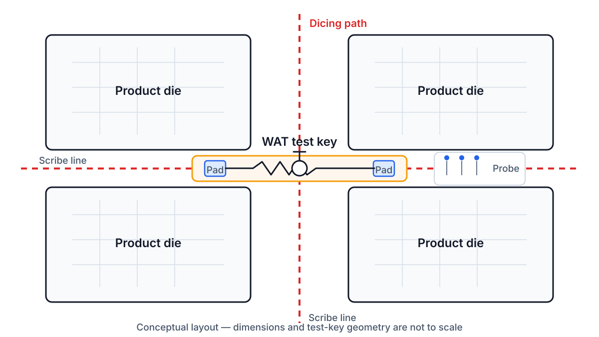
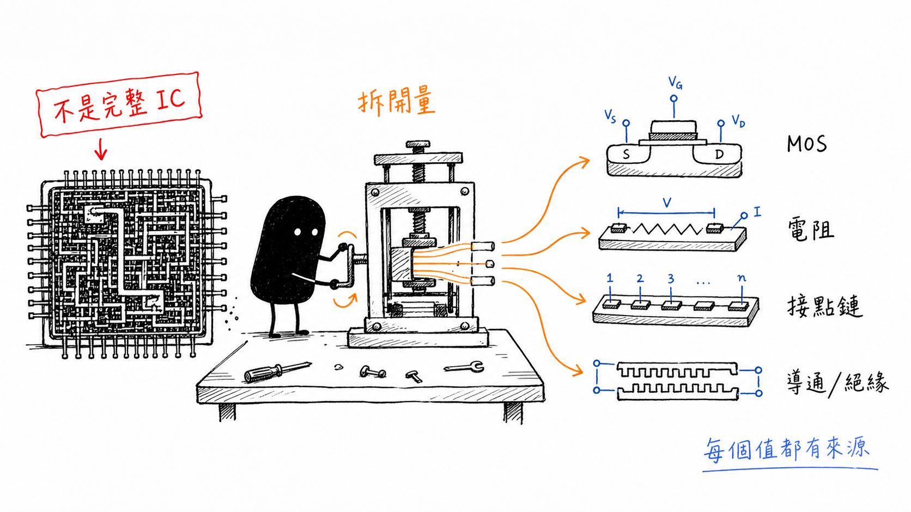
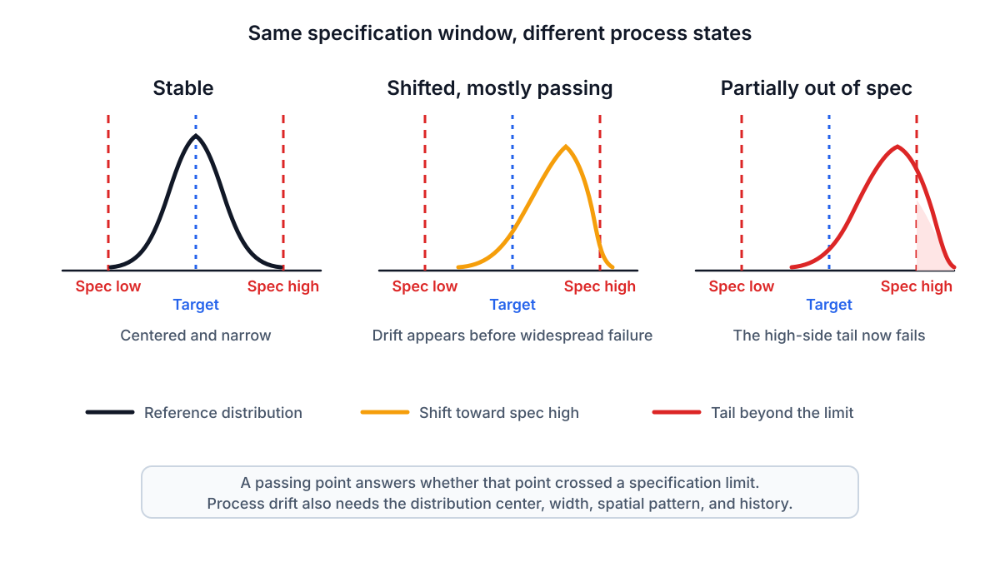
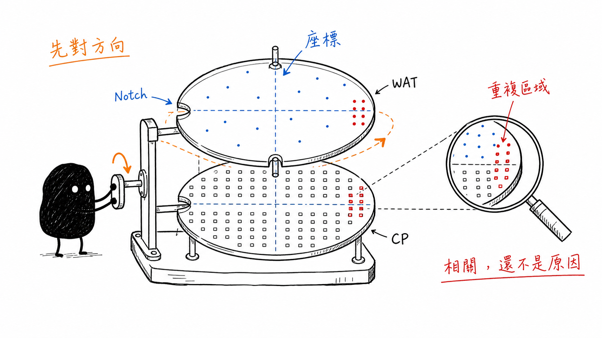

# WAT Test Structures and Yield Signals

## 一個測試數值，要放回測試結構、規格範圍與晶圓位置再看

> **Learning Context**
>
> Wafer maps and inspection results already carry spatial information, but WAT adds another question that is easy to miss: what structure produced the number? A threshold voltage, sheet resistance, or contact resistance value does not come from a complete product circuit. It comes from a deliberately designed test structure with its own geometry, terminals, and measurement purpose.
>
> This note follows that path from the scribe line to the parameter distribution. The aim is to separate a test structure from a product die, a specification result from a process trend, and a spatial association from a verified cause.

## Short English Note

WAT uses simplified structures to isolate selected process and device responses. The result becomes useful only after the structure, measurement condition, wafer position, and later product behavior are kept together.

---

第一篇先把異常放回 FEOL、MOL、BEOL 與封裝的位置。接著遇到的問題是：即使知道某個參數屬於哪一層，數值本身又是怎麼來的？

WAT 表格裡常會看到 $V_T$、$I_{dsat}$、$R_{sh}$、$R_c$、continuity 或 oxide breakdown。名稱看起來像一份元件規格清單，不過每個數值背後都有特定測試結構。若跳過這一層，容易把 test-line device 當成 product device，也容易把單一測點的 Pass 當成整片晶圓都很穩定。

這篇先把三件事接起來：**測了什麼結構、數值在晶圓上怎麼分布，以及它和 CP 結果最多能連到哪裡。**

## 1. WAT 不是完整產品功能測試

WAT 通常寫成 **Wafer Acceptance Test**，是一種 wafer-level electrical test。講義列出的測試對象包括 MOS transistor、resistor、capacitor、contact、interconnect，以及 continuity、spacing 和 insulation 結構。

這些結構的共同點，是把複雜 IC 中的某一部分抽出來量。它們不需要完成整個產品功能，反而要盡量讓某個製程或元件反應容易被觀察。

| 測試層次 | 主要對象 | 比較接近的問題 |
|---|---|---|
| Inline metrology／inspection | 製程中的尺寸、厚度、均勻性與可見缺陷 | 這一道製程目前形成了什麼結果？ |
| WAT | Scribe line 或 monitor area 中的測試結構 | 基本元件與製程參數是否位於合理範圍？ |
| CP | Wafer 上的 product die | 產品電路的功能與電性是否通過？ |
| Final test | 封裝後 IC | 封裝完成後的產品是否符合測試要求？ |

講義把 WAT 放在製程監控與良率改善的脈絡中。不過 WAT 和製程中的 thickness、CD、endpoint 或 defect inspection 仍不是同一種量測；實際插入時間與測試流程也會依製程平台和工廠做法而不同。這裡只保留一個相對位置：WAT 能在產品功能失效之外，提供另一組較接近製程與基本元件的電性證據。

## 2. 為什麼 test line 放在 scribe line

產品晶粒內的面積很珍貴，而且完整 IC 也不適合為了檢查每一個中間結構而直接破壞。因此講義將 test line 和 test key 放在相鄰 die 之間的 scribe line，也就是後續切割會經過的區域。



> 圖 1：作者依個人課程筆記重新繪製；test key 位於 product die 之間的 scribe line，可在晶圓階段提供探針量測位置，後續再沿切割道分離晶粒。圖中尺寸、測試結構數量與探針配置均為概念示意，不代表特定產品 layout。

這樣安排有幾個實際好處：

- test structure 不直接占用 product die 的主要電路區；
- 結構可以設計得比產品電路單純，方便接觸探針與量測；
- 同一種 test key 能跨 wafer 或 lot 比較；
- 測試結果可以保留 wafer、site 和製程條件，支援後續趨勢分析。

不過 scribe line 也不是免費空間。Test key 仍需要 layout、光罩面積、probe pad 和測試時間，而且它只代表被設計進去的結構與取樣位置。

## 3. Test structure 不是縮小版完整 IC

講義把 test-line MOS 和 product die 中的 MOS 放在一起比較。兩者可能具有相似的材料層與基本元件結構，但用途不同。

Product circuit 需要完成功能，會包含大量元件、互連、負載、時序條件與設計裕度。Test structure 則刻意把問題縮小，例如固定 $W$、改變 $L$，或固定 $L$、改變 $W$，觀察幾何如何影響 MOS 電流。Contact chain 會串接許多 contact，讓原本很小的接觸電阻累積到比較容易量測的程度。



> 圖 2：作者依個人課程筆記設計並重新整理；WAT 不是重新量一次完整產品功能，而是使用較單純的 MOS、電阻、接點鏈與導通／絕緣圖形，分別觀察選定的製程與元件反應。

測試結構可以降低問題的複雜度，但不代表一次只剩一個影響因素。

| Test structure | 常見量測 | 可能混入的其他影響 |
|---|---|---|
| MOS transistor | $V_T$、$I_{dsat}$、$I_{off}$、breakdown | Oxide、implant、mobility、$W/L$、series resistance |
| Resistor pattern | $R_{sh}$ 或結構電阻 | Thickness、doping、CD、contact contribution |
| Contact／via chain | Chain resistance | Contact 數量、相連薄層、幾何與量測端點 |
| Comb／serpentine pattern | Continuity、spacing、insulation | Residue、line width、misalignment、局部缺陷 |
| MOS capacitor／oxide pattern | Capacitance、leakage、breakdown | Area、edge length、oxide thickness、局部弱點 |

這裡比較像把一個大問題拆成幾個小問題，不是把所有耦合因素消掉。

## 4. WAT 能監控的範圍也有限

WAT 很適合觀察 test structure 所代表的電性，但不是所有良率問題都會落在有限的測試面積上。講義特別提醒，particle defect 不能只依賴 WAT 篩選。

原因不難理解。若一個隨機粒子落在 product die 內，卻沒有落在 scribe-line test key 上，WAT 結果可能維持正常，產品仍然可能因 open、short 或局部結構破壞而失效。

| WAT 比較適合觀察 | 仍需要其他證據 |
|---|---|
| MOS device parameter | 完整產品功能與時序 |
| Sheet resistance 與 contact-chain resistance | 隨機 particle 或局部外觀缺陷 |
| Continuity、spacing 與 insulation | 實際失效位置與缺陷形貌 |
| Oxide leakage 與 breakdown | 材料機制和局部破壞證據 |
| Wafer-level electrical trend | 已驗證的製程 root cause |

看不到，不代表不存在。反過來也一樣：test key 出現異常，還要確認 product die 是否對同一項偏移敏感。

## 5. 一個測點通過，不代表整片晶圓穩定

講義後段反覆強調 WAT parameter 具有分布，而且晶圓中心、邊緣與局部區域可能不同。這裡至少要分開三種觀察：

1. 分布中心是否接近 target；
2. 分布寬度是否變大；
3. 參數在 wafer 上是否形成空間圖形。

下面使用一組自訂數字做檢查。假設某個薄層的規格範圍是 45–60 $\Omega/\square$：

| Lot | Mean $R_{sh}$ | Observed range | 初步判讀 |
|---|---:|---:|---|
| Reference lot | 50 $\Omega/\square$ | 48–52 $\Omega/\square$ | 接近 target，分布集中 |
| Current lot | 56 $\Omega/\square$ | 49–61 $\Omega/\square$ | 平均值上升，分布變寬，已有測點超過 spec high |

若只看 current lot 的多數測點，可能會得到「大部分仍 Pass」的印象。但和 reference lot 放在一起後，平均值、寬度和高阻端尾巴都已改變。這比單點是否越界多了一層資訊。

## 6. Spec window 只回答有沒有越界

Spec low、target 和 spec high 很容易理解：參數落在上下限之間就通過，超出就失敗。不過同樣是 Pass，分布位置可能差很多。



> 圖 3：作者依個人課程筆記重新繪製；三個分布使用相同 spec window。分布由 target 附近往 spec high 移動時，即使大部分數值仍通過，也已顯示 drift；繼續偏移或變寬後，尾端才開始超出規格。曲線為教學示意，不代表實際製程資料。

因此至少要分清楚：

- **Target** 是希望製程靠近的位置；
- **Specification limits** 是產品或製程可接受的邊界；
- **Drift** 表示分布相對歷史或 target 發生移動，不一定已經越界；
- **Outlier** 可能在整體平均仍正常時先出現。

這篇不把 specification limit 和 statistical process control limit 混在一起。講義目前提供的是 spec low、target 和 spec high；control limit 的計算與設定方式需要另外的製程統計資料，不能直接從同一張圖代替。

## 7. 平均值相近，wafer map 仍可能完全不同

假設兩片 wafer 的平均 $R_{sh}$ 都是 52 $\Omega/\square$。第一片的量測點均勻散在 target 附近，第二片則是中心偏低、邊緣偏高。平均值可能一樣，但第二片已經出現明顯的空間結構。

常見的 map pattern 可以先用描述性的方式記錄：

- 全片一起偏高或偏低；
- center-to-edge gradient；
- wafer-edge ring；
- 局部 cluster；
- 少數分散 outlier。

這些形狀能幫助提出製程均勻性、邊緣效應、設備位置或量測異常等假設。不過圖形名稱只是描述，不是原因。看到 edge ring，不能直接指定某一台設備或某一道製程。

## 8. WAT map 和 CP map 要先對齊才能比較

WAT map 記錄 test-site parameter，CP map 記錄 product die 的 pass、fail 或 bin。兩者的空間單位和取樣密度通常不同，因此不能只把兩張彩色圖放在旁邊，用肉眼覺得「很像」就結束。



> 圖 4：作者依個人課程筆記設計並重新整理；比較 WAT 與 CP map 前，先確認 wafer orientation、notch、座標與取樣位置。對齊後出現重複區域，可以支持進一步調查，但空間相關仍不是已驗證的原因。

比較前至少要確認：

- wafer ID、lot 和測試時間是否對應；
- notch 或 flat 方向是否一致；
- die index、site coordinate 與旋轉方向；
- WAT site 和 CP die 的空間解析度差異；
- map pattern 是否由少數 outlier 主導；
- 其他 WAT parameter 是否也呈現相同趨勢。

對齊完成後，若 WAT 高阻區與某類 CP fail bin 重複出現在 wafer edge，可以說兩者具有值得調查的空間關聯。這裡先不把兩者直接畫上等號。共同圖形可能來自同一個製程因素，也可能是幾個參數一起變動，甚至是座標或量測設定造成的假象。

## 9. WAT 在規格內，CP 仍可能 marginal fail

講義用 marginal fail 說明另一種邊界情況：某些 WAT parameter 尚未超出規格，product die 卻在較嚴格的 CP condition 下失敗。

可能的原因包括：

- product design 對某個參數特別敏感；
- 多個仍在 spec 內的參數同方向偏移；
- WAT test structure 沒有包含產品中的負載、時序或互連條件；
- 測試條件與實際產品功能的觀察窗口不同。

因此，WAT Pass 的意思不是「產品必然通過」，而是被量測的 test parameter 在指定條件下沒有越過 WAT 規格。CP 仍然回答另一個問題。

## 10. A Small Project Connection

Wafer-inspection systems already need wafer orientation, coordinates, ROI, recipe version, camera context, and measurement time to keep an image result traceable. The same discipline is useful when WAT and CP maps are compared. A spatial pattern is difficult to trust if the notch direction, die index, site definition, or test configuration has changed between records.

Map alignment can reveal repeated associations. But it cannot determine whether the shared pattern came from one process cause, several coupled parameters, or a measurement artifact. The aligned record makes the next check possible; it does not complete the diagnosis.

## 11. 整理後，判讀順序變得比較固定

看到 WAT parameter 後，先不急著問它對應哪個製程原因。比較順手的順序是：

```text
確認 test structure 與端點
        ↓
確認參數定義與量測條件
        ↓
查看 distribution 與 wafer position
        ↓
和歷史 lot、相關 WAT parameter 比較
        ↓
最後才對照 CP yield 或 fail bin
```

一個數值落在規格內，只能回答這個測點在這次量測中有沒有越界。製程是否開始偏移，還要看分布寬度、晶圓位置、歷史趨勢，以及產品是否對這項變化敏感。

第二篇先停在 correlation。下一篇再從 $I_{dsat}$、$V_T$、$R_{sh}$ 或 $R_c$ 異常出發，整理如何拆開影響因子，以及什麼時候才需要進入物理失效分析。

## Questions Left Open

- Scribe-line test device 與 product device 的幾何差異通常如何校正？
- WAT sampling site 的數量與位置，會如何限制 wafer-map pattern 的判讀？
- Specification limit、process control limit 與 product design margin 通常如何共同設定？

## References

1. Personal notes from the first day of an in-person course on integrated-circuit failure analysis and yield improvement, August 6, 2026.

## Current Scope

I have not designed production WAT test keys, operated production WAT or CP equipment, or defined fab specification limits. The numerical distributions and wafer patterns in this note are simplified learning examples rather than production data. Project connections are limited to coordinate alignment, configuration history, and traceability practices from wafer-inspection software.
