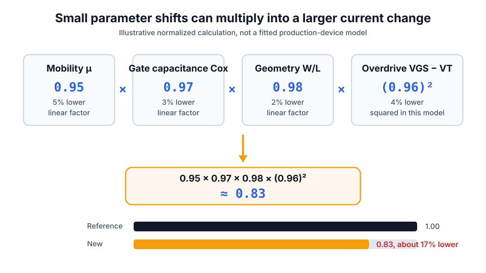
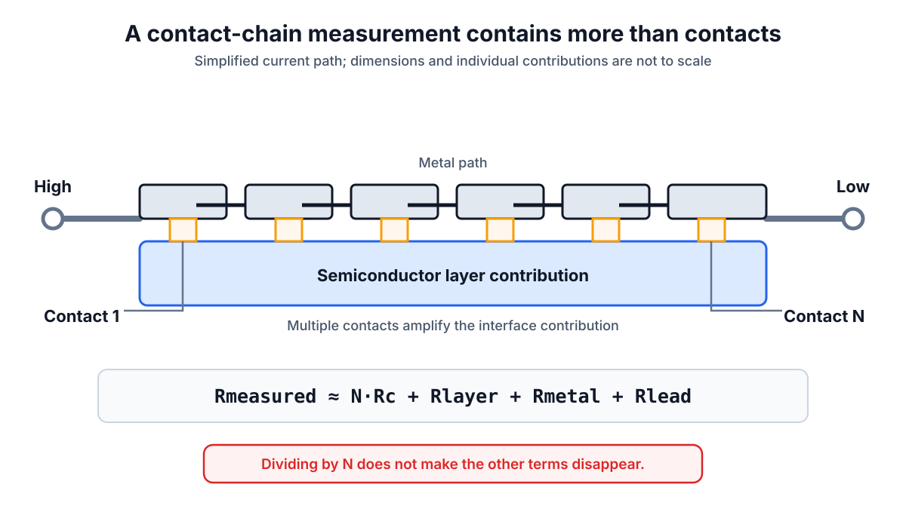
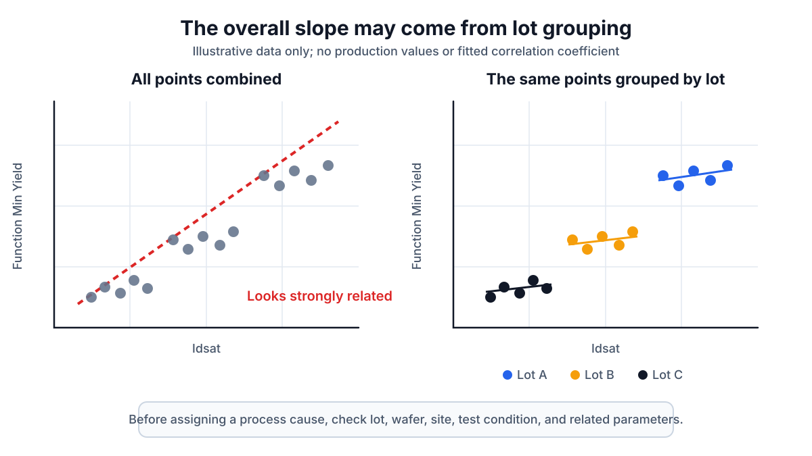

# From Electrical Anomalies to Process Hypotheses

## 先拆開量測貢獻，再決定下一個需要驗證的證據

> **Learning Context**
>
> A WAT alarm or a convincing correlation plot can make a process explanation feel closer than it really is. One electrical parameter may still contain several material, geometry, interface, and measurement contributions.
>
> This note follows a smaller question: after an anomaly is reproduced, which related measurement or map could rule out at least one competing explanation?

前兩篇先整理了製程層次、test structure、spec window 和 wafer map。走到這裡，最容易讀錯的地方反而變得明顯：一個參數超出規格，不會自己指出是哪一道製程；兩張 map 長得很像，也不會自動補上中間的物理機制。

## 1. 先確認異常能不能重現

第一個分流不是 process A 還是 process B，而是這個結果能不能重現。先確認相同 site、test condition 和 reference structure，再看 shift 是否也出現在同一片 wafer 或同一個 lot。

```text
Abnormal result
    ├─ Measurement or setup problem
    └─ Repeatable device or process shift
```

如果量測本身還不穩定，後面的製程推論就沒有意義。Probe contact、bias、sweep direction、settling time 和 compliance 是否一致，都要在這個分流裡先確認。

## 2. Idsat 是多個貢獻疊在一起的結果

先用簡化的 MOS saturation-current 關係，把幾個影響因子放在同一個式子裡：

$$
I_{dsat}
\propto
\mu C_{ox}\frac{W}{L}(V_{GS}-V_T)^2
$$

這不是用來精確預測 production device 的完整模型，比較像一張拆解表：mobility、$C_{ox}$、geometry 和 overdrive 都可能一起影響結果。看到 Idsat 變低時，先想到 implantation 只是其中一個方向。

下面是一個 normalized example，不是實際產線量測資料。假設相對 reference condition：mobility 下降 5%、$C_{ox}$ 下降 3%、有效 $W/L$ 下降 2%，而 overdrive 下降 4%。

$$
\frac{I_{\text{new}}}{I_{\text{ref}}}
\approx
0.95\times0.97\times0.98\times(0.96)^2
\approx 0.83
$$



> 圖 1：用 normalized example 看幾個小偏移如何一起拉低 `Idsat`；數值僅用來理解疊加關係。

算到這裡，還不能說原因已經拆完。實際參數可能互相耦合，mobility 與 $V_T$ 也可能隨 bias、temperature 和 extraction method 改變。這個計算比較有用的地方，是提醒先不要尋找一個也下降 17% 的單一製程參數；幾個方向一致的小偏移，就可能形成相同結果。

## 3. 其他參數也要先拆貢獻

$V_T$ shift 不能單獨命名 process cause。可以先看 flat-band behavior、capacitance 或 well $R_{sh}$ 是否一起變；若只有 extracted $V_T$ 改變，則先回頭確認 extraction 和 repeatability。MOS C–V、oxide charge 和 flat-band 的背景已整理在 [MOS Capacitor C–V and Oxide Charge](../02-semiconductor-characterization-fundamentals/03-mos-capacitor-and-oxide-charge.md)。

Contact-chain resistance 也是類似的問題。它比較像一串延長線接頭，量到的總壓降不只來自接點：

$$
R_{\text{measured}}
\approx
N R_c + R_{\text{layer}} + R_{\text{metal}} + R_{\text{lead}}
$$



> 圖 2：Contact-chain 量測路徑的概念拆解。除了 contact，本身還包含相連 layer、metal 與量測端點的 contribution。

所以 `chain resistance high` 不等於 `individual contact resistance high`。比較順手的順序是先確認 chain geometry，再看相關 $R_{sh}$ 是否一起偏移；如果這些變化還不足以解釋 chain-resistance shift，才更有理由把注意力往 contact 本身縮小。需要進一步分離時，可回到 [Contact Resistance and the Transfer Length Method](../03-electrical-characterization-and-process-monitoring/02-contact-resistance-and-transfer-length-method.md)。

## 4. Correlation 有斜率，不代表已經找到 Process Cause

把 WAT parameter 對 CP yield 或 fail bin 作圖時，先看資料怎麼分群。所有點混在一起時的斜率，可能只是不同 lot 或 wafer group 的位置不同。



> 圖 3：模擬三個 lot 的 correlation data。資料混在一起時看似有明顯趨勢，分組後各 lot 內的關係弱得多。

一個小例子是：Idsat 越低，Function Min Yield 越差；低 Idsat 主要集中在 Lot C，而 Lot C 同時出現 $V_T$ 偏高、poly CD shift，WAT 與 CP 的 edge region 也有部分重疊。比較穩妥的說法是：Lot C 的 device-drive condition 與 Function Min Fail 有值得調查的關聯，$V_T$ 和 geometry 可以先列為查證方向，但還要確認 CD shift 的方向是否和 observed current change 一致。

中間仍缺少 CD 量測的重現性、其他 current contributor、process log、相關 wafer map，以及能確認實際 profile 的物理證據。現在還不能把「優先查」寫成「已證明」。

## 5. 下一項量測要能排除至少一個可能

Electrical anomaly → related measurement → lot／wafer context → process hypothesis。這條路徑不一定每次都走到同一個終點，但每一步都應該讓候選解釋變少。

如果 correlation 和 electrical cross-check 已經把範圍縮小，下一步才進入 localization 或 physical verification。這部分延伸到 [Failure Localization and Material Characterization](../05-failure-localization-and-material-characterization/README.md)。

對目前的判讀來說，最實用的一句話是：下一項量測能不能排除至少一個其他可能？

## What I Would Check Next

- 低 Idsat 與高 $V_T$、$R_{sh}$ 或 CD 偏移同時出現時，哪一組 related measurement 最能先縮小候選範圍？
- WAT 與 CP 的相關性在不同 lot、wafer orientation 和 sampling density 下是否仍然存在？

## Learning Source

1. Hsinchu Science Park Bureau–subsidized course, [*積體電路故障分析技術與良率提升*](https://saturn.sipa.gov.tw/edu/d013_new.jsp?pl_id=26A01&cs_id=15S359) (*IC Failure Analysis Technology and Yield Improvement*, course 15S359), delivered by the Tze-Chiang Foundation of Science & Technology, August 6–7, 2026. This note draws mainly on the first-day material covering WAT electrical parameters, parameter correlation, CP low-yield analysis, and failure-analysis reasoning.

## Related Notes

- [MOS Capacitor C–V and Oxide Charge](../02-semiconductor-characterization-fundamentals/03-mos-capacitor-and-oxide-charge.md)
- [Contact Resistance and the Transfer Length Method](../03-electrical-characterization-and-process-monitoring/02-contact-resistance-and-transfer-length-method.md)
