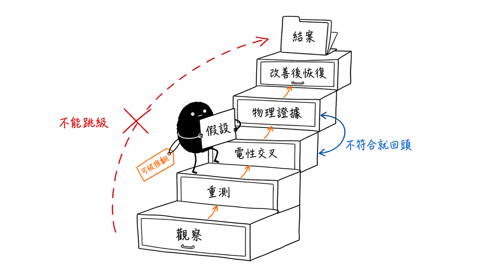

# From Electrical Anomalies to Process Hypotheses

## 先拆開量測貢獻，再決定下一個需要驗證的證據

> **Learning Context**
>
> A WAT alarm or a convincing correlation plot can make a process explanation feel closer than it really is. The difficult part is that one electrical parameter often contains several material, geometry, interface, and measurement contributions. A low saturation current does not name an implantation step, and a high contact-chain resistance does not isolate one interface by itself.
>
> This note keeps three levels separate: the observed anomaly, the process hypothesis, and the evidence needed to test it. The aim is not to build a production failure-analysis procedure. It is to make the next engineering question smaller and harder to misread.

## Short English Note

An abnormal electrical parameter is a starting point, not a process diagnosis. It is only an alarm. But the next useful step is to separate its contributors, compare related measurements, and request evidence that can remove competing explanations.

---

前兩篇先整理了製程層次、test structure、spec window 和 wafer map。走到這裡，看起來終於可以從 WAT alarm 開始找原因。不過真正容易讀錯的地方也從這裡開始。

一個參數超出規格，不會自己指出是哪一道製程；兩張 map 長得很像，也不會自動補上中間的物理機制。這篇想留下的不是一份「看到 A 就查 B」的故障字典，而是一個比較慢、但比較不容易跑錯方向的順序。

## 1. 第一個分流：量錯，還是真的偏移

講義在 drain current 異常後先列出兩個方向：WAT 量測問題，或元件／製程真的發生變化。這個分流很普通，卻應該放在所有漂亮分析圖之前。

```text
Abnormal result
    ├─ Measurement or setup problem
    └─ Repeatable device or process shift
```

看到異常後，可以先確認：

1. 同一個 site 重測後是否仍然異常；
2. Probe contact、bias、sweep direction 與量測條件是否一致；
3. 同 wafer 的其他 site 是否出現相似偏移；
4. 同 lot 的其他 wafer 是否重複；
5. Reference lot 或 control structure 是否維持正常。

如果量測本身還不能重現，後面的製程推論都太早。這就像溫度計忽高忽低時，先確認探頭有沒有接好，而不是立刻判定冷氣壓縮機故障。

比喻只能說明檢查順序。電性量測還要依實際設備、接線、settling time、compliance 與 test method 判斷，不能只靠「再量一次」排除所有量測問題。

## 2. Idsat 低，不能只想到 implantation

講義使用簡化的 MOS saturation-current 關係，將影響因子放在同一個式子裡：

$$
I_{dsat}
\propto
\mu C_{ox}\frac{W}{L}(V_{GS}-V_T)^2
$$

這不是這篇要拿來精確預測 production device 的完整模型。它比較像一張拆解表，提醒 drain current 同時受到 mobility、gate capacitance、geometry 和 overdrive 影響。

| 因子 | 可先比較的資料 | 可能涉及的方向 |
|---|---|---|
| Mobility $\mu$ | Related device current、temperature condition | Implant、anneal、carrier scattering |
| Gate capacitance $C_{ox}$ | MOS capacitance、oxide thickness | Oxide thickness、permittivity、effective area |
| Geometry $W/L$ | Mask CD、PR CD、etch profile | Lithography、poly etch、active-area definition |
| Overdrive $V_{GS}-V_T$ | Extracted $V_T$、test bias | Channel doping、oxide charge、measurement condition |

可以把它暫時想成水管流量：水壓、管徑、內壁阻力和閥門開度都會改變流量。看到水變小，不會只檢查水壓。MOS 電流當然不是水流，這個比喻只用來記住「多個因素會一起進入結果」。

## 3. 幾個小偏移，可能疊成明顯的電流下降

下面是一個 normalized example，不是課程或產線量測資料。假設相對 reference condition：

- mobility 下降 5%；
- $C_{ox}$ 下降 3%；
- 有效 $W/L$ 下降 2%；
- overdrive 下降 4%。

將每一項寫成相對比例：

$$
\frac{I_{\text{new}}}{I_{\text{ref}}}
\approx
0.95\times0.97\times0.98\times(0.96)^2
\approx 0.83
$$


> 圖 1：作者依個人課程筆記設計並重新計算；四個因子分別只下降 2%–5%，但 overdrive 以平方項進入簡化模型，最後 normalized current 約為 reference 的 0.83。這是用來檢查方向與數量級的示意計算，不代表實際元件參數彼此獨立，也不取代完整 device model。

算到這裡容易產生一種「既然算出 17%，原因就拆完了」的感覺，不過這個乘法只是示範疊加。實際參數可能互相耦合，mobility 與 $V_T$ 也可能隨 bias、temperature 和 extraction method 改變。

真正改變的是判斷方式：如果 Idsat 下降約 17%，不必先尋找一個也下降 17% 的單一製程參數。幾個方向一致的小偏移就可能形成相同結果。

## 4. Vt shift 也有不只一個入口

Threshold voltage 會受到 flat-band voltage、oxide／interface charge、channel doping、oxide capacitance、substrate bias 和 extraction method 影響。完整背景已整理在 [MOS Capacitor C–V and Oxide Charge](../02-semiconductor-characterization-fundamentals/03-mos-capacitor-and-oxide-charge.md)，這裡不再推導一次。

遇到 $V_T$ shift 時，比較有用的是看「還有什麼一起變」：

| 同時觀察到的結果 | 比較值得先確認 |
|---|---|
| $V_T$ shift 與 flat-band behavior 一起移動 | Oxide／interface charge、work-function-related contribution |
| $V_T$ shift 與 well $R_{sh}$ 一起變 | Channel／well doping、activation、thermal history |
| $V_T$ shift 與 capacitance 一起變 | Oxide thickness、effective area、measurement configuration |
| 只有 extracted $V_T$ 改變 | Extraction method、noise、geometry、measurement repeatability |

這些組合仍然只是優先順序。MOS capacitor 的 flat-band voltage 和 MOSFET 的 extracted threshold voltage 來自不同量測與模型，不能直接視為同一個參數。

## 5. Contact-chain resistance 高，先不要只怪 contact

Contact chain 很像一串延長線接頭。從插頭一端量到另一端，總壓降同時經過電線、每一個接頭和量測端。如果最後總電阻增加，接頭可能有問題，線材也可能變了。

以概念式表示：

$$
R_{\text{measured}}
\approx
N R_c + R_{\text{layer}} + R_{\text{metal}} + R_{\text{lead}}
$$

即使把量測值除以 contact 數量 $N$：

$$
\frac{R_{\text{measured}}}{N}
\approx
R_c+
\frac{R_{\text{layer}}+R_{\text{metal}}+R_{\text{lead}}}{N}
$$


> 圖 2：作者依個人課程筆記重新繪製；chain resistance 會累積多個 contact 的影響，但量測路徑仍包含相連薄層、金屬與端點。將總值除以 contact 數量後，其他貢獻不會自動消失。圖中元件與比例均為概念示意。

因此比較順手的順序是：

1. 確認 chain geometry、contact 數量和量測端點；
2. 檢查相關 $R_{sh}$ 是否一起偏移；
3. 比較 N+、P+、via 或不同 contact structure；
4. 查看分布是否出現 high-side tail；
5. 最後再把方向縮小到 contact lithography、etch、clean、interface、barrier 或 fill。

若需要進一步分離薄層與接點，可回到 [Contact Resistance and the Transfer Length Method](../03-electrical-characterization-and-process-monitoring/02-contact-resistance-and-transfer-length-method.md)。線畫得出來，不代表截距就可信；test structure、幾何假設與 fitting window 仍要一起保存。

## 6. 不同警報，需要不同的下一個證據

把幾個常見 WAT warning 放在一起後，可以得到一張簡單工作表：

| Initial warning | First cross-check | Possible verification request |
|---|---|---|
| Idsat low | $V_T$、$C_{ox}$、$R_{sh}$、CD | Thickness、profile、implant／anneal record |
| $V_T$ shift | Flat-band behavior、well $R_{sh}$、capacitance | Oxide／interface or doping evidence |
| $R_{sh}$ high | Thickness、CD、uniformity | Film or doping measurement |
| Contact-chain resistance high | Related $R_{sh}$、chain geometry | Contact cross-section or interface evidence |
| Oxide leakage high／breakdown voltage low | Area、edge-rich pattern、repeatability | Local weak-point and physical verification |
| Continuity fail | Adjacent spacing pattern、wafer location | Open／short localization and inspection |

表格左邊是警報，中間是先排除的替代解釋，右邊才是後續驗證。它不是 production troubleshooting recipe，也不是說每次都要把右欄全部做完。

## 7. Correlation 圖有斜率，先看資料怎麼分群

講義第 151–153 頁把 WAT parameter 對 CP yield 或 fail bin 作圖，並提醒可疑趨勢仍要人工判定。原因之一，是所有點混在一起時的斜率，可能只是不同 lot 或 wafer group 的位置不同。


> 圖 3：作者使用自訂教學資料重新繪製；左圖混合三個 lot 後看似有明顯負相關，右圖保留 lot 分組後，各組內部的斜率很弱。圖中不計算虛構的精確相關係數，只提醒 overall trend 可能由資料分群造成。

這很像雨天時，雨傘數量和濕掉的地面同時增加。兩者相關，不代表雨傘把地面弄濕；共同原因可能是下雨。WAT 分析裡的「雨」可能是另一個製程參數、lot condition、test setup 或共同的 spatial gradient。

除了分群，還要留意：

- 少數 outlier 是否拉出整條斜率；
- WAT 與 CP 是否來自相同 wafer、site orientation 和時間範圍；
- 兩個參數是否同時受到第三個變數影響；
- 資料範圍是否窄到看不出非線性；
- 多個 WAT parameter 是否高度耦合；
- correlation 是否只在單一 lot 出現。

圖畫得出來，不代表物理關係已經成立。

## 8. 一個小例子：Idsat 和 yield 有趨勢，然後呢

假設散佈圖出現下面的情況：

- Idsat 越低，Function Min Yield 越差；
- 低 Idsat 資料主要集中在 Lot C；
- Lot C 同時出現 $V_T$ 偏高與 poly CD 偏小；
- WAT 與 CP 的 edge region 也有部分重疊。

目前比較誠實的說法是：

> Lot C 的 device-drive condition 與 Function Min Fail 具有值得調查的關聯；$V_T$ 和 geometry 是優先查證方向。

目前還不能寫：

> Poly etch caused the yield loss.

中間仍缺少 CD 量測的重現性、其他 current contributor、process log、相關 wafer map，以及能確認實際 profile 的物理證據。這裡先不把「優先查」寫成「已證明」。

## 9. 從 correlation 走到 failure analysis

講義將 CP low-yield FA flow 分成 data analysis、electrical analysis、physical／spectral analysis 和 feedback。把儀器名稱先拿掉後，順序反而更容易理解。

### Data triage

- CP bin summary 與 fail condition；
- WAT distribution 和 wafer map；
- lot、wafer、site 與 test history；
- process log 和 configuration change。

這一層的目的，是確認問題是否集中在特定產品功能、晶圓位置、lot 或時間範圍。

### Electrical localization

- Fail mode 能否重現；
- 哪一個 bias、frequency 或 timing window 最敏感；
- 相關 WAT parameter 是否同方向偏移；
- 哪些替代解釋已經被排除。

### Physical or material verification

課程列出 OM、EMMI、SEM、FIB、TEM、SIMS 和 Auger 等方法。這篇只保留它們可能回答的問題，不展開操作程序：

| Method | 比較接近的問題 |
|---|---|
| OM／SEM | 表面、形貌或較大尺度結構是否異常？ |
| EMMI | 發光型電性異常可能集中在哪裡？ |
| FIB | 如何到達目標位置、製作局部截面或樣品？ |
| TEM | 更細部的層、界面或結構長什麼樣？ |
| SIMS／Auger | 成分、深度分布或局部表面化學能提供什麼證據？ |

不同方法回答的問題不同，不是把儀器名稱列得越多，證據就越完整。真正需要的是讓方法對準尚未排除的假設。

### Feedback and closure

- 將 physical evidence 放回對應結構與 process condition；
- 說明 corrective action 改了什麼；
- 比較改善前後的 WAT、CP 與失效模式；
- 確認結果是否在後續 wafer 或 lot 重複恢復。

## 10. 根因需要形成一個可以回頭檢查的閉環



> 圖 4：作者依個人課程筆記設計並重新整理；工程假設從 observation 出發，經過量測重現、電性交叉比對、物理證據與 corrective action 後，才逐步接近 root-cause closure。任何一層出現不一致，都可能需要回頭修改假設。

可以先用下面這條鏈檢查目前走到哪裡：

```text
Observed failure
    ↓
Repeatable electrical behavior
    ↓
Localized structure
    ↓
Physical or material evidence
    ↓
Process explanation
    ↓
Corrective action
    ↓
Result recovers
```

如果只有 correlation，目前就是 investigation lead。若已看到 physical abnormality，但 corrective action 後結果沒有恢復，也需要回頭檢查那個異常究竟是原因、伴隨現象，還是剛好被取樣到的結構差異。

## 11. A Small Project Connection

The useful connection to wafer-inspection software is not that an image model can identify the process cause. It is that the system can preserve raw results together with wafer coordinates, recipe versions, camera context, model configuration, timestamps, and later verification records. That context allows another measurement to confirm or reject a hypothesis instead of starting from an isolated screenshot.

Observation, hypothesis, verification request, and confirmed cause should remain separate fields. Combining them into one defect label would make the history look simpler, but it would also erase which conclusions were actually supported at each stage.

## 12. 整理後，下一個問題變得比較重要

現在看到 WAT alarm 或 correlation plot，先看的順序是：

```text
先確認量測能否重現
    ↓
拆開公式與 test structure 的貢獻
    ↓
比較相關 WAT parameter
    ↓
放回 wafer、lot 與 CP context
    ↓
提出可被推翻的假設
    ↓
要求能排除其他解釋的證據
```

一張圖有斜率、一個參數超規，或兩張 wafer map 長得很像，都可以讓某個方向更值得查。它們還不能替代驗證。

目前更有用的問題不是「最像哪個原因」，而是：**下一項量測能不能排除至少一個其他可能？**

## Questions Left Open

- Idsat、$V_T$、$R_{sh}$ 與 $R_c$ 同時變動時，實務上如何選擇第一個分析參數？
- 多個 WAT parameter 高度相關時，如何避免把共同製程因素誤認為單一參數因果？
- Physical FA 的 sample selection 如何避免只挑到最明顯、但不具代表性的 die？
- Corrective action 需要多少 wafer 或 lot 的恢復資料，才足以支持 root-cause closure？

## References

1. Personal notes from the first day of an in-person course on integrated-circuit failure analysis and yield improvement, August 6, 2026.

## Current Scope

I have not performed production WAT correlation analysis, electrical failure localization, or physical failure analysis. The equations, distributions, and failure scenarios in this note are simplified learning examples. Project connections are limited to data lineage, configuration history, coordinate context, and evidence tracking from wafer-inspection software.
