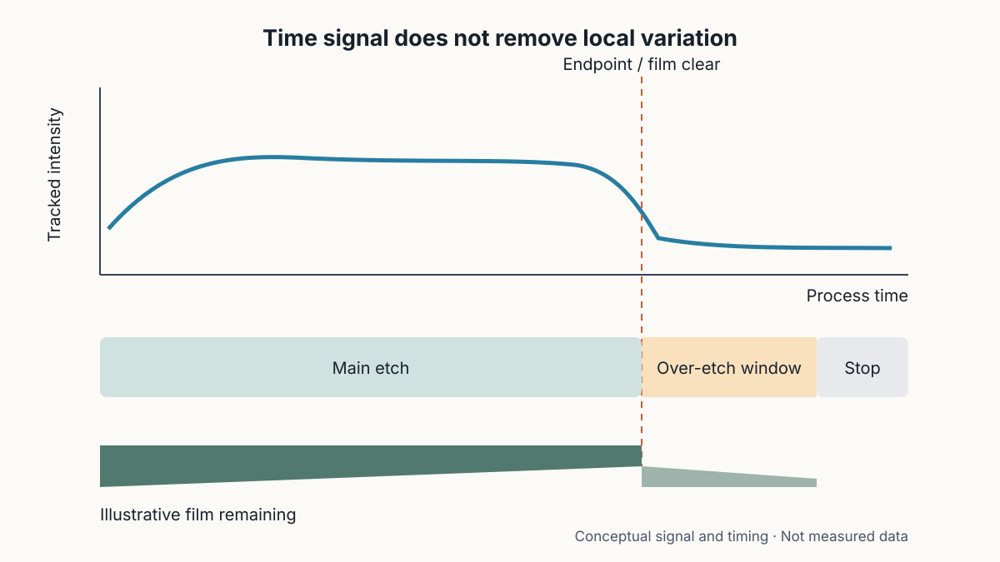
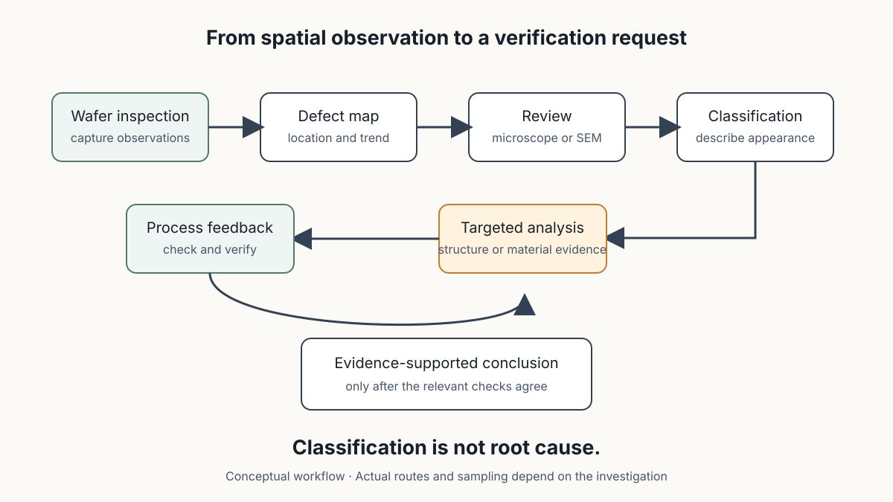

# Plasma Etch Monitoring and In-line Inspection

## 製程還在進行時，如何從訊號與缺陷分布判斷它是否偏離預期？

> **Learning Context**
>
> Most of my inspection experience begins after an image has already been captured. Plasma etching introduced an earlier layer of evidence: the process itself can leave a time-dependent optical signal before a finished structure is available for inspection. That signal may help identify a material transition or define an endpoint, while later in-line inspection records where visible defects appear.
>
> What became useful to me was knowing what each signal could actually tell me before trying to connect it to WAT or CP. One follows the reaction over time; the other preserves spatial evidence after a process step.

OES／EPD 和 defect inspection 原本看起來像是兩個主題。整理後比較能把它們放在同一條線上。兩者都比 WAT 和 CP 更靠近製程，只是一個看時間訊號，另一個看空間分布。

先分開這兩種證據，後面的判斷會簡單很多。

## 1. 製程中的訊號和完成後的結果不同

在前面的 [WAT note](./02-wat-test-structures-and-yield-signals.md) 裡，先把 inline inspection、WAT 和 CP 分開。這裡再往製程時間軸前移一步：plasma etch 還在進行時，腔體內的發光強度會隨氣體組成與反應產物改變；製程步驟完成後，inspection 才會留下 defect location、map 或 trend。

```text
Plasma process signal     → 反應隨時間是否改變？
In-line inspection       → 完成的表面在哪裡出現可見異常？
WAT                      → 測試結構的電性參數是否合理？
CP                       → Product die 是否通過功能與電性測試？
```

這四層可能互相呼應，不過不能互相替代。Endpoint signal 出現，不代表每個開口都已得到相同 profile；defect map 沒有明顯異常，也不能直接推成後續電性一定通過。

## 2. 同一個 Recipe，局部 Etch Result 仍可能不同

一開始容易把 recipe 想成整片晶圓共用的答案：時間、氣體與功率相同，蝕刻結果應該也相同。但 micro-loading 讓局部開口大小與 pattern density 也進入了結果。

較小的開口裡，etchant 較難進入，reaction byproduct 也較難離開，因此 etch rate 可能低於較大的開口。另一組 layout 與製程後剖面的對照也顯示，名義尺寸相近的 poly pattern，實際寬度仍可能不同。這裡不把例子中的特定尺寸當成通用 design rule；它比較重要的作用，是修正「layout 畫得一樣，實體就會完全一樣」的直覺。


> 圖 1：相同 process setting 下，不同 local geometry 仍可能產生不同 etch result；結構為概念示意。

這個差異也替後面的 OES 留下一個限制：腔體訊號可以反映整體反應正在改變，但不一定能單獨說明某一個小開口是否已經清乾淨。

## 3. OES 量到的是 Plasma 發出的光

Optical Emission Spectrometry（OES）把腔體發出的光經 optical fiber 送入 spectrometer，再記錄不同 wavelength 的 intensity。特定物種具有對應的 emission peak，因此可以同時觀察 spectrum，也可以追蹤選定訊號隨時間的變化。

```text
Plasma and surface reaction
        ↓
Excited species and reaction products
        ↓
Optical emission
        ↓
Spectrometer
        ↓
Intensity by wavelength and time
```

但 OES 不是直接量 film thickness，也不是拍下 wafer surface。它量到的是光。要把某條 intensity curve 解讀成材料轉換或 endpoint，仍要知道追蹤的是哪個物種、反應條件是否穩定，以及訊號變化是否能重複出現。

## 4. Endpoint 是一段時間判斷，不是一個神奇 Peak

以 silicon 或 silicon dioxide etch 為例，當正在移除的 film 接近 clear，plasma 中的反應物或產物組成會改變，選定 emission signal 也跟著改變。End Point Detection（EPD）便能利用這個時間變化送出 endpoint signal，停止 main etch 或切換到下一段操作。



> 圖 2：Emission signal 在 film clear 附近的變化，以及 main etch、endpoint 與 over-etch window 的相對位置；曲線與時間皆為概念示意。

這裡曾經卡了一下：如果 endpoint 已經出現，為什麼還要 over-etch？重新對照 micro-loading 後就比較清楚。Endpoint 比較接近「整體訊號已顯示材料轉換」，但 wafer 內與局部 pattern 仍可能存在 etch-rate variation，因此製程會保留一段 over-etch margin，讓較慢的區域有機會完成。

不過 over-etch 也不是越久越安全。「何時停止」仍是一個控制問題：時間不足可能留下殘膜，時間過長則可能增加下層材料或結構受影響的風險。單看 endpoint curve，還不能替所有 geometry 找到唯一的最佳停止時間。

## 5. In-line Inspection 留下的是空間證據

OES 與 EPD 沿著 process time 追蹤訊號，in-line inspection 則把問題換成 wafer location。流程從 wafer inspection 產生 defect map 與 trend chart，接著用 microscope 或 SEM review 進行分類，再把選定位置送往後續 analysis and investigation。



> 圖 3：Inspection 先留下 defect location 與 distribution，再透過 review、classification 與 targeted analysis 縮小 investigation scope；defect class 本身不等同 root cause。

這一段和既有 AOI 工作最接近的地方，是 coordinate、classification 與 history 都要保留下來。單張 defect image 能說明局部看到了什麼，map 和 trend 才能回答它是否集中在特定 wafer region、layer 或時間區段。後續若要和 process record、WAT 或 physical analysis 對齊，orientation、位置、recipe version 與 inspection condition 也不能丟掉。

但這種熟悉感也很容易讓判斷跑太快。這裡反而接近原本做 AOI 的習慣：particle、scratch 或 bridge-like label 可以幫忙決定先 review 哪裡，但不能只靠 classification 就往 plasma chemistry 或某一道 process step 下結論。

## 6. Time Signal 和 Spatial Evidence 要怎麼接起來

如果 endpoint timing 漂移，同批 wafer 又出現相似的空間缺陷，兩組資料放在一起會讓 etch-related hypothesis 更值得追。接下來會先確認它們是否真的來自同一個 wafer、process step 和時間範圍，再決定需要的是 CD、profile、electrical measurement，還是 physical inspection。

再往下整理，就會碰到另一個問題：geometry variation 要怎麼和可接受的 electrical risk 接起來？這就要再看 design rule 如何替 lithography、etch 與 overlay 留下 process margin。

## Learning Source

1. Hsinchu Science Park Bureau–subsidized course, [*積體電路故障分析技術與良率提升*](https://saturn.sipa.gov.tw/edu/d013_new.jsp?pl_id=26A01&cs_id=15S359) (*IC Failure Analysis Technology and Yield Improvement*, course 15S359), delivered by the Tze-Chiang Foundation of Science & Technology, August 6–7, 2026. This note draws on the second day, especially the plasma etching, OES, EPD, over-etch, and in-line inspection material.
