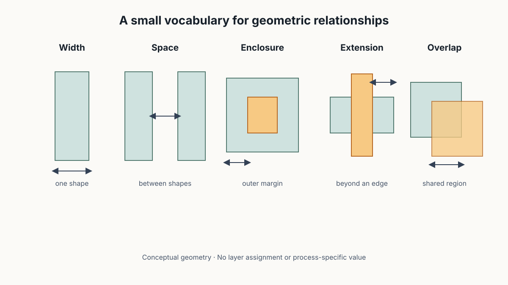
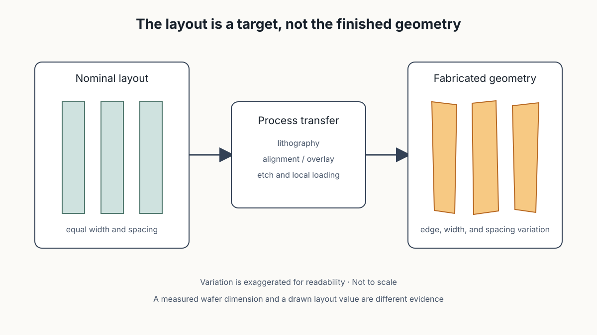
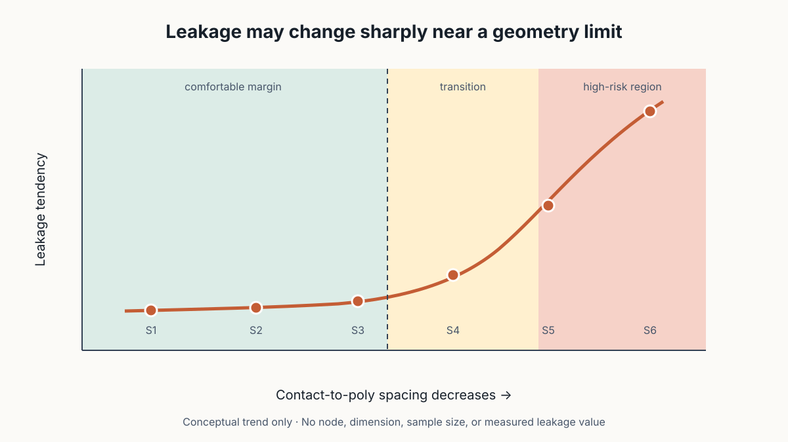

# Design Rules and Process Margin

## 幾何規則不是一張尺寸清單：它替實際製程留下多少容忍空間？

> **Learning Context**
>
> I used to read width, spacing, and enclosure mainly as layout constraints: values that a design-rule check either accepts or rejects. The missing connection was the fabricated structure. A layout is a geometric target, while lithography, alignment, etching, and local pattern conditions determine what is actually formed. A minimum rule therefore carries some of the process and electrical margin between them.
>
> This note follows one contact-to-poly spacing example. It shows why leakage can rise sharply near a process limit, while keeping three claims separate: a rule violation, an electrical symptom, and a physically verified bridge are not the same evidence.

## Short English Note

A design rule keeps geometric margin between a layout target and the structure that a variable process can fabricate. Passing DRC does not prove the finished geometry or electrical result, and a violation does not by itself verify a physical defect.

看到 design rule 的第一個直覺，是把它當成畫 layout 時不能越過的紅線。Width 不夠、spacing 太小，DRC 就會報錯。這個理解沒有錯，只是還少了一段：為什麼紅線會畫在那裡？

Well、OD、poly、contact、metal 和 via 都有各自的尺寸規則。逐條抄下來不太有幫助，因為那些數字屬於特定製程平台。真正讓這一段接起來的，反而是 contact-to-poly leakage 例子。尺寸縮小到某個區域後，電性風險開始快速增加，幾何規則才不再只像 CAD 軟體裡的一組限制。

## 1. 先記住五種幾何關係

這篇只保留五個常見詞：

- **Width**：單一圖形本身的寬度；
- **Space**：兩個圖形之間的距離；
- **Enclosure**：外層圖形包住內層圖形後，邊界還剩多少；
- **Extension**：一個圖形超出另一個圖形的距離；
- **Overlap**：兩個圖形互相重疊的範圍。



> 圖 1：作者重新繪製；五種圖形只用來分辨 layout-rule language，不代表特定 layer、製程節點或實際 design-rule 數值。

它們看起來都是幾何名詞，不過背後保護的結構不同。例如 line width 太小，可能讓導線形成變得不穩定；contact enclosure 不足，遇到 overlay variation 時可能讓接觸面積變小；相鄰圖形 spacing 太近，製程後則可能提高 bridge 或 leakage 的風險。

但「可能提高風險」還不是「已經發生失效」。這個差別後面還要再拆一次。

## 2. Layout 是 Target，不是最後做出的形狀

前一篇談 [micro-loading](./04-plasma-etch-monitoring-and-inline-inspection.md) 時，已經看到相同 recipe 進入不同開口或 pattern density 後，local etch rate 仍可能不同。Design rule 把這件事往前連回 layout：mask 上畫出的幾何形狀，要經過 lithography、alignment、etch、deposition 與其他製程步驟，才會變成晶圓上的實體。

```text
Layout target
    ↓
Lithography and alignment
    ↓
Etch or deposition
    ↓
Fabricated geometry with variation
```



> 圖 2：作者重新整理；相同 nominal layout 經過 lithography、overlay 與 etch 後，線寬、邊界與間距可能出現 variation。所有偏移均刻意放大，結構不按比例。

這裡原本容易混在一起的是「設計尺寸」和「量到的實體尺寸」。Layout database 裡的 spacing 是設計值，晶圓上的 spacing 則還包含 CD、overlay 與 profile variation。兩個數字即使名稱相同，也不應直接當成同一種 observation。

## 3. Margin 位在名義尺寸與失效邊界之間

如果 fabricated geometry 完全沒有 variation，minimum rule 只要剛好避開失效點似乎就夠了。但實際製程不是每一次、每個位置都落在同一個尺寸，因此 rule 需要在 nominal layout 和高風險區域之間保留距離。

可以先把關係想成：

```text
Nominal design value
        ↓
Expected process variation
        ↓
Electrical transition region
        ↓
High-risk or failing region
```

這裡的 margin 不是一句「留大一點比較安全」就能決定。Spacing 增加可能占用面積，width 增加可能改變電容或 routing density，enclosure 增加也會影響周圍圖形。Design rule 比較像是 design density、process capability 與 electrical behavior 之間的取捨，不是把所有尺寸無限制放大。

## 4. Contact-to-Poly Spacing 讓規則的來源比較具體

把 contact 與 poly 的距離依序縮小後，可以看到這組關係：

```text
Spacing:  S1 > S2 > S3 > S4 > S5 > S6
Leakage:  S1 ≈ S2 ≈ S3 < S4 < S5 ≪ S6
```

前幾組 spacing 雖然逐漸縮小，leakage 仍大致維持在相近範圍；進入後面的區域後，leakage 才明顯上升。這個趨勢比逐條背 rule value 更有用，因為它顯示 electrical response 不一定跟 spacing 等比例改變。接近某個製程能力區域時，小幅幾何變化也可能帶來很大的電性差異。



> 圖 3：作者依 S1–S6 的相對關係重新繪製；曲線只保留「前段相近、後段快速上升」的方向，沒有沿用原例中的 node、尺寸或 leakage 數值，也不代表實際量測分布。

這組結果可以再連回 contact、diffusion 與 poly 的 alignment precision，以及 contact-to-poly spacing 的 process capability。到這裡，minimum spacing rule 的角色才比較清楚：它不是從版圖慣例憑空產生，而是希望正常 variation 發生時，結構仍不要太容易掉進 leakage 急升的區域。

不過這張概念曲線沒有提供實際 sample size、distribution、measurement condition 或失效判準，因此不能從圖上自行讀出一個新的通用 rule。能留下的是判斷方式，不是數字。

## 5. Rule Violation、Electrical Symptom 和 Physical Defect 不同

Contact-to-poly spacing 太小時，bridge 或 leakage 是合理的工程假設，但三層證據仍要分開：

| 證據層次 | 目前能說什麼 | 還不能直接說什麼 |
|---|---|---|
| DRC violation | Layout geometry 不符合指定規則 | 晶圓上一定已形成 bridge |
| Leakage high | 測試結構存在異常導通 | 唯一原因就是 contact-to-poly spacing |
| Optical or SEM contrast | 某個位置有可見結構差異 | 差異已完成材料或電性驗證 |
| Cross-section with aligned electrical evidence | 局部實體結構與失效位置相符 | 若樣本有限，整批產品都有相同機制 |

反過來也一樣。Layout 通過 DRC，只表示它符合該組規則，不代表實際製程完全沒有 variation，也不保證每顆 product die 都會通過後續測試。Rule 提供的是可製造範圍與風險控制，不是零失效承諾。

## 6. 現在看到 Rule，會多問一層

整理前看到 spacing rule，注意力通常停在「最小值是多少」。現在比較想先問：它在保護哪一個結構？主要容納的是 CD、overlay、etch profile，還是幾種 variation 疊在一起？最後又是用哪一種 electrical response 或 failure criterion 把邊界定下來？

如果只有 layout violation，可以要求 geometry review；如果已經量到 leakage，還要比較相關 test structure、wafer distribution 與量測重現性；若要寫成 bridge cause，則需要能對準失效位置的 physical evidence。順序拉開後，rule、symptom 和 root cause 就比較不容易被寫成同一件事。

再往下會遇到另一種 margin。Design rule 關心幾何與製程能力，CP 的 nominal pass 則還沒有回答產品離 voltage、frequency 或 timing boundary 多遠。下一篇會用 Shmoo plot 把這個 operating window 畫出來。

## References

1. Hsinchu Science Park Bureau–subsidized course, [*積體電路故障分析技術與良率提升*](https://saturn.sipa.gov.tw/edu/d013_new.jsp?pl_id=26A01&cs_id=15S359) (*IC Failure Analysis Technology and Yield Improvement*, course 15S359), delivered by the Tze-Chiang Foundation of Science & Technology, August 6–7, 2026. This note draws on the second day, especially the design-rule definitions and contact-to-poly spacing example.
