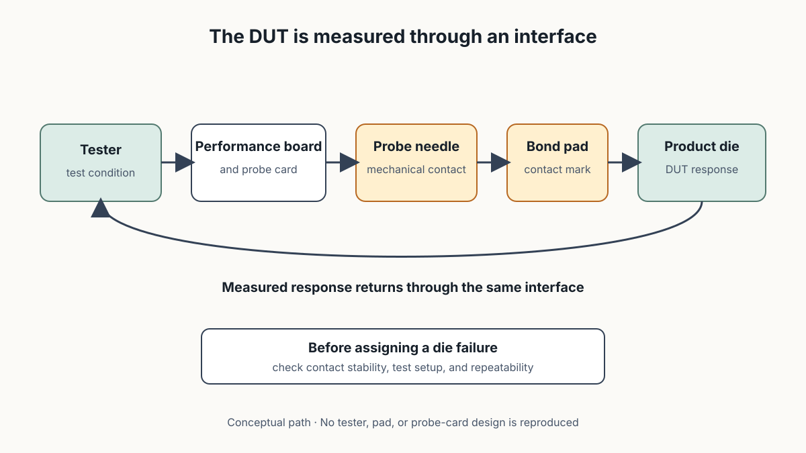
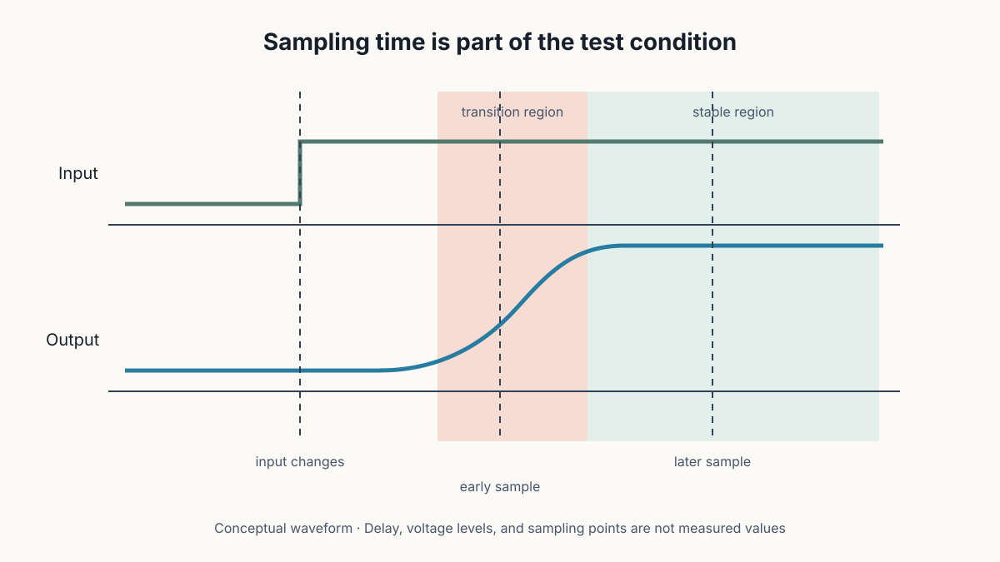
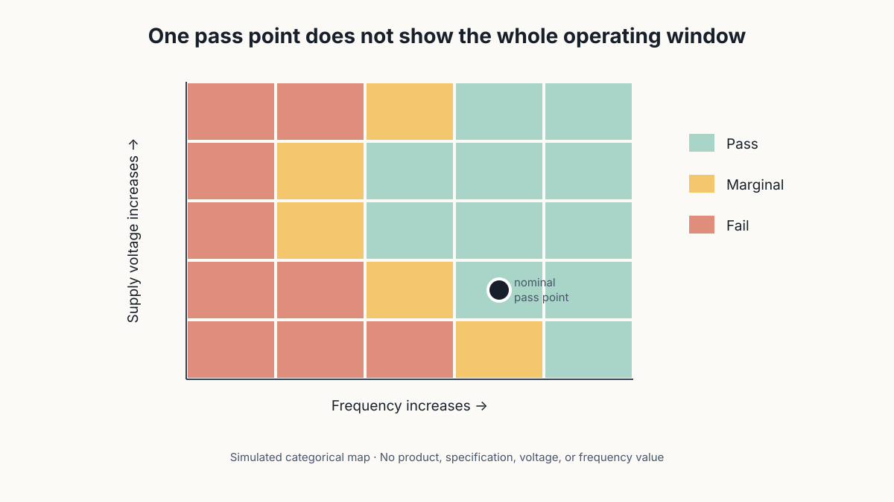

# CP Test Marginality and Shmoo Plots

## Pass 或 Fail 之外，一顆 IC 距離測試邊界還有多遠？

> **Learning Context**
>
> Pass and fail results are familiar from inspection and model evaluation, but a single result hides how close the tested object is to its decision boundary. CP testing adds another complication: the tester reaches each die through a probe card and pad contact, then evaluates the response under chosen voltage, frequency, timing, and temperature conditions.
>
> The Shmoo plot was the part that changed my reading order. Instead of treating a nominal pass as the end of the test, it maps where pass turns into fail as two conditions vary. The boundary reveals margin, although it still does not identify a unique physical cause.

## Short English Note

A nominal pass records one tested point. A Shmoo plot shows the surrounding operating window, making a result near the boundary visible without turning that boundary into a root-cause diagnosis.

以前看到 CP 結果，最順手的分類就是 Pass 和 Fail。這和 AOI 裡的 OK／NG 很接近：先把不符合條件的項目挑出來，再往下查。但把 test marginality 和 Shmoo plot 放在一起後，原本的二元結果突然多了一個問題：同樣是 Pass，一顆 IC 位在穩定區中央，和剛好擦過邊界，其實不是同一種狀態。

這篇不再重講 WAT 與 CP 的完整差異。前面的 [WAT Test Structures and Yield Signals](./02-wat-test-structures-and-yield-signals.md) 已經把兩者分開；這裡只往 CP 的 measurement path 和 operating window 多走一步。

## 1. CP 測的是 Product Die，但中間還有一條路徑

CP 在晶圓尚未切割與封裝前，透過 probe card 接觸每一顆 die 的 pad，再由 tester 施加條件並讀回 response。從 tester 到 DUT，不是直接憑空連上：

```text
Tester
    ↓
Performance board and probe card
    ↓
Probe needle
    ↓
Bond pad
    ↓
Product die under test
    ↓
Measured response
```



> 圖 1：作者重新繪製；CP tester 經過 probe card 與 pad 接觸 DUT，再接收量測 response。圖中連接、pad 數量與訊號方向均為概念示意，不代表特定 tester、probe card 或產品設計。

這條路徑看起來只是連接問題，實際上也會帶入 measurement condition。Probing-force 與 contact resistance 的關係顯示，接觸力太小時 resistance 可能偏高；施力太大則要留意 probe deflection 與 pad damage。也就是說，量到異常電阻時不能立刻把所有變化都歸到 die 內部，probe contact 的穩定性也要先站得住腳。

## 2. Probe Contact 不是越用力越可靠

這裡原本很容易形成一個簡單直覺：既然小力接觸會有較高 resistance，那就加大 probing force。但再把 probe mark array 放進來看，答案就沒那麼輕鬆。接觸必須足以建立穩定導通，又不能無限制增加 pad damage 或 mechanical deflection。

因此 CP fail 若會隨 touchdown、清針、接觸次數或 probing condition 改變，先確認 test interface 比直接猜製程原因更合理。這不表示所有 intermittent fail 都來自 probe card，只是 measurement path 尚未排除前，die failure 還不是唯一解釋。

記到這裡，Pass／Fail 已經不是只由 DUT 決定。測試如何接上它，也在結果裡。

## 3. Digital Output 也要等一段時間再取樣

以 CMOS inverter 的 rise/fall time 來看，input 改變後，output 不會在同一個瞬間完成轉換。Propagation delay、rise time 與 fall time 讓波形需要一段時間才進入穩定的 logic level；tester 若太早 sampling，就可能在 transition region 讀到不正確結果。



> 圖 2：作者重新繪製；output 在 input transition 後才逐漸進入穩定區，sampling point 太靠近轉換區時，判讀風險會增加。波形與時間刻度均為概念資料。

如果 clock frequency 提高，每個 cycle 留給訊號 settle 的時間會縮短；如果 supply voltage 降低，transistor drive current 下降，rise/fall response 也可能變慢。這些條件會一起推動 pass/fail boundary，但文章不重新展開 MOS current equation。那條式子裡的 mobility、threshold voltage、geometry 與 capacitance 貢獻，已在 [Electrical Anomalies and Process Hypotheses](./03-electrical-anomalies-and-process-hypotheses.md) 拆過。

## 4. Nominal Pass 只是一個 Operating Point

假設測試程式在指定 voltage、frequency、sampling time 與 temperature 下執行，最後得到 Pass。這個結果能證明 DUT 在當次條件下通過，卻沒有告訴我條件稍微改變後會發生什麼。

```text
Nominal test point: Pass

仍然未知：
- voltage 再低一些是否還能工作？
- frequency 再高一些是否仍能準時回應？
- sampling point 稍微提前是否會越過 timing boundary？
- temperature 改變後，原本的 window 是否仍保留？
```

這就是 marginality 想補上的資訊。它關心的不是單一點有沒有過，而是 operating condition 改變時，Pass 能維持多大的範圍。

## 5. Shmoo Plot 把 Pass／Fail Boundary 畫出來

Shmoo plot 會選兩個 test parameters 作為座標軸，在每一組條件下執行測試，再把結果標成 Pass 或 Fail。可調整的變因包括 supply voltage、clock frequency、sampling time 與 temperature；實際選哪兩個，取決於要觀察的 failure mode。



> 圖 3：作者建立的模擬 Shmoo map；每個方格代表一組 voltage–frequency condition。顏色只區分 Pass、marginal 與 Fail 區域，沒有使用真實產品、spec 或量測數值。

圖上的 nominal point 若位在 Pass region 中央，周圍條件變動後仍有較多空間；若它貼近 boundary，即使當下同樣顯示 Pass，對 voltage droop、frequency increase 或 timing shift 的容忍度可能較小。整理到這裡，Shmoo concept 最值得留下來的就是「容忍度」這個差別。

不過 boundary 的形狀也要保留條件。Temperature、test pattern、probe contact、tester configuration 或 sample size 改變時，map 可能跟著變。沒有記錄這些 context，一張漂亮的彩色格子圖也很難重現。

## 6. Margin 能縮小問題，但不會自己說出原因

看到低 voltage、高 frequency 區域先 Fail，可以提出「drive capability 或 timing margin 值得檢查」；若改變 sampling time 後 boundary 明顯移動，則 timing setup 也應列入比較。這些都是工程方向，不是唯一原因。

同一種 Shmoo boundary 仍可能混入：

- DUT 本身的 device or interconnect behavior；
- probe contact 與 test interface；
- test program、pattern 或 sampling definition；
- temperature 與其他環境條件；
- 不同 wafer、lot 或 die group 的分布差異。

因此目前比較順手的順序，是先確認 fail 是否可重現，再保存兩個 sweep parameters、step size、temperature、pattern、probe condition 與 tester configuration。接著比較 boundary 是否跟 wafer location、WAT parameter 或特定 fail bin 一起移動，最後才決定要往 electrical localization 還是 physical verification 前進。

Shmoo plot 比單一 Pass／Fail 多給了一張地圖。它顯示路走到哪裡開始不穩，卻沒有替那條邊界命名原因。再往下整理，問題就會從 product-test margin 轉成 failure localization：先找到異常發生的位置，再選擇適合的光、電子或離子束證據去查。

## References

1. Hsinchu Science Park Bureau–subsidized course, [*積體電路故障分析技術與良率提升*](https://saturn.sipa.gov.tw/edu/d013_new.jsp?pl_id=26A01&cs_id=15S359) (*IC Failure Analysis Technology and Yield Improvement*, course 15S359), delivered by the Tze-Chiang Foundation of Science & Technology, August 6–7, 2026. This note draws on the second day, especially the CP measurement path, probing-force, rise/fall-time, test-marginality, and Shmoo-plot material.
