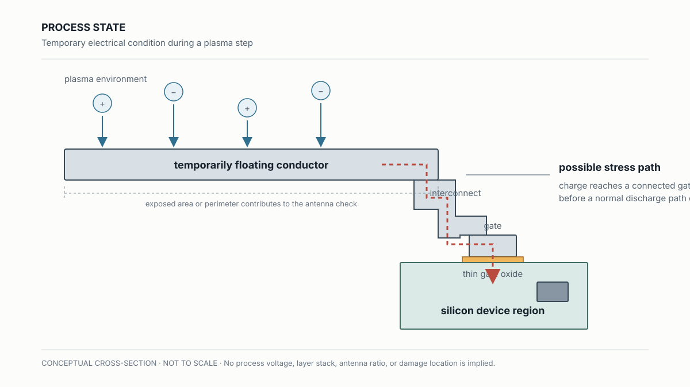
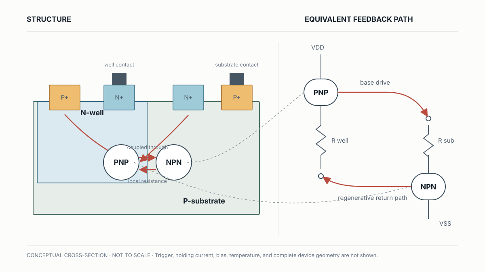
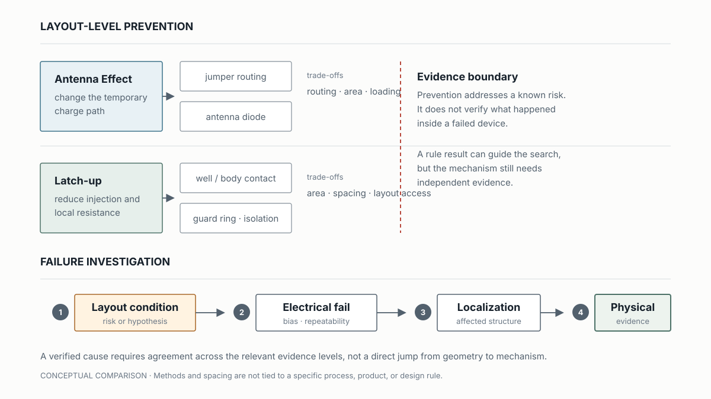

# Layout-Induced Failures: Antenna Effect and Latch-Up

## Layout 通過幾何檢查後，為什麼還可能留下 electrical risk？

> **Learning Context**
>
> I used to read layout rules mainly as geometric constraints: width, spacing, enclosure, and connectivity. Antenna effect and latch-up made that reading feel incomplete. One begins while a conductor is temporarily floating during plasma processing. The other comes from parasitic paths already present in CMOS wells and substrate.
>
> The finished layout may look ordinary in both cases, but the electrical risks are not the same. This note separates the two mechanisms first, then asks how far geometry can support an investigation before electrical localization and physical evidence are still needed.

這篇先把兩種 layout-related risk 分開：Antenna Effect 發生在帶電製程中的暫態連線；Latch-up 則來自完成元件裡的寄生回授路徑。

## 1. 先把兩種失效路徑分開

先不急著談改善方式。比較順手的分法，是先問風險在哪一個時間點形成，以及電流可能走哪一條路。

| 判讀問題 | Antenna Effect | Latch-up |
| --- | --- | --- |
| 風險何時形成 | plasma etch 等帶電製程進行時 | 元件在 bias、暫態或外部擾動下被觸發時 |
| 主要路徑 | floating conductor 收集電荷，再對 gate oxide 施加 stress | 寄生 PNP、NPN 與 well／substrate resistance 形成回授 |
| 可能看到的 electrical symptom | gate leakage 或 device failure | supply current 異常升高、功能失效，嚴重時造成損傷 |
| 單靠 layout 能支持什麼 | 找出 antenna ratio 或 connectivity 值得檢查的 net | 找出寄生路徑與 local resistance 可能較不利的區域 |

這張表只是在分流，不是在診斷。即使 symptom 吻合，也還要排除其他 leakage path、short、EOS 或測試條件造成的影響。

## 2. Antenna Effect：製程當下的 Charge Path

在 plasma etch 或其他帶電製程環境中，一段尚未接到穩定放電路徑的 metal 或 poly，可能暫時成為 floating conductor。它收集到的電荷若沿著連線走到 gate，薄薄的 gate oxide 就可能承受原本沒有預期的電場。

所以這裡的「antenna」不是版圖上多了一個元件，而是導體在某個製程步驟暫時扮演 charge collector。需要留意的也不只是線長，而是當下暴露的 conductor area 或 perimeter，和受影響 gate area 之間的關係。實際 antenna ratio 仍取決於製程層別與 design rule，不能只靠 finished layout 猜一個通用門檻。

> 圖 1：作者依機制重新繪製。圖中把 charge collection、導體連線與 gate oxide stress path 分開標示；結構不按比例，也不代表特定 metal stack、plasma potential、oxide thickness 或實際損傷位置。

幾何規則與 process margin 的關係，前面已在 [Design Rules and Process Margin](../04-ic-process-monitoring-and-failure-analysis/05-design-rules-and-process-margin.md) 整理過。另一方面，[Plasma Etch Monitoring and In-line Inspection](../04-ic-process-monitoring-and-failure-analysis/04-plasma-etch-monitoring-and-inline-inspection.md) 裡的 OES 或 endpoint signal 可以顯示製程狀態是否改變，卻不會指出哪一個 net 收集了多少電荷。要連到 oxide damage，中間還缺 layout connectivity、可重現的 leakage 與 localization evidence。

## 3. Jumper 和 Antenna Diode 改變了什麼

- **Jumper routing**：把部分連線移到較晚形成的 metal layer，縮小某一製程階段直接連到 gate 的 conductor 範圍。
- **Antenna diode**：提供較可控的 charge discharge path，避免累積電荷只往 gate oxide 走。

一開始很容易把它們當成單純的 DRC 修正。但 jumper 會動到 routing，diode 會占面積，也可能增加 loading。選哪一種方法，還得回到 layer sequence、timing、area 與可靠度條件。規則通過只表示風險已按既定方法處理，不能倒推 oxide 一定沒有受過 stress。

## 4. Latch-Up：完成元件中的 Parasitic Feedback

CMOS 的 well、substrate 與 source／drain diffusion 在組成正常元件的同時，也會帶出寄生 PNP、NPN，以及 well resistance 和 substrate resistance。這些不是 layout 裡另外畫出的 transistor，卻存在於結構中。

若注入電流讓局部電位產生足夠變化，其中一個寄生 transistor 導通後，可能再替另一個提供 base current，形成類似 SCR 的 regenerative path。原本短暫的擾動便可能變成持續的大電流，直到電源被移除，或電流降到無法維持導通的條件。

> 圖 2：作者重新整理的簡化 CMOS cross-section 與等效回授關係。圖中只用來對齊結構和寄生元件，不代表完整 device geometry、trigger current、holding current 或實際 latch-up test condition。

這裡曾經容易把「存在寄生結構」讀成「已經發生 latch-up」。但真正的問題，是 loop gain、local resistance、injected current、bias 與溫度是否一起到達可觸發並維持導通的條件。

## 5. Prevention 與 Failure Verification 不是同一件事

增加 well／substrate contact、加入 guard ring、調整 spacing 或改善 isolation，都在改變寄生路徑的條件：縮短 local resistance path、先收集 injected carrier，或減少相鄰區域互相影響。這些方法降低的是觸發與維持回授的可能性，不是替已發生的 failure 命名。

> 圖 3：作者重新繪製。上半部比較兩種 mechanism 的 layout-level prevention；下半部把 hypothesis、repeatable electrical fail、localization 與 physical evidence 排成查證順序。所有結構與方法均為概念表示，不代表特定 design rule 或產品 layout。

如果手上只有 antenna violation 或不利的 well spacing，能說的是某個風險值得處理。即使又看到 gate leakage 或 abnormal supply current，也要先確認 bias、repeatability、test setup 與其他 failure mode，再把 fail site 對到 affected structure。

現在比較有用的區分，不是哪一段 layout 看起來更可疑，而是哪一條 physical path 應該先被驗證。Antenna Effect 要沿著製程順序與 charge path 往下查；Latch-up 則要確認寄生回授能否在特定條件下被觸發。下一篇會接著看 bias 下的微弱發光，能把 electrical fail site 縮小到哪裡。

## What I Would Check Next

- Antenna risk 如何隨 layer 與 etch sequence 改變，而不是只看 finished layout？
- 面對 suspected latch-up 或 gate leakage，哪一組 electrical 與 localization evidence 最能先排除其他 failure path？

## References

1. Hsinchu Science Park Bureau–subsidized course, [*積體電路故障分析技術與良率提升*](https://saturn.sipa.gov.tw/edu/d013_new.jsp?pl_id=26A01&cs_id=15S359) (*IC Failure Analysis Technology and Yield Improvement*, course 15S359), delivered by the Tze-Chiang Foundation of Science & Technology, August 6–7, 2026. This note draws on the second day, especially the plasma-induced damage, antenna-effect, and latch-up material.
