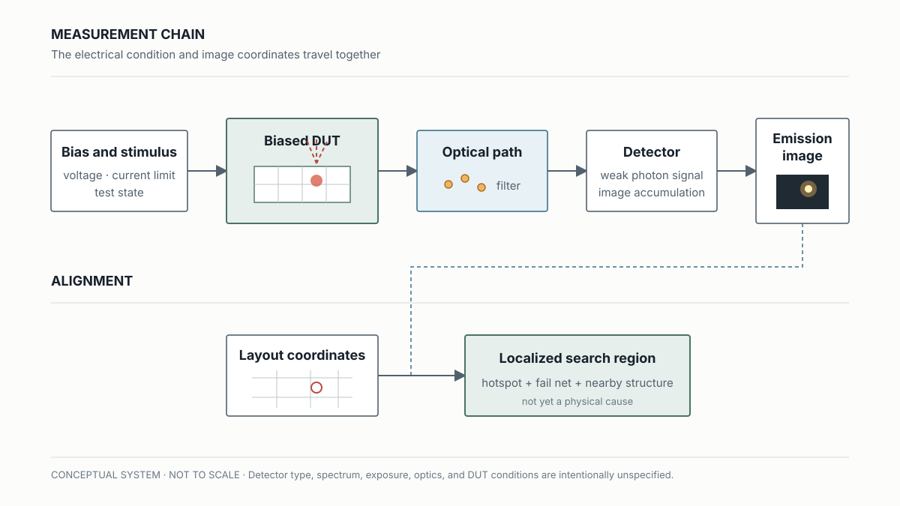
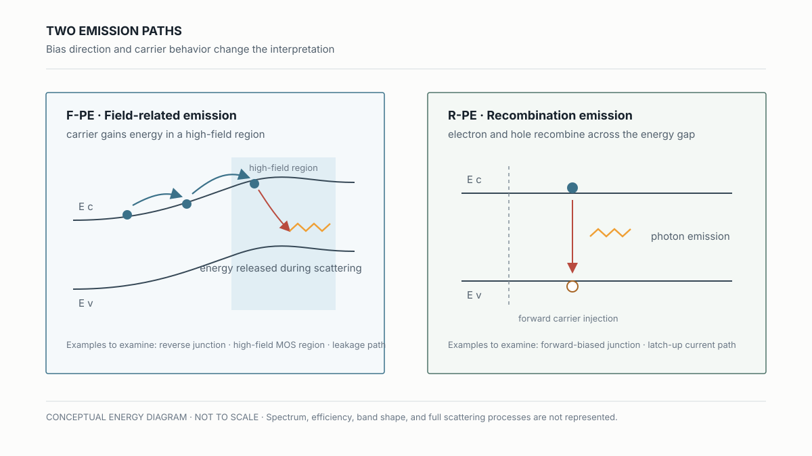
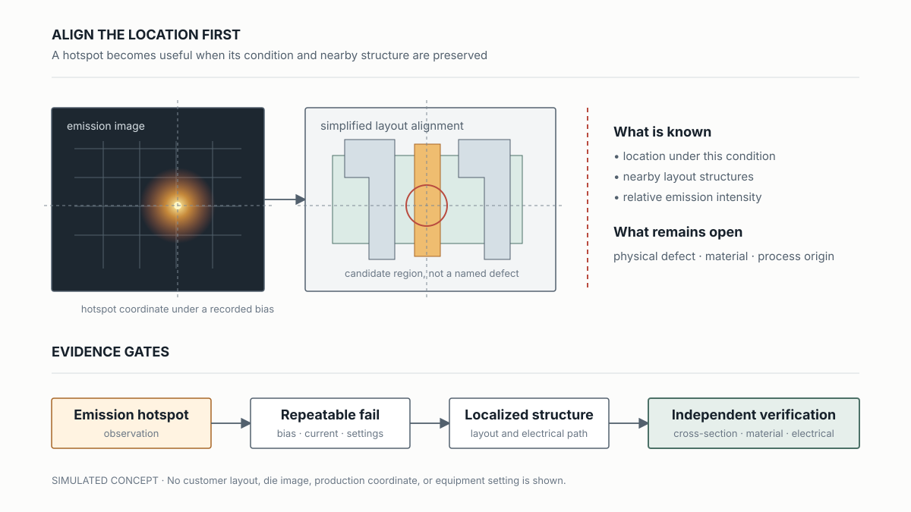

# Emission Microscopy and Electrical Localization

## 看到一個發光亮點後，究竟知道了什麼？

> **Learning Context**
>
> At first, I pictured EMMI as a simple map: if leakage happens somewhere, that area lights up. That was too rough. The biased device does become the light source, but whether a faint emission appears also depends on the electrical condition and how the signal is collected.
>
> A hotspot can narrow the search to a junction, gate region, or current path. I still need the bias, measured current, and layout alignment before deciding what to inspect next. The physical defect may remain unknown at that point.

前一篇把 [Antenna Effect 與 Latch-up](./01-layout-induced-failures-antenna-and-latchup.md) 停在 electrical hypothesis。這篇接續：如果元件在 bias 下真的發出微弱光線，EMMI 能把搜尋範圍縮小到哪裡？

## 1. EMMI 量到元件自己發出的光

Emission Microscopy Inspection System（EMMI，也常稱 Photo Emission Microscopy, PEM）會在 Device Under Test（DUT）施加指定 bias，再用高靈敏度 detector 累積元件發出的微弱光訊號。最後得到的 emission image，還要和 die image 或 layout 座標對齊，才知道亮點附近有哪些結構。

> 圖 1：EMMI 的概念量測鏈。Detector type、波長範圍與曝光時間未指定，圖中也沒有使用實際產品資料。

這和一般 optical inspection 的讀法不太一樣。表面影像主要記錄照明後的反射、散射或形貌差異；EMMI 記錄的是元件在特定 bias 下產生的 photon emission。少了量測電流與影像對位，亮點暫時只是一個座標。

## 2. 先分開 Field-Related Emission 與 Recombination Emission

我一開始其實把 EMMI 想成「漏電在哪裡，哪裡就會亮」。看到 F-PE 和 R-PE 的差別後，才發現這個理解太粗。相同是發光，載子釋放能量的方式不一定相同。

先把兩個縮寫記下來：F-PE 是 Field-related Photo Emission，R-PE 是 Recombination Photo Emission。

| 判讀問題 | F-PE | R-PE |
| --- | --- | --- |
| 主要條件 | 載子在高電場區獲得能量，再經 scattering 釋放部分能量 | 電子與電洞 recombination 時釋放能量 |
| 是否跨越能階 | 主要是同一能帶內的能量鬆弛（intraband process），不以跨越 bandgap 的 recombination 為主 | 電子由 conduction band 與 valence band 的電洞復合，跨越 bandgap（interband process） |
| 常見 electrical state | reverse-biased junction、局部高電場或 leakage path | forward-biased junction 或大量 minority-carrier injection |
| 可能關聯的檢查方向 | junction breakdown、MOS high-field region、ESD path、gate oxide leakage | forward junction conduction、latch-up current path |
| 還不能直接證明 | 高電場來自哪一個實體缺陷 | 是哪一個結構或製程條件觸發導通 |

> 圖 2：F-PE 與 R-PE 的概念比較。能帶不按比例，圖中也沒有展開完整的 scattering process 與 emission spectrum。

圖裡刻意把這個差別畫出來：F-PE 的載子主要在同一能帶內取得並釋放能量；R-PE 則牽涉 conduction band 與 valence band 之間的 electron-hole recombination。

整理完這張表後，我會先保留 bias direction。Reverse bias 與 forward injection 下的發光，後面要查的 junction 和 current path 不一樣。

## 3. 沒有亮點時，先別急著排除 Leakage

EMMI 要接收到足夠 photon，通常需要相應的電場、電流與積分時間。以 reverse-biased junction 為例，若 leakage 太小，訊號可能低於 detector 的 sensitivity；若為了追求亮點一路提高 bias，又可能讓元件進入 breakdown，甚至改變原本的 failure condition。

這裡的限制很實際：沒有亮點，可能是該位置沒有發光，也可能只是 photon 數量太少、波長不在 detector 較敏感的範圍，或曝光設定不足。亮點很強，也不能直接換算成更嚴重的 physical damage。至少要把 voltage、current compliance、曝光設定與重現性一起留下。

記到這裡，EMMI 比較像是在已知 fail condition 下，找出哪個區域出現了可偵測的 energy release。

## 4. Hotspot 先當成位置證據

假設 emission image 在某個 gate 附近出現 hotspot，能支持的是「這個位置在當次 bias 下有異常發光」。對照 layout 後，可以再確認附近是 gate edge、junction、ESD structure，還是另一條可能的 current path。

但從亮點直接寫成「gate oxide defect」仍然跳太快。Lateral light spread、上層 metal 遮蔽與對位誤差，都可能讓位置判讀偏掉；同一個 electrical symptom 也可能有幾條候選路徑。這時先留下 emission coordinate、bias、current、曝光設定，以及它和 fail net／layout structure 的對應關係。

> 圖 3：模擬 hotspot 與簡化 layout 的對位。座標和結構皆為概念資料，用來表示從亮點走向後續查證的順序。

這和 AOI 裡 bounding box 的限制很接近：座標可以把 review 範圍縮小，卻不會替框內的材料變化命名。EMMI 還多了一組 bias 與 current context，這些資料不能和影像拆開。

## 5. Localization 之後，才決定怎麼打開結構

目前比較順手的順序是先重現 electrical fail，再在相同或受控的 bias condition 下取得 emission image，接著完成 layout alignment。若 hotspot 能穩定出現在同一區域，才依候選結構選擇後續 electrical probing、cross-section、SEM、FIB 或 material analysis。

EMMI 的價值，是把「整顆 die fail」縮小成一個值得打開的區域。若 hotspot 不可重現，或只有在不同 bias 下才出現，這個差異也先留下。不急著挑一張最亮的圖當答案。

## What I Would Check Next

- 同一個 hotspot 是否能在受控的 bias、current compliance 與 acquisition setting 下重現？
- 完成 layout alignment 後，哪一種 electrical 或 physical method 最能區分候選 current path？

## References

1. Hsinchu Science Park Bureau–subsidized course, [*積體電路故障分析技術與良率提升*](https://saturn.sipa.gov.tw/edu/d013_new.jsp?pl_id=26A01&cs_id=15S359) (*IC Failure Analysis Technology and Yield Improvement*, course 15S359), delivered by the Tze-Chiang Foundation of Science & Technology, August 6–7, 2026. This note draws on the second day, especially the F-PE, R-PE, detector-response, and EMMI localization material.
