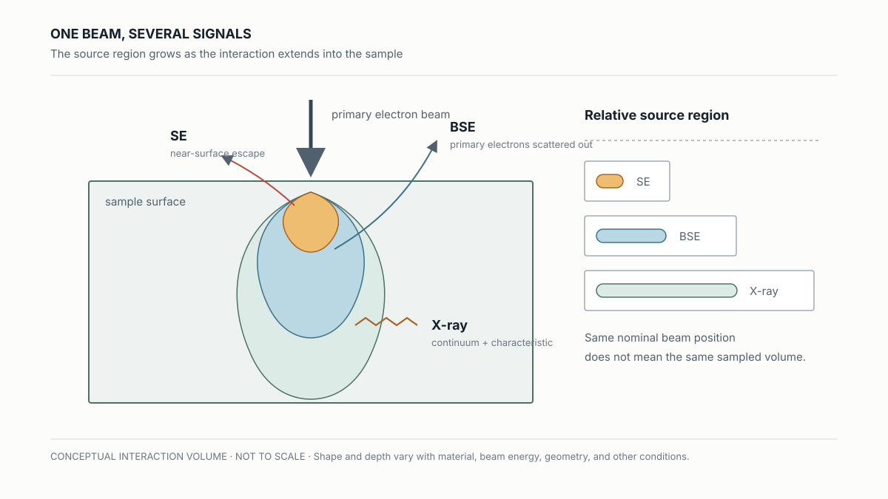
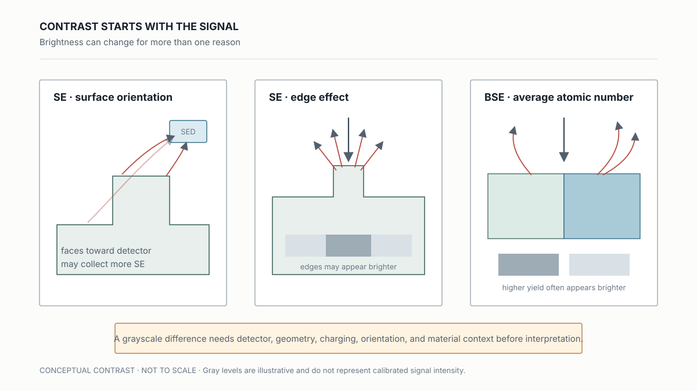
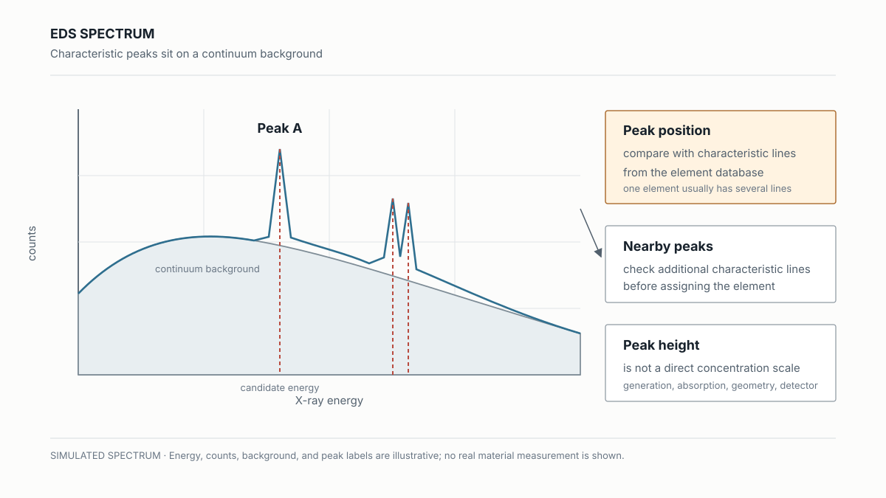

# Reading SEM and EDS Signals

## 同一束電子打到樣品後，為什麼會得到不同答案？

> **Learning Context**
>
> At first, an SEM image looked like a sharper, more magnified version of an optical image. The missing part was the signal choice. One electron beam can produce secondary electrons, backscattered electrons, and X-rays, each from a different interaction with the sample.
>
> That changes how the grayscale is read. A bright region may be related to surface geometry, signal yield, detector position, or average atomic number. An EDS peak adds elemental evidence from a larger interaction region. The signal type has to come before the interpretation.

前一篇用 [EMMI](./02-emission-microscopy-and-electrical-localization.md) 找到 biased device 的發光位置。接著如果要看表面、比較材料 contrast，或確認候選元素，問題就轉成：electron beam 和樣品作用後，到底收了哪一種訊號？

## 1. 一束 Electron Beam，三種不同問題

入射電子進入樣品後會經歷 elastic 與 inelastic scattering。作用範圍不是表面上的一個點，而是在材料裡展開成 interaction volume。Secondary electrons（SE）、backscattered electrons（BSE）與 X-rays 都從這個區域產生，只是能逃出樣品並被 detector 收到的深度與範圍不同。

| Signal | 主要回答什麼 | 最容易誤讀的地方 |
| --- | --- | --- |
| SE | surface、topography 與 edge | brightness 也受 geometry、charging、detector 影響 |
| BSE | composition-related contrast | bright 不等於已確認某個元素 |
| EDS | candidate elements | peak intensity 不等於 concentration |

> 圖 1：Electron–sample interaction 的相對關係。來源深度只表示 SE、BSE 與 X-ray 的大致順序，不對應特定材料、accelerating voltage 或實際尺寸。

一開始容易把三種訊號當成同一個位置的不同輸出。看到 interaction volume 後才比較清楚：量測座標相同，不表示訊號都來自完全相同的材料範圍。

## 2. SE：先讀 Surface 和 Collection Geometry

SE 是入射電子和樣品外層電子發生 inelastic interaction 後產生的低能電子。只有靠近表面的部分比較有機會逃出，因此很適合看 surface topography。邊緣或朝向 detector 的表面可能有更多 SE 被收集，影像就會比較亮；背向 detector 的面則可能較暗。

這裡有個容易忽略的地方。SE detector 記錄的是收到多少電子，再轉成灰階。亮度不會自己說明「這裡比較高」或「這裡就是某種材料」，因為 SE yield 還會受到 geometry、material property、conductivity、grounding 與 detector position 影響。

SE1／SE2 的差別，重點不是背來源名稱，而是知道解析度為什麼會變。SE1 比較靠近 primary beam position；SE2 的來源範圍較大，因此會帶入較寬的 spatial contribution。

## 3. BSE：Contrast 可以提示材料差異

BSE 是 primary electron 經 elastic scattering 後離開樣品的訊號。平均 atomic number 較高的區域通常有較高的 backscatter yield，因此 BSE image 常用來觀察 composition-related contrast。

> 圖 2：同一個簡化樣品分別用 SE 與 BSE 的讀法觀察。灰階僅表示概念 contrast；表面傾角、detector position 與 crystal orientation 仍可能改變實際結果。

一開始很容易把 BSE 的亮區直接叫成「重元素」。比較穩妥的說法是，它和較高 average atomic number 一致，值得再確認 composition。表面傾斜與 crystal orientation 也可能改變 BSE yield；若沒有對照 SE image、sample geometry 或 EDS，單張灰階圖還留著其他解釋。

## 4. EDS：Peak 是 Elemental Evidence，不是直接比例

入射電子可能把 inner-shell electron 撞出，外層電子回填 vacancy 時會釋放 characteristic X-ray。不同元素具有各自的一組 characteristic energies，EDS 量到 X-ray energy 後，便能把 spectrum peak 和資料庫比對，提出候選元素。

Spectrum 裡同時還有 continuum X-ray background。它來自入射電子減速時的能量損失，形成連續分布；characteristic peaks 則疊在背景之上。Peak position 是元素辨識的重要線索，但一個元素通常有多條 characteristic lines，別的元素也可能在相近 energy 出現 peak。

> 圖 3：模擬 EDS spectrum。Peak energy 用於示意候選元素比對，所有能量、強度與標籤都是概念資料。

這一段最容易偷懶的讀法，是看到最高 peak 就說那個元素最多。但 peak intensity 不能直接讀成元素比例，訊號還會受到樣品、interaction volume 與 detector response 等因素影響。X-ray 的來源範圍也可能跨過鄰近 layer 或 particle，EDS 報出的元素未必只來自影像中那個小點。

## 5. 先問問題，再決定看哪個 Signal

要看表面邊緣與形貌，先讀 SE；想比較 composition-related contrast，可以看 BSE；需要候選元素，再用 EDS spectrum 往下查。三種結果最好不要拆開看。至少要知道它們是不是在相同位置、相近 beam condition 下取得，否則很容易把量測條件造成的 contrast 當成材料差異。

同一位置在 SE 很亮、BSE contrast 不明顯，EDS 又出現某個 peak，這三件事可以共同縮小解釋，卻不必硬湊成單一答案。下一步仍可能需要換 beam condition、量相鄰背景、做 line scan／map，或準備 cross-section 看訊號究竟混到哪些結構。

## What to Check Next

- SE 的亮邊能否隨 detector direction 或 sample tilt 改變，以排除單純 edge effect？
- EDS peak 若可能重疊，還有哪些 characteristic lines 與相鄰背景位置可以一起比較？

## References

1. Hsinchu Science Park Bureau–subsidized course, [*積體電路故障分析技術與良率提升*](https://saturn.sipa.gov.tw/edu/d013_new.jsp?pl_id=26A01&cs_id=15S359) (*IC Failure Analysis Technology and Yield Improvement*, course 15S359), delivered by the Tze-Chiang Foundation of Science & Technology, August 6–7, 2026. This note draws on the second day, especially the electron–sample interaction, SE／BSE contrast, characteristic X-ray, and EDS interpretation material.
