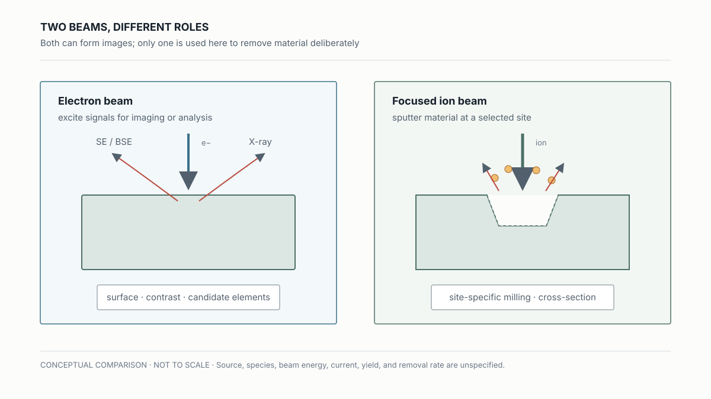
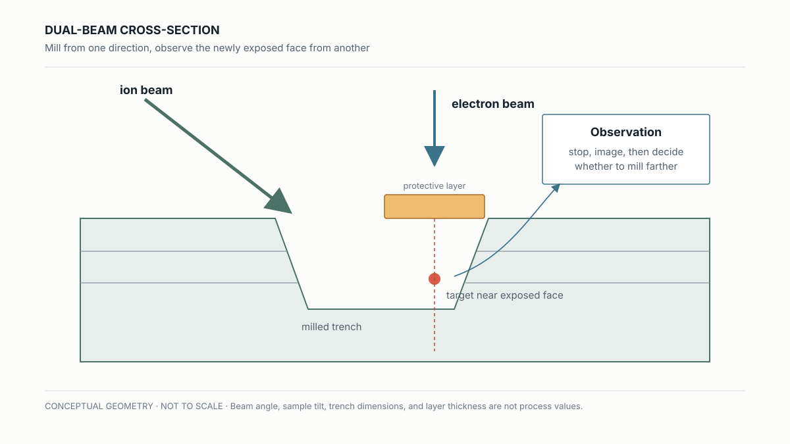
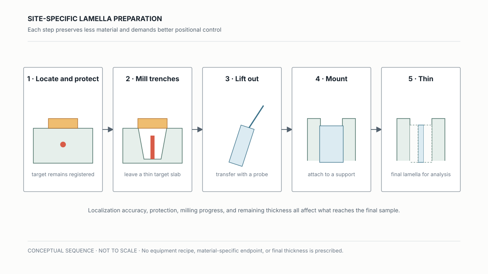
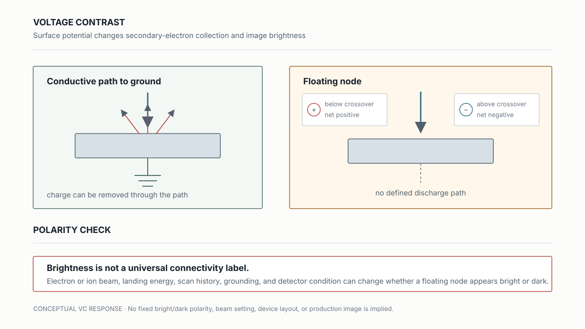

# FIB Cross-Sections, TEM Preparation, and Voltage Contrast

## 已經找到可疑位置後，怎麼打開結構又不把影像讀得太快？

> **Learning Context**
>
> Localization can end with a coordinate, while the suspected structure remains buried under metal and dielectric layers. FIB adds a different kind of access: an ion beam can remove material at a selected site, and an electron beam can observe the exposed cross-section.
>
> The same platform may also reveal voltage contrast before a physical cut is made. That contrast depends on surface potential, charge removal, and beam conditions. What I wanted to understand was simpler: once a suspicious location is known, when should I image it, cut it, or keep investigating electrically?

[EMMI](./02-emission-microscopy-and-electrical-localization.md) 可以把 electrical fail 縮到一個區域，[SEM 與 EDS](./03-electron-beam-signals-sem-and-eds.md) 則提供表面、contrast 與元素線索。接下來的問題更直接：可疑結構埋在下面時，要怎麼定點打開？

## 1. Ion Beam 可以直接改動樣品

前一篇已整理過 electron beam 產生的 SE、BSE 與 X-ray。Focused Ion Beam（FIB）不只產生訊號，ion 撞擊還會透過 sputtering 移除材料，因此可以在選定位置 milling。

> 圖 1：Electron beam 與 ion beam 的用途比較；前者著重取得訊號，後者還能在指定位置 milling。

一開始容易把 FIB 理解成解析度更高的顯微鏡。但關鍵差別是，它會直接改動樣品。一旦開始 milling，樣品本身就在改變；切面超過目標，也沒有辦法把材料放回去。

## 2. Dual Beam：邊切邊看

Dual-beam system 把 ion beam milling 和 electron-beam imaging 放在同一個 sample stage。樣品傾斜後，ion beam 從側向挖出 trench，electron beam 則觀察逐漸露出的 cross-section。這個幾何關係讓「定點邊切邊看」成為可能。

> 圖 2：Dual-beam FIB 的簡化幾何示意。Ion beam 開 trench，electron beam 用來觀察逐漸露出的 cross-section；未按比例繪製。

目標上方通常會先加 protective layer，再從兩側開 trench。也因為 preparation 本身會改動樣品，後面的切面影像要和切割前的狀態一起看。

## 3. 從 Target 到 TEM Lamella

若 cross-section 還不足以回答問題，可以把目標區域做成 TEM lamella。流程大致是先標定 target、加 protective layer、挖出兩側 trench，再將薄片 lift-out、固定到支撐載台並逐步 thinning。最後留下的是一片很薄、位置已知的樣品，交給 TEM 或其他後續分析。

> 圖 3：從 target protection、trench milling、lift-out 到 lamella thinning 的概念流程；不代表特定設備參數。

這段最容易把「定點」理解成「一定切到正中央」。實際上，前面的 localization accuracy、座標轉換、保護層位置與 milling progress 都會影響最後留下哪一小段材料。薄片做得出來是一件事，薄片是否包含原本要找的 failure site 是另一件事。

## 4. Voltage Contrast：亮暗取決於 Electrical State 和 Beam Condition

Voltage Contrast（VC）利用 conductor 的 electrical state 改變 surface potential，進而影響 secondary-electron yield 與影像灰階。Passive VC 不另外操作電路，常從接地、floating、open 或 leakage path 造成的 charging difference 找異常；active VC 則讓 device 進入指定 electrical state，再觀察節點對比。

Electron-beam VC 還要看入射電子與逸出 SE 的數量平衡。筆記裡以約 `2 keV` 作為概念分界：較低 beam energy 時，逸出的 SE 可能多於入射電子，floating surface 傾向累積正電；較高 energy 時，留在樣品中的電子較多，則可能累積負電。這個 crossover 會受材料與量測條件影響，不能當成所有樣品共用的固定門檻。

> 圖 4：Grounded 與 floating node 的 VC 概念比較；亮暗 polarity 仍要和 beam condition 一起讀。

這裡曾經最容易記成「grounded 就亮，floating 就暗」。這個口訣在特定 FIB passive VC 條件下可能成立，跨過 electron-beam crossover energy 後，floating node 累積電荷的方向可能改變，影像 polarity 也可能反過來。沒有 beam condition 的 bright／dark，資訊其實少了一半。

因此 VC 比較適合先找出和 reference structure 不同的 node，再改變 grounding condition、scan condition，或搭配 local cut／cross-section 確認是哪一條 electrical path 出問題。

## 5. 先決定缺的是哪一種證據

這一段最有用的不是記住 FIB 能做多少事情，而是先決定自己到底缺哪一種證據。若只是 connectivity 還不清楚，VC 可能先有價值；若位置已經很確定，而且問題藏在 stack 裡，才需要真的把結構切開。需要更薄、更局部的材料或界面證據時，再往 TEM lamella 走。

## What I Would Check Next

- Cross-section 的位置與角度是否真的穿過前一步定位到的 fail site？
- VC polarity 改變時，差異來自 node connectivity，還是 beam energy、charging 與 scan history？

## References

1. Hsinchu Science Park Bureau–subsidized course, [*積體電路故障分析技術與良率提升*](https://saturn.sipa.gov.tw/edu/d013_new.jsp?pl_id=26A01&cs_id=15S359) (*IC Failure Analysis Technology and Yield Improvement*, course 15S359), delivered by the Tze-Chiang Foundation of Science & Technology, August 6–7, 2026. This note draws on the second day, especially the dual-beam FIB, site-specific cross-section, TEM lamella preparation, and voltage-contrast material.
