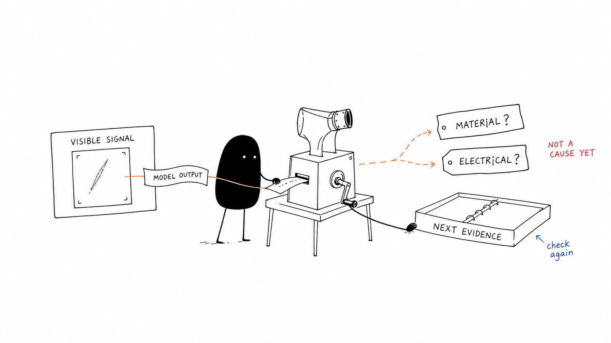

# Semiconductor Inspection Knowledge

A personal after-work learning repository connecting materials science, semiconductor fundamentals, characterization, and industrial inspection.

## Why I Keep These Notes

My work has mainly been in computer vision, industrial inspection software, and AI deployment. Across semiconductor and optical-inspection projects, that has meant dealing with cameras, datasets, defect models, runtime systems, and production traceability.

After several years of working on these systems, a gap in my own understanding became clear. The systems could detect, classify, and measure visible abnormalities. But the image alone could not always explain how those signals related to material structure, processing history, electrical behavior, or a failure mechanism (especially when the model output looked convincing).

This repository records how I have been working through that gap after work. It does not replace formal materials analysis or semiconductor characterization. The purpose is more practical: to understand what an inspection result can support, what still remains a hypothesis, and what evidence would be needed next.



> A conceptual sketch of the evidence gap: model output can narrow the question, but it does not identify a material or electrical cause by itself.

## Current Focus

- Processing–structure–properties–performance relationships
- Material properties, defects, and failure mechanisms
- Carrier transport and semiconductor electrical behavior
- I–V, C–V, sheet-resistance, and contact-resistance measurements
- Process-monitoring signals, WAT distributions, CP marginality, failure localization, and physical or material evidence

## How the Sections Connect

The repository follows the path from material behavior to the evidence available during an investigation:

```text
Materials Science
    ↓
Semiconductor Fundamentals
    ↓
Electrical Characterization
    ↓
Process Monitoring, WAT, and CP
    ↓
Failure Localization and Material Evidence
```

The path is not completely linear. Later notes often point back to an earlier model when a signal or measurement needs a more careful interpretation.

## Where to Start

These three notes are a reasonable place to start. Each comes from a different section of the repository:

1. [Crystal Defects, Diffusion, and Microstructure](./01-materials-science/04-crystal-defects-and-microstructure.md) — why an AI defect label is not the same thing as an atomic or microstructural defect.
2. [MOS Capacitor C–V and Oxide Charge](./02-semiconductor-characterization-fundamentals/03-mos-capacitor-and-oxide-charge.md) — an example of moving from a physical model to a measured curve while keeping the assumptions visible.
3. [Diode Parameter Extraction and Measurement Limits](./03-electrical-characterization-and-process-monitoring/03-diode-parameters-and-process-monitoring.md) — how fitting regions separate saturation current, ideality factor, and series resistance without hiding measurement limits.

## Notes

### 01. Materials Science

- [Materials Science Course Overview](./01-materials-science/01-course-overview.md)
- [Material Families, Property Trade-offs, and Engineering Selection](./01-materials-science/02-material-properties-and-selection.md)
- [Atomic Bonding and Crystal Structure](./01-materials-science/03-atomic-bonding-and-structure.md)
- [Crystal Defects, Diffusion, and Microstructure](./01-materials-science/04-crystal-defects-and-microstructure.md)
- [Mechanical Properties and Failure Evidence](./01-materials-science/05-mechanical-properties-and-failure.md)
- [Processing, Phase Transformations, and Material Performance](./01-materials-science/06-processing-and-material-performance.md)
- [Materials-Aware Inspection Evidence](./01-materials-science/07-semiconductor-inspection-reflection.md)
- [Section Overview](./01-materials-science/README.md)

### 02. Semiconductor Characterization Fundamentals

- [Carriers, Transport, and Optical Response](./02-semiconductor-characterization-fundamentals/01-carriers-transport-and-optical-response.md)
- [p–n Junction and Diode I–V](./02-semiconductor-characterization-fundamentals/02-pn-junction-and-diode-iv.md)
- [MOS Capacitor C–V and Oxide Charge](./02-semiconductor-characterization-fundamentals/03-mos-capacitor-and-oxide-charge.md)
- [Section Overview](./02-semiconductor-characterization-fundamentals/README.md)

### 03. Electrical Characterization and Parameter Extraction

- [Resistivity, Sheet Resistance, and Four-Point Probe](./03-electrical-characterization-and-process-monitoring/01-resistivity-sheet-resistance-and-four-point-probe.md)
- [Contact Resistance and the Transfer Length Method](./03-electrical-characterization-and-process-monitoring/02-contact-resistance-and-transfer-length-method.md)
- [Diode Parameter Extraction and Measurement Limits](./03-electrical-characterization-and-process-monitoring/03-diode-parameters-and-process-monitoring.md)
- [Section Overview](./03-electrical-characterization-and-process-monitoring/README.md)

### 04. IC Process Monitoring and Failure-Analysis Evidence

- [From Process Flow to Evidence Layers](./04-ic-process-monitoring-and-failure-analysis/01-process-flow-and-evidence-layers.md)
- [WAT Test Structures and Yield Signals](./04-ic-process-monitoring-and-failure-analysis/02-wat-test-structures-and-yield-signals.md)
- [From Electrical Anomalies to Process Hypotheses](./04-ic-process-monitoring-and-failure-analysis/03-electrical-anomalies-and-process-hypotheses.md)
- [Plasma Etch Monitoring and In-line Inspection](./04-ic-process-monitoring-and-failure-analysis/04-plasma-etch-monitoring-and-inline-inspection.md)
- [Design Rules and Process Margin](./04-ic-process-monitoring-and-failure-analysis/05-design-rules-and-process-margin.md)
- [CP Test Marginality and Shmoo Plots](./04-ic-process-monitoring-and-failure-analysis/06-cp-test-marginality-and-shmoo-plots.md)
- [Section Overview](./04-ic-process-monitoring-and-failure-analysis/README.md)

### 05. Failure Localization and Material Characterization

- [Layout-Induced Failures: Antenna Effect and Latch-Up](./05-failure-localization-and-material-characterization/01-layout-induced-failures-antenna-and-latchup.md)
- [Emission Microscopy and Electrical Localization](./05-failure-localization-and-material-characterization/02-emission-microscopy-and-electrical-localization.md)
- [Reading SEM and EDS Signals](./05-failure-localization-and-material-characterization/03-electron-beam-signals-sem-and-eds.md)
- [FIB Cross-Sections, TEM Preparation, and Voltage Contrast](./05-failure-localization-and-material-characterization/04-fib-tem-preparation-and-voltage-contrast.md)
- [Section Overview](./05-failure-localization-and-material-characterization/README.md)

## Learning Sources

1. James F. Shackelford, [*Materials Science: 10 Things Every Engineer Should Know*](https://www.coursera.org/learn/materials-science), University of California, Davis / Coursera.
2. Arizona State University, [*Fundamentals of Semiconductor Characterization*](https://www.coursera.org/learn/fundamentals-of-semiconductor-characterization), Coursera.
3. Arizona State University, [*Electrical Characterization: Diodes*](https://www.coursera.org/learn/electrical-characterization-diodes), Coursera.
4. Hsinchu Science Park Bureau–subsidized course, [*積體電路故障分析技術與良率提升*](https://saturn.sipa.gov.tw/edu/d013_new.jsp?pl_id=26A01&cs_id=15S359) (*IC Failure Analysis Technology and Yield Improvement*, course 15S359), delivered by the Tze-Chiang Foundation of Science & Technology, August 6–7, 2026. Section 04 notes 01–03 draw mainly on the first day; Section 04 notes 04–06 and Section 05 draw mainly on the second day.

## About These Notes

English is used mainly for learning context, project reflections, and some engineering notes, while Chinese carries most of the detailed technical explanations, equations, and worked examples. The two languages complement rather than duplicate each other.

Project examples are limited to systems and engineering methods I personally worked on. Screenshots use mock or anonymized data. Customer datasets, proprietary production images, confidential equipment parameters, and internal documents are not included.

I use formulas and small examples when they help check a relationship or expose a mistaken assumption. Project connections are included only when they add useful context, and their limits are stated directly. A visible anomaly is evidence, not a completed diagnosis.
