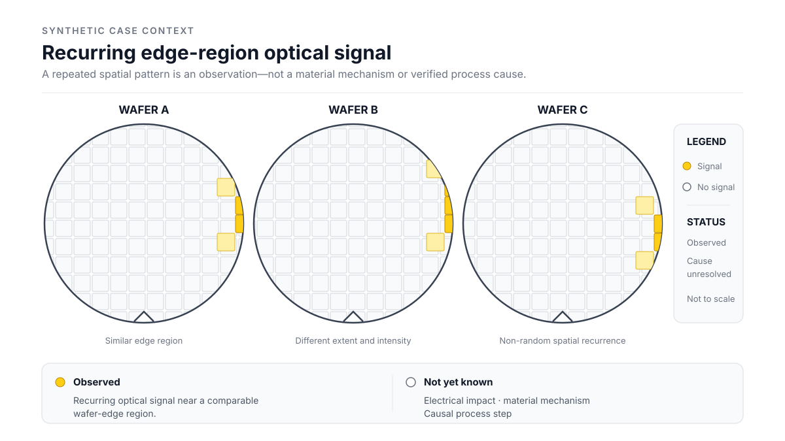
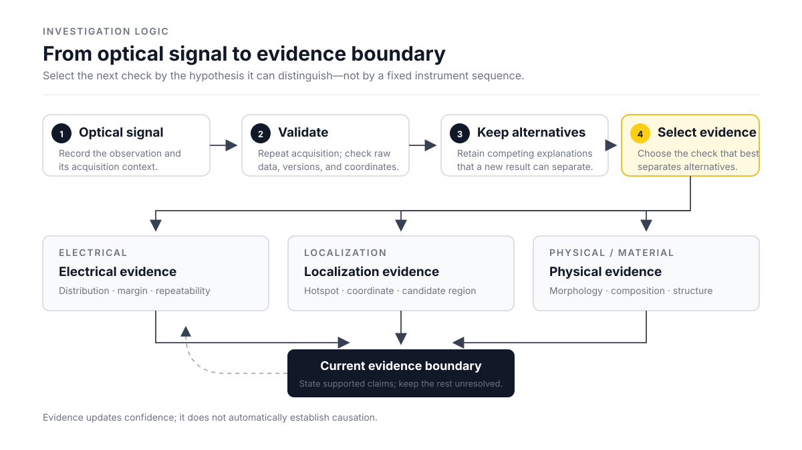

# Beyond the Defect Label

## 從光學檢測訊號走向可檢驗的調查假設

> **工程統整**
>
> 前面的筆記分別整理了材料、半導體電性、製程監控與 failure analysis。讀到後面，原本分開的內容開始連在一起，也多出一個比較實際的問題：如果現在拿到一個新的 wafer inspection signal，下一步會先查什麼？又要看到哪一筆證據，才有理由改變原本的判斷？
>
> 以下是為了練習這個判斷而設計的 illustrative scenario。Wafer map、量測結果與後續證據都是概念資料，不代表客戶資料、production case，也不是作者實際執行過的失效分析。

## 1. 先不要急著替訊號命名

假設 AOI 在數片具有相同 production context 的 wafer 上，反覆回報一個低對比的 edge-region optical anomaly。訊號集中在 wafer 的同一側，不過每片的範圍和強度不完全相同。

> 圖 1：Synthetic wafer map，只表示多片 wafer 在相近 edge region 出現 optical signal。位置、數量與分布皆為概念資料；圖中還沒有 electrical result，也沒有指定材料或製程原因。

看到這種分布後，第一個直覺很容易往 defect name 走：這是不是 haze、residue，或某一道 edge process 留下的變化？不過名字一旦放上去，分類和原因也可能跟著混進來。此時真正看到的仍然只是：在指定取像條件下，影像出現了可以重複觀察的低對比區域，而且它的空間分布不是完全隨機。

所以這裡先留下 raw image、wafer orientation、coordinate、camera、illumination、exposure、ROI、recipe、preprocessing、model version 和 threshold，再記錄 anomaly 在各片 wafer 上的頻率與範圍。若訊號來自 whole-image classification，也要和 bounding box 或 segmentation mask 分開。Wafer-level appearance 和 localized object 的 annotation semantics 不同，不能只因為模型都會輸出 confidence，就把它們當成同一種證據。

到這裡還不能說 wafer 上存在材料異常。相對準確的說法是：inspection system 看到了什麼，以及這個 observation 是在什麼條件下產生的。

## 2. 先確認 Observation 本身站不站得住腳

過去做 inspection system 時，注意力很容易先放在 class、confidence 和 detection result。不過低對比訊號又剛好靠近 optical boundary 時，比起再創建一個 defect label，取像條件反而更早需要確認。

目前會先用相同 wafer 或可控制的 reference sample 重複取像，再改變 illumination direction、exposure，或合理範圍內的 image-processing setting。如果 anomaly 跟著 ROI boundary、stitching position、camera channel 或特定 recipe version 移動，問題可能還留在 inspection chain。Wafer orientation 或 coordinate transform 如果有錯，跨 wafer 疊圖也可能做出一個看起來很穩定的 edge cluster。

這不是要先證明 anomaly「只是軟體問題」，而是確認觀察本身能不能重現。若 raw image 沒有相同變化，只有 model output 改變，就要回頭看 threshold、training distribution 與 preprocessing。但是如果換過取像條件後，訊號仍能對回相同的實體位置，才比較有理由把注意力移到 wafer-related variation。

### 第一次證據更新

先假設另一組 illumination 與獨立取像仍看得到 anomaly，位置也能對回相同的 wafer edge region。它的 contrast 有變化，但不會跟著 camera channel 或 ROI boundary 移動。

這筆結果讓單一 camera、recipe 或 coordinate artifact 的解釋弱了一些。不過「能在 wafer 上重現」和「已經確認材料變化」中間還有一段距離。Surface geometry、film response、contamination、handling mark，或其他尚未列出的可能原因都還沒有被分開。

## 3. 不要只留下最順眼的原因

這裡原本很容易只留下自己最相信的解釋，接著用後面的量測替它找證據。不過這樣做的問題是，就算拿到一張相符的圖，也不一定知道其他可能是否已經被排除。

先保留幾個彼此競爭、而且能被下一項檢查區分的假設。它們不一定互斥；surface variation 可能同時和特定 production context 或 electrical distribution 出現在一起。先分開記錄，是為了看下一筆證據能讓哪一種解釋變弱。

| 目前的假設 | 為什麼還不能排除 | 什麼結果會讓它變弱 |
| --- | --- | --- |
| 尚未排除的 acquisition 或 alignment artifact | 獨立取像已讓這個方向變弱，但 raw-image consistency、coordinate registration 與不同 acquisition path 還沒有全部確認 | 不同 acquisition path 仍能對回相同實體位置，而且 raw image 與 coordinate registration 一致 |
| Wafer surface-related variation | 訊號可在不同取像條件下重現 | Independent surface inspection 找不到對應 morphology 或 contrast |
| 與 production context 相關的空間變化 | 多片 wafer 出現相近 edge distribution | 換 lot、時間或 equipment context 後沒有可重複的分群 |
| 可能存在 electrical spatial correlation | Optical distribution 可能和 marginal die region 重疊 | 對齊後沒有一致的 electrical distribution，或只在混合分組時看似相關 |

最後一列目前最不確定，因為案例裡還沒有 electrical evidence。Optical anomaly 可以是真實的 wafer variation，卻沒有可觀察的 electrical impact。這時如果為了把 evidence chain 補齊，硬找一個 WAT parameter 配上去，反而可能把沒有關係的結果拉在一起。

## 4. 下一項檢查要能讓判斷往前邁進

一開始容易把 failure-analysis method 想成一條固定流程：AOI 後面接 SEM，再往下放 EDS、FIB 和 TEM。但是到了這裡，順序反而沒有那麼固定。比較可能有用的問題是：目前哪兩個解釋最需要被分開？

> 圖 2：這張圖表示 evidence update 的判斷迴圈，不是 production failure-analysis standard flow。Electrical、localization 與 material evidence 依問題選擇，沒有固定順序，也不代表作者操作過相關設備。

如果連訊號是不是跟著 wafer 走都還不清楚，先重複取像、保留 raw data，並比較 recipe 與 software history，比直接要求 destructive analysis 更接近目前的問題。確認訊號來自 wafer 後，才看下一個缺口在哪裡。想知道 surface morphology，可以提出 independent surface inspection 或 SEM verification request；需要候選元素時，才往 EDS 查，而且 interaction volume、background 與 peak overlap 仍要一起留下。`Contrast ≠ composition`。

如果 optical anomaly 可能和 electrical distribution 對得起來，則先確認 wafer orientation、coordinate transform、sampling density、lot grouping 與 test condition。WAT 或 CP map 的重疊可以提高某個假設的優先順序，不過 spatial overlap 仍然只是 correlation。相關判讀可回到 [WAT Test Structures and Yield Signals](./04-ic-process-monitoring-and-failure-analysis/02-wat-test-structures-and-yield-signals.md)、[Electrical Anomalies and Process Hypotheses](./04-ic-process-monitoring-and-failure-analysis/03-electrical-anomalies-and-process-hypotheses.md) 與 [CP Test Marginality and Shmoo Plots](./04-ic-process-monitoring-and-failure-analysis/06-cp-test-marginality-and-shmoo-plots.md)。

若異常能在指定 bias 下重現，EMMI 可以協助縮小 electrical activity 的位置，不過 hotspot 不會直接替 physical defect 命名。若剩下的問題是在 buried interface 或 subsurface structure，再評估 targeted FIB cross-section 或 TEM preparation 能不能回答它；單一切面仍無法補齊 causal process history。`Localization ≠ diagnosis`。

## 5. 新結果進來後，原本的解釋怎麼改變

第一輪先降低了 acquisition artifact 的可能性。接著若有可以對齊的 electrical data，就能再看 optical distribution 和 electrical marginality 是否一起變化。不能先假設一定有 correlation，也不能把所有 lot 混在一起，只為了得到一條看起來漂亮的趨勢。把資料拆回各 lot 後，原本明顯的方向也可能只由其中一組帶出來；這時先修正的是 correlation 的讀法，還不是材料原因。

### 第二次證據更新

再假設 edge anomaly 較明顯的 wafer group，也有較多 electrically marginal dies 落在相近區域。不過把資料拆開後，這個關係只出現在其中一個 lot；其他 lot 的 optical signal 較弱，electrical distribution 也沒有相同趨勢。

看到這裡，單一 inspection setting 造成全部現象的解釋又弱了一些。Wafer-related variation 與特定 production context 的關聯則更值得往下查，optical distribution 和 electrical marginality 也可能有關。不過 lot-specific factor 還沒有拆開，特定材料機制、製程步驟和 causal direction 仍然未知。

這裏最容易把「同一個 lot、相近位置、方向一致」直接縮寫成「某製程造成 electrical fail」。但中間還缺少 measurement repeatability、sampling coverage、其他共同變因，以及能把 surface、composition 和 subsurface structure 分開的 physical evidence。Map 對得起來，只是讓調查方向變得比較集中。

### 第三次證據更新

最後再加入一筆概念結果：independent surface inspection 在相同 edge region 找到可以重現的 morphology difference，目前還沒有 composition-sensitive evidence。

這時 surface-related hypothesis 會變得更合理，「只有 electrical variation、沒有對應表面變化」的解釋則弱了一些。Morphology difference 看起來已經接近材料證據，不過它仍不會自己說明 chemical composition，也不能指出是哪一道製程步驟形成。若接下來要問候選元素，EDS 可能提供另一層 evidence；若問題落在 buried interface，surface image 即使很清楚，也可能要先完成更精確的 localization，再判斷 cross-section 是否值得進行。

整理這三次更新後，才比較能看出「多一筆資料」和「多一筆有區分力的資料」並不相同。若新量測只得到另一張看起來相似的圖，卻沒有讓任何候選解釋變弱，它對這次調查能增加多少資訊，仍然要重新檢查。

## 6. 目前可以說到哪裡

走到這裡，這個 synthetic scenario 可以支持的是：edge-region optical anomaly 能在獨立取像下重現，和特定 production context 及局部 electrical marginality 存在值得繼續查證的關聯，而且相同區域也出現了 surface morphology difference。

但目前仍不知道 anomaly 的 chemical composition、buried interface 是否存在結構變化，以及哪一道製程形成現在看到的結果。Optical、surface 與 electrical evidence 之間的 causal direction 也沒有確認，因此還不能把它寫成 verified root cause。

若要再深挖，下一份 verification request 要看剩下哪個假設最需要區分。Composition evidence、cross-section 和更精確的 electrical localization 回答的是不同問題，不需要為了讓案例完整而全部做一遍。當現有資料還不足以支持更具體的原因時，`unresolved` 比一個過早完成的 defect name 更合適。

## 7. 回到 Inspection 工作後，判斷順序有什麼不同

以前在 inspection project 裡，問題的終點很容易放在 detection rate、classification result、measurement stability 或 model deployment。這些工作仍然重要。Observation 若不能穩定產生，後面的分析說實話也沒有基礎。

不過現在會再多想：這個輸出在 evidence chain 裡位於哪裡？它是 raw observation、帶有假設的分類、可以重現的 measurement、跨資料的 correlation，還是已經有 independent evidence 支持的 cause？這幾個層次需要保留的資料不同，寫下結論時能使用的 confidence wording 也不同。

目前比較適合的順序，是先確認 observation，再保留 competing hypotheses，接著選擇能把它們分開的 evidence。新結果進來後，原本的判斷也要跟著更新。最後停在哪裡，不是看用了多少種方法，而是看證據實際支持到哪裡。

這個案例沒有完成一個材料 root cause。最後留下來的比較像是一張 verification request map：哪些檢查已經讓某個解釋變弱、哪些關聯只存在於特定分組，以及下一筆資料要回答什麼，才值得讓判斷再往前一步。

## Related Notes

- [Materials-Aware Inspection Evidence](./01-materials-science/07-semiconductor-inspection-reflection.md)
- [From Process Flow to Evidence Layers](./04-ic-process-monitoring-and-failure-analysis/01-process-flow-and-evidence-layers.md)
- [Electrical Anomalies and Process Hypotheses](./04-ic-process-monitoring-and-failure-analysis/03-electrical-anomalies-and-process-hypotheses.md)
- [Emission Microscopy and Electrical Localization](./05-failure-localization-and-material-characterization/02-emission-microscopy-and-electrical-localization.md)
- [Reading SEM and EDS Signals](./05-failure-localization-and-material-characterization/03-electron-beam-signals-sem-and-eds.md)
- [FIB Cross-Sections, TEM Preparation, and Voltage Contrast](./05-failure-localization-and-material-characterization/04-fib-tem-preparation-and-voltage-contrast.md)
